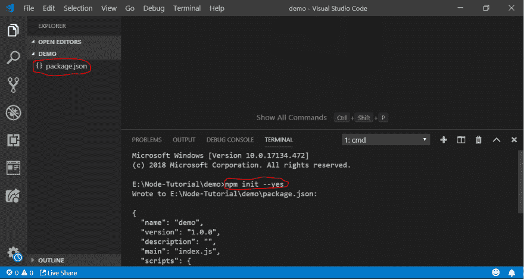
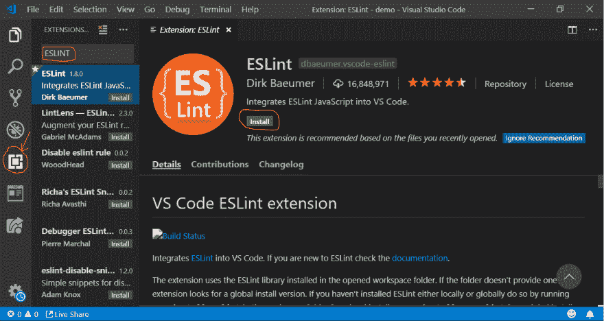
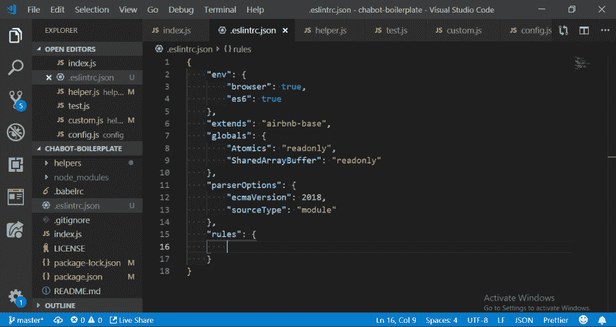
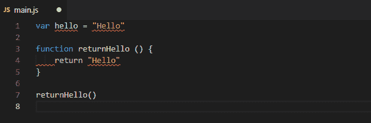

# Eslint Vscode 使用 VS 代码在 JavaScript 项目中设置 Eslint

> 原文：<https://dev.to/devdammak/setting-up-eslint-in-your-javascript-project-with-vs-code-2amf>

你有没有想过 ESLINT 到底是什么，当我第一次听说 ESLINT 的时候，我很好奇它到底是什么，从那以后我就一直在我的项目中使用它，尽管一开始我用错了，这就是为什么我发这个帖子让人们正确理解它。但是在我开始之前，让我快速解释一下什么是 ESLINT 和 VS 代码。

ESLINT 是用于 Javascript 和 JSX 的可插拔的林挺工具，它帮助发现可能的错误。

VS Code 是微软 it 部门开发和维护的顶级开发编辑器之一，它有助于提高生产率，并且有许多特性，我要强调的一个特性是扩展。扩展是 VS 代码中的外部包，允许你扩展你的编辑器的功能

可以从他们官网下载 VS 代码 [VS 代码下载](https://code.visualstudio.com/)

**NB:** *我不会深究 VS 代码..本帖中所有关于 VS 代码的内容都只会和 ESLINT* 有关。

**步骤**:

*   创建一个 javascript 项目
*   在 VS 代码编辑器中安装 eslint 作为扩展
*   使用 npm 将 eslint 作为全局软件包安装
*   在 javascript 项目中初始化 eslint
*   修改项目中的 eslint 配置文件。

让我们使用

`npm init --yes`
创建一个简单的 javascript 项目

[](https://res.cloudinary.com/practicaldev/image/fetch/s--BOH2XZEE--/c_limit%2Cf_auto%2Cfl_progressive%2Cq_auto%2Cw_880/https://thepracticaldev.s3.amazonaws.com/i/tebfsgkfr3k3h4bl7zvr.PNG)

操作成功后，它将创建一个 *package.json* 文件，该文件将管理我们项目的所有配置。

让我们尝试在 vs 代码编辑器上安装 ESLINT 扩展

[](https://res.cloudinary.com/practicaldev/image/fetch/s--gWL807Xl--/c_limit%2Cf_auto%2Cfl_progressive%2Cq_auto%2Cw_880/https://thepracticaldev.s3.amazonaws.com/i/9rmkgbk7nio6ravjm0rx.PNG)

一旦我们在 vs 代码编辑器上安装了 eslint 扩展，那么让我们使用下面的代码
通过 npm 将 eslint 安装为一个全局包

```
npm install eslint -g 
```

Enter fullscreen mode Exit fullscreen mode

您需要在项目中初始化 eslint，这样就可以利用 eslint 的强大功能。从你的根项目输入下面的代码来初始化 eslint

```
eslint --init 
```

Enter fullscreen mode Exit fullscreen mode

在初始化过程中，eslint 会问你一些问题，更像是设置你的配置文件。

*   您希望如何使用 ESLint？

    *   仅检查语法 = >它帮助你纠正你的语法并确保它符合标准。
    *   **检查语法并发现问题** = >帮助你检查语法的正确性，同时也帮助你发现代码库中的任何问题
    *   **检查语法，发现问题，强制代码样式** _ = >为了帮你检查语法，发现问题，强制样式，强制样式就是要符合某个特定的编码标准，比如 Airbnb，Google 等标准编码样式。但是我总是选择最后一个选项语法，发现问题和强制代码风格
*   你的项目使用什么类型的模块？

    *   **Javascript 模块(导入/导出)** = >如果你的项目安装了 babel，那么你肯定需要选择这个选项。如果你正在做一个项目，比如 React，Vue，Angular e.t.c，它们都使用 babel，所以你需要选择这个选项。
    *   **CommonJS(require/exports)**=>这个选项是为与 babel 无关的 CommonJS 准备的，可能是你的 nodejs 项目和任何其他 javascript 项目
*   你的项目使用哪个框架？

    *   如果你在你的项目中使用 React，那么这个选项适合你
    *   如果你在你的项目中使用 Vue，那么这个选项适合你
    *   如果你在你的项目中既不使用 React 也不使用 Vue，选择这个选项
*   你的代码在哪里运行？

    *   如果你的项目在浏览器上运行，比如 React，Angular，Vue e.t.c，那么选择这个选项
    *   如果你的项目是基于节点的，那么很乐意选择这个选项
*   你希望如何为你的项目定义一种风格？

    *   使用流行风格指南 = >这允许你从一系列流行风格中进行选择，例如 Airbnb、Standard 和 Google 风格指南，选择这个选项是明智的，以便你遵循流行和最常用的风格指南，我将在这篇文章中选择这个选项。
    *   回答关于你的风格的问题:*这是定制风格指南*
    *   检查您的 JavaScript 文件。:*自定义风格指南*
*   你希望你的配置文件是什么格式？

    *   你是否希望你的 eslint 配置文件在*中。js* 文件
    *   **YAML** = >你是否希望你的 eslint 配置文件在*中。yaml* 文件
    *   JSON = >你是否希望你的 eslint 配置文件在*中。json* 文件你可以在这个部分选择任何选项

选择了首选的配置文件类型后，它会提示您安装所有必需的依赖项。成功安装所有必要的依赖项后，它现在将生成一个带有“.eslintrc”。“js/json/yaml”。

**配置文件的例子如下图所示**
[](https://res.cloudinary.com/practicaldev/image/fetch/s--Rr_1Z9oX--/c_limit%2Cf_auto%2Cfl_progressive%2Cq_auto%2Cw_880/https://thepracticaldev.s3.amazonaws.com/i/sqyim5m8qoet5lx4bu8o.PNG)

下面是一个小动画，展示了 vs 代码如何与 eslint 一起工作，来通知您 javascript 项目中的错误

[](https://res.cloudinary.com/practicaldev/image/fetch/s--BdKgWQcw--/c_limit%2Cf_auto%2Cfl_progressive%2Cq_66%2Cw_880/https://cdn-images-1.medium.com/max/800/1%2AudUEME0YgHCXqD4pjMxpUA.gif)

**在您的项目中设置 ESLINT 规则**

在您的项目中为 eslint 定义规则告知了 ESLINT 您想要添加或删除的规则种类。您可以在配置文件

的规则部分修改/设置您的规则。要设置的规则示例有

```
"rules" : {
  no-console: 0; 
  no-empty: 0;
  no-irregular-whitespace:0;

} 
```

Enter fullscreen mode Exit fullscreen mode

你可以定义尽可能多的规则，你可以在他们的官方文档上阅读更多关于 ESLINT 规则的内容 [ESLINT 规则文档](https://eslint.org/docs/rules/)

最后，我将向您展示如何将 eslint 链接到 javascript 项目编译器/transpiler

以下步骤

*   转到您的`package.json`文件，在文件的脚本段中添加以下内容

```
script:{
    "lint":"eslint"

} 
```

Enter fullscreen mode Exit fullscreen mode

**NB:***“lint”只是一个普通的词，你可以用任何你觉得舒服的词*

然后在你的根项目中，你可以用
运行你的林挺脚本

```
npm run lint 
```

Enter fullscreen mode Exit fullscreen mode

> ESLINT 有助于提高生产率，根据标准编写代码，并在代码库违反风格指南规则时标记错误。通过这篇文章，你应该能够将 ESLINT 集成到你的 Javascript 项目中。