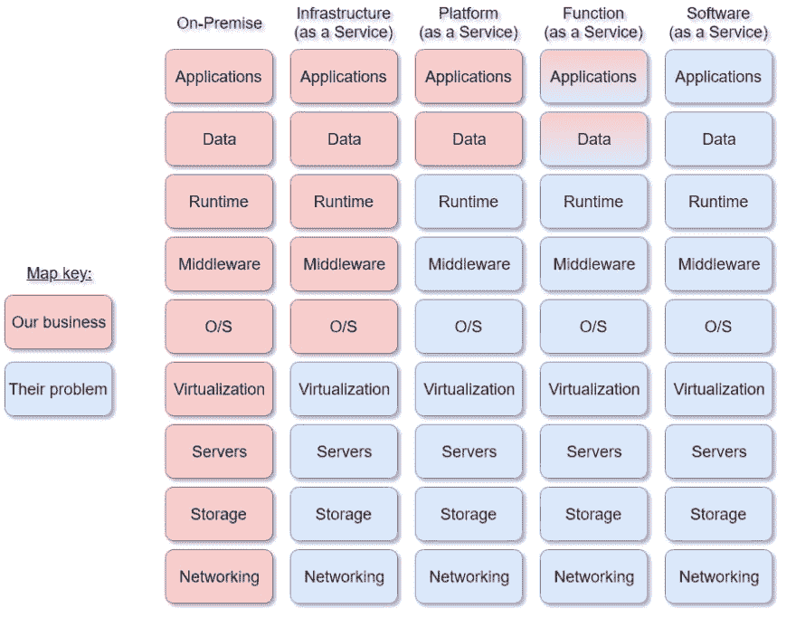

# Azure 成本优化

> 原文：<https://dev.to/rafalpienkowski/azure-cost-optimization-5acc>

### 简介

我想通过这篇文章介绍一系列的博客文章，包括一些我们可以在 Azure Cloud 中应用的成本优化技巧。

很可能你已经实施了我所有的建议。那样的话，对你有好处！否则，你仍然能够成为你公司的英雄，节省一些你必须支付 Azure 发票的钱，并把它花在一些好东西上，比如你办公室的新棋盘游戏或企业静修。或者你可能听说过 MS Azure solutions 可以让你的软件更可靠，或者将代码部署到 Azure 的 App 服务中与 Azure DevOps 结合使用比你当前的 CI/CD 流程简单得多，但在原始成本计算后，你的老板拒绝了你使用 Azure 的建议，因为云的成本太高？嗯？听起来很熟悉吗？如果是这样，我邀请你进一步阅读。这些技巧不是秘密知识，很容易实现。

在这个冗长的介绍之后，是时候给出具体的建议了。首先，我们需要回答两个简单的问题。你准备好了吗？先说第一个问题。

### 您有什么许可模式？

根据你选择的模式，你可以减少 Azure 的月费用。可用模型及其简要描述的简短回顾。

*   [现收现付](https://azure.microsoft.com/en-us/offers/ms-azr-0003p/)
    最受欢迎的一种。很容易设置。我们唯一需要的是一张可用的信用卡，它将与我们的订阅绑定在一起。每隔 30 天，您将收到一张二手资源的发票，必要的资金将从您的信用卡中扣除。你只为用过的资源付费。好的一面是从 Azure 免费帐户升级到 PAYG 很容易。仅此而已。在这种计费方式下，我们没有太多的空间来降低成本。

*   [Azure in Open (AIO)](https://azure.microsoft.com/en-us/offers/ms-azr-0111p/)
    在这种模式下，你从微软合作伙伴那里购买刮刮卡。每张卡价值 100 美元。AIO 与现收现付模式非常相似。不同的是，在我们使用资源之前，你必须付费。我们可以通过批量购买刮刮卡来节省一些钱。根据你的搭档和你想要的刮痕数量，你可以协商折扣。在 AIO 模式中，你必须在三年内激活刮刮卡，并在一年内使用可用资源。

*   [云解决方案提供商(CSP)](https://partner.microsoft.com/en-us/cloud-solution-provider)
    CSP 的工作方式类似于现收现付模式。主要区别在于，您直接向微软合作伙伴付费，而不是微软。值得一提的是，我们的支持票将发给合作伙伴，而不是微软支持。

*   [企业协议(EA)](https://azure.microsoft.com/en-us/pricing/purchase-options/enterprise-agreement/)
    如果您的解决方案经常消耗大量资金(大约 17 500 美元/年)，您可以尝试进入企业协议模式。在这种模式下，你从微软的合作伙伴那里购买 Azure 的访问权限。EA 的成立时间为一年或三年。您为给定的时间段提前付费(当然，如果您在协议结束前使用购买的资源，您可以建立新的协议)。在这里，你有最大的折扣谈判机会。一件有趣的事情是，你可以访问新的管理门户网站([https://ea.azure.com/](https://ea.azure.com/))，而不是传统的*https://portal.azure.com/。*

你找到你的许可模式了吗？我希望如此。现在是第二个问题的时候了。

### 我们使用的是什么类型的云环境？

这是一个非常基本的问题。为什么？因为根据环境的不同，会构建定价计划，并进一步创建发票。让我简单回顾一下可用的云模型，以及它们与“传统”内部环境的关系。

主要型号:

*   基础设施即服务(IaaS)
    我认为这种模式可以被视为迈向云计算的第一步。简而言之，我们将虚拟机(VM)映像放入云中。我们负责 i.a. O/S 安装和维护所需的框架、运行时安装和打补丁等。我们要关心的事情很多，但是我们收到的准入门槛很低。我们可以将虚拟机映像放入云中。在省钱的背景下，我们应该看看*微软。计算*定价计划(我们根据使用资源的时间计费)。下一集我会详细描述。

*   平台即服务(PaaS)
    在这种情况下，我们部分放弃了准备和维护环境的责任。例如，所有与操作系统和运行时相关的事情都不再是我们的问题。最后，给我们的操作系统打补丁。这是我们供应商的问题。根据服务水平协议(SLA ),供应商确保平台的可用性。但我们需要记住，在 PaaS 模式中，我们正在失去对基础设施本身的一些影响，我们必须调整我们的解决方案以适应给定的平台。根据 Azure 文档:“平台即服务(PaaS)是云中完整的开发和部署环境。”MS Azure 中这种资源的一个例子是应用服务或 Azure SQL 数据库。主要是在 PaaS 模式中，我们为服务创建的整个时间付费，即使我们没有使用它。

*   功能即服务(FaaS)
    我认为这是 PaaS 的一个特定子集。数据和应用程序的责任转移给了供应商。例如，我们可以使用 Azure 函数，而不是编写整个应用程序来服务一些 HTTP 请求。在这种情况下，当请求到达服务器时，微软负责调用我们的函数。

*   软件即服务(SaaS)
    在 SaaS 模式中，我们购买软件的使用权。最好的例子是 Office 365 或 Spotify。简而言之，我们为一段时间内使用某个程序的能力付费。

下面是比较提到的模型的图像。

有了这两个主要问题的答案，我们就可以开始下一步了。希望你不会太无聊。

在下一集，我将描述我们如何通过在基础架构即服务模式中使用云来节省一些资金。我将告诉你如何降低 Azure 中托管的虚拟机的工作成本。

下集见！

附注:本文中使用的所有照片均来自[unsplash.com](https://unsplash.com/)。