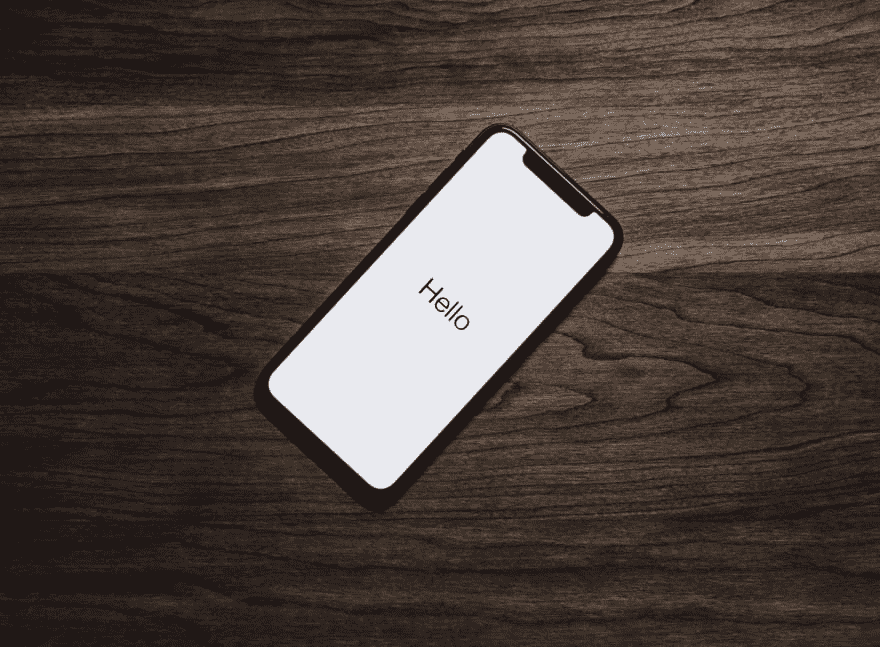

# 借助 SDK 实现移动应用货币化

> 原文：<https://dev.to/johnston616/mobile-app-monetization-with-sdk-30d3>

首先，如果您不知道 SDK 是什么，在这种情况下，它是一个软件开发工具包，或者一组软件开发工具，您可以将它添加到您正在开发的应用程序中，为它提供某些操作或信息。在大多数情况下，SDK 是为了帮助开发人员修复某种错误，或者对他们的应用程序执行特定的操作。但是，和其他领域一样，它可以帮助你赚钱。

第三方 SDK 的应用货币化通常是为了帮助收集关于用户的非个人数据或提供关于应用活动的分析数据。你添加到应用中的每一个 SDK 都必须在你的服务条款中进行描述，并且它需要有一个可用的用户同意操作，这样他/她就会知道你正在收集什么样的数据，以防万一，可以拒绝它。
作为一个基础用户，大概每个人在生活中都遇到过某种 SDK 弹窗广告，播放一定时间的视频，甚至一些支付处理器。有一些你看不到的 SDK，但是它们可能在你正在使用的应用程序的后台运行。SDK 通常采集的基本非个人参数包括:
设备类型；
设备版本；
屏幕大小；
移动运营商；
网络类型；
CPU 核心数；
RAM，ROM
国家；
IP 地址。
所以根据你的目标，以及你需要什么样的信息，你可以访问应用程序用户的这些要点。

我选择了一些最受欢迎的 SDK 应用盈利模式，您可能在使用不同的应用时遇到过，并将检查它们为开发者提供了什么样的功能。

[GlobalHop](https://globalhop.net/) 当嵌入了 GlobalHop SDK 应用程序的设备处于空闲状态并连接到 WiFi 时，HTTP 请求将通过用户的设备路由到各个网站，以提取公共数据。它不会减慢用户的设备或耗尽其电池。适用于 Android 设备。

Google AdWords/Google Ads
它是一个广告渠道，帮助营销人员或广告商将其产品置于 Google 搜索结果的顶部。这样，用户在寻找你提供的东西时，随时都能看到你的产品。只有当有人点击你的广告访问你的产品页面时，你才需要付费。

UNITY ADS
它由 Unity Technologies 于 2014 年推出，是一个受欢迎的游戏平台，允许开发者通过向玩家提供视频中显示的应用内购买来提高他们的盈利能力(可以奖励也可以不奖励)。至于受众定位，该广告网络允许将广告定位到最有可能对玩某个游戏感兴趣的玩家。此外，不需要集成额外的 ad SDK。它可以在 Android 和 iOS 上运行，并支持多种显示格式。

这个 SDK 专门研究用户保持，因为他们分析他们的行为，并根据年龄、性别、移动行为和其他最常用的应用程序创建档案。通过这种方式，他们可以帮助你建立应用活动，推动你的高质量安装。适用于 Android 和 iOS 设备。

SafeDK
更有趣的产品之一，因为它是一个 SDK，可以监控应用中实现的其他 SDK。它可以识别降低应用速度、使应用崩溃或过度消耗设备资源的 SDK。此外，它允许立即关闭它们，而不需要更新版本。你可以知道每个 SDK 对你的应用的启动时间、网络消耗、延迟、位置访问等的贡献。这个 SDK 在 Android 和 iOS 设备上都有。

移动应用货币化只需要很少甚至零的努力和时间投入。只要应用程序用户同意共享数据，你就会不断从数据收集者那里获得报酬。保持你的应用程序 UX 友好，记住，广告和 SDK 是许多货币化选择之一。