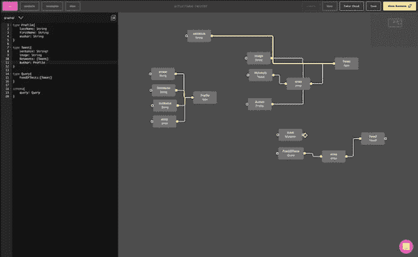

# 您的图形 SQL 字典

> [https://dev . to/graph qle editor/your-graph QL dictionary-4p 14](https://dev.to/graphqleditor/your-graphql-dictionary-4p14)

GraphQL 是一种用于 API 的现代查询语言。在第一次接触 GraphQL 时，您可能会注意到一些不熟悉的术语。我希望这本 GraphQL 字典在您开始使用 GraphQL 时会有所帮助:)

[](https://res.cloudinary.com/practicaldev/image/fetch/s--6-y98ZLK--/c_limit%2Cf_auto%2Cfl_progressive%2Cq_66%2Cw_880/https://thepracticaldev.s3.amazonaws.com/i/tz0i2zy07vl7avbwnwzn.gif)

## 论证

参数是附加到字段的一组键值。参数可以是文字值或变量的形式。

## 别名

别名是分配给字段结果的替代名称，以避免数据提取操作期间的冲突，即`admin`和`regular`。

```
{
 admin: users(role: admin) {
   id
   firstname
   lastname
 }
 regular: users(role: regular) {
   id
   firstname
   lastname
 }
} 
```

## 指令

前面有一个`@`的解释，包含了在客户机/服务器上执行查询的逻辑。GraphQL 内置指令有@skip 和 [@include](https://dev.to/include) ，并允许定义自定义指令。

## 字段

从模式中请求的数据的基本单位，在 JSON 响应中作为字段返回，即`id`和`name`。

```
type User {
 id: Int!
 name: String
} 
```

## 片段

可以在多个查询操作中重复使用的选择集。GraphQL 片段是查询逻辑的共享部分。

## GraphQL 编辑器

GraphQL 编辑器让理解 GraphQL 模式变得更加容易。通过链接可视块来规划模式，GraphQL 编辑器会将它们转换成代码。

[](https://graphqleditor.com/)

## 自省

一种提供关于 GraphQL API 模式的精确信息的方法。内省以“__”为前缀。

## 突变

允许操作数据(创建、修改、删除)的基本 GraphQL 操作之一。

```
mutation DeleteTodo($type: String!) {
 deleteTodo(type: $type) {
   id
   type
 }
} 
```

## 对象类型

它是包含字段的 GraphQL 模式中的类型。`User`是我们这里的对象类型:

```
type User {
  name: String!,
} 
```

## 操作

单个查询、变异或订阅，可由 GraphQL 中的执行引擎解释。

## 操作名称

上述元素的名称。名称使得在 GraphQL 服务器中识别、记录或调试错误变得更加容易。

## 查询

在 GraphQL 中请求数据是一个基本的获取操作。

## 查询主机代管

GraphQL 最佳实践之一，将 GraphQL 查询放在与 app 组件的视图逻辑相同的位置。

## 查询白名单

一项安全实践，涉及定义应用程序中允许的已批准查询列表。

## 解析器

将 GraphQL 模式元素连接到后端的函数。解析器将操作转化为数据；它们可以返回字符串、整数、空值和其他原语。

## 图式

GraphQL 模式是每个 GraphQL 服务器实现的核心部分。GraphQL 模式负责项目的整个逻辑，并描述客户端应用程序可用的功能。

## 模式定义语言(SDL)

GraphQL 模式定义是定义 GraphQL 模式的一种方式。语法是官方 GraphQL 规范的一部分。每个模式的主要组件是`types`和它们的`fields`。

电影评论网站的 GraphQL 模式可以这样定义:

```
type Review {
 id: String!
 title: String!
 publishedAt: DateTime!
 stars: Int! @default(value: 0)
 feed: Feed @relation(name: "Reviews")
}

type Feed {
 id: String!
 name: String!
 description: String,
 reviews: [Review!]! @relation(name: "Review")
} 
```

## 模式拼接

将次要模式合并到中心 GraphQL 模式中。

## 订阅

是在模式中定义的 GraphQL 中的实时操作。

```
type Subscription {
 reviewAdded(repoFullName: String!): Review
}
...
subscription onReviewAdded($repoFullName: String!){
 reviewAdded(repoFullName: $repoFullName){
   id
   content
 }
} 
```

## 标量类型

验证 GraphQL 字段解析的数据的是 GraphQL 类型。String、Int、Boolean、Float 都是内置的标量，可以开箱即用。自定义标量类型可以在 GraphQL 服务实现中指定。

## 类型系统

它是一组规则，定义了可以验证、查询和执行的数据集。

## 变量

它是一个可以传递给操作的值，就像下面例子中的`userID`:

```
query GetUser($userId: ID!){
 user(id: $userId){
   name
 }
} 
```

PS:

原文章发布在 GraphQL 编辑博客-[https://blog.graphqleditor.com/GraphQL-tutorial-dictionary/](https://blog.graphqleditor.com/GraphQL-tutorial-dictionary/)

这里是 GraphQL 编辑器应用的链接，以防你想尝试一下-
[https://app.graphqleditor.com/showcase/fake-twitter/](https://app.graphqleditor.com/showcase/fake-twitter/)

如果你正在寻找最好的 GraphQL 教程，请查看这个[帖子](https://blog.graphqleditor.com/top-graphql-tutorials-reviewed-2019)。