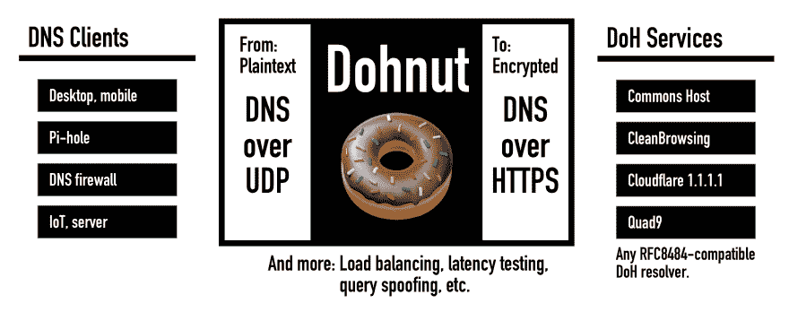
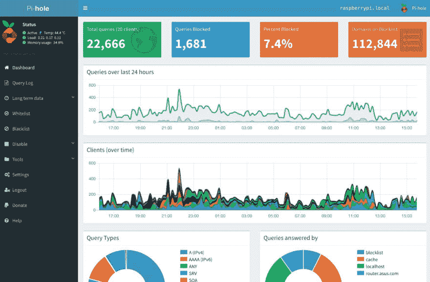

# 甜甜圈

> 原文：<https://dev.to/commonshost/dohnut--dns-to-doh-proxy-42bg>

*TL；DR [Dohnut](https://help.commons.host/dohnut/) 通过代理明文 DNS 到加密 DoH，轻松升级你所有的网络客户端。*

[Commons Host](https://commons.host)CDN project[最近推出了](https://dev.to/commonshost/how-we-built-a-doh-cdn-with-20-global-edge-servers-in-10-days-1man)一项公共 HTTPS 域名系统(DoH)服务。DoH 现在在 Commons 主机网络的所有 30 多个边缘服务器上运行，在全球许多地方提供低延迟。独特的是，Commons 主机网络是由那些[拥有并托管低成本微服务器](https://dev.to/commonshost/little-lamb-mk-i-5gf3)的贡献者发展起来的，他们在自己的家里或办公室使用消费级互联网连接。

DoH 互联网标准[RFC 8484](https://tools.ietf.org/html/rfc8484)承诺提高 DNS 的隐私性和安全性。DoH 对所有查询进行加密，保护用户免受 ISP 和流氓 Wi-Fi 路由器的窥探或 DNS 响应篡改。

将您所有的网络客户端从明文 DNS 升级到加密 DoH 并非易事。目前没有操作系统或路由器/硬件支持。目前唯一支持 DoH 的浏览器是 Firefox。

这就是为什么需要 DNS 到 DoH 代理的原因。

## 简介:Dohnut🍩

Dohnut 充当一台机器或整个本地网络的本地 DNS 服务器。它将所有 DNS 查询代理到加密的长期 HTTP/2 连接内的远程 DoH 服务。

##  [最普通的](https://github.com/commonshost) / [杜努特](https://github.com/commonshost/dohnut)

### 🍩DNS 到 HTTPS DNS(DoH)代理服务器

<article class="markdown-body entry-content container-lg" itemprop="text">

# 甜甜圈吗

Dohnut 是一个 DNS 到 HTTPS DNS(DoH)代理服务器。Dohnut 提高了 DNS 流量的性能、安全性和隐私性。

[https://help.commons.host/dohnut/](https://help.commons.host/dohnut/)

Dohnut 与任何符合开放标准( [RFC8484](https://tools.ietf.org/html/rfc8484) )的 DoH 提供者合作，包括 [Commons Host](https://commons.host) DoH service 和[许多其他的](http://dns-channel.github.io/#recsrv)。

## 特征

**高性能**自动选择最快的 DoH 旋变器。通过使用 HTTP/2 PING 帧监控 DoH 连接的往返端点，不断适应网络和服务条件。

**高可用性**允许同时使用多个 DoH 解析器，以便在服务不可用的情况下提供自动故障转移。

**零开销** -网络流量不通过 Dohnut，因此没有性能损失。只有 DNS 查询(非常小的带宽)被代理。

**轻量级** -多线程架构，在单板计算机等低功耗设备上实现快速性能。为 Raspberry Pi 和 Odroid 设计，但兼容任何可以运行 Node.js 的程序。

**完全加密** - DoH 加密所有 DNS…

</article>

[View on GitHub](https://github.com/commonshost/dohnut)

## 易于部署

[部署指南](https://help.commons.host/dohnut/)目前可用于 Raspbian、Docker、Linux/systemd 和 macOS/launchd。

桌面客户端和网络仪表板正在开发中！

## 轻巧

Dohnut 是用 Node.js 构建的，跨平台，速度快。Dohnut 运行在一台 35 美元的 Raspberry Pi 计算机上，可以轻松处理一个有几十个 DNS 客户端的典型家庭或中小企业网络。

> Commons Host@ commonshostLamb Pi 边缘服务器，有人吗？为[@ CommonsHost](https://twitter.com/CommonsHost)[# DoH](https://twitter.com/hashtag/DoH)[# DNS](https://twitter.com/hashtag/DNS)网络开发新的服务器层。2019 年 02 月 04 日上午 06:1015

Dohnut 也是流行的 DNS 广告拦截器 Pi-hole 的好伙伴。Dohnut 充当 Pio-hole 的自定义 DNS 上游服务器。Pi-hole 作为网络上 DNS 客户端的 DNS 服务器，执行广告拦截、监控并提供本地低延迟 DNS 缓存。

> Commons Host@ commonshost🍩doh nut+[# p 整体](https://twitter.com/hashtag/Pihole)家庭& SME 网络的安全和广告拦截。数十个 DNS 客户端仅使用一个 [#RaspberryPi](https://twitter.com/hashtag/RaspberryPi) 1。2019 年 2 月 20 日上午 07:5900

## 自动优化 DNS 延迟

Dohnut 可以同时使用多个 DoH 服务。DoH 使用两种可配置的策略在 DoH 服务之间进行负载平衡:

*   **最佳性能**:始终向最快的 DoH 解析器发送 DNS 查询。使用 HTTP/2 PING 帧持续监控到每个 DoH 解析器的往返时间延迟。设定并忘记；这种模式会自动发现 DoH 解析器之一何时改善了它们对网络的延迟(例如，在您附近部署新的服务器)。

*   **最佳隐私**:在所有启用的 DoH 解析器中均匀分布 DNS 查询。这会将 DNS 查询分成多个部分，因此单个 DoH 解析器只能看到总流量的一小部分。

*提示:使用[bulldhzer](https://dev.to/commonshost/bulldohzer--dns--doh-performance-testing-50fm)来测量从您的位置到多个 DNS 和 DoH 解析器的查找延迟。*

## 实验:主动跟踪对策

公共 DNS 解析器的隐私政策各不相同。但是总有一个不可避免的事实，那就是解析者必须看到你的 DNS 查询。当使用[云上 DNS 提供商](https://blog.powerdns.com/2019/02/07/the-big-dns-privacy-debate-at-fosdem/)时，这是一个固有的隐私风险。

为了阻止文档提供者的跟踪，Dohnut 可以欺骗 DNS 查询。它在随机的时间内这样做，并使用流行的真实世界域的真实样本。这使得任何文档提供者都很难分辨哪些查询是您的，哪些只是伪造的噪音。

这确实会给公共 DNS 服务带来额外的流量和负载。这是一个隐私实验。

DoH 的另一个问题是增加了 HTTP 层的跟踪面。通过将来自多个客户端的查询复用到一个 DoH 连接中，Dohnut 充当了一种被动的隐私机制。Dohnut 还可以基于真实世界的浏览器使用数据随机化 HTTP `User-Agent`头。

## 反馈

非常感谢对这些想法及其实施的反馈。❤️博客评论、GitHub 问题、Twitter 等。

*封面照片由[轮渡酒店](https://www.flickr.com/photos/65991505@N08/8222939536/)T3 拍摄*