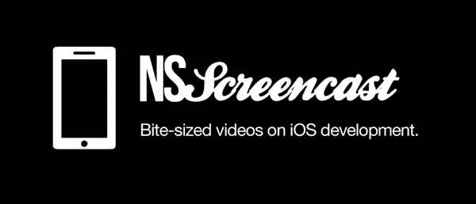

# iOS 开发者的 75 个必备工具

> 原文：<https://dev.to/heshanfu/75-essential-tools-for-ios-developers-2b2f>

如果你去一家木工师傅的商店，你总是会发现他或她用来完成各种任务的大量工具。

在软件中也是如此。你可以通过软件开发人员如何使用他们的工具来衡量他们。经验丰富的软件开发人员*掌握*他们的工具。深入了解你当前的工具是很重要的，并且要知道在你当前的工具不足的地方，可以用其他的工具来填补空白。

考虑到这一点，我向你展示了一个巨大的工具清单。有些我每天都用，有些我觉得有潜力。如果你想在这里看到更多的工具，请务必添加评论。

我尽力把这些分类。有些条目是网站，有些是后端服务，但大多数是你安装的应用程序。并非所有的应用程序都是免费的，所以我会用 *$* 来表示一个应用程序需要付费。

事不宜迟，我们将从任何项目的开头开始，那就是

## 灵感

*   一个很棒的 iOS 屏幕库，按任务设计类别。例如，如果你想了解其他应用程序如何处理活动源，这是一个查看大量示例的好地方。
*   TappGala -又一个优秀应用程序设计的大集合。它没有按任务分类，只是列出了一些可以从中获得灵感的优秀应用。
*   [iOS 示例](https://iosexample.com/) -你可以在你的 iOS 应用中使用的组件(代码)的伟大列表。有时你会发现可以节省你时间的代码，其他时候你可以学习其他开发人员是如何完成某些功能的。订阅他们的每周时事通讯；全信号，小噪音。
*   一系列真正伟大的图标。获得灵感，但不要抄袭。
*   一些最好的数码设计师把他们的作品上传给所有人看。值得一看的设计宝库。
*   灵感设计画廊。有些包含动画。*谢谢， [@joaopmaia](http://twitter.com/joaopmaia)* ！

## 设计

*   这是一个简单易用的工具，可以创建一个 iOS 应用程序的快速模型。附带了一组默认控件，您可以使用它们快速组装一些东西。
*   这是一个非常有用的应用程序，它允许你创建一个应用程序的模型，并将它们缝合在一起，这样你就可以看到交互。部署到一个设备上，这样你就可以看到它在你手中的感觉。
*   橡子(Acorn)($)——Photoshop 的有力竞争对手，只是便宜得多。我发现自己最近越来越少接触 Photoshop】。正在积极开发中。
*   随着屏幕尺寸和像素密度的变化，这款基于矢量的绘图工具越来越有用。设计一次并根据需要自由扩展通常很有帮助。还拥有强大的出口系统。对于一些示例草图项目，请查看 [Sketchmine](http://sketchmine.co) 。观看我在草图上的[截屏，观看现场演示。](http://nsscreencast.com/episodes/079-sketch)
*   如果你(或你的设计师)使用 Photoshop，这是一个非常方便的资源。一个[的 iOS 6 版本](http://www.teehanlax.com/blog/ios-6-gui-psd-iphone-5/)也是可用的。
*   Bjango 的 Photoshop Actions -如果你用 Photoshop 设计 iOS 应用程序，这绝对是一个省时的工具。一键访问以调整画布大小，缩放 200%(或 50%)，将全局照明设置为 90，等等。他们的[博客](http://bjango.com/articles/)也有一堆有用的 Photoshop 工作流程提示。
*   xScope ($) -一把不可或缺的瑞士军刀，工具包括向导、像素标尺、屏幕标尺等等。想知道那个像素是什么色值？想看看随机 Mac 应用程序的按钮和窗口之间有多少像素？xScope 已经涵盖了您。还可以看看他们的[配套 iPhone 应用](https://itunes.apple.com/app/xscope-mirror/id488819289?mt=8&ign-mpt=uo%3D4)中的[镜像设计](http://xscopeapp.com/guide#mirror)，在你的 iDevice 上看到它们像素级的完美荣耀。
*   Glyphish ($) -一个为你的 iOS 应用程序收集的高质量图标。苹果没有提供很多内置图标，所以有一个涵盖各种各种概念的图标集合是很方便的。*我仍然在寻找那个婴儿图标的用途。Glyphish 是成包的，最新的包有 iOS 7 的“细线”图标，这在设计 iOS 7 应用程序时会非常方便。*
*   用于 iOS 的字体图标(Fontastic Icons )( T1)——一个利用图标字体的开源类集，比如你的 iOS 应用中的[字体。快速方便地拥有您需要的任何像素尺寸的图标。由于字体本质上可以很容易地放大和缩小，这是一个很好的方式来使用你的图标，而不必为你需要的尺寸导出多个版本。](http://fortawesome.github.io/Font-Awesome/)
*   [PaintCode](http://paintcodeapp.com) ($) -一个基于矢量的绘图工具，将您的作品导出为等效的核心图形源代码。非常适合学习核心图形绘制的工作原理，但是如果你希望你的图形是动态的，也非常方便。请查看我在 PaintCode 上的[截屏，观看现场演示。](http://nsscreencast.com/episodes/80-paintcode)
*   这是一个简单的工具，帮助你定义可重复图像的边缘插入。可在 Mac App Store 上获得。
*   [LiveView](http://www.zambetti.com/projects/liveview/) -用于 iOS 的远程屏幕查看器，可以轻松地在设备上立即查看您的设计。*谢谢， [@_funkyboy](http://twitter.com/_funkyboy)* ！
*   Skala 预览版 ($) -另一个在真实设备上快速展示设计的优秀工具。在 Bjango 的家伙真棒，这个应用程序是值得的价格。*谢谢，jn40* ！

## 源代码控制

*   如果你没有使用源代码控制，停止你正在做的事情并改正它。我做什么都用 git，我喜欢它。
*   [万花筒](http://www.kaleidoscopeapp.com/) ($) -周围最好的区分/合并工具。做三向融合，好看。我每天都用它。
*   一个免费的，丑陋的万花筒替代品。强大的 3 路合并，但祝你好运找到下载链接。每次我找它的时候，它都藏在他们网站的更深处。
*   一个简单、强大的 GUI 工具，用于可视化 Git 时间表和快速&轻松提交。为了使用 git，我通常住在终端中，但是当我需要将大量的更改放入逻辑提交中时，我会回到这个应用程序。这是原(废弃)GitX 的一个叉子，我在这个[叉子列表](http://gitx.org)上找到的。
*   [源码树](http://www.sourcetreeapp.com/)——一个免费的全功能 Git 应用。我不用这个，因为我喜欢命令行，但是如果 GUI 工具是你的最爱，试试这个程序。

## 剖析应用

*   [pngcrush](http://pmt.sourceforge.net/pngcrush/) -这个小工具可以*粉碎* & *取消粉碎* PNG 文件，当你想查看 app Store 中捆绑分发的 App 中包含的图片时，这个小工具就很方便了。只需打开 iTunes，查看本地应用程序列表，并右键单击任何图标以显示在 Finder 中。一旦到达那里，打开应用程序，你会看到一堆 PNG 文件，但你不能查看它们。使用 pngcrush，您可以提取完整版本，以便可以用预览打开它。
*   这个方便的小 ruby 脚本将对所有图像自动执行上述过程。只需将它指向你磁盘上的一个`.app`文件，它就会将所有图像提取到你桌面上的一个文件夹中。方便查看手机上的应用程序如何完成某些设计。查看[我在剖析应用程序](http://nsscreencast.com/episodes/20-dissecting-apps)上的截屏，观看现场演示。
*   我不知道丑陋的用户界面或图标是怎么回事，但查尔斯是任何开发人员的*必备*工具。Charles 充当代理，允许您从 iPhone 模拟器检查到&的网络流量。您还可以通过将手机的代理设置为运行 Charles 的 Mac 来检查设备的流量。有了自签名 SSL 证书、请求&响应断点和请求/响应查看器，Charles 真的非常强大。必备工具。同样，我在[剖析应用](http://nsscreencast.com/episodes/20-dissecting-apps)的截屏很好地涵盖了这一点。

## 编辑

我知道你在想什么，iOS 开发者不都用 Xcode 吗？嗯，大部分情况下，是的。但是以我对 Xcode 又爱又恨的关系，我相信考虑替代方案有巨大的价值。

*   [app code](http://jetbrains.com/objc)——来自 Jetbrains 的成熟的 IDE(优秀的 ReSharper 的制造者。网)。非常强大的重构&特性可以帮助你更快地编写代码。快速识别死代码，使用相关代码时自动插入`#import`语句，轻松提取变量、方法、类。我对这个应用程序唯一的愿望是，它将成为 Xcode 的一个插件。
*   维姆 -等等，维姆？真的吗？是的，有些人在 vim 中完成了他们所有的 Objective-C 开发。我不是其中之一，但我是 Ruby 开发 vim 的粉丝。因此，我是一个超级粉丝...
*   Xvim -一个 Xcode 插件，为您提供 vim 按键绑定。“效果很好，”努夫说。
*   [OMColorSense](https://github.com/omz/ColorSense-for-Xcode)-Xcode 的另一个插件，当你的光标在一行上时，这个插件给你一个小的颜色显示，看起来像:`[UIColor redColor]`。点击这个小小的颜色标签打开一个你可以改变的颜色选择器，你对颜色所做的任何改变都会反映在代码中，通过改变代码行到`[UIColor colorWithRed:… green:… blue:… alpha:… ]`。当有人看我用这个写代码时，他们总是问我，*“哇！那是什么？!"*
*   [KSImageNamed](https://github.com/ksuther/KSImageNamed-Xcode) -另一个 Xcode 插件，这个插件允许你在键入`[UIImage imageNamed:…]`时自动完成包中的图像文件名。这是避免不可避免的打字错误的好方法，打字错误会导致该方法返回`nil`,然后你会浪费 10 分钟去找出为什么你的图像没有显示出来。
*   [CocoaPods Xcode 插件](https://github.com/kattrali/cocoapods-xcode-plugin)——这个插件增加了一个菜单项，用于与 CocoaPods 交互。如果您不喜欢使用命令行，这很有用。
*   [阿卡特兹软件包管理器](http://mneorr.github.io/Alcatraz/) -一个很棒的元插件，让你只需点击一下就可以轻松安装其他 Xcode 配色方案和插件。
*   一个轻量级的代码感知文本编辑器，知道如何用大多数语言编译&运行代码。想测试一小段 Objective-C 代码，但不想创建一个完整的 Xcode 项目？代号跑者前来救援。

## 证明文件

啊啊，文档，大家最喜欢的话题。尽管如此，拥有文档确实很重要，所以请注意，这样我们可以让您的生活更轻松。

*   想要自动生成看起来像苹果的文档吗？不要再看了。自动链接项目中定义的符号，并使用特殊格式的代码注释将讨论提取到输出中。生成官方文档集和 HTML 网站。
*   [Dash](http://kapeli.com/dash/) ($) -必备的 API 文档查看器和代码片段管理器。这个工具真的很方便，因为它允许你以闪电般的速度下载各种语言&框架的&搜索 API 文档。获取文件的最快方法。我[整合了 Dash 和 Alfred](http://joeworkman.net/blog/post-30037947509) 来加快搜索速度。

## 依赖性管理

是的，这里只列出了一种工具。我不想包括实际的第三方库，因为那将是一个完全不同的列表。说到依赖性管理，这里只有一个游戏:

*   cocoa pods-Objective-C 项目的必备工具。允许您快速&轻松地将第三方库集成到您的应用程序中。它通过创建第二个静态库项目并自动将其与您的项目链接来实现这一点。有数以千计的 pod 可用，并且很容易添加对您不拥有的库(或者可能是私有的)的支持。我在我参与的每个项目中都使用 CocoaPods。

## 诊断和调试

在某种程度上，我们的应用程序已经投入使用，我们需要更好地了解发生了什么，也许是为了修复错误或提高性能。

*   [Cocoa Lumberjack](https://github.com/robbiehanson/CocoaLumberjack)——一个更加强大的`NSLog`，Cocoa lumber jack 提供了高级日志行为，比如日志到旋转文件、日志到网络、基于日志级别的过滤(信息、调试、警告、错误)。由 [NSScreencast 第 61 集](http://nsscreencast.com/episodes/61-cocoa-lumberjack)覆盖
*   这是一个非常强大的工具，当你在调试和模拟器中运行时，你可以把它链接到你的应用程序中。一旦这样做了，您就可以按空格键来获得一些非常有用的视图调试支持。在屏幕上查看元素的精确尺寸，打印视图层次结构，甚至水平或垂直微调视图。
*   Pony Debugger -另一个通过在调试版本中嵌入库来使用的工具，Pony Debugger 实际上利用 Chrome 的开发工具来查看来自设备的网络请求，以及一个基本的核心数据浏览器。这很难描述，但请查看我在小马调试器上的[截屏以获取更多信息。](http://nsscreencast.com/episodes/54-pony-debugger)
*   Runscope 是一个在线运行的服务，它可以捕获请求、记录细节，并为您提供关于您的 API 的有价值的数据。设置起来很简单，因为它是一个 HTTP 直通 API，您需要更改的只是您的主机名。
*   [SimPholders](http://simpholders.com/) -快速、轻松地访问您的模拟器文件夹。按 iOS 版本浏览，然后按应用程序名称，直接跳到 Finder 中的文件夹。
*   [Spark Inspector](http://sparkinspector.com/) ($) -在 3D 调试模式下调试你的应用程序上运行的视图层次结构。这个应用程序真的必须看到，以充分了解其价值，但它真的可以帮助了解什么视图是用来组成你的应用程序。还包含一个通知中心检查器，所以你可以很容易地看到什么`NSNotification`正在发射和谁正在观察他们。另一个类似的应用是 [Reveal](http://revealapp.com) 。

## 形象

*   ImageAlpha -一个 Mac 应用程序，允许你将 24 位透明 PNG 转换为 8 位 Alpha 通道的 PNG。通常 8 位 PNG 没有 alpha 通道，因此如果您的图像可以用 8 位表示(比如一个纯色按钮)，您可以通过使用 ImageAlpha 将 24 位 PNG 转换为 8 位来节省大量存储空间。
*   ImageOptim -另一个为了节省空间而压缩 png 的 Mac 应用。大多数 PNG 文件可以缩小几个百分点，有时你会把文件缩小 30%或更多。更小的图像意味着更小的应用程序大小和运行时加载它们所用的内存更少。
*   Prepo -一个小小的 Mac 应用程序，可以快速调整你可能需要的各种尺寸的作品。只需将一个大的图标文件(比如 1024x1024)拖到 Prepo 上，看着它吐出 512x512 iTunesArtwork、114 x 114 Icon@2x.png，以及你所期望的所有其他大小的&文件名。
*   这是一个很棒的应用程序，它可以分析你的应用程序并发现各种问题，例如丢失的视网膜插图、未使用的图像、可以从压缩中受益的图像等等。通过 slimble 删除未使用的图像，从您的 iPhone 应用程序中删除千字节。

## 核心数据

*   仍然是一个超级有用的工具，可以在你的核心数据模型中生成你的智能子类。有些人为此使用 Xcode，并求助于手动子类化或创建类别，以便向模型添加逻辑。Mogenerator 作为快速预编译脚本运行，生成子类供您使用。它通过创建一个带下划线的版本(`_User`)和一个供您修改的常规版本(`User`)来实现这一点。
*   [Base](http://menial.co.uk/software/base/)($)——总有一天，您需要检查您的实际核心数据 sqlite 数据库，看看发生了什么。您可以使用`sqlite3`命令行工具，但是 Base 提供了一个好看的 GUI 浏览器。看到 Core Data 给你创建的数据库模式就不要吐槽了。
*   [核心数据编辑器](http://christian-kienle.de/CoreDataEditor) ($) -对于更高级的数据分析、探索和修改，您可以使用核心数据编辑器。这个应用程序理解核心数据，所以你可以直接处理实体而不是数据库行。

## 后端服务

最终，你的 iOS 应用程序可能会想要与服务器进行对话，以共享数据、获取新内容、发送推送通知或其他任何内容。虽然这可以手动完成，但您可能需要一个更方便的解决方案。

*   Helios 是一个开源框架，为 ios 应用提供必要的后端服务，从数据同步和推送通知到应用内购买和 passbook 集成。建立在许多开源的 ruby 宝石之上，所以如果你愿意，你可以选择&来建立你自己的堆栈。看一看 [Nomad CLI](http://nomad-cli.com/) 的一套方便的相关工具。
*   Windows Azure 移动服务(Windows Azure Mobile Services)——你可以把它想象成云中的可编程数据库。创建表，在读取、插入、删除时运行 JavaScript 以添加附加功能。也非常容易支持推送通知。
*   城市飞艇 -我使用城市飞艇发送推送通知已经有一段时间了。真的很容易集成，小使用是免费的。
*   这是另一个云端数据服务，但是提供了令人印象深刻的 API 和在线数据浏览器。我们在一个非常小的应用程序中使用 Parse，效果很好。

## 分析学

这里也有其他玩家，但我所看到的没有一个人有足够的理由放弃 flurry。我乐于听取建议，所以让我们在评论中听到他们。

*   [Flurry](http://flurry.com) -我已经使用 Flurry 很长时间了，为我的应用程序的使用提供有用的分析。需要知道什么时候停止支持 iOS 5？Flurry 为你提供了进行现实对话的数据。

## 部署

*   [deploy mate](http://www.deploymateapp.com/)($)——仍然需要支持 iOS 4，但是你在用 iOS 6 SDK 编译？当您使用部署目标中不存在的符号时，Deploymate 会向您发出警告。
*   [库比提诺](https://github.com/nomad/cupertino) -作为 Nomad CLI 工具的一部分，库比提诺让你可以通过命令行访问苹果供应门户中的管理设备&配置文件。例如，只需键入`ios devices:list`即可查看您帐户中的当前设备列表。对于自动化大量流程非常有用。
*   曲棍球应用程序(Hockey App)($)——一个管理你的特别构建的发布的伟大服务。测试人员可以通过无线方式获得安装新测试版的链接。还提供强大的崩溃报告，以便您可以轻松应对应用程序中的崩溃。
*   [test flight](http://testflightapp.com)——免费服务，类似曲棍球 App。我们已经非常成功地使用 TestFlight 来轻松分发应用程序和收集用户反馈。我唯一的愿望是他们开始对这项服务收费。还包括分析和崩溃报告，但我们不使用这些功能。
*   iOS 模拟器裁剪器(iOS Simulator Cropper)-一种非常简单的捕捉模拟器图像的方法，有或没有状态栏，有或没有设备 chrome 等等。非常适合拍摄应用商店或普通营销截图。
*   [状态魔法](http://shinydevelopment.com/status-magic/) ($) -拍更好的 app store 截图。没有什么比包含低电量或低信号的应用商店截图更能让你的应用看起来不那么糟糕了。Status Magic 可以让你完全定制状态栏中的内容，包括删除元素，像苹果公司一样将时间改为“上午 9:41”，等等。
*   [Crashlytics](http://crashlytics.com) -为现场应用提供出色的崩溃报告。在发布版本中自动上传 dSYMs，这样您的崩溃会被自动标记和组织，以便您关注最关键的问题。

## 测试

我不认为我们作为一个社区足够重视测试。有很多很棒的工具可供我们使用，而且大多数都很容易使用，我们没有理由不为我们的应用程序编写一些测试。

*   Kiwi——一个很棒的 Rspec 风格的 iOS 测试框架。构建于 SenTestingKit 之上，因此您只需键入`⌘U`即可运行您的规范。还包括一个完全健壮的模仿库和断言库。
*   [Specta](https://github.com/specta/specta)——一个与 Kiwi 非常相似的轻量级 BDD 框架，但是 expect 语法比 Kiwi 有一个主要的好处:所有东西都像这样被隐式装箱:`expect(items.count).to.equal(5)`。不需要像奇异果那样用`NSNumber`包裹`5`。与 [Expecta](https://github.com/specta/expecta/) 结合使用，获得一堆有用的匹配器。

以下是执行端到端验收测试的各种方法。这些测试实际上会与你的界面、触摸按钮、滚动等进行交互。从本质上来说，这些会更慢、更脆弱，但是大范围的测试肯定有助于了解所有的部分是否能够恰当地组合在一起。

*   [KIF](https://github.com/square/KIF)
*   [葫芦](https://github.com/calabash/calabash-ios)
*   [西葫芦](http://www.zucchiniframework.org/)
*   弗兰克
*   [浮标](https://github.com/bendyworks/bwoken)

## 演示/营销

*   [反射器](http://www.airsquirrels.com/reflector/) ($) -使用 Air Play 在 Mac 上无线镜像您的 iOS 设备。非常适合在您的计算机上演示应用程序。
*   Placeit -收集了大量使用设备的人的高分辨率照片，但屏幕是模板，你可以将自己的截图插入其中。非常酷，非常适合在你的网站上以一种很好的方式展示你的应用。

## 应用销售报告

你当然希望能够看到你的应用程序赚了多少钱，对吗？有几个解决方案，但这里有几个效果很好的:

*   App Viz 2 ($) -一个非常有用的 Mac 应用程序，用于跟踪你的应用程序的销售情况。你在本地运行它，它登录并下载你的销售报告。
*   [App Annie](http://www.appannie.com/)——在线销售报告工具。我不太愿意把我的 iTunes 凭证交给第三方，但它确实能让你的报告保持最新，这样你就不必在本地运行应用程序了。*在评论中，乔希·布朗建议在 iTunes Connect 中为分析创建一个不同的用户，这真是一个好主意。*

## 混杂

这些工具没有明确的分类，但是仍然值得一提。

*   快速雷达(Quick Radar)——向苹果提交错误报告是我们让他们的工具变得更好的唯一方法。如果你因为缺少一个特性而沮丧，*你应该提交一份错误报告*。如果你遇到一个 bug，*你应该提交一个 bug 报告*。一个还没备案雷达就没权利抱怨:)。考虑到这一点，通过 [bugreporter](http://bugreporter.apple.com) 提交 bug 报告感觉就像回到了 1995 年。快速雷达是一个很棒的小应用程序，让提交错误报告变得超级简单。体育自动张贴打开雷达，让其他人可以看到它，除了推文，并张贴到 App.net。我每周都会使用这个应用几次。

现在你知道了。一堵巨大的工具墙。希望你学到了一些新的，你可以添加到你的军火库。如果你喜欢这篇文章，请在 [NSScreencast](http://nsscreencast.com) 查看我的 iOS 截屏。

