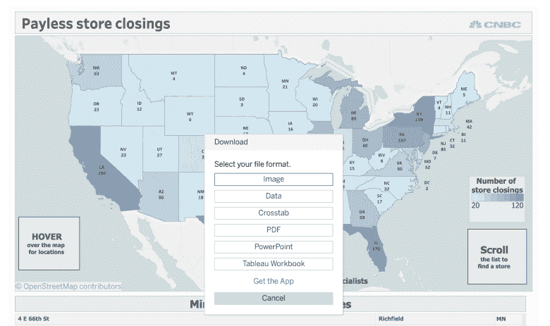

# 我只是想要数据:用 Base R(一个编码侦探故事)把 Tableau & Tidyverse 的眼泪变成微笑

> 原文：<https://dev.to/hrbrmstr/i-just-wanted-the-data--turning-tableau--tidyverse-tears-into-smiles-with-base-r-an-encoding-detective-story-58n6>

那些在殖民地之外的人可能不知道 Payless——一家让数百万不愿花 100 美元买一双他们 7 岁大的孩子一年后就穿不下的鞋子的穆斯林买得起鞋的全国连锁商店——正在关闭。美国消费者新闻与商业频道也有[的一个故事](https://www.cnbc.com/2019/02/19/heres-a-map-of-where-payless-shoesource-is-closing-2500-stores.html)，故事中有一个 choropleth，底部有一个小按钮，表明人们可以获得数据:

[](https://rud.is/b/2019/02/20/i-just-wanted-the-data-turning-tableau-tidyverse-tears-into-smiles-with-base-r-an-encoding-detective-story/payless-get-data/)

我应该知道这将是一件苦差事，因为他们使用 Tableau——当你想利用他们用来支持其首要平台的所有自由软件库时的首选平台，反过来，为你锁定所有数据，所以其他人无法采用、适应和改进。走吧。令人震惊。掠夺成性。资本主义。

*反正。*

我想让数据做一些真正的分析，而不是产生一个相当无用的可视化效果(TLDR:对受影响地区的人口普查数据进行分层，估计失业情况，计算最近的类似 Payless 商店，以查看对交通不便的家庭的影响，等等。所以我按下按钮，在 Chrome 中寻找网址(对，对于那些记得我在 2018 年转移到 Firefox 等的人，我切换回来了；三月份会有更多)并复制它，试图让这个帖子真正可复制(Tableau fanbois 的一个新概念):

```
library(tibble)
library(readr)

# https://www.cnbc.com/2019/02/19/heres-a-map-of-where-payless-shoesource-is-closing-2500-stores.html

tfil <- "~/Data/Sheet_3_data.csv"

download.file(
  "https://public.tableau.com/vizql/w/PAYLESSSTORECLOSINGS/v/Dashboard2/vud/sessions/6A678928620645FF99C7EF6353426CE8-0:0/views/10625182665948828489_7202546092381496425?csv=true&showall=true",
  tfil
)
## trying URL 'https://public.tableau.com/vizql/w/PAYLESSSTORECLOSINGS/v/Dashboard2/vud/sessions/6A678928620645FF99C7EF6353426CE8-0:0/views/10625182665948828489_7202546092381496425?csv=true&showall=true'
## Error in download.file("https://public.tableau.com/vizql/w/PAYLESSSTORECLOSINGS/v/Dashboard2/vud/sessions/6A678928620645FF99C7EF6353426CE8-0:0/views/10625182665948828489_7202546092381496425?csv=true&showall=true", : 
## cannot open URL 'https://public.tableau.com/vizql/w/PAYLESSSTORECLOSINGS/v/Dashboard2/vud/sessions/6A678928620645FF99C7EF6353426CE8-0:0/views/10625182665948828489_7202546092381496425?csv=true&showall=true'
## In addition: Warning message:
## In download.file("https://public.tableau.com/vizql/w/PAYLESSSTORECLOSINGS/v/Dashboard2/vud/sessions/6A678928620645FF99C7EF6353426CE8-0:0/views/10625182665948828489_7202546092381496425?csv=true&showall=true", :
## cannot open URL 'https://public.tableau.com/vizql/w/PAYLESSSTORECLOSINGS/v/Dashboard2/vud/sessions/6A678928620645FF99C7EF6353426CE8-0:0/views/10625182665948828489_7202546092381496425?csv=true&showall=true': HTTP status was '410 Gone' 
```

泰国或高棉的佛教寺或僧院

说实话，我期待某种时间框的网址(以前的经验 FTW)。Selenium 或 Splash 是潜在的替代品，但我不想研究更强的抓取的合法性(我只是想要数据)，所以我*手动*下载文件(*the horror*)并继续读取它。嗯，*试试*把它读进去:

```
read_csv(tfil)
## Parsed with column specification:
## cols(
## A = col_logical()
## )
## Warning: 2092 parsing failures.
## row col expected actual file
## 1 A 1/0/T/F/TRUE/FALSE '~/Data/Sheet_3_data.csv'
## 2 A 1/0/T/F/TRUE/FALSE '~/Data/Sheet_3_data.csv'
## 3 A 1/0/T/F/TRUE/FALSE '~/Data/Sheet_3_data.csv'
## 4 A 1/0/T/F/TRUE/FALSE '~/Data/Sheet_3_data.csv'
## 5 A 1/0/T/F/TRUE/FALSE '~/Data/Sheet_3_data.csv'
## ... ... .................. ...... .........................
## See problems(...) for more details.
## 
## # A tibble: 2,090 x 1
## A    
## <lgl>
## 1 NA   
## 2 NA   
## 3 NA   
## 4 NA   
## 5 NA   
## 6 NA   
## 7 NA   
## 8 NA   
## 9 NA   
## 10 NA   
## # … with 2,080 more rows 
```

泰国或高棉的佛教寺或僧院

从`readr::read_[ct]sv()`返回一个单独的列(通常)表明文件格式有问题。在戴上[猎鹿人](https://shop.bbc.com/deerstalker-hat-18746.html)(我只是想要数据！)我试着只用好 ol' `read.csv()`:

```
read.csv(tfil, stringsAsFactors=FALSE)
## Error in make.names(col.names, unique = TRUE) : 
## invalid multibyte string at '<ff><fe>A'
## In addition: Warning messages:
## 1: In read.table(file = file, header = header, sep = sep, quote = quote, :
## line 1 appears to contain embedded nulls
## 2: In read.table(file = file, header = header, sep = sep, quote = quote, :
## line 2 appears to contain embedded nulls
## 3: In read.table(file = file, header = header, sep = sep, quote = quote, :
## line 3 appears to contain embedded nulls
## 4: In read.table(file = file, header = header, sep = sep, quote = quote, :
## line 4 appears to contain embedded nulls
## 5: In read.table(file = file, header = header, sep = sep, quote = quote, :
## line 5 appears to contain embedded nulls 
```

泰国或高棉的佛教寺或僧院

事实上，这个“窟”并不是真正的*授权的，因为`read.csv()`通过`invalid multibyte string at '<ff><fe>A'`给了我们一些超有价值的信息。`FF FE`是一个*大*信号 <sup>[1](https://en.wikipedia.org/wiki/UTF-16) [2](http://unicode.org/faq/utf_bom.html)</sup> 我们正在处理另一种编码的文件，因为这是此类文件开头的一个常见“神奇”序列。*

 *但是，我不想深究我的哥伦布角色… *我只是。被通缉。的。数据*。因此，我尝试了来自`data.table`的快速灵活的助手:

```
data.table::fread(tfil)
## Error in data.table::fread(tfil) : 
## File is encoded in UTF-16, this encoding is not supported by fread(). Please recode the file to UTF-8. 
```

*啊哈*。UTF-16 ( *也许是*)。让我们看看原始文件:

```
x <- readBin(tfil, "raw", file.size(tfil)) ## also: read_file_raw(tfil)

x[1:100]
## [1] ff fe 41 00 64 00 64 00 72 00 65 00 73 00 73 00 09 00 43 00
## [21] 69 00 74 00 79 00 09 00 43 00 6f 00 75 00 6e 00 74 00 72 00
## [41] 79 00 09 00 49 00 6e 00 64 00 65 00 78 00 09 00 4c 00 61 00
## [61] 62 00 65 00 6c 00 09 00 4c 00 61 00 74 00 69 00 74 00 75 00
## [81] 64 00 65 00 09 00 4c 00 6f 00 6e 00 67 00 69 00 74 00 75 00 
```

有我们的`ff fe`(这是 UTF-16 可能性的开始)，但是`41 00`又回到了 UTF-16 的哥哥 UCS-2。`0x00`被嵌入`nul`(很可能得到对齐的字节)。还有，有很多 T4 的 T7，你知道他们是什么吗？他们是`<tab>` s .没错。Tableau 命名的文件中充满了 TSV 不必要的精心编码记录`CSV`。也许他们在键盘上敲“T”的次数太多了，以至于打不出他们的产品名称。

### 活出一个男孩的[数据]冒险故事

此时，我们有:

*   无法支持自动化、可重复的工作流程
*   一个错误命名的文件
*   一个过度编码的文件
*   浪费了很多时间(这很可能是有意让我们放弃，只使用 Tableau。不会吧。)

此时，我处于完全的 Rockford 文件(双关语)模式，并深入到命令行来使用一个老的、可信赖的助手 [`enca`](https://github.com/nijel/enca/) :

```
$ enca -L none Sheet_3_data.csv
## Universal character set 2 bytes; UCS-2; BMP
## LF line terminators
## Byte order reversed in pairs (1,2 -> 2,1) 
```

现在，我们要做的就是指定编码！

```
read_tsv(tfil, locale = locale(encoding = "UCS-2LE"))
## Error in guess_header_(datasource, tokenizer, locale) : 
## Incomplete multibyte sequence 
```

泰国或高棉的佛教寺或僧院

不像其他 99%的时间(可能是 99.9%)你使用它，tidyverse 在这种情况下不会支持你(但它*有你的[待办事项](https://github.com/tidyverse/readr/milestone/5)，因为它在 TODO 上)。*

你知道谁会支持你吗？基数 R！：

```
read.csv(tfil, sep="\t", fileEncoding = "UCS-2LE", stringsAsFactors=FALSE) %>% 
  as_tibble()
## # A tibble: 2,089 x 14
## Address City Country Index Label Latitude Longitude
## <chr> <chr> <chr> <int> <chr> <dbl> <dbl>
## 1 1627 O… Aubu… United… 1 Payl… 32.6 -85.4
## 2 900 Co… Doth… United… 2 Payl… 31.3 -85.4
## 3 301 Co… Flor… United… 3 Payl… 34.8 -87.6
## 4 304 Ox… Home… United… 4 Payl… 33.5 -86.8
## 5 2000 R… Hoov… United… 5 Payl… 33.4 -86.8
## 6 6140 U… Hunt… United… 6 Payl… 34.7 -86.7
## 7 312 Sc… Mobi… United… 7 Payl… 30.7 -88.2
## 8 3402 B… Mobi… United… 8 Payl… 30.7 -88.1
## 9 5300 H… Mobi… United… 9 Payl… 30.6 -88.2
## 10 6641 A… Mont… United… 10 Payl… 32.4 -86.2
## # … with 2,079 more rows, and 7 more variables:
## # Number.of.Records <int>, State <chr>, Store.Number <int>,
## # Store.count <int>, Zip.code <chr>, State.Usps <chr>,
## # statename <chr> 
```

~~什么~~的意思！

请注意，`read.csv(tfil, sep="\t", fileEncoding = "UTF-16LE", stringsAsFactors=FALSE)`也同样有效。

### 未走【原路】

由于这种行为大大降低了生产率，为了开心，我求助于另一个值得信赖的 R 助手,`stringi`包，看看它说了些什么:

```
library(stringi)

stri_enc_detect(x)
## [[1]]
## Encoding Language Confidence
## 1 UTF-16LE 1.00
## 2 ISO-8859-1 pt 0.61
## 3 ISO-8859-2 cs 0.39
## 4 UTF-16BE 0.10
## 5 Shift_JIS ja 0.10
## 6 GB18030 zh 0.10
## 7 EUC-JP ja 0.10
## 8 EUC-KR ko 0.10
## 9 Big5 zh 0.10
## 10 ISO-8859-9 tr 0.01 
```

而且，就像在 Google 缓存中为未来的搜索者准备的那样，将这些数据(以及其他更难理解但形式相似的数据)放入 R 的另一种方法是:

```
stri_read_lines(tfil) %>% 
  paste0(collapse="\n") %>% 
  read.csv(text=., sep="\t", stringsAsFactors=FALSE) %>% 
  as_tibble()
## # A tibble: 2,089 x 14
## Address City Country Index Label Latitude Longitude
## <chr> <chr> <chr> <dbl> <chr> <dbl> <dbl>
## 1 1627 O… Aubu… United… 1 Payl… 32.6 -85.4
## 2 900 Co… Doth… United… 2 Payl… 31.3 -85.4
## 3 301 Co… Flor… United… 3 Payl… 34.8 -87.6
## 4 304 Ox… Home… United… 4 Payl… 33.5 -86.8
## 5 2000 R… Hoov… United… 5 Payl… 33.4 -86.8
## 6 6140 U… Hunt… United… 6 Payl… 34.7 -86.7
## 7 312 Sc… Mobi… United… 7 Payl… 30.7 -88.2
## 8 3402 B… Mobi… United… 8 Payl… 30.7 -88.1
## 9 5300 H… Mobi… United… 9 Payl… 30.6 -88.2
## 10 6641 A… Mont… United… 10 Payl… 32.4 -86.2
## # … with 2,079 more rows, and 7 more variables: `Number of
## # Records` <dbl>, State <chr>, `Store Number` <dbl>, `Store
## # count` <dbl>, `Zip code` <chr>, `State Usps` <chr>,
## # statename <chr> 
```

(与舞蹈相似的要用`read_csv()`或`fread()`)。

### 鳍

这个晚上对数据做一些实际工作的探索被我厚颜无耻地称之为故意劝阻在除了商业程序之外的任何东西中这样做。但是，理解又一次大规模零售店关闭的影响是非常重要的，看起来可能要靠我们来做这项工作(因为媒体被无能的领导和缺乏经验的年轻纽约代表分散了太多注意力)。

想做同样事情的人可以从[这个网站](http://rud.is/dl/2019-payless-store-closings.csv)获取 UTF-8 编码的真实 CSV，这个网站也已经通过`janitor::clean_names()`运行，所以有适当的列类型和名称可以使用。

说到这里，这是 CSV 的`cols`规格:

```
cols(
  address = col_character(),
  city = col_character(),
  country = col_character(),
  index = col_double(),
  label = col_character(),
  latitude = col_double(),
  longitude = col_double(),
  number_of_records = col_double(),
  state = col_character(),
  store_number = col_double(),
  store_count = col_double(),
  zip_code = col_character(),
  state_usps = col_character(),
  statename = col_character()
) 
```

如果你对数据博客做了什么，并在评论中贴上链接，这样我和其他人就可以从你的发现中学习了！人们甚至不需要底图就能看到《穆里卡·佩莱斯》有多大的不同，这已经有点可怕了:

[](https://rud.is/b/2019/02/20/i-just-wanted-the-data-turning-tableau-tidyverse-tears-into-smiles-with-base-r-an-encoding-detective-story/payless-map-01/)*