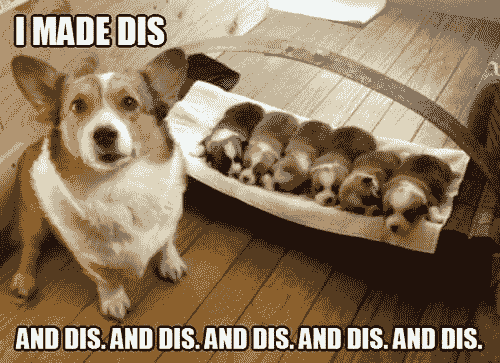
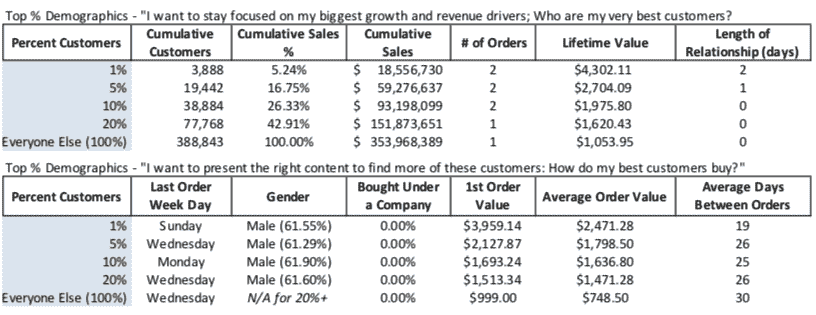
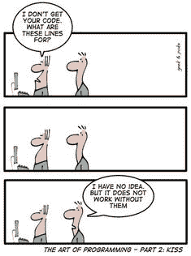

# 艰难地完成我的第一个项目

> 原文：<https://dev.to/datalospohy/struggling-through-my-first-project-3n2c>

要跳过下面关于我的第一个项目之旅的轶事，请滚动到帖子的第三部分，否则请继续。

#### 一些背景

我不是程序员..直到最近我才明白。几年来，我一直在摸索着学习。从在线课程跳到 MOOC，再跳到教科书，再回到另一个在线课程，所有这些都有望让你获得一个成熟的软件工程学位所需的技能。我跟着计算机编程炒作，然后是数据科学炒作，但从未真正取得任何进展。在我不断失败的循环中休息了一段时间后，我在某处阅读，同时试图找到继续学习的动力，7%开始在线课程的人实际上完成了。这才是真正的动力！！-__-当我准备放弃并回到我无聊的日常工作时，作者指出了一些事情。软件工程是艰难的，令人沮丧的，在看到结果之前，你很可能不会享受这个过程。如果你想在这些暗淡的前景下获得成功，你需要明白你的原因。简单来说，你为什么想成为一名电脑程序员？我的第一个想法是我想赚更多的钱，但事实上，我的日常工作收入还不错，而且我已经准备好赚更多的钱，所以事实并非如此。在我的灵魂中寻找了好久之后，我找到了它。能够将某样东西变成现实，这是一种诱人的、神秘的、有时甚至是不可思议的东西。简单明了:我想创造。我想出主意，合成各部分，然后说！

[](https://res.cloudinary.com/practicaldev/image/fetch/s--IRAWlA39--/c_limit%2Cf_auto%2Cfl_progressive%2Cq_auto%2Cw_880/https://i.kym-cdn.com/photimg/original/000/572/845/218.jpg)

意识到这一点后，我如火如荼，干劲十足，兴奋不已！所以我跑了出去，坐在我的电脑前，打开一些随机文件，然后砰！路障。我该如何构建一个程序？对于所有的“你好，世界！”对于循环来说，我从来没有在一个浏览器托管的、完美设置的、提供答案的环境之外写过东西。让我们快速记下我的情况，至少其中一个是我们都能理解的。

1.  没有技术背景或获得实际使用的技术技能的背景。
2.  我的网络是 100%的金融和商业人士，所以没有人可以寻求帮助。
3.  自学疲劳，好大的疲劳，无尽的疲劳。

#### 解——师徒关系

但不是任何一个导师，而是一个从默默无闻到令人垂涎的“高级工程师”和“硅谷独角兽创业公司”的人。夸大妄想。我的模式就这样开始了，我跑开，坐在我的电脑前，搜索“python 编程导师”，然后砰！路障。我只看到训练营这个，交钱计划那个。再次沮丧，我想也许我应该问如何找到一个导师。一些很棒的回答是“利用你的关系网”，“在网上发布一些项目并寻求反馈，这样它会自然发展”，“在你当地的聚会上参加研讨会”。所有这些伟大的建议似乎与前面提到的个人奋斗清单相矛盾。还是那么沮丧。不是一个被打败的人，我又试着搜索了一次“芝加哥 Python 导师计划”。然后从白噪音中走出来，就像是我在编码之旅中所有挣扎的答案，这就是 [ChiPy 导师计划](https://chipymentor.org/)。除了所有的夸张，这对我来说真的是一个完美的计划。免费的导师计划，一个 Python 开发者社区，希望帮助像我这样的人的志愿者。我申请了，我被录取了，现在我们终于到了这篇文章的关键点。

## 艰难度过我的第一个项目！

#### 想法

我目前的公司专注于为电子商务行业创建集成和分析解决方案。价值主张是，我们将数据转化为见解，将见解转化为行动，并将行动转化为业务增长。我们制作了一份名为 80/20 RFM 和细分报告的咨询报告，这是一份根据交易数据展示最佳客户的别出心裁的报告。
[](https://res.cloudinary.com/practicaldev/image/fetch/s--JaSNSePp--/c_limit%2Cf_auto%2Cfl_progressive%2Cq_auto%2Cw_880/https://thepracticaldev.s3.amazonaws.com/i/u3jh013odl2qral7am7i.png) 
该报告由 excel 表格生成，有时需要数周才能完成。我觉得这非常适合我的第一个项目。我知道它应该是什么样子，并且我有领域经验来理解它背后的机制。随着我技能的提高，我也有一个清晰的路径来迭代它。总的想法是，你获取一个在线商店的交易历史，并通过公式运行它，以产生关于商店性能的见解。

#### 要求

1.  根据顾客的购买历史，找出前 1%、5%、10%和 20%的顾客。
2.  确定每个细分市场的特征。(终身价值，占销售额的百分比)
3.  确定完整数据集的特征。
4.  为每个客户创建 [RFM 分数](http://gain-insights.com/solutions/retail-analytics/customer-segmentation-using-rfm-analysis/)。
5.  执行群组分析以发现见解。
6.  以易于理解的格式呈现这些数据。

这些是我正在处理的列:

```
 Index(['customerId', 'name', 'companyName', 'customerGroup', 'city', 'state',
       'country', 'email', 'totalAmountOfOrders', 'ordersCount',
       'firstOrderDate', 'secondOrderDate', 'lastOrderDate',
       'averageDaysBetweenOrders', 'firstOrderAmount', 'secondOrderAmount',
       'lastOrderAmount', 'averageOrderValue', 'createdAt'],
      dtype='object') 
```

从表面上看，这一切听起来很容易。格式化数据，在列上做一些数学魔术，分配标签。让我们来谈谈挑战。

#### 一路走来的挑战和犯下的错误

1.  每个商店都不一样，所以每个输入都不一样，所以我的程序必须灵活。
    *   我打开一个 Jupyter 笔记本，快速浏览了在一个数据集上创建报告所需的所有数学运算。
    *   它在第二个数据集上不起作用。
2.  你不能被零除。
    *   空值，这么多空值。
    *   我没有从清理数据开始，所以数学总是失败。
3.  Jupyter 笔记本不等于程序。
    *   什么是 Github？
    *   你如何设置一个要运行的文件？
    *   有适合假人的 PyCharm 吗？
4.  我是在写剧本还是在写程序？
    *   我写了一个曾经有效但需要反复有效的东西。
5.  具有数千行甚至数百万行的数据集不适合 for 循环。
    *   想象一下，编写一个需要运行 22 列和 700，000 行的 for 循环，而您的电池在中途耗尽了。
6.  在计算出报告中的所有数据后，我意识到其中一半是无用的文本。

#### 好玩的东西，代码

为了防止这篇博文成为一本书，我将把重点放在这个项目中特别具有挑战性的部分，RFM 评分。

```
from datetime import datetime
from datetime import timedelta
import pandas as pd
import numpy as np

def file_read(file):
    """
    Function meant to read in any file at any location
    """
    rfm_file = pd.read_csv(file)
    print(rfm_file.columns)
    return rfm_file

def fix_null(df, column):
    """
    Removes any null values in the columns we need to calculate on
    """
    df.loc[df[column].isnull(), column] = 0
    return df
def date_conv(x):
    """
    Converting the order columns to date time objects
    when running the function originally it turns out it wasnt clean
    so had to account for missing data and then account for other data types
    """
    x = str(x)
    date_format = "%Y-%m-%dT%H:%M:%SZ[%Z]"
    date_format2 = "%Y-%m-%dT%H:%MZ[%Z]"
    if x == "nan":
        return "Missing Order Data"
    else:
        try:
            datetime_object = datetime.strptime(x, date_format)
            x = datetime_object
            return x
        except:
            datetime_object = datetime.strptime(x, date_format2)
            x = datetime_object
            return x
def prep_file(file_loc):
    """
    """
    rfm_report = file_read(file_loc)
    report_columns = rfm_report.columns
    fix_null(rfm_report, "totalAmountOfOrders")
    fix_null(rfm_report, "ordersCount")
    rfm_report["firstOrderDate"] = rfm_report["firstOrderDate"].apply(date_conv)
    rfm_report["lastOrderDate"] = rfm_report["lastOrderDate"].apply(date_conv)
    return rfm_report

rfm_report = prep_file("/Users/dougdotts/Downloads/rfm.csv") 
```

这段代码的目标是清理数据。之前提到的挑战都是从这里开始的。我在我上过的许多课程中的一门课上学到的一个小技巧是为程序中多个地方想做的事情创建函数。这个模糊的参考引导我进入[函数式编程](https://medium.freecodecamp.org/an-introduction-to-the-basic-principles-of-functional-programming-a2c2a15c84)。根据我有限的理解，我估计函数式编程范例将允许我编写能做好一件事和一件事的代码，我听说这对于干净的代码很重要。

*file_read* 函数非常简单，只需将我的原始代码片段转换成接受变量即可。简单的部分到此结束。您可能会想，如果您使用的是关于订单历史的数据集，那么所有与订单相关的列都会有数据。在对不必要的错误绞尽脑汁之后，我最终完成了可以应用于多个列的常见清理任务。因此 *fix_null* 和 *date_conv* 。关于清理列需要注意的是，许多更有用的库只处理字符串。然后，我通过创建一个函数来调用所有其他函数 *prep_file* 来简化这个过程。

第一课:不要假设你的数据是干净的，花时间仔细检查一下，看看它的格式是否可用。这将节省大量调试代码的时间，而这些代码在技术上应该是可行的。额外收获:如果一个栏目有两种不同的格式，很有可能会有第三种格式。【T2

```
def recency_star_rating(number, df, col, title):
    """
    Breaks data into sections based on the most recent order
    """
    df = df[df[col] != "nan"]
    df = df[df[col] != "Missing Order Data"]
    df = df.sort_values(by=col, ascending=True)
    df[title] = pd.qcut(df[col],number,labels=False)
    df[title] = df[title] + 1

    return df

rfm_report = recency_star_rating(5,rfm_report,"lastOrderDate","Recency Rating") 
```

此功能的目的是为员工的 *lastOrderDate* 分配 1-5 的评分。最接近今天购买的前 20%得到 5 分，最早购买的前 20%得到 1 分。这就是干净数据变得非常必要的地方。通常建议只删除有 null 值的行，但是在我的用例中，一列为 null 而另一列不是。每次运行该函数时，我都必须取出非空的行。*写完这个程序后，我几乎觉得自己成了布尔索引专家。*然后，我必须从最小到最大对值进行排序，以便对列表进行分段。为了这只[熊猫，我在熊猫身上学到了一个全新的工具。该函数接收一系列数据段数，然后返回平均分成这些数据段的数据。我对这个函数知之甚少，因为它返回数据类型为*类别*的字段。我在学习分类数据所需的时间内完成了整个程序。简单的方法是将列转换回字符串。我最初试图基于 *df.iloc[]* 为此创建自己的函数，但我无法让它工作，最后当我运行它时，我的导师发给我 *pd.qcut* 的链接。在明显沮丧的同时，我学到了另一个有价值的教训。](http://pandas.pydata.org/pandas-docs/version/0.15.0/generated/pandas.qcut.html)

第二课:这是一个预置的函数。在重新发明轮子之前，做一个快速的谷歌搜索，看看是否有一个功能可以满足你的需要。有可能，甚至有更大的可能，它比你自己所能做的要多得多。

```
def monetary_star_rating(number, df, col, title):
    """
    Breaks data into sections based on the amount of money spent
    """
    df_1 = df.loc[df['ordersCount'] == 1]
    df_1[title] = 1

    df_2 = df[df['ordersCount'] != 1].sort_values(by=col, ascending=False)
    df_2[title] = pd.qcut(df[col],number,labels=[2,3,4,5])

    frames = [df_1, df_2]
    df = pd.concat(frames)
    return df

rfm_report = monetary_star_rating(4,rfm_report,"totalAmountOfOrders","Monetary Rating") 
```

该函数采用 *totalAmountOfOrders* 作为特定客户所有订单的总货币价值，并分配一个等级。这一特定的评级并不像最近那样一成不变。对于该数据集，62%的客户只购买了一次，平均终身价值为 48 美元，而前 1%的客户购买了 15 次以上，平均终身价值为 652 美元。不可能将这五个部分平均分配。考虑到一次性购买者的价值普遍较低，一个折中的办法是将他们取出并分配 1，然后将其他行分段。在这里，你会注意到 *pd.qcut* 的用法有所不同。我添加了属性“标签”。由于某些原因，在前面的函数中，当我添加标签时，dtype 是 category，而在这个函数中，它返回 int64 dtype。

第三课:不要使用你不了解的功能，即使它们可以工作。当代码开始以您不希望的方式运行时，您将不知道如何修复它。这将导致代码腐烂，因为你很可能不去管它，害怕改变它会破坏整个系统。

[](https://res.cloudinary.com/practicaldev/image/fetch/s--CYzaeDpf--/c_limit%2Cf_auto%2Cfl_progressive%2Cq_auto%2Cw_880/https://i.pinimg.com/236x/6e/23/ab/6e23ab731222118fcf84000d4be118e7--computer-science-humor-computer-jokes.jpg%3Fb%3Dt)T3】

```
"""
def specific_frequency_star_rating(x):

    #Breaks data into sections based on the amount of orders

    #df = df[df[col] != "nan"]
    #df = df[df[col] != "Missing Order Data"]
    if x <= 8:
        rating = 1
    elif (9 <= x) & (x <= 25):
        rating = 2
    elif (26 <= x) & (x <= 42):
        rating = 3
    elif (43 <= x) & (x <= 59):
        rating = 4
    elif (60 <= x):
        rating = 5
    return rating

"""
def create_cut(number, df, col):
    """
    First finds all the unique fields then segments them in quintiles.
    Uses the quintiles to give ratings to the original data
    """

    sorted_col = df[col].sort_values()
    unique_val = sorted_col.unique()
    unique_val = unique_val[unique_val != 1]
    unique_cut = pd.qcut(unique_val,number,labels=False)
    unique_dict = {"Items" : unique_val, "Labels" : unique_cut}
    unique_df = pd.DataFrame(unique_dict)

    left_min = list()
    right_max = list()

    for i in range(4):
        testmin = unique_df[unique_df.Labels == i]
        testmin = testmin["Items"]
        testmin = min(testmin)
        int(testmin)
        left_min.append(testmin)
    for i in range(4):   
        testmax = unique_df[unique_df.Labels == i]
        testmax = testmax["Items"]
        testmax = max(testmax)
        int(testmax)
        right_max.append(testmax)

    bins = pd.IntervalIndex.from_arrays(left_min,right_max,closed="both")
    cut = pd.cut(df["ordersCount"],bins)    

    return cut

def create_freq_labels(df, col):
    test = df[col].unique().sort_values()
    test = test.astype(str)
    test = test.tolist()
    test.remove('nan')
    print(test)
    column = df[col].astype(str)
    num = 2
    test_dict = dict()
    for i in test:
        test_dict[i] = num
        num += 1
    print(test_dict)
    column = column.replace(test_dict)
    column = column.replace({'nan':1})  

    return column
rfm_report["Frequency Rating"] = create_cut(4, rfm_report,"ordersCount")
rfm_report["Frequency Rating"] = create_freq_labels(rfm_report,"Frequency Rating") 
```

在这里我只能说编程很难。频率评级根据订单数量对客户进行细分。观察注释掉的函数*specific _ frequency _ star _ rating*，当您已经知道订单的范围时，您会发现这个任务非常容易完成。没有这种确定性，这座蚂蚁山就会变成一座山。我真的在这一部分花了一周时间。我的金锤 *pd.qcut* 用无尽的错误拒绝了我。银锤 *pd.cut* 只让我完成了一半，因为一个[已知问题](https://github.com/pandas-dev/pandas/issues/21233)。这表明，即使是专家也不能对错误免疫。我肯定有更好的方法来做这件事，但我最终成功了。解释它需要另一篇文章。我只知道，我花了所有的字典、索引、列表和数据类型转换知识才让这个东西工作起来。

**这里有两节课:**

**4。不要过于依赖某个特定的功能。它不能解决所有的使用案例，而且没有人想成为一匹只会一招的小马。**

**5。前面说过，编程很难。对于其他人来说，这似乎是一个简单的问题，但在我短暂的编码生涯中，这是我做过的最难的事情。解决之后，我很兴奋，准备进入下一步。编码很难，但成功是我生活中最令人满意的事情之一。**

#### 我该何去何从？

所有这些努力都是为了按原样重新创建报告，我之前提到过，大多数呈现的数据都是无用的。我想引入原始的交易数据，而不是汇总数据，看看我是否能从中找到一些真正的见解。这将带来一系列问题，例如合并多个 NoSQL 数据库，这些数据库会产生 JSON 文件和数百万行数据，以及学习如何在 AWS 云中工作。当我能够说“您的顶级客户在周三购买产品 x 最多，并对 10%的优惠券代码做出回应，导致平均订单价值增加 x %”时，这一切都是值得的。这将是真正的价值创造。这还有其他层面，比如有用的可视化，可能还有一个机器学习方面，它开始预测什么客户将在何时购买什么产品。要学的东西太多了，但我限制了这个版本的范围，这样我就可以真正完成一个项目。

1.  第一阶段——将所有当前计算重新创建为函数，并找到其他有价值的指标。
2.  第二阶段——连接到原始数据并将处理过程写入程序，这样我就有更多的数据可以处理了。
3.  第三阶段——弄清楚如何以一种可理解的格式可视化，以及如何提供对数据的解释。
4.  第四阶段——将它们打包并连接到一个用户可以浏览数据的交互式前端。

#### 结束。

感谢你允许我发表关于我的第一个项目的第一篇博文。更多即将到来。