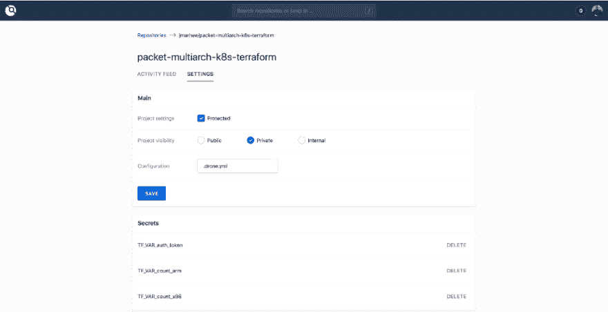
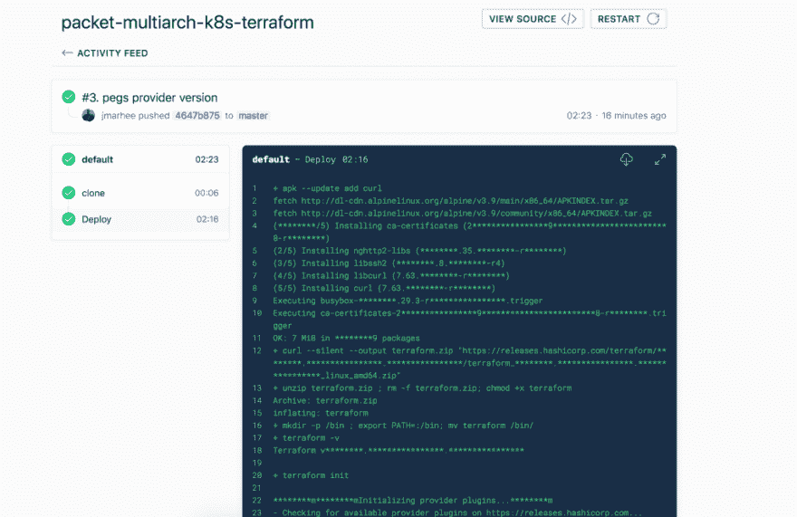

# 使用无人机为 Terraform 持续交付。io

> 原文：<https://dev.to/jmarhee/continuous-delivery-for-terraform-with-droneio-21ll>

[](https://res.cloudinary.com/practicaldev/image/fetch/s--re3xjhc2--/c_limit%2Cf_auto%2Cfl_progressive%2Cq_auto%2Cw_880/https://cdn-images-1.medium.com/max/640/1%2Ay2aYyXq908Agavu47uSeqg.jpeg) 

<figcaption>来源:【https://www.wocintechchat.com/】</figcaption>

持续交付(或者持续集成和 CD 的组合)是一种保持项目良好测试的模式(就交付到产品而言——对变更本身的其他测试也不例外)[非常容易部署](https://codeship.com/continuous-integration-essentials)。对于像 Terraform repositories 这样的基础设施供应和状态管理工具这样的项目，这通常意味着，在对发布分支进行更改时，运行这些更改并确保清单仍然可以干净地应用。

我最近创建了这个项目，在[数据包](http://packet.com)上部署多架构 Kubernetes 集群:

[jmarhee/packet-multi arch-k8s-terra form](https://github.com/jmarhee/packet-multiarch-k8s-terraform)

选择了 [Drone.io 的云 CD 工具后，](http://cloud.drone.io)一旦我激活了我的项目，我需要做的就是:

[](https://res.cloudinary.com/practicaldev/image/fetch/s--tc5QyX54--/c_limit%2Cf_auto%2Cfl_progressive%2Cq_auto%2Cw_880/https://cdn-images-1.medium.com/max/1024/1%2AH9c44XNKrw3_ibEvvTyzYw.png)

使用我的构建步骤推送一个清单. drone.yml，并引用一些配置选项，我需要这些选项来成功运行 Terraform。

在我在项目中布置清单之前，我需要存储机密，以便在 Drone 运行 Terraform 时向它们公开，所以像提供者凭据和其他变量值这样的东西，您通常可以在本地运行 terraform.tfvars 时放入其中:

[](https://res.cloudinary.com/practicaldev/image/fetch/s--WNpMDYnT--/c_limit%2Cf_auto%2Cfl_progressive%2Cq_auto%2Cw_880/https://cdn-images-1.medium.com/max/1024/1%2AuJStvXp7uukzy-H_gxOxEQ.png)

在清单中存储这些值后，您可以引用这些值并将其放入环境变量中(例如，对于名为 count_x86 的变量，您可以导出类似 TF_VAR_count_x86 的变量，而不是在 tfvars 中声明):

```
kind: pipeline

name: default

steps:

- name: Deploy

  image: alpine

  environment:

      TF_VAR_auth_token:

          from_secret: TF_VAR_auth_token

      TF_VAR_count_x86:

          from_secret: TF_VAR_count_x86

      TF_VAR_count_arm:

          from_secret: TF_VAR_count_arm 
```

然后安装和运行 Terraform，验证，然后将更改应用到存储库的 Terraform 清单，您可以在如下列表中提供命令:

```
 commands:

  - apk --update add curl

  - curl --silent --output terraform.zip "https://releases.hashicorp.com/terraform/0.11.11/terraform_0.11.11_linux_amd64.zip"

  - unzip terraform.zip ; rm -f terraform.zip; chmod +x terraform

  - mkdir -p ${HOME}/bin ; export PATH=${PATH}:${HOME}/bin; mv terraform ${HOME}/bin/

  - terraform -v

  - terraform init

  - terraform validate

  - terraform apply -auto-approve

  - terraform destroy -auto-approve 
```

然后，在推送到您的目标分支(在我的例子中是主分支)时，一个新的测试运行将开始:

[](https://res.cloudinary.com/practicaldev/image/fetch/s--LhLtftSY--/c_limit%2Cf_auto%2Cfl_progressive%2Cq_auto%2Cw_880/https://cdn-images-1.medium.com/max/1024/1%2AgkM5pSPjO9InQnfesl71Vw.png)

使用构建步骤的输出，在我们的例子中是一个名为 Deploy 的阶段(例如，您可以重复这个步骤，以在不同的设施中测试不同的服务器类型——在我们的例子中是 TF _ VAR _ facilityin 或者只是在一个更改需要多种类型的验证时),写出到控制台。

进一步阅读

[https://hacker noon . com/build-your-own-ci-CD-pipeline-with-drone-e43d 7190989 b](https://hackernoon.com/build-your-own-ci-cd-pipeline-with-drone-e43d7190989b)

[https://codeship.com/continuous-integration-essentials](https://codeship.com/continuous-integration-essentials)

[https://github.com/jmarhee/packet-multiarch-k8s-terraform](https://github.com/jmarhee/packet-multiarch-k8s-terraform)