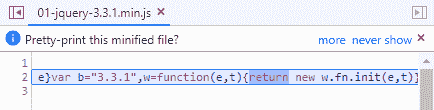
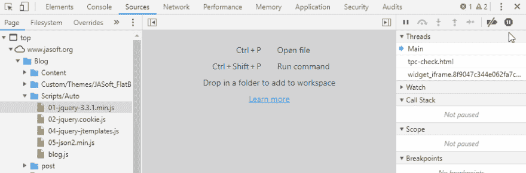
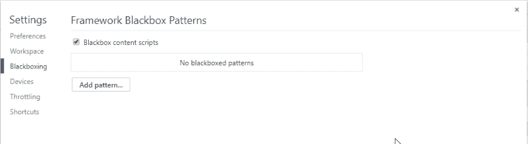
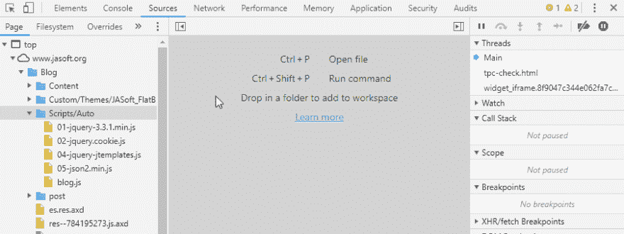

# trick-chrome 调试:将 JavaScript 文件转换为“黑匣子”以避免调试

> [https://dev . to/jmalarcon/trick---debug CIN-con-chrome-convert-files-JavaScript-in-black box-to-avoid-debug-59 HJ](https://dev.to/jmalarcon/truco---depuracin-con-chrome-convertir-archivos-javascript-en-cajas-negras-para-evitar-depurarlos-59hj)

> 最初发表在我的技术博客上:https://www . jassoft . org/blog/post/truo-debug-con-chrome-convert-files-JavaScript-in-box-black-to-avoid-debug . aspx

一般来说，当我们调试 web 应用程序时，有些事情是可以信任的。例如，如果发生异常，几乎可以肯定的是，这是我们的代码，而不是我们使用的任何已知 JavaScript 库的错。也就是说，异常可以跳至 jQuery 或 Angular 行，但这并不意味着错误就在那里，而是由我们的代码先前发出的调用引起的。

因此，当我们一步一步地调试、在某些行上设置断点然后运行功能代码、用“`F11`”插入它们或用“`F10`”跳过它们时，突然打开其中任何一个库的源代码都没有多大意义，因为它不会更不用说如果我们已经尽量少用了，并且已经可以生产了，因为上面我们也看不到什么了:

让调试器停在这条有趣的线上！□什么？

幸运的是，Chrome 开发人员已经考虑到了这种情况，并允许我们将我们感兴趣的*脚本*放入一个“黑匣子”，从而使我们能够防止这种情况的发生。该操作称为**【black oxing】**，它所做的是*脚本*正常运行，但就调试而言，它就像一个黑匣子，所以知道输入和输出的参数，但从不进入其内部。

实际上，这意味着**调试器决不会停在其内部的任何代码**，从而加快了我们的调试。

让我们看看它是如何工作的-我...。

## 激活“blackboxing”能力

默认情况下，此功能处于禁用状态，因此我们无法使用它。要启用它，我们需要转到开发人员的工具设置并访问名为“blackboxing”的相应部分，然后从该处启用它，如以下小动画所示:

## 在黑匣子中加入 scrips

启用该功能后，我们有两个选项可以向黑盒添加脚本:

#### 1.-添加路径和/或通用名称

例如，我们通常不希望调试器在任何最小化的生产库中停止。由于这些库的文件通常以名称“`.min.js`”结尾，因此我们可以使用刚才激活的“*check*”下面的按钮将此类模式添加到文件名中:

在一个重要的地方:

*   模式是一个正则表达式。因此，您可以使用这些(大量)功能来查找所有类型的文件，此外，正如动画中所示，在正则表达式中，点代表任何字符，因此，如果您要指出一个真正的点，您必须在它前面放置一个斜线，就像在动画中看到的那样，从而“逃脱”。考虑一下吧。这使我们可以添加许多政变文件。动画中所有最小化的对象。
*   这些模式不仅允许我们将文件转换为黑盒，而且相反:对于我们添加的任何模式中包含的某些文件，禁用黑盒。所以这两者都适用。

#### 2.-将每个文件分别转换成黑匣子

此外(或代替)如果我们要使用模式将特定文件转换为黑盒，在关闭上一个对话框并启用该功能后，我们将在源代码选项卡中的文件上下文菜单中有一个新选项:`Sources`。只要打开任何文件，右键单击打开的文件的任意位置，即可看到一个新选项`Blackbox Script`，使我们能够做到这一点:

从那时起，调试器将不会停止在该文件中，这正是我们想要的。

看上一个动画中的情况，一旦将文件转换为黑盒，我们就可以使用现在放入“`Stop blackboxing`”的同一上下文菜单重新启用它进行调试。∞天啊！

## 总之

*脚本*中的“blackboxing”对于加快调试速度和提高生产效率可能非常有用，因为我们很少关注第三方库的代码细节或经过高度测试的代码(可能出于教学目的除外)，并使其起到黑匣子的作用此外，如果我们在特定时间需要它，则很容易禁用它。

我的建议是直接禁用对生产库(“T0”)的调试，可能还有那些库。虽然这些库并未最小化，但已被成千上万的开发人员广泛使用和测试(框架等)。只考虑其他第三方库的影响，您可以节省时间，减少部署时间，只需关注程序所包含的信息和程序所管理的操作。

直到结果出来！

> **原始邮件:**[https://www . jassoft . org/blog/post/trick-debug-con-chrome-convert-files-JavaScript-en-box-black-to-avoid-debug . aspx](https://www.jasoft.org/Blog/post/truco-depuracion-con-chrome-convertir-archivos-javascript-en-cajas-negras-para-evitar-depurarlos.aspx)