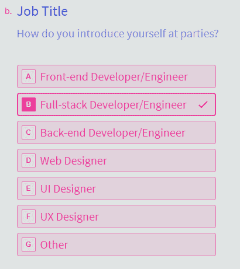

# 你如何在聚会上介绍自己？

> 原文：<https://dev.to/andreandyp/how-do-you-introduce-yourself-at-parties-45gh>

最近，一个关于 CSS 状态的新调查来自 JS 状态的家伙们。我在回答调查时，出现了一个有趣的问题:

(是的，我认为自己是一个全栈开发人员，但我们不是在谈论这个😛).这个问题让我觉得有点好笑:我做了 5 年的开发人员，参加过很多聚会，但是我从来没有在聚会上介绍自己是开发人员😅。

你呢？你在聚会上介绍自己时会提到你的头衔吗？