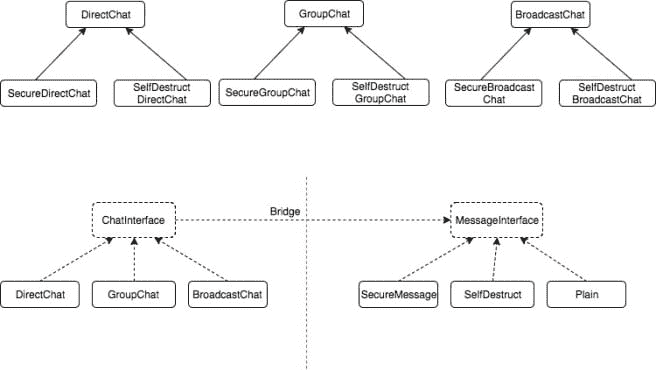

# 桥梁设计模式[结构]

> 原文：<https://dev.to/itscoderslife/bridge-design-pattern-structural-2c7m>

**为什么？**增加特征集分解类层次结构。桥模式通过将公共和特定的功能分离到不同的层次结构中来分解复杂的类层次结构。

在典型的软件开发中，当我们添加新特性时，子类的数量以惊人的速度增长。通过将实现与接口分离，两者可以独立变化。

**目标是分离出通用功能和特定功能。**

> 桥接模式将抽象从实现中分离出来，减少了变更的影响。

示例:

考虑 2 个类-**GroupChat**&**direct chat**。如果这些是普通的聊天形式。然后你需要添加对安全聊天和自毁聊天的支持，现在一般的趋势是将每个聊天扩展到另外两个 SecureGroupChat 和 SelfDestructGroupChat。现在考虑是否有另一种类型的聊天—**broadcast chat**,我们需要将其扩展到 SecureBroadcastChat 和 SelfDestructBroadcastChat。现在我们一共有 9 个班。

桥接模式——通过接口和接口之间的桥接来解决这个问题。

使用桥模式，所有的聊天类都实现了 ChatInterface，它将包含一个 MessageInterface。另一方面，所有 3 种安全、自毁和普通消息类型将符合 MessageInterface。

优势:

1.  分离通用和专用功能
2.  增加凝聚力
3.  移除继承(层次结构)
4.  移除紧密耦合
5.  减少班级数量