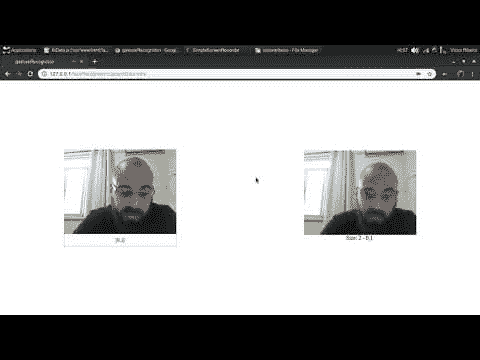

# 人脸识别

> 原文：<https://dev.to/victorqribeiro/facerecognition-520n>

# 人脸识别

用我的[神经网络](https://github.com/victorqribeiro/mlp)用 JavaScript 做了一个人脸识别实验。

## 捕捉数据

captureData.html-从网络摄像头获取图像数据。

在*标签*输入上，将标签输入到一键编码的 hormat 中。
例如:【1，0】如果某物是 A - [0，1]如果某物是 b

### 如何使用

捕获当前帧并将其添加到数据集中。

s -将数据集(x，y)保存为 x 和 y .json 文件。

撤销。从数据集中删除最后一个条目。

## 拟合数据

fitData.html-用在 captureData.html 创建的数据训练神经网络

## 测试数据

testData.html-用网络摄像头拍摄的新图像测试神经网络。

## 重要信息

本报告中提供的 *nn.json* 模型可能不适合你，因为它只使用我自己的 80 幅图像进行训练。
40 张我在电脑前的照片，40 张我不在电脑前的照片。
在训练前和测试期间，图像被缩放至 32x24 像素。

你可以在这里查看代码