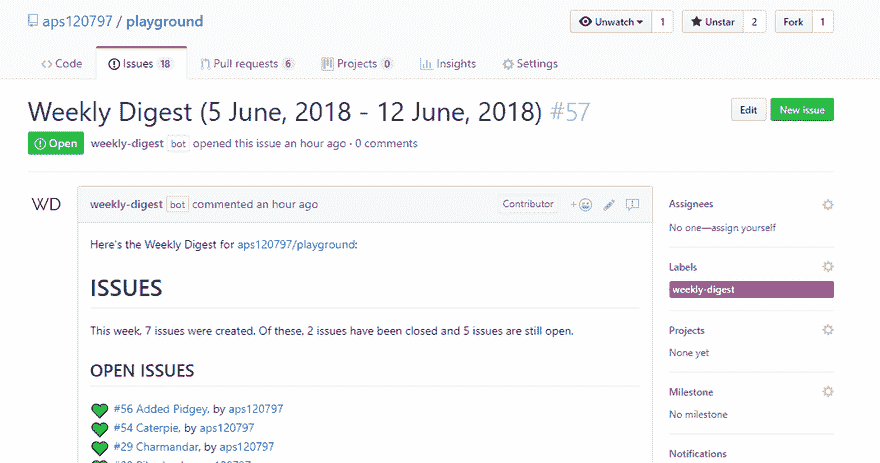

# 每周摘要:你的 GitHub 库的活动摘要

> 原文：<https://dev.to/jess/weekly-digest-summary-of-activity-on-your-github-repository-fbm>

这个机器人给了我一个超级全面的快照，每周都要回购。我可以看到新问题、已关闭问题、合并的 PRs、提交、参与回购的人员等列表。太牛逼了！这是它所产生的问题的一个例子:

# [ 《每周文摘》(2019 年 2 月 11 日-2019 年 2 月 18 日) #1816](https://github.com/thepracticaldev/dev.to/issues/1816) 

[![weekly-digest[bot] avatar](img/5ea0dc2ffd717ac95a65152eae117f2f.png)](https://github.com/apps/weekly-digest) **[weekly-digest[bot]](https://github.com/apps/weekly-digest)** posted on [<time datetime="2019-02-18T02:16:21Z">Feb 18, 2019</time>](https://github.com/thepracticaldev/dev.to/issues/1816)

下面是 [*的**周刊摘要**实用 dev/dev.to*](https://github.com/thepracticaldev/dev.to) :

* * *

# 问题

上周发行了 41 期。其中，27 期已经结案，14 期仍未结案。

## 公开议题

<g-emoji class="g-emoji" alias="green_heart" fallback-src="https://github.githubassets.cimg/icons/emoji/unicode/1f49a.png">💚</g-emoji> #1810 [不断看到离线画面](https://github.com/thepracticaldev/dev.to/issues/1810)，由 [stereobooster](https://github.com/stereobooster) <g-emoji class="g-emoji" alias="green_heart" fallback-src="https://github.githubassets.cimg/icons/emoji/unicode/1f49a.png">💚</g-emoji> #1809 [[WIP]在评论](https://github.com/thepracticaldev/dev.to/pull/1809)附近添加迷你降价备忘单，由[Mario 参见](https://github.com/mariocsee) <g-emoji class="g-emoji" alias="green_heart" fallback-src="https://github.githubassets.cimg/icons/emoji/unicode/1f49a.png">💚</g-emoji> #1806 [允许查看您的 <g-emoji class="g-emoji" alias="heart" fallback-src="https://github.githubassets.cimg/icons/emoji/unicode/2764.png">❤️</g-emoji> 和<g-emoji class="g-emoji" alias="unicorn" fallback-src="https://github.githubassets.cimg/icons/emoji/unicode/1f984.png">🦄</g-emoji>历史](https://github.com/thepracticaldev/dev.to/issues/1806)，由[j-f1](https://github.com/j-f1)T22】💚 #1805 [只有向下滚动](https://github.com/thepracticaldev/dev.to/issues/1805)才能加载首页的帖子， 由[赵](https://github.com/Zhao-Andy)安迪<g-emoji class="g-emoji" alias="green_heart" fallback-src="https://github.githubassets.cimg/icons/emoji/unicode/1f49a.png">💚</g-emoji> #1801 [用](https://github.com/thepracticaldev/dev.to/pull/1801)[轻合金](https://github.com/lightalloy) <g-emoji class="g-emoji" alias="green_heart" fallback-src="https://github.githubassets.cimg/icons/emoji/unicode/1f49a.png">在物品销毁时半身像缓存而不是重新保存物品#1621 💚</g-emoji> #1799 [通过](https://github.com/thepracticaldev/dev.to/pull/1799) [aspittel](https://github.com/aspittel) <g-emoji class="g-emoji" alias="green_heart" fallback-src="https://github.githubassets.cimg/icons/emoji/unicode/1f49a.png">为用户添加一个字段以显示他们是否允许文章编辑💚</g-emoji> #1796 [隐私獾考虑开发一个追踪器](https://github.com/thepracticaldev/dev.to/issues/1796)，作者<g-emoji class="g-emoji" alias="green_heart" fallback-src="https://github.githubassets.cimg/icons/emoji/unicode/1f49a.png">💚</g-emoji> #1794 [页脚与左手导航卡](https://github.com/thepracticaldev/dev.to/issues/1794)重叠， 由[12 万布拉](https://github.com/12vanblart)到<g-emoji class="g-emoji" alias="green_heart" fallback-src="https://github.githubassets.cimg/icons/emoji/unicode/1f49a.png">💚</g-emoji> #1788 [提交播客评论](https://github.com/thepracticaldev/dev.to/issues/1788)后页面不更新，作者[轻合金](https://github.com/lightalloy)T58】💚# 1787[【WIP】修复移动侧边栏滚动问题](https://github.com/thepracticaldev/dev.to/pull/1787)，由 [arnellebalane](https://github.com/arnellebalane) <g-emoji class="g-emoji" alias="green_heart" fallback-src="https://github.githubassets.cimg/icons/emoji/unicode/1f49a.png">💚</g-emoji> #1785 [如果你通过](https://github.com/thepracticaldev/dev.to/issues/1785)<g-emoji class="g-emoji" alias="green_heart" fallback-src="https://github.githubassets.cimg/icons/emoji/unicode/1f49a.png">过滤阅读列表，文章会被保存而不是被保存💚</g-emoji> #1778 [凹凸条纹从 3.25.0 到 4.8.0](https://github.com/thepracticaldev/dev.to/pull/1778) ，由[【bot】](https://github.com/apps/dependabot)<g-emoji class="g-emoji" alias="green_heart" fallback-src="https://github.githubassets.cimg/icons/emoji/unicode/1f49a.png">💚编辑器版本选择应该使用下拉菜单吗？ ，由[阿里戈伦](https://github.com/aligoren) <g-emoji class="g-emoji" alias="green_heart" fallback-src="https://github.githubassets.cimg/icons/emoji/unicode/1f49a.png">💚</g-emoji> #1774 [通过](https://github.com/thepracticaldev/dev.to/issues/1774) [bigblind](https://github.com/bigblind) 给出用户资料背景/文本颜色的对比指导</g-emoji>

## 关闭议题

<g-emoji class="g-emoji" alias="heart" fallback-src="https://github.githubassets.cimg/icons/emoji/unicode/2764.png">❤️</g-emoji> #1815 [将视频添加到附加的 home feed 上下文](https://github.com/thepracticaldev/dev.to/pull/1815)，由[本哈尔彭](https://github.com/benhalpern) <g-emoji class="g-emoji" alias="heart" fallback-src="https://github.githubassets.cimg/icons/emoji/unicode/2764.png">❤️</g-emoji> #1814 [修改 fetch_video_duration 以使用 m3u8 块](https://github.com/thepracticaldev/dev.to/pull/1814)，由[本哈尔彭](https://github.com/benhalpern) <g-emoji class="g-emoji" alias="heart" fallback-src="https://github.githubassets.cimg/icons/emoji/unicode/2764.png">❤️</g-emoji> #1813 [修复文章](https://github.com/thepracticaldev/dev.to/pull/1813)中的错误 cloudinary_video_url，由[本哈尔彭](https://github.com/benhalpern) [由](https://github.com/benhalpern)<g-emoji class="g-emoji" alias="heart" fallback-src="https://github.githubassets.cimg/icons/emoji/unicode/2764.png">【1811】[去除苛刻的视频限制并添加视频时长](https://github.com/thepracticaldev/dev.to/pull/1811)，由[本](https://github.com/benhalpern)<g-emoji class="g-emoji" alias="heart" fallback-src="https://github.githubassets.cimg/icons/emoji/unicode/2764.png">[使用收录代替作为更好的检查](https://github.com/thepracticaldev/dev.to/pull/1808)，由[赵](https://github.com/Zhao-Andy)<g-emoji class="g-emoji" alias="heart" fallback-src="https://github.githubassets.cimg/icons/emoji/unicode/2764.png">[去除无用的去除索引对文章的破坏](https://github.com/thepracticaldev/dev.to/pull/1807) ，由[萨拉卡尔基](https://github.com/Saralkarki)<g-emoji class="g-emoji" alias="heart" fallback-src="https://github.githubassets.cimg/icons/emoji/unicode/2764.png">❤️</g-emoji># 1803 关闭变焦图像，由[萨拉卡尔基](https://github.com/Saralkarki) <g-emoji class="g-emoji" alias="heart" fallback-src="https://github.githubassets.cimg/icons/emoji/unicode/2764.png">❤️</g-emoji> #1802 [移除未使用的组织#resave_articles 方法](https://github.com/thepracticaldev/dev.to/pull/1802)，由[轻合金](https://github.com/lightalloy) <g-emoji class="g-emoji" alias="heart" fallback-src="https://github.githubassets.cimg/icons/emoji/unicode/2764.png">❤️</g-emoji> #1800 [【安全】撞把手从 4 由](https://github.com/thepracticaldev/dev.to/pull/1800)[赵-安迪](https://github.com/Zhao-Andy) <g-emoji class="g-emoji" alias="heart" fallback-src="https://github.githubassets.cimg/icons/emoji/unicode/2764.png">、</g-emoji> #1797 [在编辑视图](https://github.com/thepracticaldev/dev.to/pull/1797)上仍然呈现编辑器与 frontmatter 的错误，由[阿皮特](https://github.com/aspittel) <g-emoji class="g-emoji" alias="heart" fallback-src="https://github.githubassets.cimg/icons/emoji/unicode/2764.png">、</g-emoji> #1795 [添加 profile_updated_at 以驱逐器清除缓存键](https://github.com/thepracticaldev/dev.to/pull/1795)，由[赵-安迪](https://github.com/Zhao-Andy)、 <g-emoji class="g-emoji" alias="heart" fallback-src="https://github.githubassets.cimg/icons/emoji/unicode/2764.png">❤️</g-emoji> #1793 由[nikoheikkila](https://github.com/nikoheikkila)t96】❤️# 1791[bug/多篇关于保存 v1 的编辑](https://github.com/thepracticaldev/dev.to/pull/1791)，由[阿斯皮特尔](https://github.com/aspittel)t102】❤️# 1790[预览不显示关于写新帖子的描述](https://github.com/thepracticaldev/dev.to/issues/1790)，由[扎法尔-萨利姆](https://github.com/zafar-saleem)t108】❤️# 1789[两 由](https://github.com/thepracticaldev/dev.to/issues/1789)[jessleanyc](https://github.com/jessleenyc)t120】❤️# 1784[添加 GitHub PR 液体标签支持](https://github.com/thepracticaldev/dev.to/pull/1784)，由[格伦门](https://github.com/Glennmen)❤️# 1782[bump 撬杆从 0.3.7 到 0.3.9](https://github.com/thepracticaldev/dev.to/pull/1782) ，由[依赖机器人【bot】](https://github.com/apps/dependabot)❤️ <g-emoji class="g-emoji" alias="heart" fallback-src="https://github.githubassets.cimg/icons/emoji/unicode/2764.png">由[dependent bot【bot】](https://github.com/apps/dependabot)<g-emoji class="g-emoji" alias="heart" fallback-src="https://github.githubassets.cimg/icons/emoji/unicode/2764.png">❤️</g-emoji># 1779[bump twilio-video 从 1.15.1 到 1.15.2](https://github.com/thepracticaldev/dev.to/pull/1779) ，由[dependent bot](https://github.com/apps/dependabot)<g-emoji class="g-emoji" alias="heart" fallback-src="https://github.githubassets.cimg/icons/emoji/unicode/2764.png">❤️</g-emoji># 1777[bump brake man 从 4.3.1 到 4.4.0](https://github.com/thepracticaldev/dev.to/pull/1777) ，由</g-emoji></g-emoji></g-emoji></g-emoji>

## 蜃期

<g-emoji class="g-emoji" alias="+1" fallback-src="https://github.githubassets.cimg/icons/emoji/unicode/1f44d.png">👍</g-emoji> #1784 [新增 GitHub PR 液态标签支持](https://github.com/thepracticaldev/dev.to/pull/1784)，由 [Glennmen](https://github.com/Glennmen) 接收<g-emoji class="g-emoji" alias="+1" fallback-src="https://github.githubassets.cimg/icons/emoji/unicode/1f44d.png">👍</g-emoji> x1，<g-emoji class="g-emoji" alias="smile" fallback-src="https://github.githubassets.cimg/icons/emoji/unicode/1f604.png">😄</g-emoji> x0，<g-emoji class="g-emoji" alias="tada" fallback-src="https://github.githubassets.cimg/icons/emoji/unicode/1f389.png">🎉</g-emoji> x1 和 <g-emoji class="g-emoji" alias="heart" fallback-src="https://github.githubassets.cimg/icons/emoji/unicode/2764.png">❤️</g-emoji> x0。

## 喧闹的问题

<g-emoji class="g-emoji" alias="speaker" fallback-src="https://github.githubassets.cimg/icons/emoji/unicode/1f508.png">🔈</g-emoji># 1787[【WIP】修复手机侧边栏滚动问题](https://github.com/thepracticaldev/dev.to/pull/1787)，由 [arnellebalane](https://github.com/arnellebalane) 提出，收到 8 条评论。

* * *

# 拉请求

上周，创建、更新或合并了 44 个拉请求。

## 更新拉动请求

上周，更新了 15 个拉取请求。<g-emoji class="g-emoji" alias="yellow_heart" fallback-src="https://github.githubassets.cimg/icons/emoji/unicode/1f49b.png">💛</g-emoji># 1809[【WIP】在评论](https://github.com/thepracticaldev/dev.to/pull/1809)附近添加迷你降价备忘单，由 [mariocsee](https://github.com/mariocsee) <g-emoji class="g-emoji" alias="yellow_heart" fallback-src="https://github.githubassets.cimg/icons/emoji/unicode/1f49b.png">💛</g-emoji> #1801 [由](https://github.com/thepracticaldev/dev.to/pull/1801)[轻合金](https://github.com/lightalloy) <g-emoji class="g-emoji" alias="yellow_heart" fallback-src="https://github.githubassets.cimg/icons/emoji/unicode/1f49b.png">在物品销毁而不是重新保存物品#1621 时半身缓存💛</g-emoji> #1799 [通过](https://github.com/thepracticaldev/dev.to/pull/1799) [aspittel](https://github.com/aspittel) <g-emoji class="g-emoji" alias="yellow_heart" fallback-src="https://github.githubassets.cimg/icons/emoji/unicode/1f49b.png">为用户添加一个字段以显示他们是否允许文章编辑💛</g-emoji># 1787[【WIP】修复手机侧边栏滚动问题](https://github.com/thepracticaldev/dev.to/pull/1787)， 由[arnellebalane](https://github.com/arnellebalane)T24】💛 #1778 [凹凸条纹从 3.25.0 到 4.8.0](https://github.com/thepracticaldev/dev.to/pull/1778) ，由[【bot】](https://github.com/apps/dependabot)<g-emoji class="g-emoji" alias="yellow_heart" fallback-src="https://github.githubassets.cimg/icons/emoji/unicode/1f49b.png">💛</g-emoji> #1773 [通过](https://github.com/thepracticaldev/dev.to/pull/1773) [mstruve](https://github.com/mstruve) <g-emoji class="g-emoji" alias="yellow_heart" fallback-src="https://github.githubassets.cimg/icons/emoji/unicode/1f49b.png">在底部内容缓存关键字中包含文章 ID💛</g-emoji> #1724 [撞帆从 1.5.1 到 2.1.1](https://github.com/thepracticaldev/dev.to/pull/1724) ，由[【bot】](https://github.com/apps/dependabot)<g-emoji class="g-emoji" alias="yellow_heart" fallback-src="https://github.githubassets.cimg/icons/emoji/unicode/1f49b.png">💛</g-emoji> #1689 [通过](https://github.com/thepracticaldev/dev.to/pull/1689)[押韵](https://github.com/rhymes) <g-emoji class="g-emoji" alias="yellow_heart" fallback-src="https://github.githubassets.cimg/icons/emoji/unicode/1f49b.png">增加“阅读时间”信息的对比度💛标题属性中的完整发布\创建日期。 对于评论和文章，由[acflint](https://github.com/acflint)T54】💛</g-emoji># 1633[【WIP】特性/自动保存编辑器](https://github.com/thepracticaldev/dev.to/pull/1633)，由 [aspittel](https://github.com/aspittel) <g-emoji class="g-emoji" alias="yellow_heart" fallback-src="https://github.githubassets.cimg/icons/emoji/unicode/1f49b.png">💛</g-emoji> #1563 [为开发连接](https://github.com/thepracticaldev/dev.to/pull/1563)实现打开收件箱，由[Mario 参见](https://github.com/mariocsee) <g-emoji class="g-emoji" alias="yellow_heart" fallback-src="https://github.githubassets.cimg/icons/emoji/unicode/1f49b.png">💛</g-emoji># 1408[【WIP】通过](https://github.com/thepracticaldev/dev.to/pull/1408)[押韵](https://github.com/rhymes) <g-emoji class="g-emoji" alias="yellow_heart" fallback-src="https://github.githubassets.cimg/icons/emoji/unicode/1f49b.png">将 Rails 升级到 5.2.2 💛</g-emoji> #1245 [凸起条纹-红宝石-模拟从 2.5.4 到 2.5.6](https://github.com/thepracticaldev/dev.to/pull/1245) ， 由[依赖机器人](https://github.com/apps/dependabot)依赖机器人<g-emoji class="g-emoji" alias="yellow_heart" fallback-src="https://github.githubassets.cimg/icons/emoji/unicode/1f49b.png">💛</g-emoji> #1125 [Docker 为开发和运行测试](https://github.com/thepracticaldev/dev.to/pull/1125)编写配置，由[dsalahutdinov](https://github.com/dsalahutdinov)T84】编写💛 #916 [由](https://github.com/thepracticaldev/dev.to/pull/916)[依赖机器人【机器人】](https://github.com/apps/dependabot)将长臂猿从 2.2.5 提升到 3.2.0

## 合并拉取请求

上周，29 个拉取请求被合并。<g-emoji class="g-emoji" alias="purple_heart" fallback-src="https://github.githubassets.cimg/icons/emoji/unicode/1f49c.png">💜</g-emoji> #1815 [将视频添加到附加主页反馈上下文](https://github.com/thepracticaldev/dev.to/pull/1815)，作者[benhalpern](https://github.com/benhalpern)T7】💜 #1814 [修改 fetch_video_duration 以使用 m3u8 块](https://github.com/thepracticaldev/dev.to/pull/1814)，由[benhalpern](https://github.com/benhalpern)T13】💜 #1813 [修复文章](https://github.com/thepracticaldev/dev.to/pull/1813)中错误的 cloudinary_video_url，作者 [benhalpern](https://github.com/benhalpern) <g-emoji class="g-emoji" alias="purple_heart" fallback-src="https://github.githubassets.cimg/icons/emoji/unicode/1f49c.png">💜</g-emoji> #1812 [给视频时长添加填充](https://github.com/thepracticaldev/dev.to/pull/1812)， 由[本哈尔彭](https://github.com/benhalpern)T25】💜 #1811 [移除苛刻的视频限制并添加视频持续时间](https://github.com/thepracticaldev/dev.to/pull/1811)，由[benhalpern](https://github.com/benhalpern)T31】💜 #1808 [使用 include 代替作为更好的检查](https://github.com/thepracticaldev/dev.to/pull/1808)，由[赵-Andy](https://github.com/Zhao-Andy) <g-emoji class="g-emoji" alias="purple_heart" fallback-src="https://github.githubassets.cimg/icons/emoji/unicode/1f49c.png">💜</g-emoji> #1807 [清除无用的清除小齿轮上的分度条破坏](https://github.com/thepracticaldev/dev.to/pull/1807)，由[轻合金](https://github.com/lightalloy)清除<g-emoji class="g-emoji" alias="purple_heart" fallback-src="https://github.githubassets.cimg/icons/emoji/unicode/1f49c.png">💜</g-emoji> #1802 [移除未使用的组织#resave_articles 方法](https://github.com/thepracticaldev/dev.to/pull/1802)， 由[轻合金](https://github.com/lightalloy)轻合金<g-emoji class="g-emoji" alias="purple_heart" fallback-src="https://github.githubassets.cimg/icons/emoji/unicode/1f49c.png">💜</g-emoji> #1800 [【安全】从 4.0.12 到 4.1.0](https://github.com/thepracticaldev/dev.to/pull/1800) ，由[dependent bot【bot】](https://github.com/apps/dependabot)<g-emoji class="g-emoji" alias="purple_heart" fallback-src="https://github.githubassets.cimg/icons/emoji/unicode/1f49c.png">💜</g-emoji> #1798 [增加更严格的卫生处理](https://github.com/thepracticaldev/dev.to/pull/1798)，由[赵-安迪](https://github.com/Zhao-Andy) <g-emoji class="g-emoji" alias="purple_heart" fallback-src="https://github.githubassets.cimg/icons/emoji/unicode/1f49c.png">💜</g-emoji> #1797 [仍然在编辑视图](https://github.com/thepracticaldev/dev.to/pull/1797)上呈现带有 frontmatter 错误的编辑器，由 [aspittel](https://github.com/aspittel) <g-emoji class="g-emoji" alias="purple_heart" fallback-src="https://github.githubassets.cimg/icons/emoji/unicode/1f49c.png">💜</g-emoji> #1795 [添加 profile_updated_at 到 banisher 清除缓存键](https://github.com/thepracticaldev/dev.to/pull/1795)， 由[赵](https://github.com/Zhao-Andy)安迪<g-emoji class="g-emoji" alias="purple_heart" fallback-src="https://github.githubassets.cimg/icons/emoji/unicode/1f49c.png">💜</g-emoji> #1793 [Bug/v1 编辑标签](https://github.com/thepracticaldev/dev.to/pull/1793)，由 [aspittel](https://github.com/aspittel) <g-emoji class="g-emoji" alias="purple_heart" fallback-src="https://github.githubassets.cimg/icons/emoji/unicode/1f49c.png">💜</g-emoji> #1792 [通过](https://github.com/thepracticaldev/dev.to/pull/1792) [nikoheikkila](https://github.com/nikoheikkila) <g-emoji class="g-emoji" alias="purple_heart" fallback-src="https://github.githubassets.cimg/icons/emoji/unicode/1f49c.png">将“me”值添加到个人资料上乳齿象 URL 的“rel”标签中💜</g-emoji># 1791[Bug/多篇关于保存 v1 的编辑](https://github.com/thepracticaldev/dev.to/pull/1791)，由 [aspittel](https://github.com/aspittel) <g-emoji class="g-emoji" alias="purple_heart" fallback-src="https://github.githubassets.cimg/icons/emoji/unicode/1f49c.png">💜</g-emoji> #1786 [更新角色](https://github.com/thepracticaldev/dev.to/pull/1786)时更新‘可信’缓存， 由[jessleanyc](https://github.com/jessleenyc)T97】💜 #1784 [增加了 GitHub PR 液体标签支持](https://github.com/thepracticaldev/dev.to/pull/1784)，由[Glenn men](https://github.com/Glennmen)T103】💜 #1782 [通过](https://github.com/thepracticaldev/dev.to/pull/1782)[依赖机器人](https://github.com/apps/dependabot) <g-emoji class="g-emoji" alias="purple_heart" fallback-src="https://github.githubassets.cimg/icons/emoji/unicode/1f49c.png">将撬杆从 0.3.7 撞击到 0.3.9 💜</g-emoji> #1781 [从 4.5.0 到 4.6.0](https://github.com/thepracticaldev/dev.to/pull/1781) 的凸起设计，由[从属机器人【机器人】](https://github.com/apps/dependabot) <g-emoji class="g-emoji" alias="purple_heart" fallback-src="https://github.githubassets.cimg/icons/emoji/unicode/1f49c.png">💜</g-emoji># 1780[15 . 6 . 2 至 15.7.1](https://github.com/thepracticaldev/dev.to/pull/1780) 的撞柱类型， 由[依赖机器人](https://github.com/apps/dependabot)依赖机器人<g-emoji class="g-emoji" alias="purple_heart" fallback-src="https://github.githubassets.cimg/icons/emoji/unicode/1f49c.png">💜</g-emoji># 1779[Bump twilio-video 从 1.15.1 到 1.15.2](https://github.com/thepracticaldev/dev.to/pull/1779) ，由[dependent bot【bot】](https://github.com/apps/dependabot)<g-emoji class="g-emoji" alias="purple_heart" fallback-src="https://github.githubassets.cimg/icons/emoji/unicode/1f49c.png">💜</g-emoji> #1777 [由](https://github.com/thepracticaldev/dev.to/pull/1777)[【bot】](https://github.com/apps/dependabot)<g-emoji class="g-emoji" alias="purple_heart" fallback-src="https://github.githubassets.cimg/icons/emoji/unicode/1f49c.png">将制动员从 4.3.1 提升至 4.4.0 💜</g-emoji> #1776 [通过](https://github.com/thepracticaldev/dev.to/pull/1776)[依赖机器人【机器人】](https://github.com/apps/dependabot) <g-emoji class="g-emoji" alias="purple_heart" fallback-src="https://github.githubassets.cimg/icons/emoji/unicode/1f49c.png">将 rspec-rails 从 3.8.1 提升到 3.8.2 💜</g-emoji> #1766 [减少文章评论的 sql 查询数量#1606](https://github.com/thepracticaldev/dev.to/pull/1766) ， 由[轻合金](https://github.com/lightalloy)和<g-emoji class="g-emoji" alias="purple_heart" fallback-src="https://github.githubassets.cimg/icons/emoji/unicode/1f49c.png">组成💜</g-emoji> #1761 [增加 `tag support to markdown editors in article posts and comm…`](https://github.com/thepracticaldev/dev.to/pull/1761) ，由[增加](https://github.com/deadlybyte) <g-emoji class="g-emoji" alias="purple_heart" fallback-src="https://github.githubassets.cimg/icons/emoji/unicode/1f49c.png">💜</g-emoji> #1739 [在](https://github.com/thepracticaldev/dev.to/pull/1739)标签页显示标签版主，由[seanmfox](https://github.com/seanmfox)T157】💜 #1682 [添加条纹取消网钩](https://github.com/thepracticaldev/dev.to/pull/1682)，由[jessleanyc](https://github.com/jessleenyc)和<g-emoji class="g-emoji" alias="purple_heart" fallback-src="https://github.githubassets.cimg/icons/emoji/unicode/1f49c.png">完成💜</g-emoji> #1540 [[UI]修复滚动条重叠的 bug](https://github.com/thepracticaldev/dev.to/pull/1540) ，由 [maestromac](https://github.com/maestromac) <g-emoji class="g-emoji" alias="purple_heart" fallback-src="https://github.githubassets.cimg/icons/emoji/unicode/1f49c.png">💜</g-emoji> #1524 [用于文章分享](https://github.com/thepracticaldev/dev.to/pull/1524)，作者[菲尔纳什](https://github.com/philnash)

* * *

# 提交

上周有 29 次提交。 <g-emoji class="g-emoji" alias="hammer_and_wrench" fallback-src="https://github.githubassets.cimg/icons/emoji/unicode/1f6e0.png">🛠️</g-emoji>

*   修正了测试中的打字错误。

*   固定测试-现在比较内部 html。

*   已移除。showpage-signi-cta 作为死代码通过 git merge 意外恢复。

*   使用 sass 占位符，因为无需输出。css 中的 kbd 类。

*   恢复了原来的 css，因为意外改变了合并。]([https://github . com/thepractical dev/dev . to/commit/C1 eecd 18501 f 6c 2323 a 308 fed 0869 a 015 CCA c6b 6](https://github.com/thepracticaldev/dev.to/commit/c1eecd18501f6c2323a308fed0869a015ccac6b6))by[deadlybyte](https://github.com/deadlybyte)T4】🛠️【修改 fetch_video_duration 使用 m3u8 组块(#1814) *修改 fetch_video_duration 使用 m3u8 组块

*   移除 ffprober gem]([https://github . com/the practical dev/dev . to/commit/5 eab 8d 4962 cf 0a 27 af 22d 7174931 f 39 eafd 6641 a](https://github.com/thepracticaldev/dev.to/commit/5eab8d4962cf0a27af22d7174931f39eafd6641a))by[benhalpern](https://github.com/benhalpern)<g-emoji class="g-emoji" alias="hammer_and_wrench" fallback-src="https://github.githubassets.cimg/icons/emoji/unicode/1f6e0.png">🛠️</g-emoji>【添加填充到视频时长(#1812) *在 video_duration_in_minutes 中添加适当的填充

*   在 video_duration_in_minutes 中添加适当的填充

*   暂时从 travis 中移除 ffmpeg]([https://github . com/thepractical dev/dev . to/commit/5d 1370 C3 B4 d 92 EC 22959 bbaae 9 f 652 DD 949836 a 6](https://github.com/thepracticaldev/dev.to/commit/5d1370c3b4d92ec22959bbaae9f652dd949836a6))作者[本哈尔彭](https://github.com/benhalpern) <g-emoji class="g-emoji" alias="hammer_and_wrench" fallback-src="https://github.githubassets.cimg/icons/emoji/unicode/1f6e0.png">🛠️</g-emoji> [修复文章中的错误 cloudinary _ video _ URL(# 1813)](https://github.com/thepracticaldev/dev.to/commit/4465f9a5317bdc1912301e30f8490bf3fca64eed)作者[本哈尔彭](https://github.com/benhalpern)<g-emoji class="g-emoji" alias="hammer_and_wrench" fallback-src="https://github.githubassets.cimg/icons/emoji/unicode/1f6e0.png">🛠️</g-emoji>

*   重构注释树显示

*   重构检索注释树

*   删除注释树视图对象

*   通过[轻合金](https://github.com/lightalloy)<g-emoji class="g-emoji" alias="hammer_and_wrench" fallback-src="https://github.githubassets.cimg/icons/emoji/unicode/1f6e0.png">🛠️</g-emoji>([https://github . com/thepractical dev/dev . to/commit/1c 0 fccbf 7 a1 b 6351 e 447 a 143375 ee 788 cc 148 ab](https://github.com/thepracticaldev/dev.to/commit/1cc0fccbf7a1b6351e447a143375ee788cc148ab))更新评论规范中的分数以获得一致的顺序【移除苛刻的视频限制并添加视频持续时间(#1811) *移除苛刻的视频限制并添加视频持续时间

*   修复视频元数据和测试

*   修改视频测试

*   救援视频持续时间提取错误

*   将日志更改为 puts in test]([https://github . com/thepractical dev/dev . to/commit/BC E0 B4 fff 6 ce e9 C3 da 84 a 389 ecac 314772 a 807 b 9](https://github.com/thepracticaldev/dev.to/commit/bce0b4fff6cee9c3da84a389ecac314772a807b9))by[benhalpern](https://github.com/benhalpern)<g-emoji class="g-emoji" alias="hammer_and_wrench" fallback-src="https://github.githubassets.cimg/icons/emoji/unicode/1f6e0.png">🛠️</g-emoji>[删除无用的删除 algolia 索引 on article destroy(# 1807)](https://github.com/thepracticaldev/dev.to/commit/28bac35db27be6c44d90b1f271b571a5fe9d606d)by[light alloy](https://github.com/lightalloy)<g-emoji class="g-emoji" alias="hammer_and_wrench" fallback-src="https://github.githubassets.cimg/icons/emoji/unicode/1f6e0.png">🛠️</g-emoji>【从 4.5 开始的 Bump 设计

*   [发行说明](https://github.com/plataformatec/devise/releases)
*   [变更日志](https://github.com/plataformatec/devise/blob/master/CHANGELOG.md)
*   [提交](https://github.com/plataformatec/devise/compare/v4.5.0...v4.6.0)

落款:依赖机器人[bot][support@dependabot.com](mailto:support@dependabot.com)([https://github . com/thepractical dev/dev . to/commit/f 89016664959 f 05d 442d 3 B3 c 6014d 37 a 800 efb 3 f](https://github.com/thepracticaldev/dev.to/commit/f89016664959f05d442d3b3c6014d37a800efb3f))作者[依赖机器人[bot]](https://github.com/apps/dependabot)<g-emoji class="g-emoji" alias="hammer_and_wrench" fallback-src="https://github.githubassets.cimg/icons/emoji/unicode/1f6e0.png">🛠️</g-emoji>[【ui】修复滚动条重叠 bug (#1540)](https://github.com/thepracticaldev/dev.to/commit/91848f0f853e161e033d8b5c6675c59e65fd32bb) 作者[梅斯特罗姆 这个现在已经不用了，取而代之的是 ActiveJob 类](https://github.com/maestromac)by[light alloy](https://github.com/lightalloy)<g-emoji class="g-emoji" alias="hammer_and_wrench" fallback-src="https://github.githubassets.cimg/icons/emoji/unicode/1f6e0.png">🛠️</g-emoji>[add profile _ updated _ at 清除缓存键(#1795)](https://github.com/thepracticaldev/dev.to/commit/84fbbed82acc08c15969aa87da615567eb55a5d5) by [赵-安迪](https://github.com/Zhao-Andy)<g-emoji class="g-emoji" alias="hammer_and_wrench" fallback-src="https://github.githubassets.cimg/icons/emoji/unicode/1f6e0.png">[[security]bump handle 从 4.0.12 到 4 . 1 . 0(# 1800)bump[handle](https://github.com/wycats/handlebars.js)从 4.0.12 到 4 **此更新包含安全修复程序。**</g-emoji>

*   [发行说明](https://github.com/wycats/handlebars.js/releases)
*   [变更日志](https://github.com/wycats/handlebars.js/blob/v4.1.0/release-notes.md)
*   [提交](https://github.com/wycats/handlebars.js/compare/v4.0.12...v4.1.0)

落款:dependent bot[bot][support@dependabot.com](mailto:support@dependabot.com)([https://github . com/thepractical dev/dev . to/commit/0 ddf 4a 856 EC 4 a C4 ee 7 cf 4a 826 B3 a 992 a 005245d](https://github.com/thepracticaldev/dev.to/commit/0ddf4a856ec4acb4ee7cf4a826b3a992a005245d))作者:[dependent bot[bot]](https://github.com/apps/dependabot)<g-emoji class="g-emoji" alias="hammer_and_wrench" fallback-src="https://github.githubassets.cimg/icons/emoji/unicode/1f6e0.png">[改进 runkit 标签的清理(#1798)](https://github.com/thepracticaldev/dev.to/commit/48de2171f3df8e71af47874657a9ef34dc24e055) 作者:[赵-安迪](https://github.com/Zhao-Andy) by[jessleanyc](https://github.com/jessleenyc)<g-emoji class="g-emoji" alias="hammer_and_wrench" fallback-src="https://github.githubassets.cimg/icons/emoji/unicode/1f6e0.png">🛠️</g-emoji>[修复编辑器 v1 上的标签模板问题(#1793)](https://github.com/thepracticaldev/dev.to/commit/4f1a996e6fc09bbde988872520e7e027729f8a30)by[aspittel](https://github.com/aspittel)<g-emoji class="g-emoji" alias="hammer_and_wrench" fallback-src="https://github.githubassets.cimg/icons/emoji/unicode/1f6e0.png">🛠️</g-emoji>[防止 v1 编辑器上的双文章提交(# 1791)](https://github.com/thepracticaldev/dev.to/commit/09c82fe69ec4a8e84df60935130c7777c10239af)by[aspittel](https://github.com/aspittel)<g-emoji class="g-emoji" alias="hammer_and_wrench" fallback-src="https://github.githubassets.cimg/icons/emoji/unicode/1f6e0.png">🛠️</g-emoji>[在个人资料(# 1793)上的乳齿象 URL 上添加“rel=me”](https://github.com/thepracticaldev/dev.to/commit/81c889bc78b0fccbf4318dbcbd01f52eb1319dae) by [菲尔纳什](https://github.com/philnash) <g-emoji class="g-emoji" alias="hammer_and_wrench" fallback-src="https://github.githubassets.cimg/icons/emoji/unicode/1f6e0.png">🛠️</g-emoji> 【颠簸布雷克曼】从 4.3.1 到 4.4.0(# 1777)【ci skip】颠簸[布雷克曼](https://github.com/presidentbeef/brakeman)从 4.3.1 到 4 . 4 . 0。</g-emoji>

*   [发行说明](https://github.com/presidentbeef/brakeman/releases)
*   [变更日志](https://github.com/presidentbeef/brakeman/blob/master/CHANGES.md)
*   [提交](https://github.com/presidentbeef/brakeman/compare/v4.3.1...v4.4.0)

落款人:依赖者[bot][support@dependabot.com](mailto:support@dependabot.com)([https://github . com/thepractical dev/dev . to/commit/7c 369 facf 183 FB 236 f 47333 e 0 Fe 913 e 565 b 12d 2 a](https://github.com/thepracticaldev/dev.to/commit/7c369facf183fb236f47333e0fe913e565b12d2a))作者:[依赖者[bot]](https://github.com/apps/dependabot) <g-emoji class="g-emoji" alias="hammer_and_wrench" fallback-src="https://github.githubassets.cimg/icons/emoji/unicode/1f6e0.png">🛠️</g-emoji> 【将 rsce-rails 从 3.8.1 提升到 3 . 8 . 2(# 1776)【ci skip】bumps【t8

*   [发行说明](https://github.com/rspec/rspec-rails/releases)
*   [变更日志](https://github.com/rspec/rspec-rails/blob/master/Changelog.md)
*   [提交](https://github.com/rspec/rspec-rails/compare/v3.8.1...v3.8.2)

落款:dependent bot[bot][support@dependabot.com](mailto:support@dependabot.com)([https://github . com/thepractical dev/dev . to/commit/Fe 3b 11008 D1 af 8916 c 555500 a 37 e 3 a 76 BC 8 b 76](https://github.com/thepracticaldev/dev.to/commit/fe3b11008d1d1af8916c555500a37e3a76bc8b76))作者:[dependent bot[bot]](https://github.com/apps/dependabot)<g-emoji class="g-emoji" alias="hammer_and_wrench" fallback-src="https://github.githubassets.cimg/icons/emoji/unicode/1f6e0.png">🛠️</g-emoji>【bump twilio-video 从 1.15.1 到 1 . 15 . 2(# 1779)【ci skip】凸点

*   [发行说明](https://github.com/twilio/twilio-video.js/releases)
*   [变更日志](https://github.com/twilio/twilio-video.js/blob/1.15.2/CHANGELOG.md)
*   [提交](https://github.com/twilio/twilio-video.js/compare/1.15.1...1.15.2)

落款:dependent bot[bot][support@dependabot.com](mailto:support@dependabot.com)([https://github . com/thepractical dev/dev . to/commit/3d bd4 f 008d 2698 DFB aa 0a 38254d 05 fbf 696 a 73](https://github.com/thepracticaldev/dev.to/commit/3dbd4f008d2698dfbaa0a5a38254d05fbf696a73))落款:dependent bot[bot]<g-emoji class="g-emoji" alias="hammer_and_wrench" fallback-src="https://github.githubassets.cimg/icons/emoji/unicode/1f6e0.png">🛠️</g-emoji>【bump prop-types 从 15.6.2 到 15 . 7 . 1(# 1780)【ci skip】bumps【t8

*   [发行说明](https://github.com/facebook/prop-types/releases)
*   [变更日志](https://github.com/facebook/prop-types/blob/master/CHANGELOG.md)
*   [提交](https://github.com/facebook/prop-types/compare/v15.6.2...v15.7.1)

落款人:依赖者[bot][support@dependabot.com](mailto:support@dependabot.com)([https://github . com/thepractical dev/dev . to/commit/cf BBA 0d 0e 9 da a383 f 8196 f 6828 d6c 798 e 4781844](https://github.com/thepracticaldev/dev.to/commit/cfbba0d0e9daa383f8196f6828d6c798e4781844))作者:[依赖者[bot]](https://github.com/apps/dependabot)<g-emoji class="g-emoji" alias="hammer_and_wrench" fallback-src="https://github.githubassets.cimg/icons/emoji/unicode/1f6e0.png">🛠️</g-emoji>【bump 撬轨从 0.3.7 到 0 . 3 . 9(# 1782)【ci skip】bumps【t8

*   [发行说明](https://github.com/rweng/pry-rails/releases)
*   [提交](https://github.com/rweng/pry-rails/compare/v0.3.7...v0.3.9)

落款:依存机器人[bot][support@dependabot.com](mailto:support@dependabot.com)([https://github . com/the practical dev/dev . to/commit/71bf 584 ba 4c f0d 59 e 583237 b 2e 1 C5 f 7 E1 e 1 E1 e 1 de 1](https://github.com/thepracticaldev/dev.to/commit/71bf584ba4cf0d59e583237b2e1c5f7e1efa1de1))由[依存机器人[bot]](https://github.com/apps/dependabot)

* * *

# 投稿人

上周有 12 个贡献者。<g-emoji class="g-emoji" alias="bust_in_silhouette" fallback-src="https://github.githubassets.cimg/icons/emoji/unicode/1f464.png">👤</g-emoji> [本哈彭](https://github.com/benhalpern) <g-emoji class="g-emoji" alias="bust_in_silhouette" fallback-src="https://github.githubassets.cimg/icons/emoji/unicode/1f464.png">👤</g-emoji><g-emoji class="g-emoji" alias="bust_in_silhouette" fallback-src="https://github.githubassets.cimg/icons/emoji/unicode/1f464.png">👤</g-emoji> [轻合金](https://github.com/lightalloy) <g-emoji class="g-emoji" alias="bust_in_silhouette" fallback-src="https://github.githubassets.cimg/icons/emoji/unicode/1f464.png">👤</g-emoji> [【依赖机器人】](https://github.com/apps/dependabot) <g-emoji class="g-emoji" alias="bust_in_silhouette" fallback-src="https://github.githubassets.cimg/icons/emoji/unicode/1f464.png">👤</g-emoji> [maestromac](https://github.com/maestromac) <g-emoji class="g-emoji" alias="bust_in_silhouette" fallback-src="https://github.githubassets.cimg/icons/emoji/unicode/1f464.png">👤</g-emoji>T22【格伦门】T23<g-emoji class="g-emoji" alias="bust_in_silhouette" fallback-src="https://github.githubassets.cimg/icons/emoji/unicode/1f464.png">👤</g-emoji> [赵——安迪](https://github.com/Zhao-Andy) <g-emoji class="g-emoji" alias="bust_in_silhouette" fallback-src="https://github.githubassets.cimg/icons/emoji/unicode/1f464.png">👤</g-emoji>[jessleanyc](https://github.com/jessleenyc)<g-emoji class="g-emoji" alias="bust_in_silhouette" fallback-src="https://github.githubassets.cimg/icons/emoji/unicode/1f464.png">👤</g-emoji><g-emoji class="g-emoji" alias="bust_in_silhouette" fallback-src="https://github.githubassets.cimg/icons/emoji/unicode/1f464.png">👤</g-emoji><g-emoji class="g-emoji" alias="bust_in_silhouette" fallback-src="https://github.githubassets.cimg/icons/emoji/unicode/1f464.png">👤</g-emoji>[seanmfox](https://github.com/seanmfox)T44】👤 [菲尔纳什](https://github.com/philnash)

* * *

# 观星者

上周有 53 名实习生。<g-emoji class="g-emoji" alias="star" fallback-src="https://github.githubassets.cimg/icons/emoji/unicode/2b50.png">[【mysoluto】](https://github.com/mysoluto)<g-emoji class="g-emoji" alias="star" fallback-src="https://github.githubassets.cimg/icons/emoji/unicode/2b50.png"><g-emoji class="g-emoji" alias="star" fallback-src="https://github.githubassets.cimg/icons/emoji/unicode/2b50.png">【t】 [belev](https://github.com/belev)<g-emoji class="g-emoji" alias="star" fallback-src="https://github.githubassets.cimg/icons/emoji/unicode/2b50.png">[【migueabelian】](https://github.com/migueabellan)<g-emoji class="g-emoji" alias="star" fallback-src="https://github.githubassets.cimg/icons/emoji/unicode/2b50.png">[【tardajae】](https://github.com/taruntejae)【t】 <g-emoji class="g-emoji" alias="star" fallback-src="https://github.githubassets.cimg/icons/emoji/unicode/2b50.png">[【m0dm】](https://github.com/M0dM)【T1112】【T1114】【ragymoromos】<g-emoji class="g-emoji" alias="star" fallback-src="https://github.githubassets.cimg/icons/emoji/unicode/2b50.png">【T1117】【T1118】【朱利安尼诺布鲁纳】【111】 [苏关阳](https://github.com/suguanYang)</g-emoji><g-emoji class="g-emoji" alias="star" fallback-src="https://github.githubassets.cimg/icons/emoji/unicode/2b50.png">【T1173】</g-emoji>t <g-emoji class="g-emoji" alias="star2" fallback-src="https://github.githubassets.cimg/icons/emoji/unicode/1f31f.png">🌟</g-emoji></g-emoji></g-emoji></g-emoji></g-emoji></g-emoji></g-emoji>

* * *

# 发布

上周没有发布。

* * *

上周到此为止，请`<g-emoji class="g-emoji" alias="eyes" fallback-src="https://github.githubassets.cimg/icons/emoji/unicode/1f440.png">👀</g-emoji> **Watch**`和`<g-emoji class="g-emoji" alias="star" fallback-src="https://github.githubassets.cimg/icons/emoji/unicode/2b50.png">⭐</g-emoji> **Star**`资源库[T3】the practical dev/dev . toT5】接收下周更新。<g-emoji class="g-emoji" alias="smiley" fallback-src="https://github.githubassets.cimg/icons/emoji/unicode/1f603.png">😃</g-emoji>](https://github.com/thepracticaldev/dev.to)

*你也可以[点击这里](https://github.com/thepracticaldev/dev.to/issues?q=is:open+is:issue+label:weekly-digest)查看所有的每周摘要。*

> 你的 [**周刊文摘**](https://github.com/apps/weekly-digest) bot。<g-emoji class="g-emoji" alias="calendar" fallback-src="https://github.githubassets.cimg/icons/emoji/unicode/1f4c6.png">📆</g-emoji>

[View on GitHub](https://github.com/thepracticaldev/dev.to/issues/1816)

和他们的回购:

##  [ abhijeetps ](https://github.com/abhijeetps) / [周报](https://github.com/abhijeetps/weekly-digest)

### GitHub 库的每周活动总结📆

<article class="markdown-body entry-content container-lg" itemprop="text">

# 每周文摘

> 使用 [Probot](https://probot.github.io/) 构建的应用程序，每周自动生成 GitHub 存储库上发生的活动和事件的摘要。

## 应用程序在运行

## 装置

1.  在这里探索每周文摘应用: [GitHub 应用-每周文摘](https://github.com/apps/weekly-digest)
2.  现在，单击 install 并确认您的安装位置。
3.  您的应用程序已准备就绪并处于活动状态，请访问您的存储库，查看应用程序发布的每周摘要！

## 特征

当用户或组织的存储库中安装了每周摘要应用程序时，它会收集以下数据并将其作为一期发布:

*   过去一周内创建的问题
    *   开放的问题
    *   已关闭的问题
    *   吵闹的问题
    *   喜欢的问题
*   在最后一个请求中打开、更新或合并的请求
    *   打开的提取请求
    *   更新的拉取请求
    *   合并的拉请求
*   上周在主分支中进行的提交
*   贡献者，在上周添加贡献
*   观星者，或者你们仓库的粉丝们，他们…

</article>

[View on GitHub](https://github.com/abhijeetps/weekly-digest)