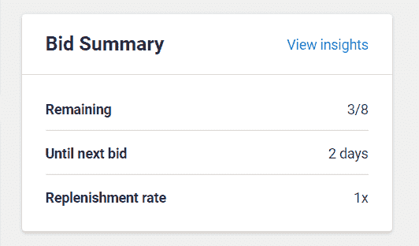
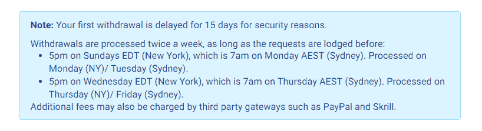
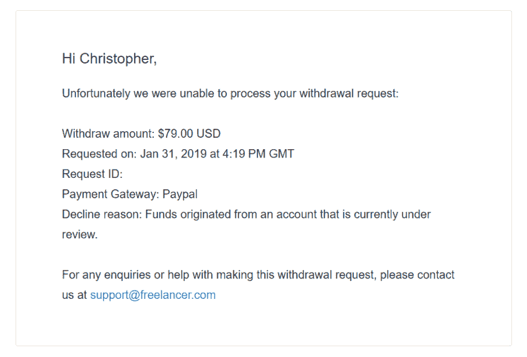

# 不要用 Freelancer.com

> 原文：<https://dev.to/chrisdunne/dont-use-freelancercom-hfj>

在[自由职业者](//www.freelancer.co.uk)平台被骗走血汗钱后，我做了一些挖掘；这是我的发现。

我决定做一点自由职业者的工作，我有一些空闲时间，想用我的技能来做一些我可能在日常生活中没有机会做的事情。我也考虑过有一天成为全职自由职业者的可能性，这是一个尝试的机会；而不必做出任何重大承诺。

开设账户后，你会不断地被推销和促销的广告轰炸，如何花钱，即使你只是为了改善你的财务状况。这本身就是一件令人烦恼的事情，因为它被过度货币化，甚至在你开始之前就感觉像一个骗局；然而，如果你忽视这些“好处”，你就会处于非常不利的地位。不管怎样，我已经在 [Trustpilot](https://uk.trustpilot.com/review/www.freelancer.com) 上看到了近 4k 条评论的 5 星评级，我已经准备好分一杯羹了。

竞价粗糙；有很多自由职业者来自劳动力成本比我所在的国家低得多的国家，如果你不预先给他们钱，投标就会受到严重限制。我很快学会了如何定制我的推销，并最大限度地利用对我的限制。我得到了我的第一份工作，更新一些旧代码来进行一些 API 调用。然后，我受雇于同一个人，执行另一项工作，这是另一项与 Twitter 相关的基于 API 的任务。我赚了大约 100 欧元，在自由职业者的削减后减少了大约 10%。付款到了我的账户上，工作被标记为完成，评论强调了我们彼此合作的积极体验。

我决定撤回我的资金，我仍然对这个网站感到失望，并希望在承诺任何其他项目之前，确认一切端到端的工作。在导航到撤回部分时，我看到了上面的消息，这是一段很长的时间，之前没有提到过，但我还是盲目地继续。

原来你不能用欧元取款，所以这需要转换成美元；当然，由于种种不便，你得到的是人类已知的最糟糕的汇率。一旦你把你的收入转换成美元，在等待 15 天后，你还剩下减少的金额可以提取。

18 天后，我收到一封电子邮件，“很遗憾，我们无法处理您的提款请求:资金来自一个帐户，目前正在审查中。”

在这一点上，我找到了雇用我的人，他也是一名自由职业者，他告诉我，他们是在同一条船上，只是网站对他的要价接近 1000 美元。我对雇主和自由职业者同样悲观，钱在我的账户里，这没有意义？我通过自由职业者的在线聊天功能与他们联系，但被切断了，这在以前讨论除了钱以外的话题时从未发生过。我被打入冷宫了。

我导航回到 Trustpilot 页面，这是我在旅程开始时不耐烦地浏览过的，我注意到 11%的评论是 1 星，充满了严重的欺诈指控。另一个评论网站 [SiteJabber](https://www.sitejabber.com/reviews/freelancer.co.uk) 描绘了一幅更加暗淡的画面，他们网站上的 12 个评论中有 12 个是 1 星，所有这些都提供了关于自由职业平台的严重问题的细节。另一个有数百条评论的网站是 [highya](https://www.highya.com/freelancer-com-reviews) ，在那里你很难找到任何正面的体验。

谷歌、推特、Reddit 等网站上充斥着更多人们无法取钱的例子。自由职业者有严重的问题。对一些人来说，这可能行得通，但对很多人来说，这只是一个骗局。我不知道我所做的工作是否能得到回报，但当我发现很多人和我处于相同的位置时，我不得不努力寻找真相的一些版本。其他人可能没有我一样的财务稳定水平，他们正在被利用。我不知道他们的 TrustPilot 页面上的任何正面评论是否合法，因为我无法与任何使用该平台有过正面体验的人交谈。请让我知道你在讨论中的经历。

克莉丝

这里将添加更多类似问题的示例:

*   https://tough nickel . com/self-employment/Hidden-truth-about-Freelancercom