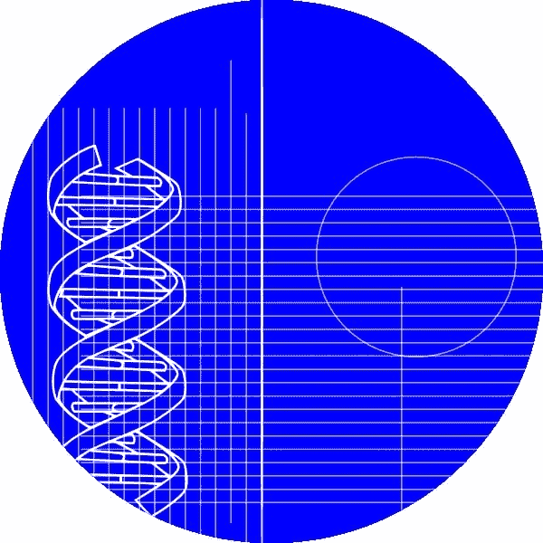
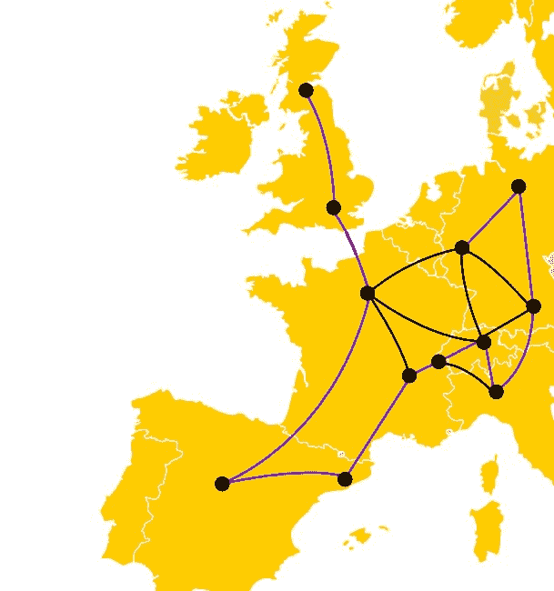
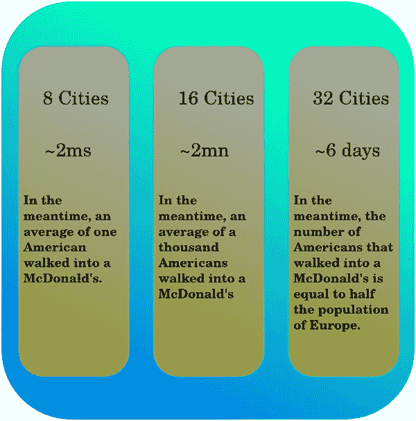
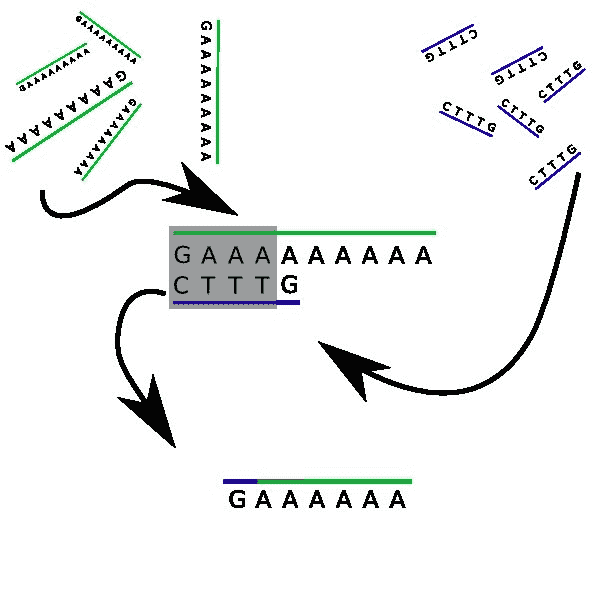

# DNA 并行计算

> 原文：<https://dev.to/nmattia/parallel-computing-with-dna-jk4>

DNA。每个人都知道 DNA 是我们细胞复制的蓝图。每个人都知道霍雷肖·凯恩用它来抓坏人。**但是...如果
我们用 DNA 建造超级计算机会怎么样？那绝对是科幻小说...或者是
？当我在做 DNA 计算的时候，我得到了相当多的人盯着我看，好像我疯了一样。有人甚至问我是否能找到一种方法，从一只鸟的 DNA 中培育出一架最优的飞机。我想我应该揭开它的神秘面纱。**

### 一点历史

1994 年，[伦纳德·阿德曼](https://en.wikipedia.org/wiki/Leonard_Adleman)(你可能知道在 *[RSA](https://en.wikipedia.org/wiki/RSA_(cryptosystem))* 中的 *A* )展示了**有可能解决**一些相当**困难的问题**，仅仅通过**使用 DNA** 和其他与细胞繁殖相关的东西。*等等，什么？他是否只是重新创造了一个类似原始汤的环境，然后等待一台有机超级计算机从中进化出来，以某种方式遵循自然选择的规则？不完全是。但是我们一会儿会谈到事情是如何运作的。*

##### DNA...但是为什么呢？

理解人们为什么来研究 DNA 计算的原因是很重要的。阿德曼试图解决的问题是 [*真的*难](https://en.wikipedia.org/wiki/NP-complete)。它被称为 *[哈密顿路径问题](https://en.wikipedia.org/wiki/Hamiltonian_path_problem)* (但姑且称之为*公路旅行问题*)，它是这样的:

*   拿一张地图
*   从地图上剪下一部分，你会看到几个由道路连接的城市
*   拿起笔。你能沿着道路追踪一条穿过**每个城市恰好一次**的**路径**吗？

公路旅行问题。好吧。这个想法是这样的:**你拥有的城市**越多，**你需要的时间**就越长。不幸的是，如果你把城市的数量增加一倍，你可能需要两倍多的时间来解决这个新问题。这意味着如果你只是**一个接一个地尝试每一个解决方案**，那将会花费大量的时间。如果你能同时尝试这些可能性中的几种，那不是很好吗？

这基本上就是为什么现在的计算机有多个内核同时工作的原因。通常从两点到八点，后者比前者多。尽管如此，如果一个问题需要一年时间才能在单核上解决，那么使用 8 核仍然需要一个半月的时间。如果你需要结果去做别的事情，那就不酷了，是吧？嗯，这就是超级计算机存在的原因，托管 250k+核心。你一年的问题现在只需要两分钟。

 
有时甚至这还不够(例如，这对于[密码术](https://en.wikipedia.org/wiki/Public-key_cryptography)来说是件好事)。解决公路旅行问题最快的算法之一在 O(n^2 2^n).运行这基本上意味着，如果一台计算机需要千分之二秒的时间来解决八个城市的问题，那么同样的一台计算机需要两分钟来解决十六个城市的问题，而计算三十二个城市的结果则需要一周多一点的时间。就城市数量而言，大部分时间上的巨大增长来自于指数项 2^n，乘以 n^2 一点帮助也没有。

当这样的场景出现时，它会让一些科学家发疯，有时会给他们一些奇怪的想法。其中之一是试图用 DNA 解决 NP 完全问题。

### DNA 算法

**DNA 链**就像含有**信息**的小字符串(或句子)，以四个[字符](https://en.wikipedia.org/wiki/Nucleobase)的形式出现: **A** 、 **T** 、 **C** 和 **G** 。碰巧人物 **A** 和 **T** 相互吸引，同样的道理也适用于 **C** 和 **G** (如果你像我一样永远记不住哪个与哪个相配，那就[很简单](http://www.amazon.com/G%C3%B6del-Escher-Bach-Eternal-Golden/dp/0465026567) : **A** chilles 和**T**or oice 组成一对，而 **C** rab 和他的**也是如此这种成对的字符叫做 *[互补](https://en.wikipedia.org/wiki/Complementarity_(molecular_biology))* 。如果两条 DNA 链恰好包含互补字符的序列，它们将相互吸引，并夹在一起，赋予长
**DNA** 链它们的 **[性感形状](https://en.wikipedia.org/wiki/Nucleic_acid_double_helix)** 。**

现在，让我们严肃点，现在是 2015 年。到 2015 年，你可以**设计你的 DNA** 链，并让他们生产出来。就这么办吧(至少设计部分)。耐心听我说一分钟，想象一下我们有自己的 DNA 链打印机。让我们设计一个简单的 DNA 链，包含一个 ***G*** 字符，后跟一个 **9** ***A*** 字符:

> ***gaaaaaaaaaa*T3】**
> 
> *(一条 DNA 链，不是莫名其妙的垂死挣扎)*

好吧。让我们称那串 ***N*** 。还有，我们印两千遍吧。现在让我们创建另一个链。它由 **3** ***T*** 字符组成，周围有一个 ***C*** 和一个 ***G*** :

> ***CTTTG***

我们会刊登那个...再说一万次吧(顺便说一下，DNA 是非常微小的)。那些股我们称之为*。现在我们去厨房，拿一个桶，装满水，把我们的一万二千股 DNA 扔进去。**祝贺你**，你刚刚构建并编程了**你的第一台 DNA 计算机**！*

 *

让我们现在就搞清楚:**你不会很快在上面运行《我的世界》**。但是桶里到底发生了什么？首先，两条链都包含互补的字符。 **d** (我们的第二条链)中的序列***【TTT】***会倾向于被我们第一条 DNA 链 **N** 中的任意三个*所吸引。然而，它可以做得更好:d**d**的前四个字符，即 ***CTTT*** ，是对 N**N**:***GAAA***前四个字符的完美补充。它们会夹在一起，并留下两条尾巴:一边是简单的 ***G*** ，另一边是**6*****A***s。等等，**这个看起来很眼熟...***

 *的确，由于 DNA 链是柔性的，两条尾巴将充当新的 DNA 链 ***GAAAAAA*** ，其结构与 **N** 相同，但带有 **6** ***A*** s 而非 9。你看这是什么意思:**这个过程将会重复！**另一根 **d** 将会漂过，其前导 **C** 字符将会被钩住。每次出现这种情况，我们主字符串上的 ***一个*** 字符的数量就会**减少三个！**最终，我们的链上不会剩下任何一个*，全部覆盖上 ***T*** s。*

 *我们刚刚实现的是 **9** 除以 **3** ，实际上等于零。串 **N** 用九个 ***A*** 字符编码数字 **9** ，串 **d** 用 **3** 字符编码减法，用三个 ***T*** 字符编码。这很容易扩展到任何数字，例如可以用来检查一个数字是否是质数。真正令人惊奇的是，所有的计算都是**(几乎)完全并行的**:你有**成千上万对**形成，而**独立于**其他的！

当然，这是非常理论化的，即使一些成功的实验已经完成。它仍然是 DNA 计算的最开始，运行一个算法所需的时间远远超过了计算机(如果你能首先运行给定的算法)。然而，它是有希望的，最终理论家并不关心它是否有一天会起作用。

### 我的来稿

2015 年 2 月，我完成了一个研究项目，作为我硕士研究的一部分。我能够使用 ***DNA 算法*** 为几个问题提供解决方案，比如:

*   检查一个数是否是质数
*   计算一个数的平方根
*   为 DNA 问题实现**二进制输入**

并对这些算法的速度和可靠性进行了分析。与其他基于 DNA 的计算相比，改进之处在于

1.  它更具可扩展性(至少理论上是这样)
2.  它只使用 DNA 链(例如，阿德曼也使用酶)。

如果你对 DNA 算法知识如饥似渴，有任何疑问，或者想
抱怨什么:就在下面的评论里给我留言吧！

*问题很多(还有解决方案！)与用 DNA 计算有关，下面的一些可能会让读者感兴趣:*

*   组合问题解决方案的分子计算。在:科学杂志。(2009 年 11 月)
*   张，丁勇，温弗里，e .:用足趾交换控制 dna 链置换动力学。刊登在:日本建筑学会的文章中。(2009 年 6 月)
*   用 dna 链置换级联放大数字电路计算。在:科学杂志。(2011 年 6 月)

另外，微软开发了一个可视化 DNA 计算的工具。玩得开心！***