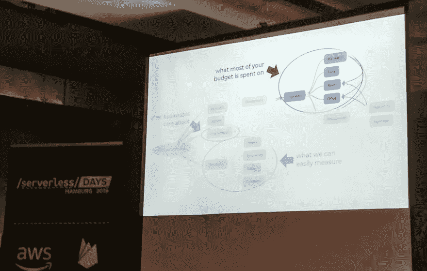
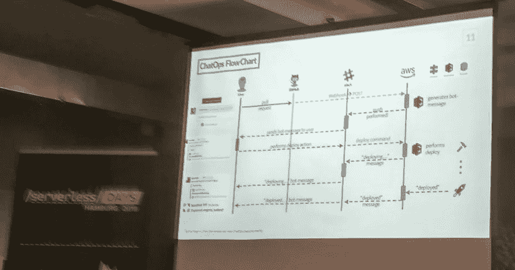
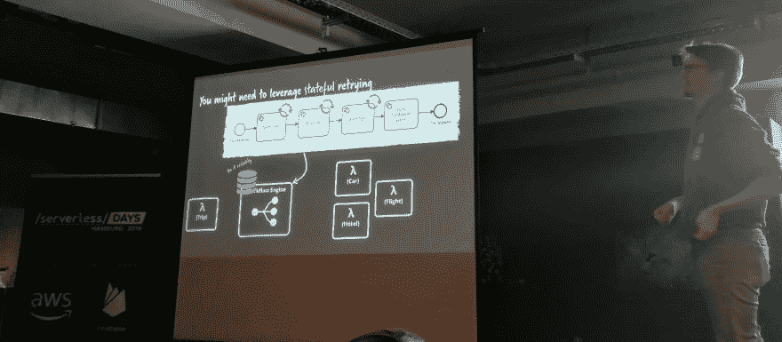
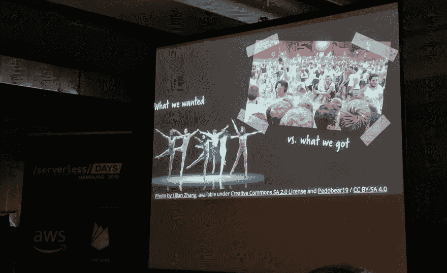
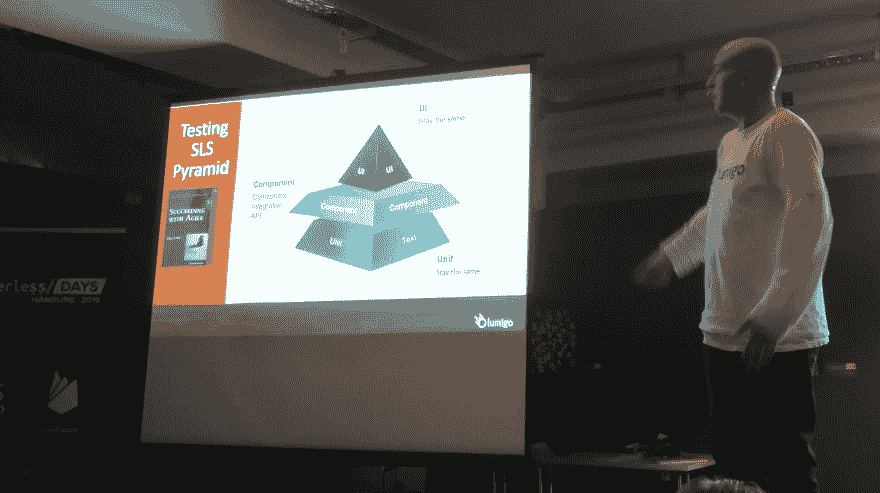
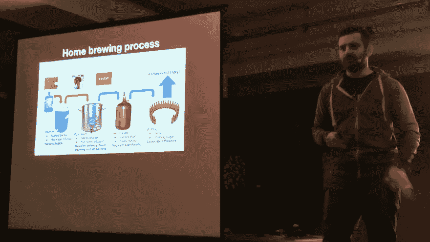
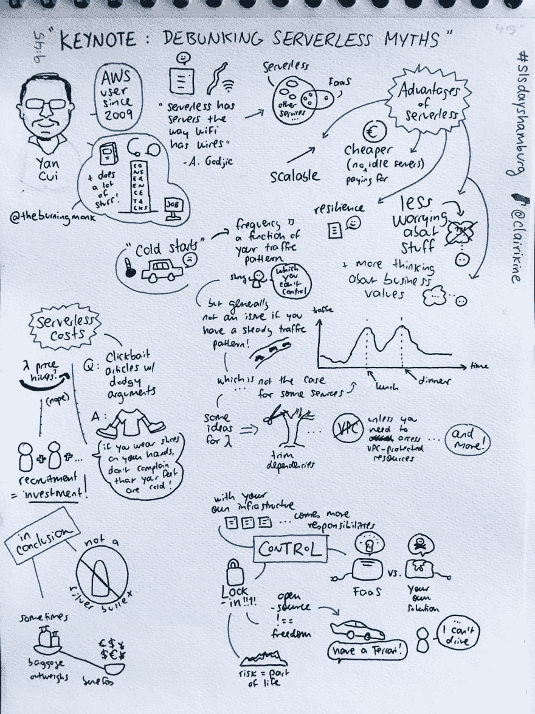

# 汉堡 2019 年无服务器日-第 2 天

> 原文：<https://dev.to/dvddpl/serverless-days-hamburg-2019---day-2-1kii>

[昨天的研讨会之后](https://dev.to/dvddpl/serverless-days-hamburg-2019---day-1-workshops-195o)今天是会谈的日子！
汉堡迎来了一个阳光明媚、蓝天白云的寒冷早晨。会场已经挤满了人，我们享受美味的自助早餐。
参观完赞助商的展台并收集了所有可能的小玩意后，我和同事们在第二排就座。
笔记本电脑打开，准备开始记笔记——开始！：

## 揭穿无服务器神话——崔琰

自从我开始我的 AWS 和无服务器之旅以来，我一直是崔琰在他的博客[https://theburningmonk.com/](https://theburningmonk.com/)上发表的所有内容的热心读者，因此，我非常兴奋，真的很期待看到他的主题演讲。
在他的演讲中，他决定分享他的经验和知识，谈论一些关于无服务器的错误观点，这些观点经常可以在网络上的博客和教程中读到:

*   冷启动仅在第一次调用 Lambda 时发生

    真相:对*容器*的第一次调用将是冷启动，所以每次有并发调用需要产生新容器时，冷启动总是会发生。
    交通稳定，冷启动不是问题。如果你的应用程序流量经历高峰/峰值(午餐时间，足球比赛等)，由于并发性，冷启动无论如何都会发生。因此，我们必须尽一切可能缩短启动持续时间:

    *   修剪相关性
    *   只有一个目的——一个 lambda 应该只做一件事(这样就减少了工作的依赖性)
    *   VPC 加起来是 10 秒。只有在绝对必要的时候才使用它们——lambda 已经受到 IAM 角色和策略的保护。

关于这个话题的更多信息[点击这里](https://theburningmonk.com/2018/01/im-afraid-youre-thinking-about-aws-lambda-cold-starts-all-wrong/)

*   无服务器是昂贵的事实:因为与内部解决方案相比，许多成本都没有考虑在内(如雇佣开发运营工程师的成本:**专业知识既稀少又昂贵**)这两种解决方案的**总拥有成本**实际上没有可比性。无服务器可能——而且经常是——更便宜。而是取决于使用情况。控制基础设施伴随着责任和成本参见[本文](https://theburningmonk.com/2019/01/you-are-thinking-about-serverless-costs-all-wrong/)了解更多信息

[](https://res.cloudinary.com/practicaldev/image/fetch/s--90iXQApr--/c_limit%2Cf_auto%2Cfl_progressive%2Cq_auto%2Cw_880/https://thepracticaldev.s3.amazonaws.com/i/3gslcxw9fssnu2i2sfrl.jpg)

*   供应商锁定锁定的真正危险是潜在的数据锁定。回报是否值得冒险。是

[](https://res.cloudinary.com/practicaldev/image/fetch/s--6qwP81Hk--/c_limit%2Cf_auto%2Cfl_progressive%2Cq_auto%2Cw_880/https://thepracticaldev.s3.amazonaws.com/i/rx15j98qmq1j0hu8cbcb.png) 
**它是无服务器的，就像 WiFi 是无线的** (Gojko Adzic)

* * *

## devops &带 aws 的无服务器/无服务器如何帮助聊天操作成为现实——Selina Magnin

无服务器的特征:

*   全面管理的服务
*   迅速发展
*   即现即付制度
*   自动缩放

开发-运营流程

*   自动化第一
*   简单交互
*   使用熟悉的工具
*   多租户优先

她展示了他们如何使用许多不同的 AWS 服务(其中包括用于聊天机器人的语言处理器 LEX)来构建与 Slack 集成的 CI/CD 工具。

[](https://res.cloudinary.com/practicaldev/image/fetch/s---8oinSWw--/c_limit%2Cf_auto%2Cfl_progressive%2Cq_auto%2Cw_880/https://thepracticaldev.s3.amazonaws.com/i/zny6olb4lzt4k035i99c.jpg)

* * *

## 设计六边形架构的可测试无服务器 app 斯洛博丹·斯托亚诺维奇

关于供应商锁定的一些想法:
我们真正讨论的不是被供应商锁定，而是转换到另一个供应商需要多少成本。(当切换框架或语言时，同样的事情也会发生)

**六角形架构**也称为端口和适配器，是一种设计应用的模型，其中逻辑通过其集成而隔离。由于使用无服务器，集成部分变得更加重要(想象一个用 Express 构建的 NodeJs REST API 资源/路由在代码中处理，而使用 AWS API 网关和 lambda 资源在网关中定义，每个路由可能有自己的 Lambda)。

*集成可以随时改变*

> 测试不会阻止改变。他们确保你的改变不是偶然的

#### 如何？

*   汉德勒做得不多。只需解析输入并定义依赖关系。
*   主逻辑注入了依赖项和参数。在此基础上，我们可以运行模拟依赖项的集成测试，比如内存数据库。
*   依赖项(即 mongo-integration.js)将有自己的与真实服务的集成测试。

```
beforeAll() 
{
// dynamoDB create Table
// wait for table create 
// pass to test context
}
afterAll () {
    // destroy table
} 
```

Enter fullscreen mode Exit fullscreen mode

> 对于那些你不能测试的东西，确保你有监控和警报！

### 跟踪后端错误的工具

*   [x 射线](https://aws.amazon.com/it/xray/)
*   [泻药](https://epsagon.com/)

### 跟踪前端错误的工具

[Desole.io](https://desole.io)

关于这个话题的更多信息，请参见本文

* * *

## 用无服务器构建有状态应用——Tiru Marai

### 模式为委托状态

*   有效负载中的完整上下文:我们将状态委托给事件管理
*   使用托管服务又名 *serviceful 无服务器* : Twilio - Algolia - Auth
*   运行轻量级长时间运行的代理:(数据库的独立连接池)
*   外部应用状态:代码是无状态的，状态应用于输出。
*   使用快速事务数据库

> 人们通常所说的无状态是指等幂

无状态==幂等但幂等= >无状态
如果你能确保幂等，我们的有状态函数看起来就像无状态函数。

* * *

## 无服务器比你想象的多——迈克尔·麦克唐纳

这是 Firebase / Google 产品经理的一次 8 分钟的闪电谈话，分享了他最近工作/玩的有趣的东西，如 [Pulumi](https://github.com/pulumi/pulumi-gcp) 和【无服务器容器】

* * *

## 迷失在事务中——管理无服务器架构一致性的策略——Bernd rücker

这是一天中最有趣、最激烈的谈话之一。我一定会在他触及的话题中挖掘更多，也许会写一篇专门的帖子。现在，我只是把我的笔记和一些阅读建议放在这里:

[](https://res.cloudinary.com/practicaldev/image/fetch/s--wbwvOWlq--/c_limit%2Cf_auto%2Cfl_progressive%2Cq_auto%2Cw_880/https://thepracticaldev.s3.amazonaws.com/i/iokwog2p0q9tpqlf635y.jpg)

如果我们有很长的运营/交易链，这些是可能的方法:

*   合并功能
*   编排:
    *   链式函数
    *   事件链
*   流程编排:
    *   协调功能(长时间运行的功能)
    *   工作流(中间组件)

阅读[更多关于服务器世界中*函数组合的*](https://www.google.de/search?q=function+composition+in+a+serverlss+world&oq=function+composition+in+a+serverlss+world&aqs=chrome..69i57.758j0j7&sourceid=chrome&ie=UTF-8)

### 关键概念

*   利用有状态重试
*   幂等函数
*   要么全有，要么全无。功能是独立的，但是当其中一个失败时——回滚所有功能

阅读[更多](https://en.wikipedia.org/wiki/Fallacies_of_distributed_computing)关于*分布式计算的谬误*

**A C I D**

*   原子数
*   一致性
*   隔离
*   持久耐用

> 我们放弃 C 和 I 以获得可用性、适度降级和性能**

**B A S E**

*   基本可用
*   柔软状态
*   最终一致性

### 出现问题时可用的策略

*   分布式交易
*   补偿事务(中止/回滚应用程序级别)
*   道歉(检测并修复违反约束的情况)

[](https://res.cloudinary.com/practicaldev/image/fetch/s--1_yso-Fs--/c_limit%2Cf_auto%2Cfl_progressive%2Cq_auto%2Cw_880/https://thepracticaldev.s3.amazonaws.com/i/7jzw25eem8ehefdymlbc.jpg)

> 成年人不使用分布式事务，而是使用最终一致性

[分布式交易之外的生活:
一个叛教者的观点](http://adrianmarriott.net/logosroot/papers/LifeBeyondTxns.pdf)帕特·海兰德著

### 传奇模式/补偿作为策略

#### 事件驱动编排

*   非常容易失去流动的观念
*   如果流程发生变化，您必须同时调整所有服务和重新部署

#### 编排

*   AWS 步骤功能(描述步骤的无服务器插件)
*   BPMN(图形化方式- > xml)

[例子回购](https://github.com/berndruecker/flowing-trip-booking-saga)
[更多关于传奇](//vasters.com/archive/sagas.html)

* * *

## 无服务器社区——迈克尔·大下

这个人从日本飞来给我们讲述日本的无服务器社区，并提供如何发展技术社区的有用信息。

* * *

## 安全:没有服务器的未来——加比·费希尔

这段代码是关于一个允许在 Cloudfront edge 上执行的 Cloudfront 解决方案的:

*   基于网络的无服务器
*   无人服务的工人
*   把 FaaS 逼到边缘

* * *

## 逃脱锁定——克里斯托夫·内延豪斯

关于供应商锁定的一些想法:
只有当转换供应商的成本太高时，才会发生锁定。这种成本由重构实现所需的时间来表示。

AWS Azure 和 Google Cloud 的无服务器功能共享相同的基本概念，但专有 API 却大不相同。

> 定义一个统一的 api，并为专有 api 使用适配器。

#### 使用六角形建筑

结构化代码，以便逻辑被隔离，并为每个云提供商的处理程序使用适配器。大多数情况下，只是事件/上下文和输入数据以不同的方式从一个供应商传递到另一个供应商。

#### 可以为给定的产品编写适配器吗？

*   如果简单且功能在提供者之间相似(如 blob 存储、键值存储)，则为是
*   没有功能编排或 Api 网关或高级数据库功能..

* * *

## 无服务器测试- Avishai Shafir

当转移到无服务器架构时，测试金字塔的组件/集成层变得更宽、更重要(金字塔看起来更像是玛雅金字塔)

[](https://res.cloudinary.com/practicaldev/image/fetch/s--iXM5vNxC--/c_limit%2Cf_auto%2Cfl_progressive%2Cq_auto%2Cw_880/https://thepracticaldev.s3.amazonaws.com/i/dkr3troudshpwshutc87.jpg)

### 测试方法

#### 本地

我们可以使用*无服务器框架*或 *SAM* 在本地运行测试。
这些测试快速、便宜、易于调试，但**配置可能会有所不同**而且不是所有东西都可以被模仿

#### 杂交

一些服务(如 cognito 和 DB)在云上测试。比在本地嘲笑或模仿更可靠，而且运行测试的成本仍然很低

#### 云

像
这样的生产当然会产生成本，但相对于生产成本来说，它们仍然是最小的，而且你会在开发/调试成本上节省大量时间。
部署时间更长，调试难度更大。
重要的是只自动化和部署架构中发生变化的部分，而不是整个堆栈。

关于成本的一些想法:

128 mb 内存耗时 11 秒成本 0.0243
1gb 内存耗时 1.5 秒成本 0.248
**较低的内存耗时更长，因此最终支付相同的费用**

概述:

*   检查配置
*   添加 tracer id / correlation id 以跟踪组件并帮助调试 tracer.io
*   在云上测试。从长远来看，节省时间和金钱。因为它更类似于生产
*   如果是大包装，使用 Lambda 层
*   使用*无服务器大炮*运行**负载测试**(在产品上进行负载测试时要小心，因为当你的产品被用户使用时，你可能会受到限制。
*   分割环境以避免混乱

* * *

## 禅宗与啤酒发酵艺术的可观察性——伊利亚·莱宾

有趣的谈话，他描述的是宠物项目。他将自己对家庭酿酒的热情与无服务器解决方案结合起来，开发了一个应用程序来监控啤酒发酵，并在发酵好的时候得到通知。

[](https://res.cloudinary.com/practicaldev/image/fetch/s--y8BokNFv--/c_limit%2Cf_auto%2Cfl_progressive%2Cq_auto%2Cw_880/https://thepracticaldev.s3.amazonaws.com/i/3ht20r5hqsg0q6eplamd.jpg)

他使用[一个基于倾斜的测量工具](//ispindel.de)，然后每隔 2 秒向 REST Api 发送数据，将数据插入 DynamoDB，使用 DynamoStreams 聚合一些数据，并使用 cloud watch+Simple Notification Service 接收通知。

他还提到了这个项目的成本——这个项目调用了成千上万次 ApiGateway/Lambda/DynamoDb:大约每月 5 欧元..

* * *

除了我们已经看过的所有演讲，我真的想提一下坐在第一排的女孩，就在我前面，当我在笔记本电脑上疯狂地打字做笔记时，她平静地画出了每个演讲中最有趣和最搞笑的部分。我走近她，她原来是一个漫画家/素描师，我真的建议你看看她的推特账户，因为她很有才华。
[ ](https://res.cloudinary.com/practicaldev/image/fetch/s--G8-UNfQj--/c_limit%2Cf_auto%2Cfl_progressive%2Cq_auto%2Cw_880/https://pbs.twimg.com/media/DzcBmlpW0AE5Jis.jpg:large) *写生笔记[千里眼](https://twitter.com/clairikine)*