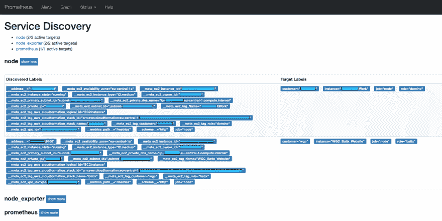
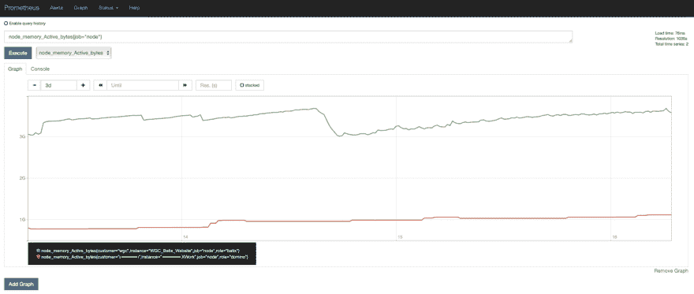
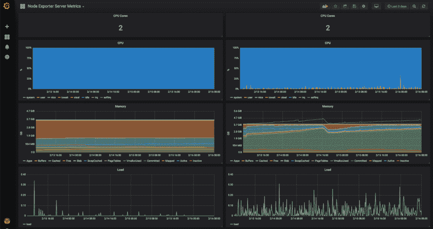

# 适当的监控——如何在 AWS EC2 实例中使用 Prometheus

> 原文：<https://dev.to/kbild/proper-monitoring-how-to-use-prometheus-with-your-aws-ec2-instances-4npm>

由于我们运行大量的服务器，我们需要一个合适的监控解决方案。AWS 提供了 CloudWatch，这是一个几乎完美的监控 AWS 云基础设施的解决方案。

但是，我们也在其他云提供商(Softlayer、Azure 等)上运行服务器，我们需要一个监控解决方案来跟踪所有这些服务器。

你可能知道，我是 [CNCF](https://www.cncf.io) 唯一毕业的监测项目[普罗米修斯](https://prometheus.io)的超级粉丝。

如果你想更多地了解什么是普罗米修斯以及如何使用它，我推荐你看一下 YouTube 上的这部电影[“监控，普罗米修斯的方式”](https://www.youtube.com/watch?v=PDxcEzu62jk)，普罗米修斯的联合创始人朱利叶斯·沃尔茨对这个话题做了很好的介绍。

去年在达姆施塔特的 DNUG 活动上，我还做了一个关于 Prometheus 以及如何将其与 IBM Connections 结合使用的演讲。它只有德语版本，但是如果您对如何监控 IBM 与 Prometheus 的连接感兴趣，可以看看这个演示

那么，我们如何将 Prometheus 与我们的 AWS 云基础设施结合使用呢？

我们需要以下零件:

EC2 实例上的代理(称为 [node_exporter](https://github.com/prometheus/node_exporter) )

配置了 AWS 服务发现的 Prometheus(在这种情况下，仅适用于 EC2 实例)

## EC2 实例上的节点导出器

在 EC2 实例上安装 node_exporter 非常简单，只需使用下面的用户数据脚本:

```
useradd -m -s /bin/bash prometheus
# (or adduser --disabled-password --gecos "" prometheus)

# Download node_exporter release from original repo
curl -L -O https://github.com/prometheus/node_exporter/releases/download/v0.17.0/node_exporter-0.17.0.linux-amd64.tar.gz

tar -xzvf node_exporter-0.17.0.linux-amd64.tar.gz
mv node_exporter-0.17.0.linux-amd64 /home/prometheus/node_exporter
rm node_exporter-0.17.0.linux-amd64.tar.gz
chown -R prometheus:prometheus /home/prometheus/node_exporter

# Add node_exporter as systemd service
tee -a /etc/systemd/system/node_exporter.service << END
[Unit]
Description=Node Exporter
Wants=network-online.target
After=network-online.target
[Service]
User=prometheus
ExecStart=/home/prometheus/node_exporter/node_exporter
[Install]
WantedBy=default.target
END

systemctl daemon-reload
systemctl start node_exporter
systemctl enable node_exporter 
```

Prometheus 服务器将在标准端口 9100

上抓取 node _ exporter 不要忘记将该端口添加到您的实例安全组，并授予对 Prometheus 服务器的访问权限

您可以通过在 EC2 实例上本地运行以下命令来测试 node_exporter 是否按预期运行:curl[http://127 . 0 . 0 . 1:9100/metrics](http://127.0.0.1:9100/metrics)

如果一切正常，你应该会得到你的服务器的指标

```
# HELP go_gc_duration_seconds A summary of the GC invocation durations.
# TYPE go_gc_duration_seconds summary
go_gc_duration_seconds{quantile="0"} 2.8809e-05
go_gc_duration_seconds{quantile="0.25"} 3.7675e-05
go_gc_duration_seconds{quantile="0.5"} 4.8971e-05
go_gc_duration_seconds{quantile="0.75"} 6.1912e-05
go_gc_duration_seconds{quantile="1"} 0.000266006
go_gc_duration_seconds_sum 0.667055045
go_gc_duration_seconds_count 11450
# HELP go_goroutines Number of goroutines that currently exist.
# TYPE go_goroutines gauge
go_goroutines 9
... 
```

Prometheus 服务器会抓取并记录相同的内容。

## 普罗米修斯 AWS 服务发现

Prometheus 服务器将直接与 AWS API 对话，因此您需要创建一个具有编程访问权限的用户，并添加以下权限:

```
{
    "Version": "2012-10-17",
    "Statement": [
        {
            "Effect": "Allow",
            "Action": "ec2:DescribeInstances",
            "Resource": "*"
        }
    ]
} 
```

Prometheus 服务器可以获得 EC2 实例的所有元数据，如 IP 地址或标签

在 Prometheus 服务器上，必须使用添加用户的访问权限和密钥将一个抓取目标添加到 **prometheus.yml** 文件中。你可以做一些[重新标记魔法](https://prometheus.io/docs/prometheus/latest/configuration/configuration/#relabel_config)，让你在普罗米修斯中重用你的 EC2 标签和元数据，这非常好。

也就是说，这里我们将 **ec2_tag_name** 作为**实例**值，并添加两个额外的标记(**客户，角色**)，这两个标记是从 **ec2_tag_customer** 和 **ec2_tag_role**
中获得的

```
 - job_name: 'node'
    ec2_sd_configs:
      - region: YOURREGION
        access_key: YOURACCESSKEY
        secret_key: YOURSECRETKEY
        port: 9100
        refresh_interval: 1m
    relabel_configs:
      - source_labels:
        - '__meta_ec2_tag_Name'
        target_label: 'instance'
      - source_labels:
        - '__meta_ec2_tag_customer'
        target_label: 'customer'
      - source_labels:
        - '__meta_ec2_tag_role'
        target_label: 'role' 
```

Prometheus 服务器现在将获得您所有 EC2 实例的私有 IP 地址

(默认为私有 IP，但是您也可以使用公共 IP，参见 [ec2_sd_config 文档](https://prometheus.io/docs/prometheus/latest/configuration/configuration/#ec2_sd_config))

如果你想知道普罗米修斯通过了服务发现，请浏览你的普罗米修斯服务器的网址:

**-[【https://prometheus.server.com/service-discovery】](https://prometheus.server.com/service-discovery)**

在这里，您将看到所有 EC2 实例及其元数据，以及哪些数据在 Prometheus 中被重用:

[](https://kbild.ch/201902/Prometheus_SD.png)

## 图表和仪表盘

我们定义每分钟收集一次指标，几分钟后我们可以在 Prometheus UI 中看到结果:

[](https://kbild.ch/201902/Prometheus_Graph.png)

正如您在这里看到的，我们甚至获得了实例内存的数据，如果我们使用 CloudWatch 进行监控，我们就没有这些数据。如果您不想使用真正的仪表板进行监控，只需添加 Grafana，它本身支持 Prometheus 作为数据源，您就可以创建这样漂亮的仪表板:

[](https://kbild.ch/201902/Grafana_Dashboard.png)

也许你现在知道为什么我是普罗米修斯的超级粉丝了，作为一个也在使用普罗米修斯来监控他的 Kubernetes 环境的人，我可以告诉你我们只是触及了普罗米修斯的表面。