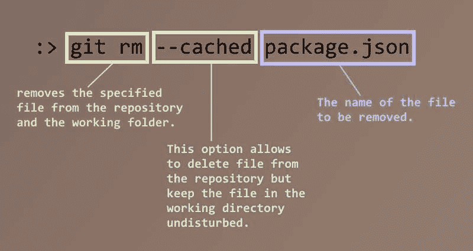
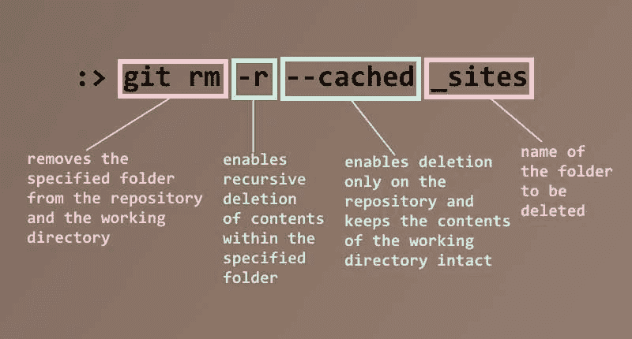
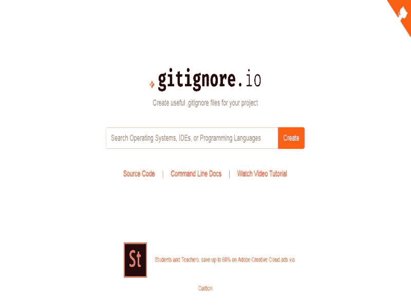

# 停止跟踪，开始忽略

> 原文：<https://dev.to/svijaykoushik/stop-tracking-and-start-ignoring-ook>

你好世界，

在过去的几个月里，我一直在玩 GitHub & Git，大多数时候我会不小心提交和推送与项目完全无关的文件。通常情况下，当我使用 node.js 来缩小 css & JS 时，它们是像*node _ modules*&*build*目录和 *package.json* 这样的环境文件；当我使用 Jekyll 来写博客时，它们是像 *_site* folder 和 *Gemfile.lock* 这样的文件。

这个问题的原因？我忘了加上*。gitignore* 文件到我的存储库中。*。gitignore* 文件包含项目的所有忽略规则(通常是要忽略的文件和文件夹的名称)。但是有一个问题。*。gitignore* file 将告诉 Git 只忽略那些没有被推送的文件的存在。因为我已经推送了文件，所以将它们添加到忽略规则不会起作用。Git 将继续跟踪这些文件的更改，并提醒我提交这些更改。

我可以删除这些文件，并将删除的内容推送到 repo，但是每次我构建项目时，都会重新创建它们。所以，那没用。我在网上快速搜索了一下，找到了我需要的确切解决方案。有一种方法可以将这些文件从回购中删除，并保留在本地。通过在类似于 **git bash** 或 **cmd** 的 CLI 中执行以下命令，我从 repo 中删除了文件，但没有将它们从本地文件系统中删除。

```
 git rm --cached <file name>
    E.g. git rm --cached package.json 
```

[](https://res.cloudinary.com/practicaldev/image/fetch/s--nqeXZKLE--/c_limit%2Cf_auto%2Cfl_progressive%2Cq_auto%2Cw_880/https://svijaykoushik.github.io/blog/img/2019_02_16/rm_cached_file.jpg)

```
 git rm –r --cached <directory name>
    E.g. git rm –r --cached _sites 
```

[ ](https://res.cloudinary.com/practicaldev/image/fetch/s--Oow3VBP5--/c_limit%2Cf_auto%2Cfl_progressive%2Cq_auto%2Cw_880/https://svijaykoushik.github.io/blog/img/2019_02_16/rm_cached_folder.jpg) *命令的分解仅从存储库中删除文件夹及其内容*

`--cached`标志从存储库中删除文件，并保留本地副本不受干扰。并且`–r`标志递归地删除指定目录中的文件。

现在我已经从 repo 中删除了文件，Git 认为被删除文件的本地副本是我添加到 repo 中的新内容。所以将这些文件名添加到*中。gitignore* 文件会告诉 git 忽略这些文件，它们不会再被推送。

由于这种事故经常发生在我身上，我决定把它贴在这里，这样我就不会忘记把忽略规则添加到回购协议中。即使我真的忘记了，我也知道去哪里寻找解决方法。

为了让事情变得更简单，我找到了一个生成*的网站 [gitignore.io](https://gitignore.io) 。gitignore* 文件基于我在一个一体化文本框中提供的操作系统、ide 和编程语言。[](https://res.cloudinary.com/practicaldev/image/fetch/s--8yPAv2jS--/c_limit%2Cf_auto%2Cfl_progressive%2Cq_auto%2Cw_880/https://svijaykoushik.github.io/blog/img/2019_02_16/gitignoredoti_shot.jpg)*git ignore . io 的主页截图*