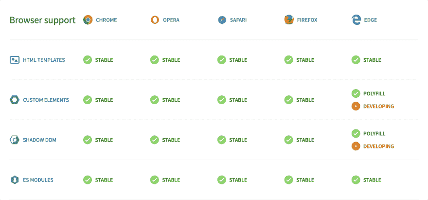

# 让我们构建 Web 组件！第八部分:流言终结者版

> 原文：<https://dev.to/bennypowers/lets-build-web-components-part-8-mythbusters-edition-3la>

到目前为止，在这个系列中，我们已经讨论了底层 web 组件[标准](https://dev.to/bennypowers/lets-build-web-components-part-1-the-standards-3e85)，遗留浏览器[聚合填充](https://dev.to/bennypowers/lets-build-web-components-part-2-the-polyfills-dkh)，以及它们与[普通 javascript](https://dev.to/bennypowers/lets-build-web-components-part-3-vanilla-components-4on3) 和[宽](https://dev.to/bennypowers/lets-build-web-components-part-4-polymer-library-4dk2) [种类](https://dev.to/bennypowers/lets-build-web-components-part-5-litelement-906)的[不同](https://dev.to/bennypowers/lets-build-web-components-part-6-gluon-27ll)助手[库](https://dev.to/bennypowers/lets-build-web-components-part-7-hybrids-187l)的实现。

今天，我们将回顾一些最近出现的关于 web 组件及其使用的有害神话。考虑到这项技术还很年轻，以及从`v0` web components 规范到`v1`规范的转变和它的广泛采用已经极大地改变了这个领域，并且变得更好，许多这些误解是可以理解的。

让我们稍微了解一下 web 自己的组件模型，并了解它们如何使开发变得更容易，并改善用户、开发人员和管理人员的体验。

*   [误区:浏览器不支持 Web 组件](#myth-web-components-arent-supported-by-browsers)
*   [误区:Web 组件不能接受复杂数据](#myth-web-components-cant-accept-complex-data)
*   [谬论:Web 组件没有模板化的方法](#myth-web-components-have-no-way-of-templating)
*   [误区:Web 组件不能在服务器端呈现](#myth-web-components-cant-be-serversiderendered)
*   神话:Web 组件是谷歌的专有技术
*   [谬论:使用 Web 组件需要聚合物](#myth-you-need-polymer-to-use-web-components)
*   [误区:你需要使用 HTML 导入](#myth-you-need-to-use-html-imports)
*   [误区:你需要使用影子 DOM](#myth-you-need-to-use-shadow-dom)
*   神话:你需要框架来编写应用程序
*   [谬论:你不能在框架中使用 Web 组件](#myth-you-cant-use-web-components-in-frameworks)
*   [神话:网络社区已经从网络组件发展而来](#myth-the-web-community-has-moved-on-from-web-components)

## 神话:浏览器不支持 Web 组件

有时候一张图片抵得上 1024 个字:

[](https://res.cloudinary.com/practicaldev/image/fetch/s--JvVpS77D--/c_limit%2Cf_auto%2Cfl_progressive%2Cq_auto%2Cw_880/https://thepracticaldev.s3.amazonaws.com/i/n44vascg9dclyk6u7h7s.png) 

<figure>

<figcaption>
此截图取自 2019 年 2 月[https://webcomponents.org](https://webcomponents.org)带火狐 65.0.1 版本。它表明所有主流浏览器都支持 web 组件规范，Edge 很快会提供无填充支持。 <small>(Web 组件也可以被支持到 IE11，但是[你不应该这样做](https://tech.slashdot.org/story/19/02/09/050208/please-stop-using-internet-explorer-microsoft-says) )</small>
</figcaption>

</figure>

但是布丁的好坏不在于吃吗...或者...平台 <abbr title="Application Programmer Interface">API</abbr> 在部署中的证明？如果不支持 web 组件，我们就不会期望在野外看到它们，当然也不会被大型团队使用。然而: [Twitter](https://twitter.com/maxlynch/status/1072587492749180928) 、GitHub、 [dev.to](https://github.com/thepracticaldev/dev.to/pull/1524) 、麦当劳、 [Salesforce](https://developer.salesforce.com/docs/component-library/documentation/lwc) 、 [ING](https://tweakimg.net/files/upload/spreakrik.pdf) (PDF 链接)、 [SAP](https://sap.github.io/ui5-webcomponents/) 以及许多其他公司都在面向公众的核心业务页面中使用 web 组件。在我在[或](https://forter.com)的日常工作中，我们使用 web 组件。事实上，在 2018 年，所有报告的 Chrome 页面负载中有 10%使用了 web 组件。

> @ slightlyllate上周在挖掘这些数据，结果发现没有太多重叠。Chrome 中 10%以上的页面负载使用 Web 组件；我们近年来最成功的功能之一(对于上下文，CSS Grid 被大约 2.5%的页面加载使用)[twitter.com/abraham/status…](https://t.co/LLKHuCDRdj)20:36PM-23 Jan 2019Abraham Williams[@ Abraham](https://dev.to/abraham)定义定制元素 v1 的页面加载量(5%)刚刚超过定制元素 v0 的注册量(4.5%)。# web components https://t.co/LjhSS5d6Ap https://t.co/rU1kQUQptS https://t.co/dqofSNgcm6[](https://twitter.com/intent/tweet?in_reply_to=1088173570046480384)[](https://twitter.com/intent/retweet?tweet_id=1088173570046480384)[](https://twitter.com/intent/like?tweet_id=1088173570046480384)

显然，web 组件不仅仅是一项潜在的有趣的未来技术。今天，你和像你一样的用户正在网络上使用它们。

[](#)

## 误区:Web 组件不能接受复杂数据

我最近看到有人声称 web 组件仅限于接受字符串形式的数据，因此不能接受复杂的对象。这种误解尤其阴险，因为就像任何善意的谎言一样，它有一半是真的。这种被误导的观念源于对 DOM 及其运作方式的根本误解。

下面是一个简短的回顾。如果你对 DOM vs .<abbr title="HyperText Markup Language">HTML</abbr>/attrs vs . props 没问题，请随意[跳过它](#string-attr-debunk)。

```
<input id="text-input" placeholder="Enter Your Text"/> 
```

Enter fullscreen mode Exit fullscreen mode

HTML 元素和属性是 HTML 规范的一部分，大致构成了`DOM`或文档对象模型的`D`部分。在上面的例子中，`<input>`元素有两个属性，`id`的值是“文本输入”，而`placeholder`的值是“输入你的文本”。因为 HTML 文档根据定义是字符串并且仅仅是字符串，所以属性名和它们的值都是字符串并且仅仅是字符串。

当浏览器解析一个文档时，它创建对应于每个 HTML 元素的 JavaScript 对象，用在相应属性中找到的值初始化该对象的一些属性。这个对象树由`DOM`中的`OM`组成。属性存在于 JavaScript 对象上。

下面是我们输入的 DOM 节点的伪代码示例:

```
Object HTMLInputElement {
  tagName: 'INPUT',
  placeholder: 'Enter Your Text',
  id: 'text-input'
  ...
} 
```

Enter fullscreen mode Exit fullscreen mode

严格来说，元素可以有属性但不能有属性，因为元素是文档的一部分，而不是 DOM 树。我的意思是，给定页面的 DOM 与该页面的 HTML 不同；相反，DOM 是从 HTML 文档中派生出来的。

您可以在“开发工具元素/检查器”面板中检查任何 DOM 节点的属性。Chrome 在`properties`标签中显示所有 DOM 属性(看 CSS 规则旁边)，Firefox 在`Show DOM Properties`上下文菜单中显示它们。您还可以在检查节点时评估`$0`，或者使用 DOM APIs，例如`document.querySelector('my-element').someProp`；

在我们刚刚开始输入的情况下，DOM 对象的`id`属性是`text-input`。

```
const input = document.getElementById('text-input');

console.log(input.id);                  // 'text-input'
console.log(input.getAttribute('id'));  // 'text-input'

input.id = 'by-property';
console.log(input.getAttribute('id'));  // 'by-property'

input.setAttribute('id', 'by-attribute');
console.log(input.id);                  // 'by-attribute' 
```

Enter fullscreen mode Exit fullscreen mode

对于许多属性/特性对，对一个属性/特性对的更改会反映在另一个属性/特性对中，但不是对所有属性/特性对都是如此。例如，`HTMLInputElement`的`value`属性表示当前的值*，而`value`属性仅表示初始的*值*。*

*回到我们的故事*

似乎一些开发者已经做出了这样的推理:

1.  属性只能是字符串
2.  HTML 元素只有属性，没有特性
3.  自定义元素是 HTML 元素
4.  因此，web 组件只能在属性中接受字符串

这个推理在每个人都 100%禁用 JavaScript 的世界里成立，但是我们并没有生活在这样的世界里。在我们的世界中，DOM 是 web 平台的一个丰富且被充分利用的部分。

自定义元素确实是绑定到文档的 HTML 元素，但它们也是 DOM 节点，从 DOM 树的分支摆动而来。它们可以有语义**字符串**属性，但是它们也可以使用 JavaScript 和 DOM 接受复杂的嵌套**数据**作为属性。

这里有一个例子，说明如何仅使用 DOM API 来完成这个任务:

```
const input = document.createElement('country-input');
input.countries = [
  {name: 'Afghanistan', dialCode: '+93', countryCode: 'AF'},
  {name: 'Albania', dialCode: '+355', countryCode: 'AL'},
  /* ... */
]; 
```

Enter fullscreen mode Exit fullscreen mode

那么 web 组件只接受字符串吗？胡扯！胡说八道！弗利姆肖。从第一天起，您的定制元素就可以获得 DOM 的全部表达能力。

[](#)

如果您认为只能使用裸 DOM APIs 来设置这些属性...再想想！

## 谬论:Web 组件没有模板化的方法

像前面的神话一样，这个误解也有一脚踩在了真理上。最广泛采用的 web 组件规范是 [`<template>`元素，用于高效的静态模板](https://dev.to/bennypowers/lets-build-web-components-part-1-the-standards-3e85#template-elements)，它可以在所有 evergreen 浏览器上使用。我想在这篇文章中讨论的模板类型使用了你可能称之为“动态模板”或带有可变部分的模板。

```
<template id="person-template">
  <figure>
    
    <figcaption>{{name}}</figcaption>
  </figure>
</template> 
```

Enter fullscreen mode Exit fullscreen mode

我们将从讨论一些提议的特性开始，然后展示一些您现在可以运行的示例。

[模板实例化](https://github.com/w3c/webcomponents/blob/gh-pages/proposals/Template-Instantiation.md)是一个提议的 web 组件规范，它提供了一种未来的方法来定义带有动态内容槽的 DOM 模板。它有望很快让我们为自定义元素编写声明性模板。下面的模型展示了它在实践中的样子:

```
<template type="with-for-each" id="list">
  <ul>
    {{foreach items}}
      <li class={{ type }} data-value={{value}}>{{label}}</li>
    {{/foreach}}
  </ul>
</template>

<script>
const list = document.getElementById('list');

customElements.define('awesome-web-components', class extends HTMLElement {
  #items = [
    { type: 'description', value: 'awesome', label: "Awesome!!" },
    { type: 'technology', value: 'web-components', label: "Web Components!!" }
  ];

  template = list.createInstance({ items: this.#items });

  constructor() {
    super();
    this.attachShadow({ mode: 'open' });
    this.shadowRoot.appendChild(this.template);
  }

  set items(items) {
    this.#items = items;
    this.template.update(items);
  }

  get items() {
    return this.#items;
  }
});
</script> 
```

Enter fullscreen mode Exit fullscreen modeNote, I'm purposefully handwaving over the implementation of `with-for-each` here. This example is only to whet the appetite. See the [proposal](https://github.com/w3c/webcomponents/blob/gh-pages/proposals/Template-Instantiation.md) for more.

模板实例化将是*hella*-当它登陆时是有用的，但是目前，我们需要依赖库。

这是否意味着 web 组件无法进行模板化？荒谬！有各种各样的方法和库可用，从 [lit-html](https://lit-html.polymer-project.org) 、 [HyperHTML](https://github.com/WebReflection/hyperHTML) ，或者[hybrids](https://hybrids.js.org)；到 [slim.js](https://slimjs.com) 或者[苗条](https://svelte.technology/)等等。

举几个例子来说明这一点:

### 用 lit-html 做模板

```
import { LitElement, html } from 'lit-element';

const itemTemplate = ({ value, label, type }) => html`
  <li class=${type} data-value=${value}>${label}</li>`

customElements.define('awesome-web-components', class extends LitElement {
  items = [/* ... */]
  render() {
    return html`<ul>${items.map(itemTemplate)}</ul>`;
  }
}); 
```

Enter fullscreen mode Exit fullscreen mode

### 以杂种为模板

```
import { define, html } from 'hybrids';

const itemTemplate = ({ value, label, type }) => html`
  <li class=${type} data-value=${value}>${label}</li>`;

define('awesome-web-components', {
  items: { get: () => [/*...*/] },
  render: ({ items }) => html`<ul>${items.map(itemTemplate)}</ul>`
}); 
```

Enter fullscreen mode Exit fullscreen mode

### 用 Slim.js 做模板

```
import { Slim } from 'slim-js';
import { tag, template } from 'slim-js/Decorators';
import 'slim-js/directives/repeat.js'

@tag('awesome-web-components')
@template(`
<ul>
  <li s:repeat="items as item"
      bind:class="item.type"
      bind:data-value="item.value">
    {{ item.label }}
  </li>
</ul>`)
class MyTag extends Slim {
  onBeforeCreated() {
    this.items = [/*...*/]
  }
} 
```

Enter fullscreen mode Exit fullscreen mode

### 以苗条为模板

```
<ul>
  {#each items as item}
    <li class="{item.type}" data-value="{item.value}">{item.label}</li>
  {/each}
</ul>

<script>
  export default {
    data() {
      return {
        items: [/*...*/]
      }
    }
  }
</script> 
```

Enter fullscreen mode Exit fullscreen mode

在这一点上值得一提的是，其中一些例子说明了使用编译时翻译来呈现模板的方法(特别是 svelte)。但是你并不局限于此；hybrids、lit-element 和其他在浏览器中运行动态模板。您可以将 lit-element 示例(通过一些小的修改来解析裸模块说明符)粘贴到浏览器控制台中，这样就可以工作了。

使用许多不同的模板方法，您还可以声明性地将复杂数据作为属性传递:

```
import { html } from 'lit-html';
const propPassingTemplate = html`
  <takes-complex .data=${{ like: { aTotal: ['boss'] } }}></takes-complex>`; 
```

Enter fullscreen mode Exit fullscreen mode

那么，你能写动态的、声明性的模板吗？Web 组件提供了一个简单的模板故事，没有翻译步骤的硬性要求。此外，随着这些标准声名狼藉，生态系统中有许多不同的固执己见的方法出现了。

[](#)

## 神话:Web 组件不能在服务器端呈现

服务器端呈现是一种技术，当请求进来时，客户端 javascript(或类似的东西)在服务器上执行，生成包含内容的初始响应，否则这些内容在前面提到的客户端代码被下载、解析和执行之前是不可用的。一般来说，实现服务器端呈现有两个原因:

1.  让你的应用程序的页面能够被可能不运行 JavaScript 的搜索引擎索引
2.  将时间减少到[第一次内容丰富的绘画](https://developers.google.com/web/tools/lighthouse/audits/first-contentful-paint)

您能在 web 组件应用程序中实现这些目标吗？*不容置疑的*。

您可以使用 Google 的木偶师(它在您的服务器上运行 headless Chrome 或 Firefox)来呈现您的组件的内容，以便进行网络爬行。无与伦比的[队长](https://www.captaincodeman.com/)有一个用 Go 写的 <abbr title="server side rendering">SSR</abbr> -for- <abbr title="search engine optimization">SEO</abbr> 的[完全实现的例子。](https://github.com/CaptainCodeman/appengine-ssr)

因此，有一些方法可以在服务器上运行基于定制元素的客户端 JS，用于 SEO 目的。减少加载时间呢？

好吧，看起来首先运行你的模板服务器端是否更快还没有定论。如果目标是减少时间，您可能会选择在请求时计算数据，同时将客户端应用程序与轻量级静态应用程序外壳相结合。在这种风格的 SSR 中，你有一些计算初始状态的服务器端代码， *à la* 这个例子来自 [Apollo Elements](https://dev.to/bennypowers/announcing-apollo-elements-5777) GraphQL 应用:

```
async function ssr(file, client) {
  // Instantiate a version of the client-side JS on the server.
  const cache = new InMemoryCache();
  const link = new SchemaLink({ schema: server.schema, context });
  const client = new ApolloClient({ cache, link, ssrMode: true });

  // Calculate the initial app state.
  await client.query({ query: initialQuery });
  const serializedState = JSON.stringify(client.extract());

  // Inject said state into the app with a static `<script>` tag
  const dom = await JSDOM.fromFile(file);
  const script = dom.window.document.createElement('script');
        script.innerHTML =
          `window.__APOLLO_STATE__ = ${serializedState}`;

  dom.window.document.head.append(script);

  // Send the modified index.html to the client
  return dom.serialize();
}

app.get(/^(?!.*(\.)|(graphi?ql).*)/, async function sendSPA(req, res) {

  // SSR All the Things
  const index = path.resolve('public', 'index.html');
  const body = await ssr(index, client);

  // 👯‍♀️👯‍♂️
  res.send(body);
}); 
```

Enter fullscreen mode Exit fullscreen mode

对不同的状态容器(如 redux)做同样的事情留给读者做练习。(或者，像...谷歌一下

您会注意到，这些代码都不是特定于 web 组件或任何特定的模板库的。当您的组件升级并连接到它们的状态容器时，它们将获得它们的属性并根据任何实现进行呈现。

在这个问题上还有很多要说的，这个故事只会在短期内得到改善，因为 lit-html 团队已经将 SSR 工作列为 2019 年的优先事项。亲爱的读者，我不介意告诉你，我不是专家。如果你想知道真相，就关注一下特雷·舒加特、T2、凯文·P·沙夫和 T4 的贾斯汀·法格尼。

那么，你能对你的 web 组件应用程序中的所有东西进行 SSR 吗？嗯，不要指望这里有任何交钥匙解决方案。现在还为时过早，牛痘还很新鲜。尽管如此，基本设施在今天的生产中仍在使用，而且很快会有很多东西出现。但是可能吗？当然可以！

**<abbr title="too long; didn't read">TL；</abbr>** 博士:技术和库仍然很早，但在基于 wc 的应用中完成 SSR 的目标肯定是可能的。

好吧，我宣布。

[](#)

## 神话:Web 组件是谷歌的专有技术

虽然现代 web 组件的故事始于 Google(我听说是在他们一个数据中心的地下室里的一个秘密降神会上👻)，它的发展已经超越了任何一家公司的界限。

也就是说:

*   HTML 模块的提议被微软采纳。
*   苹果公司提出了[模板实例化提案](https://github.com/w3c/webcomponents/blob/gh-pages/proposals/Template-Instantiation.md)。(对美国佬来说，“搁置”意味着“供考虑”)
*   VSCode 团队正在带头对 web 组件的 IDE 工具进行标准化。
*   [`open-wc`](https://open-wc.org) (注意:我是一个贡献者)是一个与任何大玩家都没有关联的社区项目。

Web 组件规范是具有多种实现和利益相关者的开放标准。

[](#)

## 谬论:使用 Web 组件需要聚合物

这是一个有趣的问题。回到 2013 年的黑暗时代，使用“web 组件”的唯一方式是使用聚合物库，它当时的功能是聚合填充/模板系统/构建工具/包管理器/厨房水槽的组合。原因很简单:Polymer 项目发明了 web 组件的现代概念，Polymer library(版本 0)是它们的原型实现。

从那以后，事情发生了巨大的变化。多年前，polyfills 从聚合物库及其固执己见的模板系统中分离出来，现在被许多独立项目使用。

如果这对你来说是新闻，快速阅读我的[聚合物库帖子](https://dev.to/bennypowers/lets-build-web-components-part-4-polymer-library-4dk2#the-polymer-project)的第一部分，它阐明了聚合物项目和聚合物库之间的区别。

所以，不，你不需要聚合物来使用 web 组件。如果你只支持 evergreen 浏览器，你甚至不需要 Polyfills

想要证据吗？在 Chrome、Firefox 或 Safari 中打开一个新标签，并将这段代码粘贴到控制台:

```
customElements.define('the-proof', class extends HTMLElement {
  constructor() {
    super();
    this.attachShadow({ mode: 'open' });
    this.shadowRoot.innerHTML = `
      <style>:host { display: block; }</style>
      You just used web components without Polymer
    `;
  }
});

document.body.innerHTML = `
  <the-proof>You Can't use web components without Polymer!!</the-proof>
`; 
```

Enter fullscreen mode Exit fullscreen mode

**<abbr title="too long; didn't read">TL；</abbr>** 博士:[poly fill](https://github.com/webcomponents/webcomponentsjs)是独立的，聚合物项目甚至建议*不要*使用聚合物库进行新项目。

[](#)

## 误区:需要使用 HTML 导入

早在 2015 年，让我迷上 web 组件的一个原因是用 HTML 文件编写复杂组件的想法。现在已经失效的 HTML 导入规范让我们做到了这一点，下面是它的样子:

```
<link rel="import" href="/my-component.html">
<my-component></my-component> 
```

Enter fullscreen mode Exit fullscreen mode

HTML 的引入引起了许多开发人员的共鸣，因为它标志着 web 开发回归到以文档为中心的方法，而不是“现代的”、以脚本为中心的方法，如今我们许多人发现自己不得不采用这种方法。这就是为什么，对于 web 组件社区中的许多人来说，当 HTML Imports 规范被弃用而支持模块时，这是一件苦乐参半的事情。

是的，你没看错。 **HTML 导入不是个东西。** [<sup>1</sup>](#endnote-1)

如今，web 组件和 app 作者最有可能使用 JavaScript 模块来封装和导入他们的组件:

```
<script type="module" src="/my-component.js"></script>
<my-component></my-component> 
```

Enter fullscreen mode Exit fullscreen mode

这种方法为我们现有的大量工具选项打开了大门，意味着你不需要在你的项目中使用聚合物工具。

但是你也不局限于模块: [`<good-map>`](https://github.com/keanulee/good-map) 是 Google Maps 的一个普通的 web 组件包装器，它作为一个脚本而不是模块分发。如果你访问这个 repo，我希望你这样做，不要被(可选的)遗留 HTML 导入或者最近一次更新是在两年前的事实吓到，web 组件规范意味着它[仍然工作得很好](https://stackblitz.com/edit/good-map-example)。

[https://glitch.com/embed/#!/embed/good-map-example?path=index.html](https://glitch.com/embed/#!/embed/good-map-example?path=index.html)

**<abbr title="too long; didn't read">TL；</abbr>** 博士:不仅 HTML 导入*是不必要的*，而且你实际上*不应该*在你的项目中使用它们。

[](#)

## 误区:需要使用暗影 DOM

这是最容易打破的神话之一。最近用过 GitHub 吗？您已经使用了没有影子 DOM 的 web 组件。在你最喜欢的 evergreen 浏览器中打开一个到[https://github.com](https://github.com)的标签，并将这段代码粘贴到控制台:

```
const isCustomElement = ({ tagName }) => tagName.includes('-');
const usesShadowDom = ({ shadowRoot }) => !!shadowRoot;
const allElements = Array.from(document.querySelectorAll('*'))
console.log("All Custom Elements", allElements.filter(isCustomElement));
console.log("Uses Shadow Dom", allElements.filter(usesShadowDom)); 
```

Enter fullscreen mode Exit fullscreen mode

Shadow DOM 是 web 组件的秘方，我强烈建议您最大限度地使用它。然而，有时候你可能不希望封装一个组件的所有样式来对抗文档的其余部分 [<sup>2</sup>](#endnote-2) 。对于这些实例，避免使用影子 DOM 很简单——就是不要选择加入！

这里有一个简单的可复制的例子:

```
customElements.define('without-shadow', class extends HTMLElement {
  constructor() {
    super();
    // no call to `this.attachShadow`
    this.innerHTML = `<p>A Custom Element Without Shadow DOM</p>`
    this.style.color = 'rebeccapurple';
  }
});

document.body.innerHTML = `<without-shadow></without-shadow>`; 
```

Enter fullscreen mode Exit fullscreen mode

所以，虽然我认为你应该使用影子 DOM，但很高兴知道你不需要 T2。

[](#)

## 神话:你需要框架来编写应用程序

你可能听说过“web 组件对于像按钮这样的叶子节点来说很棒，但是你需要框架来构建真正的应用程序”或者类似的说法。毫无疑问，如果你正在构建一个像复选框或卡片一样的叶子节点，web 组件无疑是最受欢迎的(见[下一个神话](#myth-you-cant-use-web-components-in-frameworks))，但是你可能不知道的是，你确实可以用它们构建整个应用程序。

我使用 Apollo GraphQL 和 web 组件构建了一个[演示应用](http://lit-apollo-subscriptions.herokuapp.com/),在 lighthouse 中表现良好。然后是 [pwa-starter-kit](https://pwa-starter-kit.polymer-project.org/) 示例应用程序。它使用带有 redux [<sup>3</sup>](#endnote-3) 的 web 组件来管理状态，拥有客户端路由、集成测试以及所有这些应用程序的优点。在 Forter，我们正在构建没有框架的原型和内部应用程序，目前为止结果非常积极。

还有很多例子。(有没有想过 GitHub 用的是哪个 JS 框架？)

现在，我碰巧认为说你永远不应该使用框架和说你总是需要框架一样是错误的。框架本身没有任何问题。一个框架*可能是*你项目的正确选择，但是不要让任何人告诉你*需要*一个来写网络应用。

**<abbr title="too long; didn't read">TL；</abbr>** 博士:框架是伟大的，但它们不是绝对的要求，即使对于前沿的工作流也是如此。

[](#)

## 神话:你不能在框架中使用 Web 组件

这个很快。消除它只需要 10 秒钟滚动浏览[https://custom-elements-everywhere.com](https://custom-elements-everywhere.com)

即使是具有最差自定义元素支持的框架也在缓慢但肯定地改善这种情况，并且有可用的解决方法。

**<abbr title="too long; didn't read">TL；</abbr>** 博士:网络组件💓爱情💓框架。

[](#)

## 神话:网络社区已经脱离了 Web 组件

如果你已经阅读了整篇文章，你可能会挠头想“这不是很明显吗？”然而，从网上宣称 <abbr title="web components">WC</abbr> 已死的声音来看，它有了一些新的内容。

[](https://res.cloudinary.com/practicaldev/image/fetch/s--Z1AoIvqw--/c_limit%2Cf_auto%2Cfl_progressive%2Cq_auto%2Cw_880/https://thepracticaldev.s3.amazonaws.com/i/q8tycwjyznocq8fy6mmy.jpg)

我们已经看到了大大小小的组织是如何发布 web 组件的。我们已经看到您自己在过去的一个小时内可能是如何在流行网站上使用 web 组件的。我们已经看到，在所有浏览会话中，超过 10%的页面加载是如何加载带有自定义元素的页面的。所有这些仅仅是开始。

2018 年，web 组件世界中出现了名副其实的新想法和已发布代码的寒武纪大爆发——从第 63 版的 [Firefox 发布全面支持到](https://blog.nightly.mozilla.org/2018/09/06/developer-tools-support-for-web-components-in-firefox-63/) [Edge 宣布意向发布](https://developer.microsoft.com/en-us/microsoft-edge/platform/status/shadowdom/?q=shadow)，到创新的库发布，如 hybrids 和 [haunted](https://github.com/matthewp/haunted) (想想 web 组件的 React hooks)，再到像 [Angular Elements](https://angular.io/guide/elements) 这样的项目，它们改善了元素和框架之间已经令人生畏的互操作故事。我们不是在谈论浏览器实现者在他们的编译器后面发号施令！正如我们在上面看到的，大大小小的公司和社区志愿者都大量采用了这种方法。

那么，对于那些声称“web 组件还没有出现”的人，我们应该如何看待呢？

[](https://res.cloudinary.com/practicaldev/image/fetch/s--OTGjI2-4--/c_limit%2Cf_auto%2Cfl_progressive%2Cq_auto%2Cw_880/https://thepracticaldev.s3.amazonaws.com/i/jtpjp1fqdslrisjbtjrp.jpg)

[](#)

## 结论

如果你一直在等待 web 组件的到来，然后才尝试使用它们，我现在就给你许可。作为一名 web 开发人员，这是一个激动人心的时刻，未来只会越来越光明。

Web 组件让我们能够编写和发布可重用的 web 内容，并使用越来越小的依赖和工具链来编写模块化应用程序。如果您还没有尝试这种令人耳目一新的开发风格，我希望您能尽快尝试。

## 鸣谢

很多人帮我写了这篇文章，我非常感激。

感谢慷慨地在这篇文章上提供笔记的[威斯布鲁克](https://dev.to/westbrook)、[津塔斯](https://dev.to/oswee)、[斯特拉梅尔](https://dev.to/stramel89)、托马斯、特普卢斯卡德和科里法瑞尔；以及`open-wc`团队的 lars、 [Passle](https://dev.to/thepassle) 、dak mor；Dan Luria(他把这篇文章描述为“早午餐鸡尾酒——既令人愉快又越来越有挑战性”)在 WeAllJS slack 上；我的好朋友贾斯汀·考夫曼；还有我亲爱的妻子瑞秋。

## 尾注

1.  敬请关注，因为随着 [HTML 模块提案](https://github.com/w3c/webcomponents/blob/gh-pages/proposals/html-modules-proposal.md)的提出，用 HTML 编写 HTML-in-HTML 的时代正在回归。 [<small>回</small>](#myth-you-need-to-use-html-imports)
2.  大多数情况下，您会希望在这个用例中使用`<slot>`元素。无论出于什么原因，当您发现您的项目无法使用阴影 DOM polyfill 时，零阴影 DOM 方法是最适合的。 [<small>回</small>](#myth-you-need-to-use-shadow-dom)
3.  不喜欢 Redux 或者阿波罗？使用不同的(MobX 等)或 no(介体或减数分裂模式)状态容器——您可以选择。 [<small>回</small>](#myth-you-need-frameworks-to-write-apps)