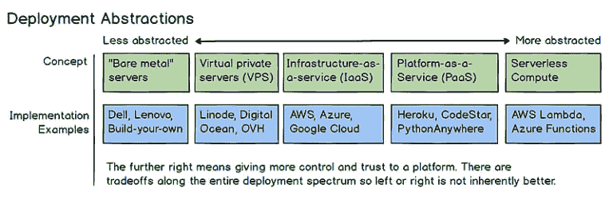

# 如何部署机器学习 web 应用程序？

> 原文：<https://dev.to/flyingnobita/how-do-i-deploy-a-machine-learning-web-app-525f>

移动设备和服务器上机器学习部署方法的比较。

## 目录

1.  [为什么部署很重要？](#why-does-deployment-matters)
2.  推理应该在哪里进行？
3.  [移动设备实现](#mobile-device-implementation)
4.  [服务器实现](#server-implementation)

在我的[上一篇](///general/2019/02/04/building_google_lens.html)文章中，我谈到了我如何想建立一个像谷歌镜头一样工作的移动应用，但是有我自己的图像分类模型。虽然网上有很多关于构建简单图像分类模型的示例代码，但关于部署的资源还远远不够。尽管如此，我发现在何处以及如何部署该模型方面有太多的选择，这既令人着迷又令人不知所措。

虽然有些人会说我偏离了 ML，但我认为部署是 ML 不可分割的一部分，不应该被忽视。我的目标不是成为部署 ML 应用程序的专家，但我认为了解基础知识和了解不同类型的部署选项是必不可少的，因为这将帮助我了解全局以及不同部分如何适应。即使我将来不需要进行 ML 部署，这仍然会帮助我设计更好的 ML 应用程序。

如果数据清理是数据科学家机器学习中最不愉快的部分，那么部署模型可能是第二个。事实上，部署所需的技能集差异很大，通常由单独的团队来完成。

在这篇文章中，我将概述现有的选择，并讨论它们的利弊。我希望这将对您的下一个 ML 应用程序部署有所帮助。

## 为什么部署很重要？

在 fastai 的帮助下，我们可以将一个图像分类模型的训练减少到 3 行代码:

```
data = ImageDataBunch.from_folder(path) # Load some images
learn = cnn_learner(data, models.resnet18, metrics=accuracy) # Load a model
learn.fit(1) # Train the model 
```

在此之后，只需使用训练好的模型进行预测的另一行代码:

```
prediction = learn.predict(img) 
```

机器学习的关键基本上是想办法提高预测精度。

有了以上代码，你现在可以称自己为数据科学家或[任何你喜欢的头衔](https://blog.usejournal.com/fake-data-jobs-9b1c74bf7da8)。

玩笑归玩笑，令人惊讶的是 ML 变得如此简单。当然，这只是一个例子，还有很多问题，即使解决了，解决方法也不那么简单。但是你明白我的意思。

第一个 fastai 项目中的图像分类模型实现与上面类似，也非常简单。大部分时间会花在清理数据上，对预测精度影响很大。然后剩下的时间就花在部署上了。

进行模型训练和即席预测的最常见方式之一是在 Jupyter 笔记本上。但这种方法不适用于谷歌镜头类型的应用程序。你不想用手机拍照，手动上传到电脑，然后进行预测，看看预测的结果是什么。你要么带着你的笔记本电脑，要么等到你回家。仅此一点可能会让你从一开始就放弃开发这个应用的想法。

相反，你需要开发一个可以立即做出并显示预测的移动应用程序。

也就是说，让我们来探索我可以部署移动应用程序的不同方式。

## 推理应该发生在哪里？

推理是使用经过训练的模型进行预测。与训练模型不同，它需要更少的计算能力。如此之少，以至于现在的智能手机都可以做到。部署的很大一部分是决定在哪里以及如何进行推理。

移动应用的推断可以发生在移动设备或服务器上。这两种方法各有利弊，下表总结了一些主要差异:

|  | **移动设备** | **服务器** |
| --- | --- | --- |
| **互联网** | 不需要 | *必需的* |
| **互联网带宽** | 没有人 | *取决于应用* |
| **互联网延迟** | 没有人 | *高* |
| **计算能力** | *低* | 高的 |
| **隐私** | 数据保留在设备上 | *数据泄露到服务器* |
| **框架&库** | *受限* | 没有限制 |
| **模型实现复杂度** | *方法取决于框架和设备操作系统(Android、iOS 等)* | 没有人 |

采取哪种方法的决定很大程度上取决于您的用例。对于一个简单的图像分类应用程序来说，许多关于互联网、计算能力和隐私的因素都不是问题。

相反，您的决定更可能基于您想要使用的框架。让我们探索一下移动设备前端有什么可用的。

## 移动设备实现

下面是您可以使用的更常见的框架或方法的总结:

| 框架/方法 | 笔记 |
| --- | --- |
| **[tensor flow Lite](https://www.tensorflow.org/lite)T3】** | -用于构建移动原生应用 |
| **[TensorFlow.js](https://www.tensorflow.org/js)** | -用于构建可在手机和桌面上运行的网络应用 |
| **[py torch->ONNX->caffe 2](https://pytorch.org/tutorials/advanced/super_resolution_with_caffe2.html)T3】** | - PyTorch 和 Caffe2 可能会因为稍微不同的实现而产生不同的模型输出 |
| **py torch->ONNX->tensor flow** | -将 ONNX 模型导入 TensorFlow 仍处于[试验阶段](https://github.com/onnx/tutorials) |
| [**谷歌 ML 套件**](https://firebase.google.com/docs/ml-kit/) | -提供对设备(通过 TensorFlow Lite)或云(通过 Google Cloud Vision API)的推理访问的 API |

*   支持可在云(Firebase)或设备上托管的定制 TensorFlow Lite 模型
*   从云中自动更新设备上的模型
*   根据设备连接情况，自动切换使用设备上的模型或云模型
*   测试版| | [**核心版 ML 2**](https://developer.apple.com/machine-learning/) | -仅 iOS 版|

我们从上面看到一些有趣的观察结果:

*   对于 TensorFlow 用户来说有太多的选择，因为它是一个相对成熟的框架。
*   [ONNX(开放神经网络交换)](https://github.com/onnx/onnx)是一个正在蓄势待发的开放标准。它允许来自一个框架的训练模型被另一个框架使用。因此，您可以自由地选择构建和训练模型的框架，知道它可以部署到其他支持推理的框架中。除了解决不同人的框架偏好，它还有助于解决框架锁定的问题。
*   谷歌 ML 工具包似乎是一个非常有趣的选择。它允许在设备上和云之间自动切换模型，同时还支持设备上模型的自动更新，这种想法非常有用。随着这种方法走出测试阶段，我们可能会看到它被更广泛地采用。

对于当前的应用程序，我们希望保留几个首选项:

*   动机是应用 fastai 库，因此必须使用 PyTorch。*(排除 TensorFlow Lite，TensorFlow.js，Google ML Kit)*
*   完全控制整个部署过程，除了任何模型转换的复杂性*(排除 ONNX)* 之外，不需要处理另一个框架
*   它在 Android 和 iOS 上工作*(排除核心 ML2)*

似乎没有一个设备上的实现完全符合这个要求。接下来让我们探索服务器端的方法。

## 服务器实现

与移动设备实现不同，在服务器端有更多的选择。您的选择将取决于以下因素:

*   您配置和管理服务器的知识水平
*   您准备在基础架构上花费的时间
*   您的项目所需的计算能力
*   基础设施的灵活性，以便以后承担更重的负载
*   你有多少预算

<figure>[](https://res.cloudinary.com/practicaldev/image/fetch/s--PAgi9RRS--/c_limit%2Cf_auto%2Cfl_progressive%2Cq_auto%2Cw_880/https://res.cloudinary.com/flyingnobita/image/fetch/c_limit%2Cf_auto%2Cq_auto%2Cw_768/https://flyingnobita.com/asseimg/posts/machine_learning_deployment__server_implementation_spectrum.webp) 

<figcaption>

可以在这张图表上总结出光谱的选择([来源](https://www.fullstackpython.com/serverless.html) )

</figcaption>

</figure>

我们从以上几类中挑几个来简单讨论一下。

### IaaS -基础设施即服务

如果您在配置自己的服务器方面经验丰富，这是适合您的。您需要设置硬件配置，并安装推理和与移动设备通信所需的软件库。此外，维护服务器、库和可伸缩性的工作都落在了您的身上。你需要定期给你的服务器打补丁，否则会有被黑客攻击的风险。

虽然第一步是了解不同云构建模块的功能以及它们如何相互配合，但下一步是熟悉所提供的所有服务的定价，这可能会很快变得复杂(或者您甚至敢于比较不同提供商的成本)。

> 巨大的灵活性带来巨大的力量，也可能带来挫折。

#### 优点:

*   通过调整配置，可以始终将成本降至最低，同时保持最佳性能
*   可以转移到任何项目或其他提供商的宝贵经验和技能

#### 缺点:

*   高度的配置会让人不知所措
*   如果您不熟悉定价方式，成本可能会出乎意料地高[，例如，您关闭的资源仍在收费，因为它们尚未停用，或者您的应用程序遇到了意外的高流量，而您没有采取任何警报或对策](https://www.itproportal.com/features/7-hidden-aws-costs-that-could-be-killing-your-budget/)
*   对于任何新手来说，为了学习“供应服务器的艺术”而投入大量时间，如果不符合您的目标，这可能是不值得的

#### 提供商:

*   [AWS EC2](https://aws.amazon.com/ec2/)
*   [谷歌计算引擎](https://cloud.google.com/compute/)
*   [微软 Azure 虚拟机](https://azure.microsoft.com/en-us/services/virtual-machines/)

### VPS -虚拟专用服务器

VPS 通过为您提供预先选择的配置来简化硬件选择过程，从而极大地限制了您必须做出的选择。这就像一个月租一台预先组装好的电脑，你可以选择“小型”、“中型”或“大型”。你每月收取固定费用，没有多少空间(即风险)去超过固定费用。

优点:

*   新接触云计算的人的绝佳选择
*   设置起来比 IaaS 简单得多
*   许多供应商可供选择
*   “突击收费”的风险大大降低

#### Con:

*   即使只有一种资源需要升级，也需要升级到更高的定价层，例如，如果您需要更多内存，但当前层中的其他资源仍未得到充分利用(处理器、磁盘空间等),则需要支付更高的价格层。)
*   随着应用程序的增长和云知识的增加，大多数人发现缺少定制越来越成问题
*   比 IaaS 更贵

#### 提供商:

*   [亚马逊光帆](https://aws.amazon.com/lightsail/)
*   [微软 Azure Marketplace](https://azuremarketplace.microsoft.com/en-us)
*   [数字海洋](https://www.digitalocean.com/)
*   里诺德

### PaaS -平台即服务

PaaS 提供了一个抽象层次，在这个层次上你不需要“说服务器”。它们通常带有预装的操作系统、数据库、web 服务器和您选择的语言的编程环境。云提供商将为您处理任何必要的服务器或软件维护。

PaaS 相对于 IaaS 和 VPS 的另一个主要优势是，它会为您自动扩展服务器。您可以预先定义预算，让云提供商处理剩下的工作。如果你的应用程序点击了令人垂涎的[黑客新闻 FP](https://thehftguy.com/2017/09/26/hitting-hacker-news-front-page-how-much-traffic-do-you-get/) ，这将非常方便。

#### 优点:

*   服务的自动扩展
*   比 IaaS 更易于管理
*   比 MLaaS 便宜
*   通过流行的源代码库(如 Github)支持[持续集成](https://www.atlassian.com/continuous-delivery/continuous-integration) & [持续部署](https://www.atlassian.com/continuous-delivery/continuous-deployment)

#### 缺点:

*   比 MLaaS 需要更多的设置
*   (通常)比 IaaS 更贵

#### 提供商:

*   [AWS 豆茎](https://aws.amazon.com/elasticbeanstalk/)
*   [谷歌应用引擎](https://cloud.google.com/appengine/)
*   [微软 Azure 应用服务](https://azure.microsoft.com/en-us/services/app-service/)
*   [Heroku](https://www.heroku.com/)

### ML PaaS -机器学习平台即服务

这是云提供商的最新产品，以尽可能少的基础设施设置为 ML 从业者提供云计算能力。它可以被认为是 ML 风味形式的 PaaS。每个提供者都有自己支持的 ML 框架列表。

#### 优点:

*   PaaS 的所有优点
*   云提供商内部运行完整的 ML 设置所需的所有基础设施资源的良好集成
*   能够选择基础设施的类型(从单台计算机到计算机集群)
*   用于构建整个 ML 项目管道的 GUI
*   支持超参数调谐
*   追踪实验结果

#### 缺点:

*   倾向于锁定云提供商(“[粘性云](https://www.thoughtworks.com/radar#sticky-clouds)”)
*   最贵的
*   可能不支持您的特定 ML 框架
*   难以微调基础架构以获得更好的性能和成本

#### 提供商:

*   [亚马逊 SageMaker](https://aws.amazon.com/sagemaker/)
*   [谷歌云机器学习引擎](https://cloud.google.com/ml-engine/)(目前不支持 PyTorch)
*   [微软 Azure 机器学习服务](https://azure.microsoft.com/en-us/services/machine-learning-service/)

### 预建模型

这是 ML PaaS 的一个子类型(或者可能是 SaaS，软件作为解决方案，谁知道呢)，它允许你使用他们预先训练好的模型。这些解决方案将整个图像分类解决方案简化为几次 API 调用或几次点击。你只需上传你的照片，它会给你关于图像的信息，其中可能已经包含了你试图预测的信息。这只有在他们预先培训的解决方案与您正在寻找的解决方案重叠时才有用，因为您将无法进行太多的定制。这是为没有任何 ML 经验的人设计的。由于我们想使用我们自己的训练模型，我们不会在我们的项目中考虑这一点。

#### 提供商:

*   [亚马逊机器学习 AI 服务](https://aws.amazon.com/machine-learning/#AI_SERVICES)
*   [谷歌云 AI](https://cloud.google.com/products/ai/building-blocks/)
*   [微软 Azure 机器学习工作室](https://azure.microsoft.com/en-us/services/machine-learning-studio/)

对于我们的应用程序，使用上述解决方案中最基本的选项就足够了。最多不超过 15 分钟。但是这有什么意思呢？(过去我在配置服务器上花费的时间比我希望的要多)如果我们不需要配置*任何*服务器呢？

让我们在下一篇文章[中更深入地探讨这个问题。](///deployment/serverless/2019/03/18/serverless_deployment_of_fastai_on_azure.html)