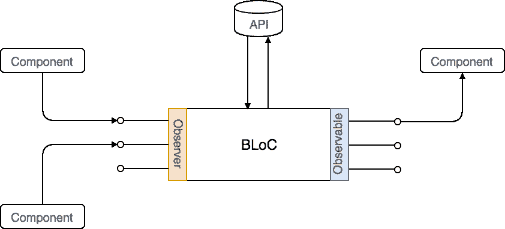

# 具有反作用钩阻挡图案

> 原文：<https://dev.to/magarcia/bloc-pattern-with-react-hooks-3fkf>

**区块图案**由来自谷歌的*保罗·苏亚雷斯*和*丛辉*设计，并在*dart conf 2018*(2018 年 1 月 23 日至 24 日)期间首次展示。[看 YouTube 上的视频](https://www.youtube.com/watch?v=PLHln7wHgPE)。

BLoC 代表 **B** 业务 **Lo** gic **C** 组件。最初的设想是允许在 Flutter 和 Angular Dart 之间重用相同的代码，但实际上是独立于平台的:web 应用程序、移动应用程序、后端。

它可以被认为是利用 Dart 流的颤振的 [Redux 端口的替代方案。在我们的例子中，我们将使用库](https://pub.dartlang.org/packages/flutter_redux) [RxJS](https://rxjs.dev/) 中的 Observables，但是任何其他选项如 [xstream](http://staltz.github.io/xstream/) 也是有效的。

简言之，欧盟将:

*   包含业务逻辑(理想情况下，在更大的应用程序中，我们将有多个 BLoCs)
*   对于输入(*观测器*)和输出(*可观测器*)来说，完全依赖使用*可观测器*
*   保持*平台独立*
*   保持*环境独立*

## BLoC 如何工作？

我不打算详细解释 BLoC 是如何工作的(还有其他人做得更好，我将在这里介绍)，而只是一些基本的提示。

[](https://res.cloudinary.com/practicaldev/image/fetch/s--aMxcMNC5--/c_limit%2Cf_auto%2Cfl_progressive%2Cq_auto%2Cw_880/https://magarcia.io/static/f7316bea5be848da6df2f125575f4ab9/c31c2/bloc-schema.png)

集团将掌握业务逻辑，而组件对内部发生的事情一无所知。组件将通过观察器向 BLoC 发送*事件，并由 BLoC 通过*观察器*通知。*

## 实施集团

这是使用 RxJS:
的搜索块的基本类型脚本示例

```
export class SearchBloc {
  private _results$: Observable<string[]>;
  private _preamble$: Observable<string>;
  private _query$ = new BehaviorSubject<string>('');

  constructor(private api: API) {
    this._results$ = this._query$.pipe(
      switchMap(query => {
        return observableFrom(this.api.search(query));
      })
    );
    this._preamble$ = this.results$.pipe(
      withLatestFrom(this._query$, (_, q) => {
        return q ? `Results for ${q}` : 'All results';
      })
    );
  }

  get results$(): Observable<string[]> {
    return this._results$;
  }

  get preamble$(): Observable<string> {
    return this._preamble$;
  }

  get query(): Observer<string> {
    return this._query$;
  }

  dispose() {
    this._query$.complete();
  }
} 
```

`results$`和`preamble$`被暴露为从一个组件订阅，它们表示异步值，这些值随着`query`的变化而变化。

`query`作为`Observer<string>`暴露给外部，以允许从组件添加新值。在`SearchBloc`中，我们有
`_query$: BehaviorSubject<string>`作为流源，构造函数声明`_results$`和`_preamble$`来响应`_query$`。

## 在 React 上使用它

为了在 React 上使用它，我们需要创建一个新的块实例，并使用 React 上下文将其共享给子组件。

```
const searchBloc = new SearchBloc(new API());
const SearchContext = React.createContext(searchBloc); 
```

我们必须使用上下文提供者来公开它:

```
const App = () => {
  const searchBloc = useContext(SearchContext);

  useEffect(() => {
    return searchBloc.dispose;
  }, [searchBloc]);

  return (
    <SearchContext.Provider>
      <SearchInput />
      <ResultList />
    </SearchContext.Provider>
  );
}; 
```

重要的是让`useEffect`返回 BLoC 的 dispose 方法，这样当组件被卸载时它将完成 observer。

然后我们可以从`SearchInput`组件:
发布对块的更改

```
const SearchInput = () => {
   const searchBloc = useContext(SearchContext);
   const [query, setQuery] = useState("");

   useEffect(() => {
      searchBloc.query.next(query);
   }, [searchBloc, query]);

   return <input
            type="text"
            name="Search"
            value={query}
            onChange={({ target }) => setQuery(target.value)}
          />;
} 
```

我们使用钩子`useContext`得到 BLoC，然后使用`useEffect`每次查询改变时，我们向 BLoC 发布新值。

现在到了`ResultList` :

```
const ResultList = () => {
  const searchBloc = useContext(SearchContext);
  const [results, setResults] = useState([]);

  useEffect(() => {
    return searchBloc.results$.subscribe(setResults);
  }, [searchBloc]);

  return (
    <div>
      {results.map(({ id, name }) => (
        <div key={id}>{name}</div>
      ))}
    </div>
  );
}; 
```

和以前一样，我们使用`useContext`来获取 BLoC，但是现在在`useEffect`中，我们订阅了`results$`接口上的更改，以更新组件的本地状态。返回 subscribe 的返回值很重要，因为当组件被卸载时，它将取消订阅。

## 最后的想法

最终的代码并不复杂，至少如果你对*可观测量*和*挂钩*有一点了解的话。我感觉代码可读性很好，有助于将业务逻辑保持在组件之外。的确，当组件被卸载时，我们应该注意取消订阅可观测量并处理 BLoC，但是这些问题可以通过创建一些新的挂钩(如`useBlocObservable`和`useBlocObserver`)来轻松解决。但是我会在将来尝试，我希望很快，在一个副业项目中我会使用这个模式。

* * *

*原载于[magarcia . io](https://magarcia.io/2019/02/18/bloc-pattern-with-react-hooks/)2019 . 2 . 18。*