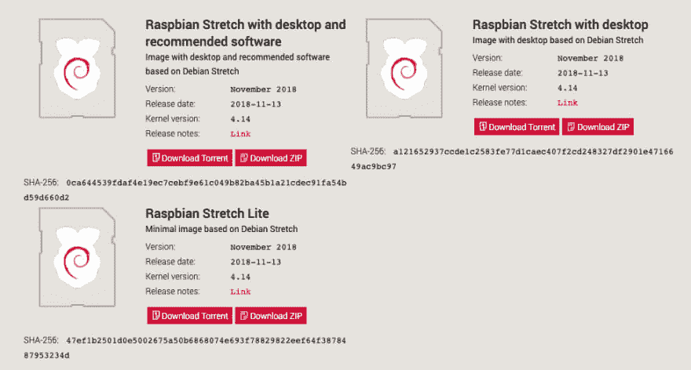
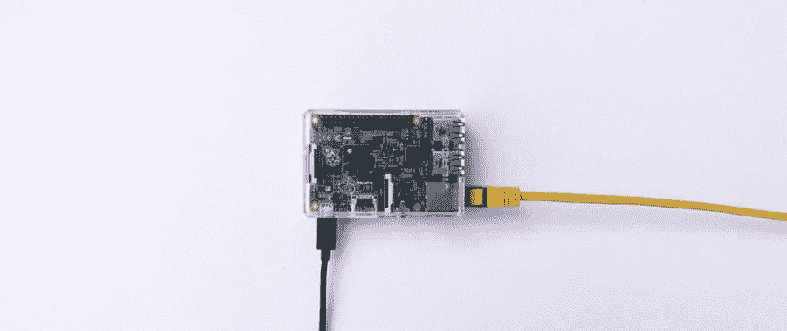
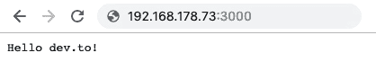
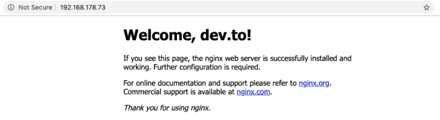
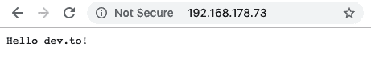

# 在无头 Raspberry Pi 上运行 Node.js 应用程序

> 原文：<https://dev.to/bogdaaamn/run-your-nodejs-application-on-a-headless-raspberry-pi-4jnn>

最近我的桌子上有一个小硬件( [Raspberry Pi 2 Model B](https://www.raspberrypi.org/products/raspberry-pi-2-model-b/) )。我没有让它整天无所事事，而是通过 Nginx 启动并运行了一个小小的 Node.js 应用程序。

## 启动并运行树莓酱

无头安装不需要任何类型的额外硬件(如屏幕或键盘)，因此您需要的一切就是 Raspberry Pi 本身、microSD(或 SD，取决于您的硬件)卡和互联网连接(有线或无线，也取决于您的 Raspberry)。

### 1。获取[拉斯边拉伸](https://www.raspbian.org/)图像

Raspbian 是对 Raspberries 优化最多的操作系统，当我需要最小和快速的设置时，我会使用它。只要去[官网](https://www.raspberrypi.org/downloads/raspbian/)下载最新版本的 **Raspbian Stretch Lite** 就可以了。

[](https://res.cloudinary.com/practicaldev/image/fetch/s--mp50ATwW--/c_limit%2Cf_auto%2Cfl_progressive%2Cq_auto%2Cw_880/https://thepracticaldev.s3.amazonaws.com/i/2atkux0j8lq2oqx0b2w5.png)

### 2。烧掉那张照片

将您的卡插入您的 PC，并在上面刻录 Raspbian 图像。

我按照[这些指令](https://www.raspberrypi.org/documentation/installation/installing-images/mac.md)([**Linux**](https://www.raspberrypi.org/documentation/installation/installing-images/linux.md)/[**Windows**](https://www.raspberrypi.org/documentation/installation/installing-images/windows.md)也是可用的)因为我更喜欢使用我的终端，但是 [Etcher](https://www.balena.io/etcher/) (类固醇的图形替代物)也在所有平台上可用。

### 3。启用无头 SSH 连接

SSH 在 Raspbian 中默认是不启用的，所以您必须在第一次引导卡之前启用它。

安装完成后，转到`boot/`，创建一个名为`ssh`(无扩展名)的文件。

```
touch ssh 
```

Enter fullscreen mode Exit fullscreen mode

### 4。启动那个树莓派

插入卡、电源和网络电缆。绿色发光二极管停止闪烁后，您的树莓派就可以使用了！

[](https://res.cloudinary.com/practicaldev/image/fetch/s--eaRPu3Bk--/c_limit%2Cf_auto%2Cfl_progressive%2Cq_auto%2Cw_880/https://thepracticaldev.s3.amazonaws.com/i/39ugughmcqk0fzcwgjge.jpg)

### 5。找到那个树莓派

所以你有电源，网络和操作系统，没有键盘，没有屏幕。你如何连接到树莓派？

为了 SSH 进入它，你必须首先在你的网络中找到它。假设您将 Raspberry 连接到您的家庭网络，您可以从 ARP 表中看到 LAN 中的所有设备(MAC 和 IP 地址)。只需在您的终端上运行(可在所有平台上运行)

```
arp -a 
```

Enter fullscreen mode Exit fullscreen mode

你会在那里找到你的覆盆子酱。

```
fritz.box (192.168.178.1) on en1 ifscope [ethernet]
raspberrypi.fritz.box (192.168.178.73) on en1 ifscope [ethernet] 
```

Enter fullscreen mode Exit fullscreen mode

在我的例子中，`fritz.box`是我的路由器，紧随其后的是我的树莓派。所以从现在开始，我会通过`192.168.178.73`地址连接到它。

更多关于 ARP 表和如何在那里找到你的设备。

[](/onmyway133) [## 在 MAC 层理解 ARP

### khoa Pham Sep 21 ' 183 分钟读数

#arp #mac #ip](/onmyway133/understanding-arp-at-the-mac-layer-2a14)

### 6。*最后*宋承宪进了那个树莓派

默认凭证是

```
username: pi
password: raspberry 
```

Enter fullscreen mode Exit fullscreen mode

SSH 到树莓 Pi。在 **Mac** 或 **Linux** 上，你只需运行

```
ssh pi@192.168.178.73 
```

Enter fullscreen mode Exit fullscreen mode

而在**窗口**上有几个选择，如[油灰](https://www.putty.org/)或[命令](http://cmder.net/)上的默认配置。

## 启动并运行 Node.js 应用程序

你被录取了！您应该启动 Node.js 应用程序，因此下面的步骤是通过 SSH 在您的 Raspberry Pi 上运行的。

### 1。在 Raspbian 上安装 Node.js

在 Linux 机器上安装 [Node.js](https://nodejs.org/en/) 有很多种方法，但我总是按照 [NodeSource](https://github.com/nodesource) 的说明去做，这是我做过的最安全的方法。

对于 Node.js v11.x，我运行了

```
sudo apt-get update
curl -sL https://deb.nodesource.com/setup_11.x | bash -
sudo apt-get install -y nodejs 
```

Enter fullscreen mode Exit fullscreen mode

无论如何，如果你需要更多的工具或附件，`curl -sL https://deb.nodesource.com/setup_11.x | bash -`会提供更多的说明。

检查 Node.js 和`npm`是否安装正确。

```
$ node -v
v11.10.0

$ npm -v
6.7.0 
```

Enter fullscreen mode Exit fullscreen mode

对于其他版本或故障排除，请查看[节点源](https://github.com/nodesource)的综合文档。Raspbian 是基于 Debian 的操作系统，所以请寻找 Debian 的说明。

##  [节点源](https://github.com/nodesource) / [分布](https://github.com/nodesource/distributions)

### NodeSource Node.js 二进制发行版

<article class="markdown-body entry-content container-lg" itemprop="text">

# [NodeSource](https://nodesource.com) Node.js 二进制分布

[](https://nodesource.com)

[](https://circleci.com/gh/nodesource/distributions/tree/master)

这个库包含了通过使用**[node source](https://nodesource.com)****[node . js](http://nodejs.org)**二进制发行版的文档。rpm，。deb 和 Snap 包以及它们的设置和支持脚本。

如果您正在寻找 NodeSource 的低影响 Node.js 性能监控平台，请从这里开始 **[。](https://accounts.nodesource.com/sign-up-linuxdistro)**

如果您遇到问题或想讨论与发行版相关的内容，请提交问题。

如果您认为有改进安装过程或增加跨 Linux 发行版兼容性的更改，我们鼓励您提出拉请求。

## 目录

*   **[基于 Debian 和 Ubuntu 的发行版](https://raw.githubusercontent.com/nodesource/distributions/master/#deb)** (deb)
    *   [安装说明](https://raw.githubusercontent.com/nodesource/distributions/master/#debinstall)
    *   [手动安装](https://raw.githubusercontent.com/nodesource/distributions/master/#debmanual)
*   **[基于企业 Linux 的发行版](https://raw.githubusercontent.com/nodesource/distributions/master/#rpm)** (rpm)
    *   [安装说明](https://raw.githubusercontent.com/nodesource/distributions/master/#rpminstall)
*   **[抓包](https://raw.githubusercontent.com/nodesource/distributions/master/#snap)**
    *   [关于](https://raw.githubusercontent.com/nodesource/distributions/master/#snapabout)
    *   [安装说明](https://raw.githubusercontent.com/nodesource/distributions/master/#snapinstall)
    *   [高级用法](https://raw.githubusercontent.com/nodesource/distributions/master/#snapadvanced)
*   **[测试](https://raw.githubusercontent.com/nodesource/distributions/master/#tests)**
*   **[常见问题](https://raw.githubusercontent.com/nodesource/distributions/master/#questions)**
*   **[要求分发](https://raw.githubusercontent.com/nodesource/distributions/master/#requests)**
*   **[牌照](https://raw.githubusercontent.com/nodesource/distributions/master/#project-license)**

## 基于 Debian 和 Ubuntu 的发行版

**可用架构:**

NodeSource 将继续维护以下架构，并可能在未来添加更多架构。

*   **amd64** (64 位)
*   **armhf** (ARM 32 位硬浮点，ARMv7 及以上…

</article>

[View on GitHub](https://github.com/nodesource/distributions)

如果您选择编写或粘贴代码，请快速安装`vim`，它将使我们的生活变得更加轻松，稍后我将带您浏览，不要担心。

```
sudo apt-get update
sudo apt-get install vim -y 
```

Enter fullscreen mode Exit fullscreen mode

### 2。获取 Node.js 应用程序

编写、复制粘贴或[克隆](https://github.com/BogDAAAMN/nodejs-hello-world)node . js 应用程序。出于测试目的，我创建了`app.js`文件。

```
cd ~
vim app.js 
```

Enter fullscreen mode Exit fullscreen mode

我粘贴了下面的样板文件

```
const http = require('http');

const PORT = 3000;

const server = http.createServer((req, res) => {
  res.statusCode = 200;
  res.setHeader('Content-Type', 'text/plain');
  res.end('Hello dev.to!\n');
});

server.listen(PORT, () => {
  console.log(`Server running on port ${PORT}.`);
}); 
```

Enter fullscreen mode Exit fullscreen mode

如果`vim`太让人受不了，你可以尝试用其他方式作为`nano`。不过可以肯定的是，这是一个*真正快速的*后续:

1.  用`vim app.js`打开(或创建)文件。

2.  现在，`vim`处于**正常模式**，它在等待你的命令。按下`i`进入**插入模式**，这将允许你编写代码。

3.  现在键入或粘贴代码，就像在编辑器中一样。

4.  如果你写完了，按下`esc`这样你就回到了**正常模式**这样你就可以命令`vim`保存并退出。

5.  通常，`vim`命令以`:`开头。轻轻按下`:`，然后按下`w`进行 **w** 书写，按下`q`进行**q**ui ting。你可以在终端的底部看到你正在输入的命令。按 enter 键确认命令。

6.  太好了。`app.js`已保存。

如果你想用`vim`做更多疯狂的把戏，遵循这个初学者指南，你会发现`vim`并没有**那么**糟糕。

[](/hamza) [## Vim 入门——您需要知道的最基本的知识

### hamza Tamenaoul 12 月 25 日 173 分钟阅读

#vim #linux #terminal #beginners](/hamza/vim-for-starters---the-minimum-you-need-to-know-3ob)

### 3。*最后*运行 Node.js 应用程序

运行

```
$ node app
Server running at 127.0.0.1 on port 3000. 
```

Enter fullscreen mode Exit fullscreen mode

你的 Node.js 应用将在`localhost:3000/`运行。

因为默认情况下没有打开任何端口，所以您只能从您的 Raspberry Pi 测试应用程序。打开 SSH 连接的新标签并运行

```
curl localhost:3000 
```

Enter fullscreen mode Exit fullscreen mode

你应该得到

```
Hello dev.to! 
```

Enter fullscreen mode Exit fullscreen mode

### 4。安装 PM2

当然，您希望您的应用程序被后台化(在*后台*)，当然，您希望您的应用程序在系统重启时启动。 [PM2](https://github.com/Unitech/pm2) 将提供这一切。

停止 Node.js 应用程序(`ctrl + C`)并继续安装。

我们将使用`npm`在全球安装 PM2`-g`。

```
sudo npm install -g pm2 
```

Enter fullscreen mode Exit fullscreen mode

#### 用 PM2 启动应用程序

用 PM2 开始`app.js`运行

```
pm2 start app.js 
```

Enter fullscreen mode Exit fullscreen mode

你应该看到

```
[PM2] Starting /home/pi/app.js in fork_mode (1 instance)
[PM2] Done.
┌──────────┬────┬─────────┬──────┬─────┬────────┬─────────┬────────┬─────┬───────────┬──────┬──────────┐
│ App name │ id │ version │ mode │ pid │ status │ restart │ uptime │ cpu │ mem       │ user │ watching │
├──────────┼────┼─────────┼──────┼─────┼────────┼─────────┼────────┼─────┼───────────┼──────┼──────────┤
│ app      │ 0  │ N/A     │ fork │ 738 │ online │ 0       │ 0s     │ 0%  │ 21.8 MB   │ pi   │ disabled │
└──────────┴────┴─────────┴──────┴─────┴────────┴─────────┴────────┴─────┴───────────┴──────┴──────────┘ 
```

Enter fullscreen mode Exit fullscreen mode

现在`app.js`被妖魔化运行。你可以像我们之前用`curl localhost:3000`做的那样测试它。

奖励:如果应用崩溃，PM2 会重启它。

#### PM2 启动

`pm2 startup`命令将生成一个脚本，该脚本将在引导时与您配置启动的应用程序一起处理 PM2。

```
pm2 startup systemd 
```

Enter fullscreen mode Exit fullscreen mode

将生成

```
[PM2] Init System found: systemd
[PM2] To setup the Startup Script, copy/paste the following command:
sudo env PATH=$PATH:/usr/bin /usr/lib/node_modules/pm2/bin/pm2 startup systemd -u pi --hp /home/pi 
```

Enter fullscreen mode Exit fullscreen mode

复制生成的命令并运行它。

```
sudo env PATH=$PATH:/usr/bin /usr/lib/node_modules/pm2/bin/pm2 startup systemd -u pi --hp /home/p 
```

Enter fullscreen mode Exit fullscreen mode

这创建了一个将在引导时启动 PM2 的系统单元。当系统启动时，PM2 将从尚未创建的转储文件中恢复。要创建它，运行

```
pm2 save 
```

Enter fullscreen mode Exit fullscreen mode

这将把 PM2 的当前状态保存在一个转储文件中(运行`app.js`),该文件将在复活 PM2 时使用。

就是这样！您的应用程序当前正在运行，如果重启，它将在系统启动时启动。

#### PM2 守护进程

您可以随时通过`pm2 list`、`pm2 status`或`pm2 show`查看您的申请状态。

```
$ pm2 list
┌──────────┬────┬─────────┬──────┬─────┬────────┬─────────┬────────┬──────┬───────────┬──────┬──────────┐
│ App name │ id │ version │ mode │ pid │ status │ restart │ uptime │ cpu  │ mem       │ user │ watching │
├──────────┼────┼─────────┼──────┼─────┼────────┼─────────┼────────┼──────┼───────────┼──────┼──────────┤
│ app      │ 0  │ N/A     │ fork │ 451 │ online │ 0       │ 96m    │ 0.2% │ 31.8 MB   │ pi   │ disabled │
└──────────┴────┴─────────┴──────┴─────┴────────┴─────────┴────────┴──────┴───────────┴──────┴──────────┘ 
```

Enter fullscreen mode Exit fullscreen mode

```
$ pm2 show app
┌───────────────────┬──────────────────────────────────┐
│ status            │ online                           │
│ name              │ app                              │
│ version           │ N/A                              │
│ restarts          │ 0                                │
│ uptime            │ 97m                              │
│ script path       │ /home/pi/app.js                  │
│ script args       │ N/A                              │
│ error log path    │ /home/pi/.pm2/logs/app-error.log │
│ out log path      │ /home/pi/.pm2/logs/app-out.log   │
│ pid path          │ /home/pi/.pm2/pids/app-0.pid     │
│ interpreter       │ node                             │
│ interpreter args  │ N/A                              │
│ script id         │ 0                                │
│ exec cwd          │ /home/pi                         │
│ exec mode         │ fork_mode                        │
│ node.js version   │ 11.10.0                          │
│ node env          │ N/A                              │
│ watch & reload    │ ✘                                │
│ unstable restarts │ 0                                │
│ created at        │ 2019-02-17T14:14:35.027Z         │
└───────────────────┴──────────────────────────────────┘ 
```

Enter fullscreen mode Exit fullscreen mode

你可以利用 PM2 的很多优点，阅读下面关于日志和流程的更多内容。

[](/nickparsons) [## 在生产环境中运行 PM2 & Node.js

### 尼克帕森斯 8 月 6 日 185 分钟阅读

#pm2 #node #processmanagement](/nickparsons/running-pm2--nodejs-in-production-environments-23i5)

## 利用反向代理

正如我之前提到的，你的设备上没有一个端口是公开开放的，所以你不能从外部世界访问你的 Raspberry Pi。对于为什么应该或不应该为 Node.js 应用程序使用反向代理，有很多理由。由于可伸缩性和安全性的原因(也很容易设置和管理)，我将使用 Nginx 作为这个应用程序的反向代理服务器。

### 0。不要使用反向代理:(

如果你计划使用反向代理，不要遵循这个步骤，否则你会弄乱端口(就像同时打开 80 和 3000 个端口)。

不使用反向代理的一个简单方法是使用 [`ufw`](https://help.ubuntu.com/community/UFW) 来允许一些端口允许输入流量。但是请注意，这可能是一个很大的安全缺陷。

运行
进行安装

```
sudo apt-get install ufw 
```

Enter fullscreen mode Exit fullscreen mode

一个快速的`sudo ufw status verbose`将告诉我们`ufw`当前是不活动的。在启用它之前，您应该允许所有 SSH 流量进入您的设备，这样连接就不会受到干扰。

```
$ sudo ufw allow ssh
Rules updated
Rules updated (v6) 
```

Enter fullscreen mode Exit fullscreen mode

现在您可以启用它了。

```
sudo ufw enable 
```

Enter fullscreen mode Exit fullscreen mode

另一个快速的`sudo ufw status verbose`将显示所有进入的 SSH 流量都被允许。所有传出流量都是允许的，所以不用担心。现在只需继续并允许在`3000`上的连接，即您的应用程序的端口。

```
sudo ufw allow 3000 
```

Enter fullscreen mode Exit fullscreen mode

现在你可以从外面进入了！您可以在浏览器中键入设备的地址，后跟端口。

[](https://res.cloudinary.com/practicaldev/image/fetch/s--fFjTYaHw--/c_limit%2Cf_auto%2Cfl_progressive%2Cq_auto%2Cw_880/https://thepracticaldev.s3.amazonaws.com/i/focj9afhpa6ej335qchv.jpg)

### 1。install nginx(安装引擎)

我使用 Nginx 作为反向代理服务器，将所有进出端口`80`的流量重定向到我在端口`3000`上的应用程序。安装 Nginx 运行

```
sudo apt update
sudo apt install nginx 
```

Enter fullscreen mode Exit fullscreen mode

安装完成后，Nginx 将立即运行。打开的默认端口是`80`，你可以通过浏览你的 Raspberry 的地址来测试。

[](https://res.cloudinary.com/practicaldev/image/fetch/s--l8Ve4T8v--/c_limit%2Cf_auto%2Cfl_progressive%2Cq_auto%2Cw_880/https://thepracticaldev.s3.amazonaws.com/i/qhczm2oqnxy1sp947g5w.png)

### 2。配置反向代理服务器

关于反向代理有很多要说的，但我们现在将坚持基本原则。

您将编辑默认配置(为您在浏览器中看到的 HTML 页面提供服务)以进行正确的重定向。

```
sudo vim /etc/nginx/sites-available/default 
```

Enter fullscreen mode Exit fullscreen mode

如果你对 Nginx 不熟悉，`/etc/nginx/sites-available/default`是一个又长又混乱的文件。我会去掉所有的评论，这样你可以看得更清楚。

```
server {
        listen 80 default_server;
        listen [::]:80 default_server;

        root /var/www/html;

        index index.html index.htm index.nginx-debian.html;

        server_name _;

        location / {
            # First attempt to serve request as file, then
            # as directory, then fall back to displaying a 404.
            try_files $uri $uri/ =404;
            # proxy_pass http://localhost:8080;
            # proxy_http_version 1.1;
            # proxy_set_header Upgrade $http_upgrade;
            # proxy_set_header Connection 'upgrade';
            # proxy_set_header Host $host;
            # proxy_cache_bypass $http_upgrade;
        }
} 
```

Enter fullscreen mode Exit fullscreen mode

您将需要基本配置，因此不要管它。您将对`location / {`块进行更改。

取消注释该块中的注释部分，将端口更改为`3000`，去掉第一行，这样确切的配置就是一个反向代理(或者只是复制下面的代码)。

```
server {
        listen 80 default_server;
        listen [::]:80 default_server;

        root /var/www/html;

        index index.html index.htm index.nginx-debian.html;

        server_name _;

        location / {
            proxy_pass http://localhost:3000;
            proxy_http_version 1.1;
            proxy_set_header Upgrade $http_upgrade;
            proxy_set_header Connection 'upgrade';
            proxy_set_header Host $host;
            proxy_cache_bypass $http_upgrade;
        }
} 
```

Enter fullscreen mode Exit fullscreen mode

用
检查 Nginx 中的语法错误

```
sudo nginx -t 
```

Enter fullscreen mode Exit fullscreen mode

并且*最后*重启 Nginx 服务器。

```
sudo systemctl restart nginx 
```

Enter fullscreen mode Exit fullscreen mode

通过浏览你的覆盆子的地址来测试它。

[](https://res.cloudinary.com/practicaldev/image/fetch/s--jRlV5DZH--/c_limit%2Cf_auto%2Cfl_progressive%2Cq_auto%2Cw_880/https://thepracticaldev.s3.amazonaws.com/i/qkcaxeoymobes8kzjxml.png)

搞定了。所有对 Raspberry 地址的请求都将被重定向到 Node.js 应用程序。

请注意，这是 Nginx 的基本配置，您可以在这里找到更多关于其他功能的信息。

[](/mozartted) [## 了解 nginx(代理、反向代理、负载平衡)

### osita Chibuike 5 月 23 日 184 分钟阅读

#devops #showdev #linux #learning](/legobox/understanding-nginx-proxying-reverse-proxying-load-balancing-1pjd)

## 大结局

现在你完成了！因此，您得到了一个在无头 Raspberry Pi 上运行(后台化)的 Node.js 应用程序，它通过 Nginx 反向代理服务器处理请求。

希望这是一个足够全面的指南，但我愿意讨论和下面的问题。让我们知道你经历了什么，或者你在这个过程中找到了什么其他选择。