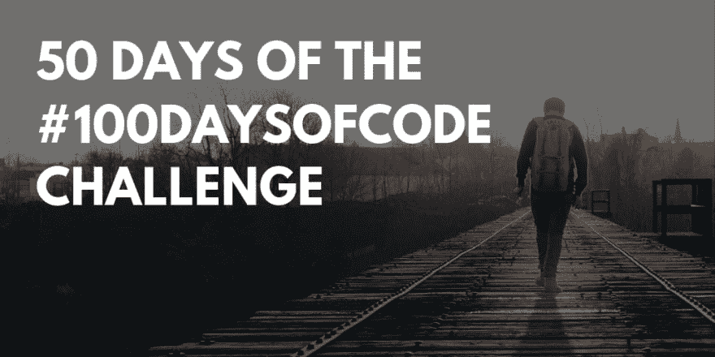
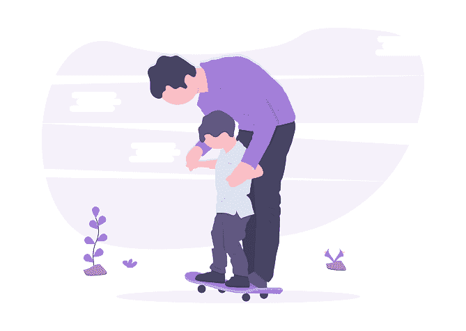

# #100DaysOfCode 挑战赛 50 天

> 原文：<https://dev.to/kriyeng/50-days-of-the-100daysofcode-challenge-58n>

# 50 天的#100DaysOfCode 挑战

我今天在挑战的**中点**！在这一点上，我**非常高兴**能参与其中。
到目前为止，这是一次有趣而富有成效的旅行。我学到了很多新东西，认识了很多很棒的人，也在为自己努力。

我不得不说，参加挑战是去年**的一部分，目的是锻炼自己**。挑战不是我需要改进的唯一输入。

1 月，我设定了 2019 年的可实现目标。多亏了这个挑战，我们已经到了二月中旬，我已经接近完成这些目标的 **50%了。**

来看看我目前为止的成绩吧！

**个人进步**

*   我坚持每天花一些时间去实现一个明确的目标。我过去常常学习、写作和做兼职项目。我意识到这种一致性在我生活的其他方面帮助了我，消除了一些背景懒惰。这有点像每天去健身房锻炼一会儿。
*   由于坚持不懈(同时也在锻炼自己)，我开始改善我欣赏其他活动的方式。我正在变得更好，享受我的家庭时光，专注于我每时每刻在做的事情。远没有达到我想要的程度，但是**在进步！**

    [T8】](https://res.cloudinary.com/practicaldev/image/fetch/s--PCbTYO22--/c_limit%2Cf_auto%2Cfl_progressive%2Cq_auto%2Cw_880/https://thepracticaldev.s3.amazonaws.com/i/0ty2ajew326w5fyx012s.png)

*   我开始享受把一些时间花在非生产性的活动上，而不后悔自己。只是享受一下！

**与编码相关的项目**

*   发现并开始参与一个**伟大的社区**。令人惊讶的是，有这么多的人愿意帮助他人，有这么多的项目和令人敬畏的想法。
*   我第一次开始从事**开源项目**。我已经打开了几个拉请求，接受并合并。我学到了很多关于这些社区如何组织起来以及工具如何在这种环境下工作的知识。
*   我和世界各地的一些人一起参与了两个有趣的项目。发现如何组织如此多时区的社区很有趣。
    T3T5】

*   我在战胜恐惧，分享我的作品。我开始喜欢分享我的工作，写教程。我正在一点一点地克服我的冒名顶替综合症。)

*   我已经发了今年 10 篇文章中的 6 篇。

*   我已经发布了教程[的第 1 部分和第 2 部分，用不到 350 行代码](http://blog.ibanyez.info/blogs/coding/20190126-create-your-own-framework/)创建你自己的框架。我在它的中间点！

因此，我对此次挑战的评估是**优秀**。我**强烈推荐**这个挑战给几乎所有需要意志力和鼓励去开始做那些她/他从未开始或结束的事情的人。

我会得到挑战的第二部分，完全的鼓励和兴奋去完成更多的事情！

这篇文章于今天早些时候[发表在我的博客](http://blog.ibanyez.info/blogs/about-me/20190217-what-i-achieved-after-50-days-taking-part-in-the-100daysofco/)上