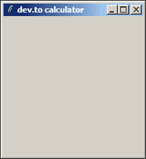
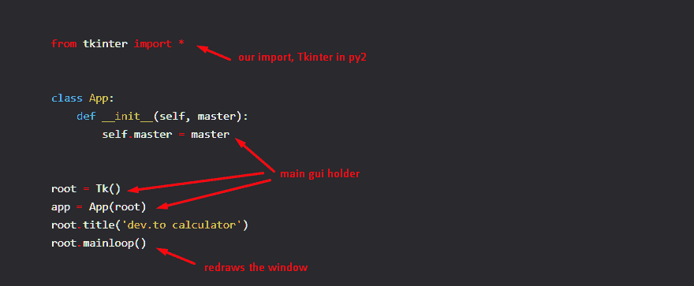
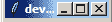
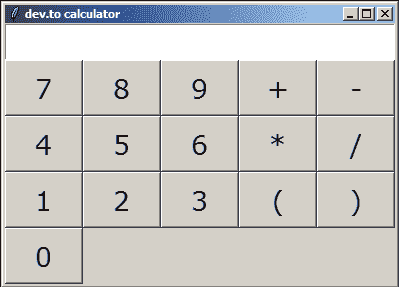
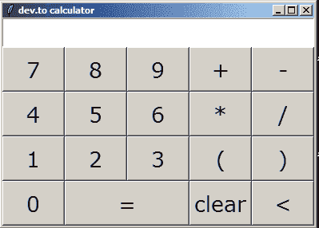
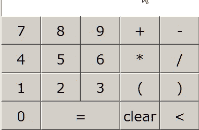
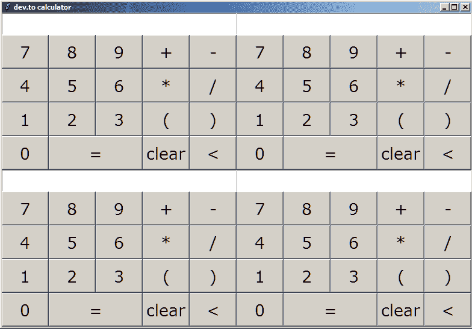

# 构建 OOP 计算器以及编写小部件库意味着什么

> 原文：<https://dev.to/abdurrahmaanj/building-an-oop-calculator-and-what-it-means-to-write-a-widget-library-4560>

在这篇文章中，我们将编写一个 OOP 计算器，实际上是让它成为一个即插即用的小部件。Python 的灵活性和 oop 是一个很好的搭配！

## 我们的骨架

我们使用 tkinter(实际上再次发音为 tee-Kay-inter ), widget guys 表示窗口小工具

```
from tkinter import *

class App:
    def __init__(self, master):
        self.master = master

root = Tk()
app = App(root)
root.title('dev.to calculator')
root.mainloop() 
```

我们得到了

[](https://res.cloudinary.com/practicaldev/image/fetch/s--58gqycNA--/c_limit%2Cf_auto%2Cfl_progressive%2Cq_auto%2Cw_880/https://thepracticaldev.s3.amazonaws.com/i/3tilnf8lf00c5d2p1hkf.png)

和往常一样，这是一些信息

[](https://res.cloudinary.com/practicaldev/image/fetch/s--fPB6qKf3--/c_limit%2Cf_auto%2Cfl_progressive%2Cq_auto%2Cw_880/https://thepracticaldev.s3.amazonaws.com/i/77oogo8o0btm3vb9fwfe.png)

## 我们的计算器

下面是一个普通的类

```
class Calculator:
    def __init__(self, parent, x, y):
        pass 
```

我们添加了一个框架来容纳所有的元素，这样我们只需插入一个框架

```
class Calculator:
    def __init__(self, parent, x, y):
        self.parent = parent

        self.container = Frame(self.parent)
        self.container.grid(row=x, column=y) 
```

我们现在可以将计算器添加到我们的应用程序

```
class App:
    def __init__(self, master):
        self.master = master

        calc = Calculator(self.master, 0, 0) 
```

我们得到了

[](https://res.cloudinary.com/practicaldev/image/fetch/s--omYL33zf--/c_limit%2Cf_auto%2Cfl_progressive%2Cq_auto%2Cw_880/https://thepracticaldev.s3.amazonaws.com/i/q4n7uk9lvwek9z86k4dk.png)

## 我们计算器中的一些初始化

```
class Calculator:
    def __init__(self, parent, x, y):
        self.button_font = ('Verdana', 15)
        self.entry_font = ('Verdana', 20)
        self.parent = parent

        self.button_width = 4
        self.button_height = 1
        self.container = Frame(self.parent)
        self.container.grid(row=x, column=y)

        self.string = '' 
```

那两个只是字体名称和字体大小
self.button_font = ('Verdana '，15)
self . entry _ font =(' Verdana '，20)

一个帧可以被认为是一个容器

在 self.string 中，我们将存储我们将在计算器屏幕上显示的内容

## 网格上的一个音符

网格告诉我们在哪里放置元素，坐标从 0，0 开始

## 优雅地添加元素

我们不是每次为一个按钮添加两行代码，而是通过在 calculator 类
中定义来添加一行代码

```
def button(self, char_, x_, y_):
        self.b = Button(
            self.container, text=char_, width=self.button_width,
            height=self.button_height, font=self.entry_font)
        self.b.grid(row=x_, column=y_) 
```

像这样使用它

```
self.button('7', 1, 0) 
```

对于我们的文本字段，我们将显示我们的字符

```
def entry(self, x_, y_):
        self.entry = Text(
            self.container, font=self.entry_font, state=DISABLED,
            height=self.button_height//2, width=self.button_width*5)
        self.entry.grid(row=x_, column=y_, columnspan=5, sticky='we') 
```

用法

```
self.entry(0, 0) 
```

使用 state=DISABLED，这样我们就不能通过放置光标
columnspan 在其他列中展开我们的元素来写任何东西

## 实际上添加了它们

在我们的计算器课上

```
 self.entry(0, 0)

        self.button('7', 1, 0)
        self.button('8', 1, 1)
        self.button('9', 1, 2)

        self.button('4', 2, 0)
        self.button('5', 2, 1)
        self.button('6', 2, 2)

        self.button('1', 3, 0)
        self.button('2', 3, 1)
        self.button('3', 3, 2)

        self.button('0', 4, 0)

        self.button('+', 1, 3)
        self.button('-', 1, 4)
        self.button('*', 2, 3)
        self.button('/', 2, 4)

        self.button('(', 3, 3)
        self.button(')', 3, 4) 
```

这是我们得到的

[](https://res.cloudinary.com/practicaldev/image/fetch/s--DwJPy7jD--/c_limit%2Cf_auto%2Cfl_progressive%2Cq_auto%2Cw_880/https://thepracticaldev.s3.amazonaws.com/i/gjo1wz2bw07titqsc2g6.png)

## 添加删除一个字符、相等和清除按钮

我们将有三个按钮，一个用于删除一个字符，如果我们错误地添加了一个
一个用于评估我们的结果，一个用于完全清除显示

评估按钮

```
def button_eq(self, char_, x_, y_):
        self.b = Button(
            self.container, text=char_, width=self.button_width,
            height=self.button_height, font=self.entry_font)
        self.b.grid(row=x_, column=y_, sticky='we', columnspan=2) 
```

用法

```
self.button_eq('=', 4, 1) 
```

移除一个字符按钮

```
def button_rem(self, char_, x_, y_):
        self.b = Button(
            self.container, text=char_, width=self.button_width,
            height=self.button_height, font=self.entry_font)
        self.b.grid(row=x_, column=y_) 
```

用法

```
self.button_rem('<', 4, 4) 
```

清除按钮

```
def button_clear(self, char_, x_, y_):
        self.b = Button(
            self.container, text=char_, width=self.button_width,
            height=self.button_height, font=self.entry_font)
        self.b.grid(row=x_, column=y_) 
```

用法

```
self.button_clear('clear', 4, 3) 
```

## 我们在哪里

到目前为止的代码

```
from tkinter import *

class Calculator:
    def __init__(self, parent, x, y):
        self.button_font = ('Verdana', 15)
        self.entry_font = ('Verdana', 20)
        self.parent = parent

        self.button_width = 4
        self.button_height = 1
        self.container = Frame(self.parent)
        self.container.grid(row=x, column=y)

        self.string = ''

        self.entry(0, 0)

        self.button('7', 1, 0)
        self.button('8', 1, 1)
        self.button('9', 1, 2)

        self.button('4', 2, 0)
        self.button('5', 2, 1)
        self.button('6', 2, 2)

        self.button('1', 3, 0)
        self.button('2', 3, 1)
        self.button('3', 3, 2)

        self.button('0', 4, 0)

        self.button('+', 1, 3)
        self.button('-', 1, 4)
        self.button('*', 2, 3)
        self.button('/', 2, 4)

        self.button('(', 3, 3)
        self.button(')', 3, 4)

        self.button_eq('=', 4, 1)

        self.button_clear('clear', 4, 3)
        self.button_rem('<', 4, 4)

    def button_eq(self, char_, x_, y_):
        self.b = Button(
            self.container, text=char_, width=self.button_width,
            height=self.button_height, font=self.entry_font)
        self.b.grid(row=x_, column=y_, sticky='we', columnspan=2)

    def button_rem(self, char_, x_, y_):
        self.b = Button(
            self.container, text=char_, width=self.button_width,
            height=self.button_height, font=self.entry_font)
        self.b.grid(row=x_, column=y_)

    def button_clear(self, char_, x_, y_):
        self.b = Button(
            self.container, text=char_, width=self.button_width,
            height=self.button_height, font=self.entry_font)
        self.b.grid(row=x_, column=y_)

    def button(self, char_, x_, y_):
        self.b = Button(
            self.container, text=char_, width=self.button_width,
            height=self.button_height, font=self.entry_font)
        self.b.grid(row=x_, column=y_)

    def entry(self, x_, y_):
        self.entry = Text(
            self.container, font=self.entry_font, state=DISABLED,
            height=self.button_height//2, width=self.button_width*5)
        self.entry.grid(row=x_, column=y_, columnspan=5, sticky='we')

class App:
    def __init__(self, master):
        self.master = master

        calc = Calculator(self.master, 0, 0)

root = Tk()
app = App(root)
root.title('dev.to calculator')
root.mainloop() 
```

我们的 gui

[](https://res.cloudinary.com/practicaldev/image/fetch/s--XboyxQl---/c_limit%2Cf_auto%2Cfl_progressive%2Cq_auto%2Cw_880/https://thepracticaldev.s3.amazonaws.com/i/ai641bhvcs9kdjixexik.png)

## 添加逻辑

显示文本使文本区正常，添加然后再次禁用它

```
 def display(self, text_):
        self.entry.config(state=NORMAL)
        self.entry.delete('1.0', END)
        self.entry.insert('1.0', text_)
        self.entry.config(state=DISABLED) 
```

点击任何按钮都会将按钮上的字符添加到显示屏上

```
 def normal_button_click(self, text_):
        self.string = '' + self.string + text_
        self.display(self.string) 
```

按下等号键会评估我们写的任何东西。我们使用 py 的 eval，所以我们可以用**来表示指数

```
 def equal_button_click(self):
        self.display(eval(self.string))
        self.string = '' 
```

删除一个字符只是通过排除最后一个字符
来减少字符串

```
 def rem_button_click(self):
        self.string = '' + self.string[0:-1]
        self.display(self.string) 
```

清除按钮重置所有

```
 def clear_button_click(self):
        self.display('')
        self.string = '' 
```

## 添加了命令的按钮

添加了一个普通命令

命令=功能名称

但是带有参数的命令是由

command = lambda:self . function(parameter _)

```
 def button(self, char_, x_, y_):
        self.b = Button(
            self.container, text=char_, width=self.button_width,
            height=self.button_height, font=self.entry_font,
            command=lambda: self.normal_button_click(char_))
        self.b.grid(row=x_, column=y_)

    def button_eq(self, char_, x_, y_):
        self.b = Button(
            self.container, text=char_, width=self.button_width,
            height=self.button_height, font=self.entry_font,
            command=self.equal_button_click)
        self.b.grid(row=x_, column=y_, sticky='we', columnspan=2)

    def button_rem(self, char_, x_, y_):
        self.b = Button(
            self.container, text=char_, width=self.button_width,
            height=self.button_height, font=self.entry_font,
            command=self.rem_button_click)
        self.b.grid(row=x_, column=y_)

    def button_clear(self, char_, x_, y_):
        self.b = Button(
            self.container, text=char_, width=self.button_width,
            height=self.button_height, font=self.entry_font,
            command=self.clear_button_click)
        self.b.grid(row=x_, column=y_) 
```

## 终于到了

我们的完整代码

```
from tkinter import *

class Calculator:
    def __init__(self, parent, x, y):
        self.button_font = ('Verdana', 15)
        self.entry_font = ('Verdana', 20)
        self.parent = parent

        self.button_width = 4
        self.button_height = 1
        self.container = Frame(self.parent)
        self.container.grid(row=x, column=y)

        self.string = ''

        self.entry(0, 0)

        self.button('7', 1, 0)
        self.button('8', 1, 1)
        self.button('9', 1, 2)

        self.button('4', 2, 0)
        self.button('5', 2, 1)
        self.button('6', 2, 2)

        self.button('1', 3, 0)
        self.button('2', 3, 1)
        self.button('3', 3, 2)

        self.button('0', 4, 0)

        self.button('+', 1, 3)
        self.button('-', 1, 4)
        self.button('*', 2, 3)
        self.button('/', 2, 4)

        self.button('(', 3, 3)
        self.button(')', 3, 4)

        self.button_eq('=', 4, 1)

        self.button_clear('clear', 4, 3)
        self.button_rem('<', 4, 4)

    def entry(self, x_, y_):
        self.entry = Text(
            self.container, font=self.entry_font, state=DISABLED,
            height=self.button_height//2, width=self.button_width*5)
        self.entry.grid(row=x_, column=y_, columnspan=5, sticky='we')

    def button(self, char_, x_, y_):
        self.b = Button(
            self.container, text=char_, width=self.button_width,
            height=self.button_height, font=self.entry_font,
            command=lambda: self.normal_button_click(char_))
        self.b.grid(row=x_, column=y_)

    def button_eq(self, char_, x_, y_):
        self.b = Button(
            self.container, text=char_, width=self.button_width,
            height=self.button_height, font=self.entry_font,
            command=self.equal_button_click)
        self.b.grid(row=x_, column=y_, sticky='we', columnspan=2)

    def button_rem(self, char_, x_, y_):
        self.b = Button(
            self.container, text=char_, width=self.button_width,
            height=self.button_height, font=self.entry_font,
            command=self.rem_button_click)
        self.b.grid(row=x_, column=y_)

    def button_clear(self, char_, x_, y_):
        self.b = Button(
            self.container, text=char_, width=self.button_width,
            height=self.button_height, font=self.entry_font,
            command=self.clear_button_click)
        self.b.grid(row=x_, column=y_)

    def display(self, text_):
        self.entry.config(state=NORMAL)
        self.entry.delete('1.0', END)
        self.entry.insert('1.0', text_)
        self.entry.config(state=DISABLED)

    def normal_button_click(self, text_):
        self.string = '' + self.string + text_
        self.display(self.string)

    def equal_button_click(self):
        self.display(eval(self.string))
        self.string = ''

    def rem_button_click(self):
        self.string = '' + self.string[0:-1]
        self.display(self.string)

    def clear_button_click(self):
        self.display('')
        self.string = ''

class App:
    def __init__(self, master):
        self.master = master

        calc = Calculator(self.master, 0, 0)

root = Tk()
app = App(root)
root.title('dev.to calculator')
root.mainloop() 
```

[](https://res.cloudinary.com/practicaldev/image/fetch/s--Fg7Anxbl--/c_limit%2Cf_auto%2Cfl_progressive%2Cq_66%2Cw_880/https://thepracticaldev.s3.amazonaws.com/i/nos9pyme4ojhu9rbakd1.gif)

## 探索小工具的灵活性

由于我们的计算器是一个小部件，我们可以添加 Moore

```
 calc = Calculator(self.master, 0, 0)
        calc = Calculator(self.master, 0, 1)
        calc = Calculator(self.master, 1, 0)
        calc = Calculator(self.master, 1, 1) 
```

给了我们

[](https://res.cloudinary.com/practicaldev/image/fetch/s--6Am2w3jZ--/c_limit%2Cf_auto%2Cfl_progressive%2Cq_auto%2Cw_880/https://thepracticaldev.s3.amazonaws.com/i/tms70qddw6vddlnxuje0.png)

在一个屏幕上，每一个功能都是独立的应用程序

## 如此...小部件库

小部件库只是一些 gui 类。很容易不是吗？

覆盖 img 信用:unsplash 上的原始像素