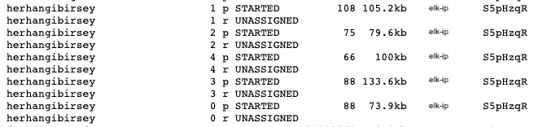

# 弹性研究/🇹🇷表演

> 原文：<https://dev.to/mrturkmen/elasticsearch-performans-2d1f>

*   [简介](#giri%c5%9f)
*   [平行块体指数](#paralel-bulk-indeksleme)
*   [删除索引刷新间隔(刷新 _ 间隔)](#indeks-yenileme-aral%c4%b1%c4%9f%c4%b1n%c4%b1-kald%c4%b1rma-refreshinterval)
*   [禁用索引副本(副本)](#indeks-kopyalar%c4%b1n%c4%b1-devre-d%c4%b1%c5%9f%c4%b1-b%c4%b1rakmak-replica)
*   [移除交换空间。(服务器上)](#swap-alan%c4%b1n%c4%b1-kald%c4%b1rmak-sunucu-%c3%bczerindeki)
*   [增加 JVM 堆空间](#jvm-heap-alan%c4%b1n%c4%b1-art%c4%b1rmak)
*   [SSD 或 RAID 0 磁盘的使用](#ssd-veya-raid-0-disk-kullan%c4%b1m%c4%b1)
*   [此工作中使用的资源](#bu-%c3%a7al%c4%b1%c5%9fma-esnas%c4%b1nda-yararlan%c4%b1lan-kaynaklar)

#### [简介](#giri%C5%9F)

需要快速处理大型弹性地震资料的工作之一。在本文中，我将尝试介绍如何改进弹性地震的性能。

在讨论如何执行这些增强功能之前，您可能会发现灵活计算体系结构中的一些组件非常有用。

*   **群集**:弹性工作者可以在一台或多台计算机上集成工作，而这些计算机称为弹性工作者节点。群集(群集)是指这些节点组成的组的结构。
*   **索引**:弹力层上的数据存储在索引中，索引只是文档的收集和保存结构。
*   **Shard** :由于弹性搜寻可以在多台机器(虚拟机器或实体机器)上进行储存，因此索引中的资料会以分散方式储存在称为群集的环境中。弹性地震会自动处理此过程的管理部分。
*   **副本**:弹性搜索通常为每个索引(默认)创建 5 个主共享和 1 个副本，即每个索引有 5 个共享，每个共享包含一个副本。以下是此状态的屏幕截图。

```
http://<elk-ip>:9200/_cat/shards 
```

Enter fullscreen mode Exit fullscreen mode

[](https://res.cloudinary.com/practicaldev/image/fetch/s--ons-UmAr--/c_limit%2Cf_auto%2Cfl_progressive%2Cq_auto%2Cw_880/https://mrturkmen06.github.io/asseimg/figure_1.png)

这些性能改进步骤是针对在单个服务器(节点)上运行的弹性堆栈执行的，因此，在分布式系统上进行改进将有所不同。(虽然有些部分看起来很相似)

**注意:这些增强功能包括运行的服务器数量(如果是分布式系统)、互联网速度(如果是分布式系统)，以及服务器上运行的操作系统**

#### 并行批量索引

在弹性搜寻上建立索引的方式有几种，其中有些是个别建立索引、批次建立索引和平行建立索引。

单个索引方法并不是数据较大时首选的方法，这是因为它要求每个记录都有一个弹性堆栈。也就是说，10，000 行将发送 10，000 个请求，而批量索引将被选择为 10，000 个记录发送一个请求，这样既可以减少请求数量，又可以缩短索引时间。更高级的一步是平行云，这种索引方法提供了多个线程发送数据的弹性堆栈。在我们的研究中使用了平行栓法。

在本研究中，弹性力学是使用 Python 模组，此模组使用平行区块，如下所示。

Python 生成器是使用并行云的首选方法之一，因为它既具有重复(迭代)结构，又使用较少的 ram。

示例生成器结构:

```
def gendata(docs_list):

     for json in docs_list:

        yield {
            "_index": "herhangibirsey",
            "_type": "_doc",
            "isim":json['isim'],
            "soyisim":json['soyisim'],
            "sehir": json['sehir'],
            "yas":json['yas'],
            "meslek":json['meslek']
        } 
```

Enter fullscreen mode Exit fullscreen mode

在此生成器结构中，我们获取名为 docs_list 的 gendata 函数，并假定该列表的内容为

```
docs_list= [{"isim": "Mehmet","soyisim": "Ataklar","sehir": "Kocaeli","yas": 45,"meslek": "Ogretmen"}] 
```

Enter fullscreen mode Exit fullscreen mode

`gendata`函数将索引功能设置为从列表中的任意纹理中检索所需的字段。并行块可以通过 Python 脚本调用，如下所示。

```
 for response in parallel_bulk(elasticDeamon, gendata(doc_records), thread_count=7):
    pass 
```

Enter fullscreen mode Exit fullscreen mode

#### [删除索引刷新间隔(刷新 _ 间隔)](#indeks-yenileme-aral%C4%B1%C4%9F%C4%B1n%C4%B1-kald%C4%B1rma-refreshinterval)

节点上的索引 e 必须在索引建立过程中移除索引更新间隔。因为每更新一次 flex earch，就在服务器上创建一个切片，这对机器资源来说都是一个不利因素，这是一个昂贵的过程，可以提高 ram 和 cpu 利用率。

您可以使用以下命令从您的“巨型工具”部分中删除。

```
PUT /<indeks-ismi>/_settings

{
    "index": {

        "refresh_interval": -1

    }

} 
```

Enter fullscreen mode Exit fullscreen mode

通过终端:T0

```
curl -X PUT "<elk-ip>:9200/<index-ismi>/_settings" -H 'Content-Type: application/json' -d' { "index" : { "refresh_interval" : -1 } } ' 
```

Enter fullscreen mode Exit fullscreen mode

如果已完成批量构建索引，则可以使用相同的命令将刷新间隔设置为“null”。这样用户就可以自行调整刷新间隔。

```
PUT /<index-ismi>/_settings

{

    "index": {

        "refresh_interval": null

    }

} 
```

Enter fullscreen mode Exit fullscreen mode

#### [禁用索引副本(副本)](#indeks-kopyalar%C4%B1n%C4%B1-devre-d%C4%B1%C5%9F%C4%B1-b%C4%B1rakmak-replica)

如果不喜欢，关闭索引副本可提高索引速度，最大的缺点是索引不受数据丢失的影响

禁用“DevTools”部分中的副本。

```
PUT /<indeks-ismi>/_settings

{

    "index" : {

        "number_of_replicas" : 0

    }

} 
```

Enter fullscreen mode Exit fullscreen mode

通过终端:T0

```
curl -X PUT "<elk-ip>:9200/<index-ismi>/_settings" -H 'Content-Type: application/json' -d' { "index" : { "number_of_replicas" : 0 } } ' 
```

Enter fullscreen mode Exit fullscreen mode

#### 移除交换空间。(伺服器上)

弹性地震最重要的一个因素是它处理 ram 的速度。Linux 伺服器上的置换空间是指在 ram 不足或 ram 不足时，将闲置(闲置)档案储存在磁碟上的空间。这会增加索引和搜寻的速度，以便让弹性地震在整个 ram 中进行处理。

您可以暂时移除交换栏位，只要在终端机上输入这个指令即可。

```
$ swapoff -a 
```

Enter fullscreen mode Exit fullscreen mode

您只要在`/etc/fstab`档案中输入`swap`的最后一个字，就可以完全移除 swap 栏位。

删除交换空间后，您可能需要对服务器上正在运行的“弹性堆栈”设置进行一些更改。

`/etc/elasticsearch/elasticsearch.yml`

`elasticsearch.yml`文件中需要添加以下参数。

```
bootstrap.mlockall: true 
```

Enter fullscreen mode Exit fullscreen mode

这样一来，弹力女超人就可以完全透过 RAM 进行处理。

#### JVM 堆空间的增加

弹性地震 JVM 堆是一个专用的区域，用于快速处理数据和处理数据。如果服务器上有足够的 RAM，此字段通常为 1 GB(默认)，增加此字段将提高索引和处理速度。

在此处，最重要的是，对于具有 64 位结构的服务器，**最大值最大值**最大值应增加到 32 GB，即使服务器上的 RAM 量大得多，也不能超过 32 GB 如需详细说明，请参阅「https://www . flex . co/guides/en/弹力 search/guide/current/heap-you . html」中的「T4」

设置 JVM 堆空间时，通常最好提供比物理 ram 大一半的堆空间，这样就不会超过 32 GB。

JVM 堆设置位于名为**JVM . options**的目录下，该目录在基于 Debian 的操作系统中的位置如下。

如果您要将堆区域设置为 16 GB(请确保物理 RAM 至少为 32 GB)，则可以按如下方式将其保存到 jvm.options 文件中。

```
/etc/elasticsearch/jvm.options

    ## bu jvm.options dosyası içerisine aşağıda verilen parametler girilir.

-Xms16GB
-Xmx16GB 
```

Enter fullscreen mode Exit fullscreen mode

请注意，在`jvm.options`档案中储存这些参数后，您必须在步骤中重新启动弹性搜寻服务。

```
sudo service elasticsearch restart 
```

Enter fullscreen mode Exit fullscreen mode

#### [固态硬碟或 RAID 0 磁碟使用率](#ssd-veya-raid-0-disk-kullan%C4%B1m%C4%B1)

固态硬盘比 HDD 更快，这将直接影响到灵活计算名声数据的速度，从而提高效率。使用 RAID 磁盘时，最好不要使用 RAID 0 以外的类型。

本节概述了提高弹性拉伸性能可能需要采取的一些步骤。

*   *平行块体索引*
*   *JVM 堆空间增大*
*   *禁用索引副本*
*   *禁用索引刷新间隔*
*   *删除服务器交换空间*
*   *使用固态硬盘或 RAID 0 磁盘*

这是第一部分，其中显示了提高弹性拉伸性能的步骤，第二部分是在弹性拉伸上创建索引时如何根据数据配置映射系统

#### 此工作中使用的资源

[https://blog . code centric . de/en/2014/05/elastic search-indexing-performance-cheat sheet>T1】](https://blog.codecentric.de/en/2014/05/elasticsearch-indexing-performance-cheatsheet)

[https://www . elastic . co/guide/en/elastic search/reference/master/tune-for-indexing-speed . html](https://www.elastic.co/guide/en/elasticsearch/reference/master/tune-for-indexing-speed.html)

[https://www . elastic . co/guide/en/elastic search/guide/current/heap-sizing . htm](https://www.elastic.co/guide/en/elasticsearch/guide/current/heap-sizing.htm)

[https://elasticsearch-py.readthedocs.io/en/master](https://elasticsearch-py.readthedocs.io/en/master)