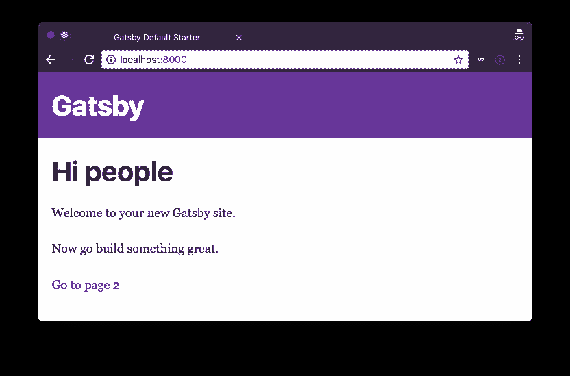

# 如何用 Gatsby 和 Cosmic JS 搭建文档 App

> 原文：<https://dev.to/jacobknaack/how-to-build-a-documentation-app-with-gatsby-and-cosmic-js-1p16>

[](https://res.cloudinary.com/practicaldev/image/fetch/s--ybbSeo_0--/c_limit%2Cf_auto%2Cfl_progressive%2Cq_auto%2Cw_880/https://thepracticaldev.s3.amazonaws.com/i/8kcmm857hqe913u73edt.png)

文档？...文档。假设你想创造一种方式来轻松地发布和阅读文档，呃…文档。在这篇文章结束时，你将能够做到这一点，所有这些都借助于 Gatsby(一个静态站点生成器)和 Cosmic JS(一个易于设置和使用的内容管理系统)的力量。喝点咖啡，找把舒服的椅子，让我们做点酷的东西。

**TL:DR**

[盖茨比文档 App 演示](https://cosmicjs.com/apps/gatsby-docs)
[查看代码库](https://github.com/cosmicjs/gatsby-docs-app)

## 1.0 -简介

**什么是[盖茨比](https://www.gatsbyjs.org/)？**

Gatsby 是一个易于使用的生成静态网站文件的框架。它与各种热点捆绑在一起，如用于构建 web 组件的 React JS，以及用于处理组件状态的 GraphQL，而无需配置 Redux 之类的东西来处理外部数据。

**那么[宇宙 JS](https://cosmicjs.com/) 呢？**

宇宙 JS 将处理我们的出版和数据存储。对于这样的应用来说，它很容易设置和实现，而且具有足够的可伸缩性来处理大型团队中更复杂的项目。我们将用它来创建和存储我们的文档内容。这将使我们能够专注于用户如何与我们的应用程序交互，并让 Cosmic JS 做所有的繁重工作。

就这些吗？

嗯，不…我们将把我们的文档从 markdown 转换成 html，因为这是网络浏览器喜欢的。为了做到这一点，我们将使用一个名为[摊牌](http://showdownjs.com/)的包，它可以处理解析和转换 markdown 与 HTML。

有什么要求吗？

哦，对了，你需要访问一个终端，一个带有[桶和文档对象](https://cosmicjs.com/getting-started)的宇宙 JS 账户，以及一个安装在你机器上的[节点 JS](https://nodejs.org/en/) 的最新版本，以便安装必要的软件使这个应用程序工作。我将使用 yarn 来运行我的构建脚本，但是如果你愿意，你也可以使用 npm。只要记住选择一个(npm 或 yarn)并坚持下去，因为在部署的时候事情会变得有点棘手。

我们来建吧！！

## 1.1 -设置我们的开发环境

要开始，我们需要安装 Gatsby 并安装我们的依赖项。很简单。Gatsby 使用方便的命令行界面(CLI)来构建我们的初始项目文件。首先，我们希望通过使用 npm 全局安装 CLI 来安装它:

`$ npm install -g gatsby-cli`

这使我们能够访问`gatsby`命令，并允许我们初始化我们的项目。运行以下脚本，创建一个填充了项目模板的新目录:

`$ gatsby new gatsby-docs`

稍等片刻，让脚本完成，您会注意到创建了一个名为`gatsby-docs`的新目录。让我们通过改变目录来看看里面有什么:

`$ cd gatsby-docs`

您应该会看到类似如下的目录结构:

```
.
├── node_modules
├── src
├── .gitignore
├── gatsby-browser.js
├── gatsby-config.js
├── gatsby-node.js
├── gatsby-ssr.js
├── LICENSE
├── package-lock.json
├── package.json
└── README.md 
```

如果您习惯于创建节点应用程序，您会对其中的大部分内容感到熟悉，但有些内容会有点陌生。通过执行启动脚本，您应该能够启动并运行开发服务器:

`$ yarn start`

一秒钟后，您应该会看到一个成功提示，让您知道一切都已正确编译，您的应用程序是活的。

现在，您可以打开指向`localhost:8000`的浏览器，查看编译后的输出。它应该看起来很像这样:
[](https://camo.githubusercontent.com/ce605e30e35492dfafc3b651c1430596574b411b/68747470733a2f2f64726f7073696e6e2e73332e616d617a6f6e6177732e636f6d2f53637265656e25323053686f74253230323031372d30382d3236253230617425323031322e35372e3430253230504d2e706e67)

恭喜你。你已经建立了一个工作的盖茨比网站。但是，在我们深入了解幕后发生的事情之前，让我们先安装为我们的应用提供动力的其余依赖项:

`$ yarn add cosmicjs showdown highlight.js dotenv node-sass gatsby-plugin-sass gatsby-source-graphql`

惊叹声...这是很多新安装的软件包，但我发誓每一个都非常有用。

*   `cosmicjs`将用于向我们的应用程序添加新内容。

*   是我提到的处理 markdown 和 html 转换的文本解析器。

*   将在转换后的降价文本中处理我们的语法高亮显示。

*   `dotenv`是一个环境变量包，它将确保我们的敏感令牌和/或运行时环境是从一个`.env`文件配置的

*   `node-sass`和`gatsby-plugin-sass`包将允许使用`.scss`文件来设计我们的组件。

*   将允许我们在外部数据上利用 GraphQL 查询(即使用 Cosmic JS GraphQL api)

随着所有这些业务的完成，我们可以查看我们的目录并配置我们的 Gatsby 源代码以正确运行。

## 2.0 -配置盖茨比

现在我们可以深入我们的目录，并确保 Gatsby 配置正确，可以使用可扩展和合理地支持我们的应用程序的技术。

我们要查看的第一个文件是`gatsby-config.js`。这个文件用于配置高级插件，当我们构建静态文件时，这些插件允许我们编写的任何源代码被正确捆绑。它还包含一些向用户描述我们站点的元数据，可以在我们的 React 组件中查询。

在这里，我们将把新安装的插件添加到你面前的默认配置中。首先，我们只需要将`gatsby-plugin-sass`添加到插件列表中，允许我们导入 sass 文件并利用 sass 为每个组件编写合理的样式规范。

接下来，我们将为`gatsby-source-graphql`添加一个对象到插件列表的末尾，它将配置我们的外部 GraphQL API 端点，允许我们从 Cosmic JS 获取数据。事情应该是这样的: