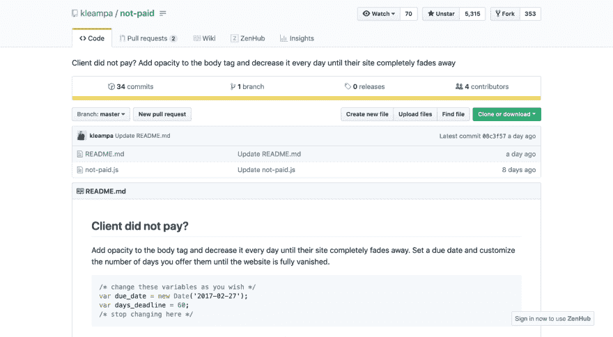
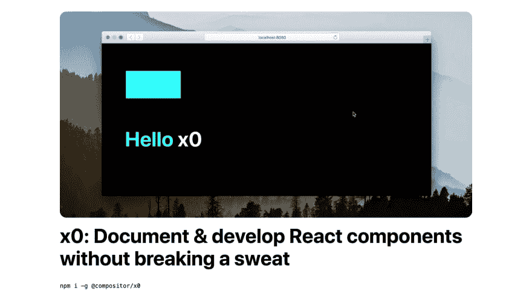
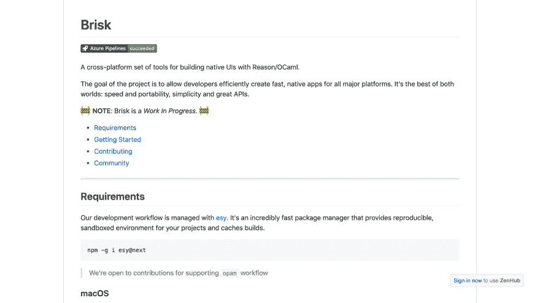
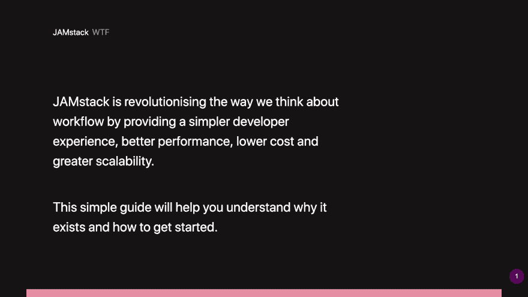
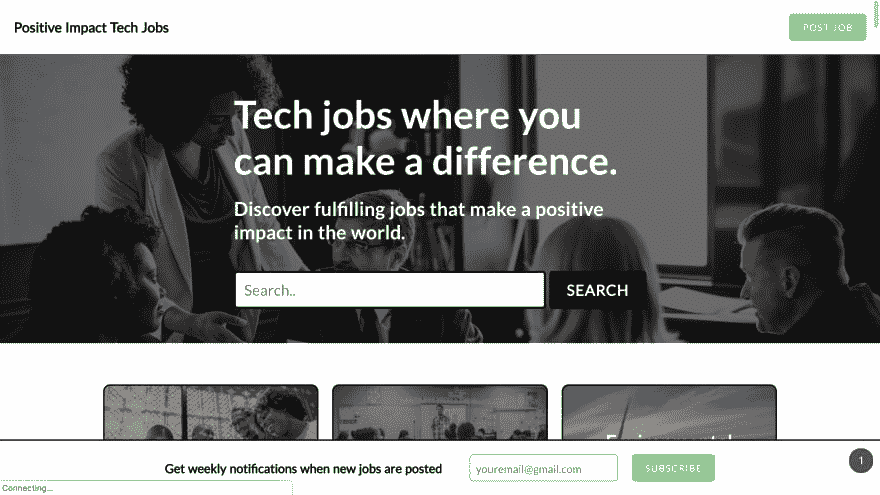
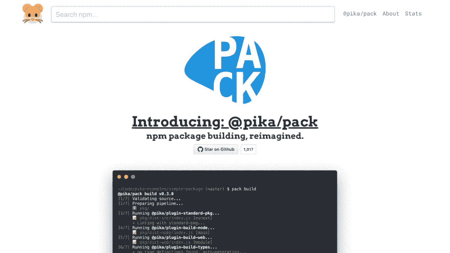
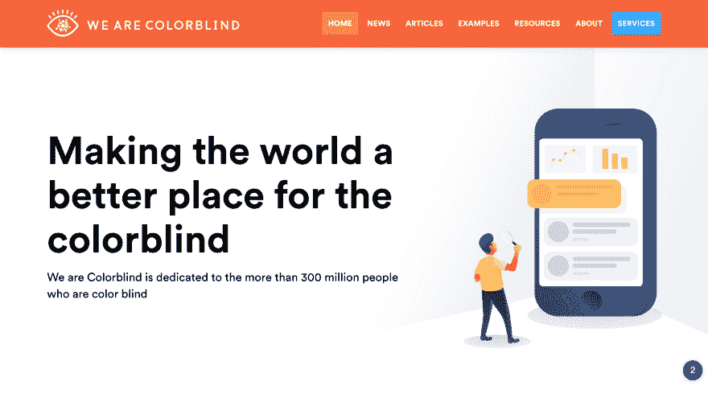

# Pop Tech TLDR 第 2 集-打击坏客户，更好的 npm 包装，有意义的技术工作，等等！

> 原文：<https://dev.to/johnpaulada/pop-tech-tldr-episode-2---combatting-bad-clients-better-npm-packing-meaningful-tech-jobs-and-more-319e>

> 最初发布于:[https://devstuffwithjpada.com/pop-tech-tldr-episode-2/](https://devstuffwithjpada.com/pop-tech-tldr-episode-2/)

* * *

## [未支付](https://github.com/kleampa/not-paid)

你的客户忘记付钱了吗？淡出网站的每一天，他们不支付，直到它完全消失！专业提示:将它与代码混合，缩小，模糊以获得更好的效果。**眨眼*

* * *

## [x0](https://compositor.io/x0/)

x0 是一个允许您为 React 组件创建文档的工具。把它当成故事书的替代品。它最有趣的特性之一是 *LiveEditor* ，允许你在一个真实的环境中摆弄组件，并且能够立即看到变化的预览。

* * *

## [轻快](https://github.com/briskml/brisk)

Brisk 允许你使用 ReasonML/OCaml 来创建本地 ui。这仍然是一项正在进行的工作，但看到它将如何结束是令人兴奋的，特别是因为它使用了理性。

* * *

## [詹斯塔克 WTF](https://jamstack.wtf/)

JAMstack 现在非常流行。这个网站将帮助你理解 WTF JAMstack 到底是什么，以及为什么开发者现在都在尝试用这个技术栈来构建他们的应用。它还教授一些最佳实践和理想的工作流程。现在去那里，成为一名精通 JAMstack 的开发人员吧！

* * *

## [正面冲击理工就业岗位](https://positiveimpacttechjobs.com/)

如果你在找工作，你会考虑申请一份对世界及其人民有积极影响的工作吗？积极影响技术工作是一个试图对世界做出积极改变的公司的技术工作机会列表。他们列出了具有社会影响、教育影响、环境影响、医疗影响等的公司。像可汗学院、约翰·霍普斯金大学和 OpenAI 这样的公司都有工作机会。如果你想为一家倡导社会公益的公司工作，这是一个很好的起点。

* * *

## [@pika/pack](https://www.pikapkg.com/blog/introducing-pika-pack/)

这个工具是我个人非常兴奋尝试的一个工具。@pika/pack 是一个 CLI 工具，它允许您简化打包和部署 npm 软件包的过程。@pika/pack 允许你创建一个你用一个库做的普通过程的管道，比如编译成 ES5，丑化等等，使用带有合理默认值的插件。一旦你设置好管道，只需运行`pack build && pack publish`就大功告成了！

* * *

## [我们是色盲](https://wearecolorblind.com/)

“我们是色盲”是一个教育人们色盲的网站，提供见解、提示和资源，帮助人们开发色盲友好的内容和软件。