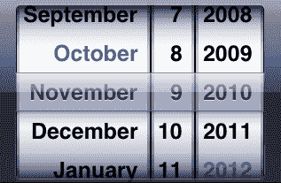
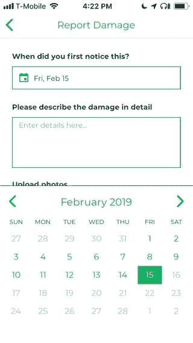

# 反应本土，一年后:我们学到了什么

> 原文：<https://dev.to/lfkwtz/react-native-one-year-later-what-wevelearned-2ja9>

想要保持最新状态？现在看看 React Native，双周刊 [React Native 简讯](https://reactnativenow.com/)

* * *

2017 年末，我们开始了从 Ionic 1/AngularJS 开始重新编写 [one 或我们的移动应用](https://itunes.apple.com/us/app/lawnstarter-for-providers/id963343083?mt=8)的雄心勃勃的任务，以反应原生。六周后，我们把它运到了应用商店。几个月后，我们又开始了这个过程，在又一个忙碌的六周之后，把我们的[其他应用](https://itunes.apple.com/us/app/lawnstarter/id968630246?mt=8)推出了。

回顾过去一年多的时间，以下是我们学到的一些要点:

## 提前计划好你的航行

如果你的应用有相当直接的导航——你可能不需要担心这一点，但我们的应用有许多流程，允许我们的客户和提供商自助解决任何可能出现的问题，以及大量访问这些流程的方式。这导致了父选项卡中嵌套堆栈的嵌套堆栈网络，所有这些堆栈都需要相互了解，以便我们可以正确导航，并确保我们已经重置了正在退出的堆栈。在很大程度上，我们对这些结果很满意——但是如果我们在规划阶段给更多的时间来规划我们的用户流和屏幕，我们当然可以减少我们必须编写的导航助手的数量。

当我们开始开发我们的第一个应用程序时， [react-navigation](https://github.com/react-navigation/react-navigation) 仍然是 v1 之前的版本，与原生产品相比，它是否会成为同类最佳解决方案还没有定论。总的来说，我们对它有一个积极的体验——从那以后，它一直在改进。

*The jumping off point for our web of navigation*

## 社会还年轻

在我们迁移到 React Native 之前，我们开始在 Vue 中创建任何新的 web 应用程序，到目前为止，我们对这种体验非常满意。因此，当我们在重写过程中陷入困境时，我们非常熟悉找到或创建自己问题的解决方案的感觉——因为在任何一个平台上进行谷歌搜索都不会像其他技术那样提供丰富的结果。考虑到这一点，我们已经做了一些有趣的工作[开源](https://github.com/lawnstarter/react-native-picker-select)，并且[将继续这样做](https://github.com/lawnstarter/react-native-hotspot)。

我们待办事项中的一个项目是创建我们自己的文本输入遮罩——因为我们在当前的产品中运气不佳。一个是缺乏更新，经常被 React 本地主要版本破坏，而另一个是缺乏我们对灵活性的需求。我们在网络上使用 [Cleave.js](https://github.com/nosir/cleave.js/) 取得了很大的成功，并计划尽我们所能模仿它建立我们自己的库——除非在我们使用它之前有更好的东西出现。

## 升级时落后一个版本

我们通常会尝试将我们的升级安排在先前主要版本的最终次要版本上(即，在 0.58.0 发布后升级到 0.57.8)。这使得我们可以从大量的错误修复和改进中受益，而不必首先处理意想不到的重大变化。

我们典型的升级工作流程非常成功，看起来是这样的:

1.  确保我们的沙盒分支与主沙盒保持同步
2.  在沙盒上，更新 React 本机文件、核心文件和任何相关的依赖项，使用指南跟踪任何更改
3.  借此机会更新所有其他依赖项
4.  在 iOS 和 Android 上快速运行一遍，看看是否有任何东西看起来不可靠(由于我们通过[应用中心](https://appcenter.ms)将我们的构建推送到[浏览器堆栈](https://www.browserstack.com/live)的部署过程，这非常容易做到)
5.  将沙盒合并到我们的主分支，并运行我们的回归清单
6.  一旦一切正常，就发布升级，不要对应用商店做任何改动(100%在 Google Play 上，分阶段在应用商店上)
7.  用[哨兵](https://sentry.io/)监控释放

## 尽量使用原生元素，但不要强制要求

当我们第一次重写我们的应用程序时，我们试图尽可能多地使用特定于平台的原生元素。我们的观点是，用户已经对他们的平台感到满意了，所以我们能呈现给他们的原生 UI 组件越多，他们就越容易与我们的应用程序交互。此外，不要低估这一点，当我们不必考虑偏离这种体验时，它确实加快了我们的开发时间。

虽然我们在某种程度上仍然会同意这些观点，但我们现在已经知道，有很多正当的理由偏离这个计划。当你可以用更好的 UI 组件替换原生的 UI 组件时，这一点尤其正确。

以 iOS 的 UIDatePicker 为例。

*Nowhere outside of iOS do you interact with a calendar like this*

十多年来，这一直是 iOS 中客观存在的可怕用户体验，而且没有任何改变的迹象。当我们第一次启动我们的应用程序时，当用户需要输入日期时，我们有一个带有 [DatePickerIOS](https://facebook.github.io/react-native/docs/datepickerios) 的模态弹出窗口。如果他们滚动到不允许的日期，他们不会知道，直到模态关闭，他们看到输入下面的验证消息。这是一次糟糕的经历。

然而在 Android 上，默认日历看起来像是一个真正的日历。我们最终意识到所有用户都应该有这样的体验，所以我们在 [react-native-calendars](https://github.com/wix/react-native-calendars) 的帮助下推出了自己的日期选择器，结果非常棒。

*Much better*

因此，我们现在在设计 UI 元素时更加灵活，因为设计更好的品牌一致性**和**用户体验的好处远远超过了不成文的规则，即所有 iOS 应用程序都必须看起来像 iOS 应用程序，反之亦然。

## 这让招聘变得很棒

我们最近能够用一些非常有才华的初级工程师将我们的团队规模扩大一倍，这在一定程度上要归功于我们对本土反应的承诺。虽然在前进的道路上有一些颠簸，但我们已经将平台推得比我们最初重写这些应用程序时预期的更远——包括动画、硬件传感器和原生模块的使用——并且仍然没有遇到没有原生移动开发者就无法解决的挑战。这使得我们能够将招聘工作重点放在前端开发人员上，我们可以快速了解 React 和其移动版之间的差异，同时也能够帮助我们构建我们的网络产品。

到目前为止，这是一次很棒的经历，我们很高兴看到 2019 年将为 React 本地社区带来什么！