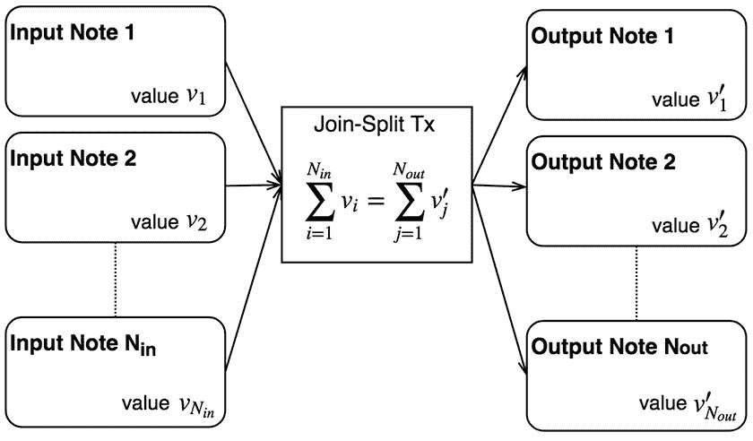
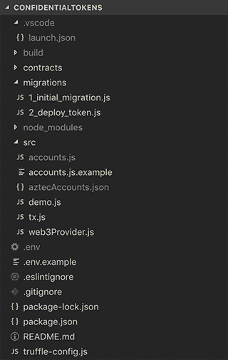
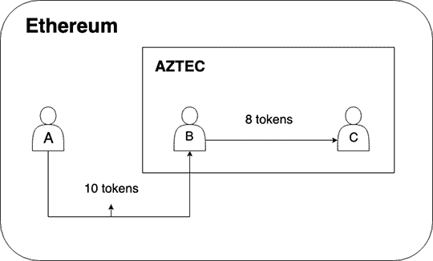

# 如何在以太坊上给自己的机密令牌编码

> 原文：<https://dev.to/paulrberg/how-to-code-your-own-confidential-token-on-ethereum-19io>

[](https://res.cloudinary.com/practicaldev/image/fetch/s--_H6Uv5YW--/c_limit%2Cf_auto%2Cfl_progressive%2Cq_auto%2Cw_880/https://paulrberg.com/post/confidential-tokens/cover.jpg)

## 上下文

以太坊不是私人的。每次您转移 ERC20 令牌或任何其他数字资产时，信息都会泄露给第三方。他们可以通过访问 Etherscan、Blockscout 或任何其他区块链探索者网站，了解你的全部财务历史。

别担心，有办法防止这种情况。首先，你可以使用多个账户，但是你必须时刻记住不要交叉链接这些账户。这将是生活管理的噩梦。如果有一种更优雅、更可编程的方式呢？

我来介绍一下 AZTEC:一个建立在以太坊之上的隐私协议。在本文中，我不会强调支持该协议的密码学，而是强调它的实际应用，比如开发机密令牌。

声明:我是 AZTEC 的全职软件工程师。

## 先决条件

我将进一步假设您对以下内容有基本的了解:

*   以太坊开发使用 [Truffle 框架](https://truffleframework.com/)
*   [零知识证明](https://ethresear.ch/t/zero-knowledge-proofs-starter-pack/4519)
*   密码学和椭圆曲线

确保你的机器上有 node.js 和 npm，并安装 Truffle:

```
$ npm install truffle --global 
```

Enter fullscreen mode Exit fullscreen mode

## 心智模式

我们先暂停一下，抓住核心技术概念。

### 协议

以太坊是一个国家，阿兹特克是 T2 森林。

在这个国家，人们相互交流，在 dApps 上做金融，搬到不同的城市(钱包)等等。我喜欢把阿兹特克想象成局限在这个国家地理范围内的一片安静的林地。人们可以去那里，在进入之前申报他们的余额，但之后的交易是保密的。

下面的股票图片代表了我(愚蠢地)试图描绘的想法消退到阿兹特克。正常环境下(以太坊)发生的事情一清二楚，但是一个人跨过拱门后的世界状态是模糊的，被森林掩盖了(阿兹特克)。

[](https://res.cloudinary.com/practicaldev/image/fetch/s--bAEVcxwu--/c_limit%2Cf_auto%2Cfl_progressive%2Cq_auto%2Cw_880/https://paulrberg.com/post/confidential-tokens/forest.jpg)

### 备注

阿兹特克笔记是一等公民和协议的核心原语。当你在一无所知的情况下进行交易时，智能合约不会存储任何余额，而是使用椭圆曲线点，这对任何没有私钥的人来说都只是计算噪音。

区分 ERC20 和阿兹特克的机密令牌标准 [ERC1724](https://github.com/ethereum/EIPs/issues/1724) 非常重要。前者存储以太坊地址和未加密余额之间的[映射](https://ethereum.stackexchange.com/questions/58203/storing-millions-of-values-in-mapping-variable/58204#58204)。后者确实加密了余额。我喜欢将阿兹特克纸币与**比特币 UTXOs** 进行比较，因为在阿兹特克上消费纸币的过程非常相似。

[](https://res.cloudinary.com/practicaldev/image/fetch/s--VuNC9TTL--/c_limit%2Cf_auto%2Cfl_progressive%2Cq_auto%2Cw_880/https://paulrberg.com/post/confidential-tokens/note-validation.jpg)

按可见性分类的便笺内容:

*   公共
    *   物主
    *   加密值
*   私人的
    *   支出键
    *   价值

我们正在优化速度，所以我们在这里停止了花哨的加密。如果您渴望了解更多，请查看我们的[白皮书](https://github.com/AztecProtocol/AZTEC/blob/master/AZTEC.pdf)。

在继续之前，请注意 AZTEC 需要一个可信的设置。本教程使用由我们团队内部生成的可信设置。我们将在不久的将来发布更多关于生产可信安装生成的信息。使用风险自担。

## 开始吧

克隆这个 [repo](https://github.com/PaulRBerg/confidential-tokens) 并安装节点模块:

```
$ git clone git@github.com:PaulRBerg/confidential-tokens.git
$ cd confidential-tokens
$ npm install 
```

Enter fullscreen mode Exit fullscreen mode

如果您得到了大量与“scrypt”和“keccak”相关的详细日志，这完全没问题，因为我们需要`aztec.js`，它需要`web3.js`，后者随后有许多加密依赖项。

在实际运行演示之前，有几个重要步骤要做:

1.  在`src`文件夹中创建一个`accounts.js`文件。只设置**两个**账户。有一个例子文件叫做`accounts.js.example`。
2.  在项目的根目录下创建一个`.env`文件，并用下面的属性填充它。同样，有一个名为`.env.example`的示例文件。
3.  将机密令牌合同部署到 Rinkeby。你可以用松露来做这个:

```
$ truffle migrate --network rinkeby 
```

Enter fullscreen mode Exit fullscreen mode

环境变量:

1.  [CONFIDENTIAL _ TOKEN _ ADDRESS](https://truffleframework.com/docs/truffle/reference/truffle-commands#networks):注意，实际的契约名称是 ZKERC20，在 truffle 部署契约后得到这个
2.  [助记符](https://support.mycrypto.com/private-keys-passwords/how-do-mnemonic-phrases-work.html)
3.  [INFURA_API_KEY](https://infura.io)

现在，检查您的项目如下所示:

[](https://res.cloudinary.com/practicaldev/image/fetch/s--KsR4Vjbq--/c_limit%2Cf_auto%2Cfl_progressive%2Cq_auto%2Cw_880/https://paulrberg.com/post/confidential-tokens/project-files.png)

运行演示:

```
$ npm run demo 
```

Enter fullscreen mode Exit fullscreen mode

这将需要一段时间，因为事务被发送到 Rinkeby。几分钟后，您应该在控制台中打印出收据列表。万岁，你刚刚在以太坊上完成了你的第一次机密令牌转移！

现在，让我们浏览一下`src/demo.js`中的源代码。

### 创建笔记

```
 aztecAccounts = [...new Array(2)].map(() => aztec.secp256k1.generateAccount());
  notes = [
    aztec.note.create(aztecAccounts[0].publicKey, 5),
    aztec.note.create(aztecAccounts[0].publicKey, 5),
    aztec.note.create(aztecAccounts[1].publicKey, 8),
    aztec.note.create(aztecAccounts[0].publicKey, 2)
  ]; 
```

Enter fullscreen mode Exit fullscreen mode

步骤:

1.  生成一堆随机账户。我们必须使用“secp256k1 ”,因为 AZTEC 需要帐户的公钥，而不仅仅是他们的地址。
2.  创建 4 张纸币，前两张属于第一个账户，后两张将初始总金额(10)中的 8 个代币给第二个账户。

为了更好地理解第 2 步，回想一下阿兹特克纸币在本质上与比特币 UTXOs 类似。当一个人转账时，剩余的金额必须转换成一套新的纸币——这与以太坊规范交易相反，以太坊规范交易使用余额模型。

另外，我将以太坊中使用的账户(在`src/accounts.js`中的账户)与随机生成的 AZTEC 账户(演示脚本生成一个名为`aztecAccounts.json`的文件)分开。

### 创建 Dem 样张

```
 proofs[0] = aztec.proof.joinSplit.encodeJoinSplitTransaction({
    inputNotes: [],
    outputNotes: notes.slice(0, 2),
    senderAddress: accounts[0].address,
    inputNoteOwners: [],
    publicOwner: accounts[0].address,
    kPublic: -10,
    aztecAddress: joinSplit.options.address,
  }); 
```

Enter fullscreen mode Exit fullscreen mode

上面的证明对象:

1.  证明`publicOwner`很乐意将 10 个**公共** ERC20 代币转换成阿兹特克形式
2.  使第一个随机生成的阿兹特克账户成为新的所有者(回想一下，前两张纸币各值 5 个代币，都属于该阿兹特克账户)

```
 proofs[1] = aztec.proof.joinSplit.encodeJoinSplitTransaction({
    inputNotes: notes.slice(0, 2),
    outputNotes: notes.slice(2, 4),
    senderAddress: accounts[0].address,
    inputNoteOwners: [aztecAccounts[0], aztecAccounts[0]],
    publicOwner: accounts[0].address,
    kPublic: 0,
    aztecAddress: joinSplit.options.address,
  }); 
```

Enter fullscreen mode Exit fullscreen mode

第二个证明:

1.  以完全零知识的形式向第二个阿兹特克账户转移 8 个代币
2.  刻录前两个输入注释，这样第一个 AZTEC 帐户就不能在将来重复使用它们

```
 proofOutputs = proofs.map(({ expectedOutput }) => {
    return aztec.abiEncoder.outputCoder.getProofOutput(expectedOutput, 0);
  });
  proofHashes = proofOutputs.map(proofOutput => {
    return aztec.abiEncoder.outputCoder.hashProofOutput(proofOutput);
  }); 
```

Enter fullscreen mode Exit fullscreen mode

我们需要上述内容与一个名为“NoteRegistry”的契约进行交互，该契约对于每个机密令牌契约都是唯一的。您可以将`proofHashes`视为先前生成的证明的唯一标识符的数组。

### 批准

```
 for (let i = 0; i < accounts.length; ++i) {
    const data = erc20Mintable
      .methods
      .approve(noteRegistry.options.address, scalingFactor.mul(tokensTransferred).toString(10))
      .encodeABI();
    await sendTx({
      from: accounts[i].address,
      to: aztecAddresses.erc20Mintable,
      data: data,
      privateKey: accounts[i].privateKey,
    });
  } 
```

Enter fullscreen mode Exit fullscreen mode

我们铸造了一堆令牌，并授予 NoteRegistry 使用 ERC20 合同的权限。

```
 const delta = 10;
  let data = noteRegistry
    .methods
    .publicApprove(proofHashes[0], delta)
    .encodeABI();
  await sendTx({
    from: accounts[0].address,
    to: noteRegistry.options.address,
    data: data,
    privateKey: accounts[0].privateKey,
  }); 
```

Enter fullscreen mode Exit fullscreen mode

就像 ERC20 一样，NoteRegistry 需要被授予使用 AZTEC 证明的权限。我们承认这是一个积极研究的领域，我们正在研究使 UX 的发展更加顺利的方法。

### 转移

```
 let data = confidentialToken
    .methods
    .confidentialTransfer(proofs[0].proofData)
    .encodeABI();
  await sendTx({
    from: accounts[0].address,
    to: confidentialToken.options.address,
    data: data,
    privateKey: accounts[0].privateKey,
  });

  data = confidentialToken
    .methods
    .confidentialTransfer(proofs[1].proofData)
    .encodeABI();
  await sendTx({
    from: accounts[0].address,
    to: confidentialToken.options.address,
    data: data,
    privateKey: accounts[0].privateKey,
  }); 
```

Enter fullscreen mode Exit fullscreen mode

最后，有趣的部分是:调用机密令牌合同进行转账。请注意，第一笔交易仅转换 ERC20 令牌，因此第三方可以了解转移了多少令牌。然而，第二次交易是完全保密的。

这是我们刚刚做的思维导图:

[](https://res.cloudinary.com/practicaldev/image/fetch/s--lm_qLYF4--/c_limit%2Cf_auto%2Cfl_progressive%2Cq_auto%2Cw_880/https://paulrberg.com/post/confidential-tokens/mindmap.png)

## 告诫

*   本教程使用由我们团队内部生成的可信设置。我们将在不久的将来发布更多关于生产可信安装生成的信息。使用风险自担。
*   在秘密转移被触发之前，需要大量的预先批准。如前所述，这是我们期待改进的地方。
*   这篇文章发表后，AZTEC 代码库可能会经历多次重大的变化。不过不用担心，本教程使用 npm 包的精确版本来防止中断。
*   阿兹特克使用的是 [Solidity 0.4.24](https://solidity.readthedocs.io/en/v0.4.24/) ，所以你必须使用 OpenZeppelin 的兼容版本，也就是 [2.0.0](https://github.com/OpenZeppelin/openzeppelin-solidity/releases/tag/v2.0.0)
*   当阿兹特克合同只有一个用户时，保密性就泄露了。第三方可以推断由于 ERC20 的公共性质存放了多少钱——他们可以将其与合同持有的总金额进行比较。加入的用户越多，保密性就越强。

## 套餐

以下是我们用过的阿兹特克美食的详尽列表:

1.  [aztec.js](https://github.com/AztecProtocol/AZTEC/tree/master/packages/aztec.js)
2.  [@阿兹特克/合同地址](https://github.com/AztecProtocol/AZTEC/tree/master/packages/contract-addresses)
3.  [@阿兹特克/契约-神器](https://github.com/AztecProtocol/AZTEC/tree/master/packages/contract-artifacts)
4.  [@aztec/dev-utils](https://github.com/AztecProtocol/AZTEC/tree/master/packages/dev-utils)
5.  [@aztec/protocol](https://github.com/AztecProtocol/AZTEC/tree/master/packages/protocol)

所有这些的源代码都可以在我们的 [monorepo](https://github.com/AztecProtocol/AZTEC) 中找到。如果您有任何问题，请随时联系 hello@aztecprotocol.com 的[推特](https://twitter.com/aztecprotocol)或发送电子邮件至！

## 总结

我希望你喜欢这篇教程，并且和我一样对保密交易感到兴奋。看看这些交易，它们使用几个 AZTEC 证明将 10 个 ERC20 代币转换成完全的零知识形式:

*   [https://rinkeby . ethers can . io/tx/0x 85 ab 17 ab 8290 bad0d 91501083 c 571 a 63 e 8715 a0d 425828 df 4c 0 b 36 accb 11d 077](https://rinkeby.etherscan.io/tx/0x85ab17ab8290bad0d91501083c571a63e8715a0d425828df4c0b36accb11d077)
*   [https://rinkeby . ethers can . io/tx/0x F5 dbaf 357 e 09 abf 2d 4151974 bdfae 5 e 20317043 b 155 ff 653 b 03 FBD 137 c 940 a 84](https://rinkeby.etherscan.io/tx/0xf5dbaf357e09abf2d4151974bdfae5e20317043b155ff653b03fbd137c940a84)

非常感谢扎克·威廉森、阿诺·申克和汤姆·韦特的投入和反馈。

如果你想聊天，可以在推特或者 T2 上找到我。