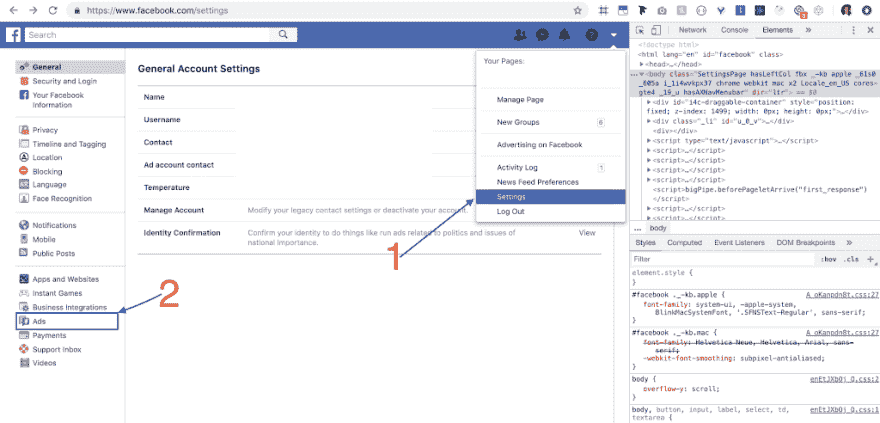
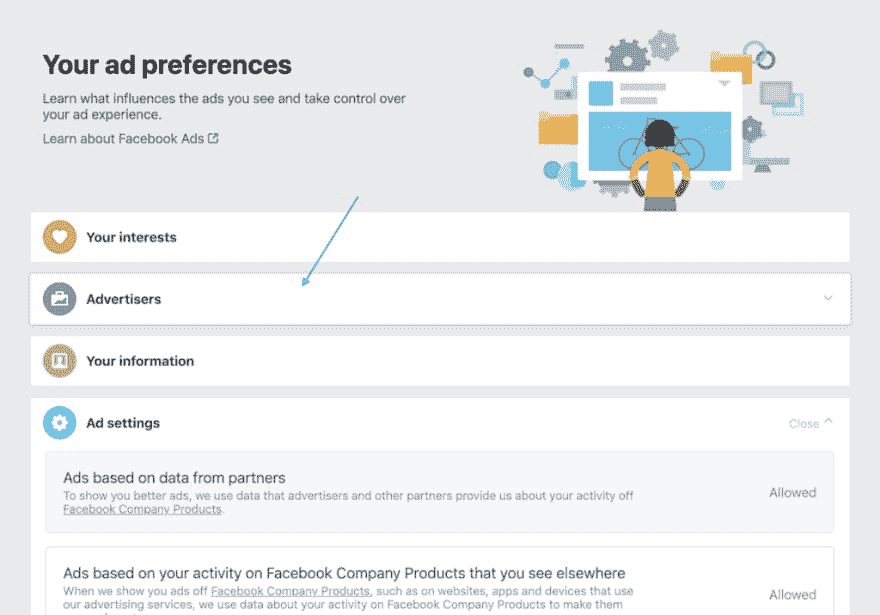
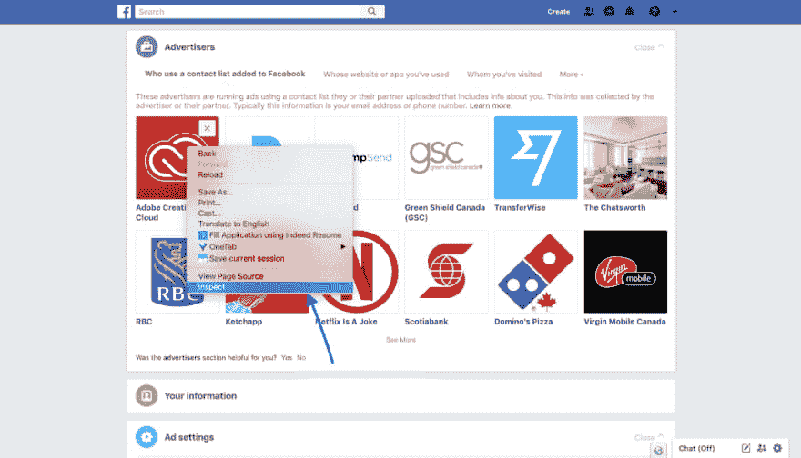
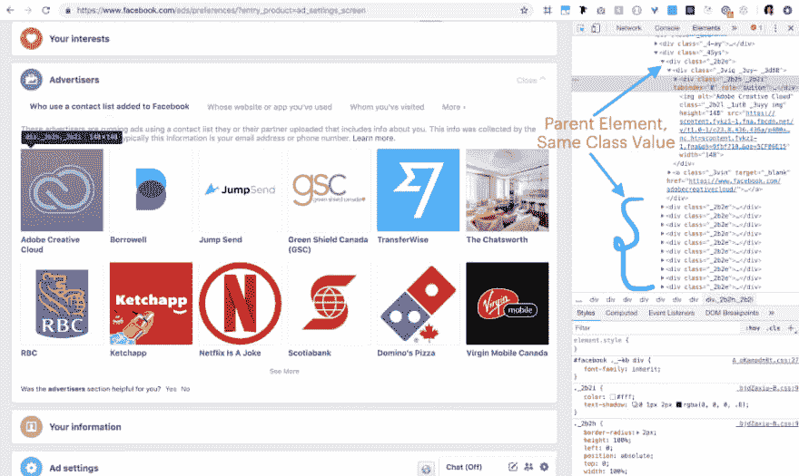
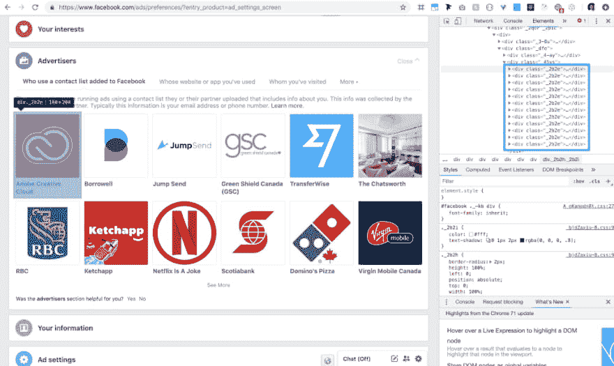
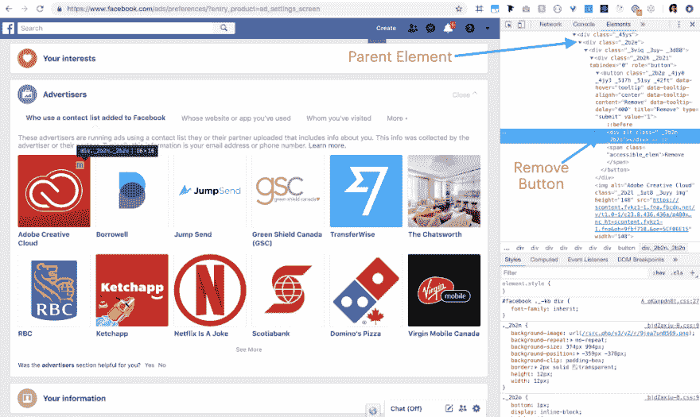
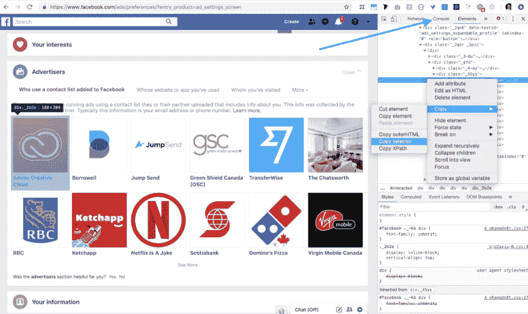
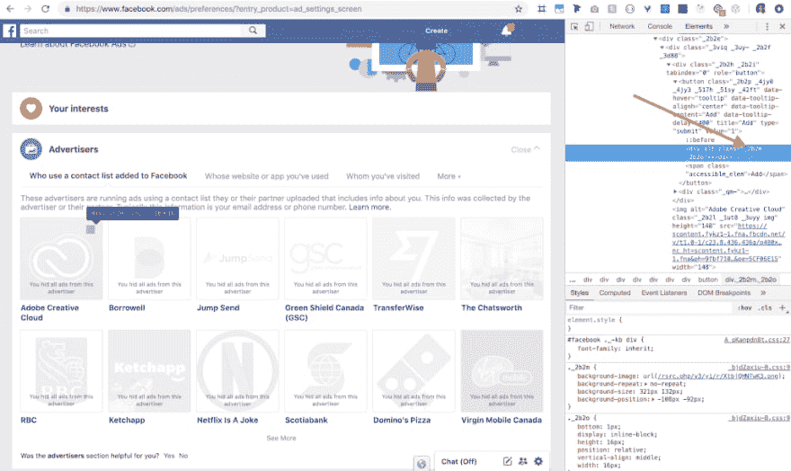

# 在 2 分钟内删除 facebook 上的所有广告商和定向广告

> 原文：<https://dev.to/parthchokshi/remove-all-advertisers-and-targeted-ads-from-facebook-in-2-minutes-4am6>

[](https://res.cloudinary.com/practicaldev/image/fetch/s--rV-Kna9t--/c_limit%2Cf_auto%2Cfl_progressive%2Cq_auto%2Cw_880/https://cdn-images-1.medium.com/max/1024/0%2AGwUqD0Na69pz4_Jk) 

<figcaption>照片由[思想目录](https://unsplash.com/@thoughtcatalog?utm_source=medium&utm_medium=referral)上 [Unsplash](https://unsplash.com?utm_source=medium&utm_medium=referral)</figcaption>

用户–嘿，脸书，你是做什么工作的？

**脸书**——我们*根据人们的喜好、他们在个人资料中与我们分享的信息、他们访问的网站——网站给我们钱让我们全天候关注用户，等等，来管理*人们的新闻。

**用户**–我该如何停止？我可以删除所有定向广告和广告商吗？

脸书:是的，现在你可以了。只需将所有广告客户从您的个人资料中一一删除即可— *。*

用户——但是我有几千个。

脸书我听不到你说话。

是的，有些事情被故意弄得很难来阻止你去做。你不能只点击一个按钮就一劳永逸地删除所有的广告客户。但是我们可以通过运行一行代码来实现。

以下步骤适用于两个部分:

1) [使用添加到脸书](https://www.facebook.com/ads/preferences/?entry_product=ad_settings_screen#)的联系人列表。
T5】2)[你用过谁的网站或 app](https://www.facebook.com/ads/preferences/?entry_product=ad_settings_screen#)

以下是如何做到这一点:

第 1 步:转到您个人资料中的**广告**部分:

[](https://res.cloudinary.com/practicaldev/image/fetch/s--mpvnZvV4--/c_limit%2Cf_auto%2Cfl_progressive%2Cq_auto%2Cw_880/https://cdn-images-1.medium.com/max/1024/1%2APk6iJnp9jUMzuP5XyRZ90Q.png)

第二步:**点击广告主标签上的**

[](https://res.cloudinary.com/practicaldev/image/fetch/s--A_lv64fS--/c_limit%2Cf_auto%2Cfl_progressive%2Cq_auto%2Cw_880/https://cdn-images-1.medium.com/max/1024/1%2ALDu8TjiIqHqZil1jrxd-mA.png)

第三步:**右键点击第一个广告客户的**，点击 inspect element。

[](https://res.cloudinary.com/practicaldev/image/fetch/s--HCsZEUav--/c_limit%2Cf_auto%2Cfl_progressive%2Cq_auto%2Cw_880/https://cdn-images-1.medium.com/max/1024/1%2AE12f242qo4KK7et7PNMK7w.png)

如果你想删除所有的广告客户，你必须把他们带到浏览器视图中。为此，继续点击*查看更多*，直到所有的广告商都已加载，然后您可以继续以下步骤。万一你只是想试一试。你什么都不用做。

如果你像我一样懒惰，甚至不想不停地点击"*查看更多"*一百次，这里也有代码。

这将调用点击*查看更多*50 次。如果你想触发点击超过 50 次，用更大的数字代替 50。

```
[...new Array(50)].forEach(() => document.querySelector('#interacted > div > div._2qor._2pic > div:nth-child(1) > div._dfo > div._45yq._5946 > div > div').click()); 
```

步骤 4:单击 inspect 将在浏览器的底部或侧面打开一个部分。

现在前往菜单中的**控制台**部分。你会看到一个大的停车标志。忽略它(相信我😃).只需执行以下代码:

```
document.querySelectorAll(
    '#interacted > div > div._2qor._2pic > div:nth-child(1) > div._dfo > div._45ys > div._2b2e > div._3viq > div._2b2h > button > div._2b2n'
  )
  .forEach(advSection => advSection.click()) 
```

这将删除所有广告客户。这可能会使您的屏幕冻结一段时间。

下面是再次添加它们的代码:

```
document.querySelectorAll(
    '#interacted > div > div._2qor._2pic > div:nth-child(1) > div._dfo > div._45ys > div._2b2e > div._3viq > div._2b2h > button > div._2b2m'
  )
  .forEach(advSection => advSection.click()) 
```

> 上面的代码应该可以工作。如果你想知道我们是如何形成这些代码的，以防上面的内容对你不起作用。继续跟踪，了解形成代码的步骤。

如果上面的代码不工作，那么可能是因为类名，看起来对你来说可能是不同的。因此，您需要编写特定于您的机器的代码。请注意，整个广告客户部分遵循*相同的模式*命名(`<div class="_2b2e">`)每个部分。我将它标记为*父元素*。

[](https://res.cloudinary.com/practicaldev/image/fetch/s--cuY83IWB--/c_limit%2Cf_auto%2Cfl_progressive%2Cq_auto%2Cw_880/https://cdn-images-1.medium.com/max/1024/1%2Am-WtRS_TcexqfajHYjR66w.png)

切换父元素部分以隐藏代码，您应该会看到类似下面的内容。正如你所看到的，所有的个人广告部分都有相同的代码，只有数据是不同的。

[](https://res.cloudinary.com/practicaldev/image/fetch/s--O7UQnOGy--/c_limit%2Cf_auto%2Cfl_progressive%2Cq_auto%2Cw_880/https://cdn-images-1.medium.com/max/1024/1%2AtV3gxw1Rrfs9cJYrsmwxhQ.png)

**注:**你可能和我有不同的类值(我的情况是 _2b2e)大概。但是不要担心，无论你有什么样的价值观，都要遵循这些步骤。直到所有的部分都有相同的类值，这都是好的。

现在，主要部分。我们需要触发点击删除按钮，只有当我们将鼠标悬停在每个广告客户部分时，该按钮才会出现。让我们在代码中找到它。您可以单击第一个父元素并一直打开代码，直到找到那个 remove 按钮。

[](https://res.cloudinary.com/practicaldev/image/fetch/s--HE7jqidy--/c_limit%2Cf_auto%2Cfl_progressive%2Cq_auto%2Cw_880/https://cdn-images-1.medium.com/max/1024/1%2A2Kb_vI-Old2_7lIOPV2l0Q.png)

现在让我们开始编码吧。右键单击第一个**父元素**并转到**复制**，然后转到**复制选择器。**点击**控制台**标签后，您可能会看到一个带有警告的大停止标志。忽略它。(相信我！).现在如果你粘贴代码，它看起来会像这样。以**点(.对你来说可能会不一样。**

```
#interacted > div > div._2qor._2pic > div:nth-child(1) > div._dfo > div._45ys > div:nth-child(1) 
```

[](https://res.cloudinary.com/practicaldev/image/fetch/s--sPjGCSac--/c_limit%2Cf_auto%2Cfl_progressive%2Cq_auto%2Cw_880/https://cdn-images-1.medium.com/max/1024/1%2A_iYHhZAfoi2_j8whF7QRrQ.png)

用“**父元素**”的类值替换代码的最后一部分—“***:第 n 个子元素(1)*** ”。我的情况是 ***_2b2e。*** 所以我会用 ***来代替。_2b2e '。*** 别忘了加一个 ***圆点(。)*前**后。它看起来会像这样:

```
#interacted > div > div._2qor._2pic > div:nth-child(1) > div._dfo > div._45ys > div._2b2e 
```

这给了我们到达父元素的代码，但是我们需要到达删除按钮并点击它。为此，我们需要深入每一层，获取所有元素的类值，以形成要执行的代码。所有目标值都标有红色箭头。

[](https://res.cloudinary.com/practicaldev/image/fetch/s--2upG2Und--/c_limit%2Cf_auto%2Cfl_progressive%2Cq_auto%2Cw_880/https://cdn-images-1.medium.com/max/1024/1%2AHAHtjD4mSSrwg_Ulnw7vOw.png)

让我们形成代码。如果您有不同的类名，相应地编码。在父元素(div。_2b2e)，继续添加尖括号和带有 **'div '的类值**前置于其上。并将该值放入 document.querySelectorAll()中，并添加一个 for 循环来触发单击全部。大概是这样的:

```
document.querySelectorAll(
    '#interacted > div > div._2qor._2pic > div:nth-child(1) > div._dfo > div._45ys > div._2b2e > div._3viq > div._2b2h > button > div._2b2n'
).forEach(advSection => advSection.click()); 
```

就是这样。它应该删除所有的广告客户。

等等，如果我想再把它们加回去呢。再次找到“删除”按钮。

[](https://res.cloudinary.com/practicaldev/image/fetch/s--2OiAzXWz--/c_limit%2Cf_auto%2Cfl_progressive%2Cq_auto%2Cw_880/https://cdn-images-1.medium.com/max/1024/1%2AQsSegMBQftO9bzxXtL5Lyw.png)

可以看到值 ***_2b2n*** 被替换为 ***_2b2m。*** 只需替换上面代码中的类，再次执行即可。

```
document.querySelectorAll(
'#interacted > div > div._2qor._2pic > div:nth-child(1) > div._dfo > div._45ys > div._2b2e > div._3viq > div._2b2h > button > div._2b2m'
).forEach(advSection => advSection.click()); 
```

这应该会把广告商拉回来。

此外，您可以进入广告设置，并在所有部分选择“不允许”，以进一步停止监管和定向广告。

我很好奇想知道你们有没有不同的班名。让我在评论区知道他们是否是，如果你正面临任何问题。*玩得开心！*

看看我的另一个博客，不像所有的 facebook 页面。

[不像 facebook 上的所有页面在 2 分钟内完成](https://dev.to/parthchokshi/unlike-all-pages-on-facebook-in-2-minutes-3ao1)