# 像老板一样跨浏览器测试您的模板 Web 组件

> 原文：<https://dev.to/vogloblinsky/cross-browser-testing-your-stencil-web-component-like-a-boss-2n4c>

 

<figcaption>照片由[克里斯蒂安·弗雷南](https://unsplash.com/@christianfregnan?utm_source=medium&utm_medium=referral)在 [Unsplash](https://unsplash.com?utm_source=medium&utm_medium=referral)</figcaption>

上拍摄

Stencil 是一款非常棒的软件。对于不熟悉的人来说，它是一个“Web 组件的编译器”。

默认情况下，Stencil 附带了测试 Web 组件的工具: [Jest](https://jestjs.io/) 用于测试框架，而[puppet er](https://pptr.dev/)用于“端到端”(e2e)测试。

木偶师是驱动 Chrome 无头实例的强大解决方案，但它只适用于 Chrome。

如果您想在更多的浏览器中支持或测试您的 Web 组件，您有两种策略:

*   使用 W3C WebDriver API 驱动浏览器的解决方案: [WebdriverIO](https://webdriver.io) 、 [Nightwatch.js](http://nightwatchjs.org/) 是两个很好的解决方案。主要的缺点是用这些解决方案查询影子 DOM 有点棘手，因为 WebDriver APIs 中对影子 DOM 的不良支持。
*   使用在浏览器中运行测试的解决方案:Polymer 团队的 [Web Component Tester](https://github.com/Polymer/tools/tree/master/packages/web-component-tester) 或 [@open-wc/testing](https://open-wc.org/testing/) 是两个很好的解决方案。

我对支持 Web 组件的“所有浏览器”测试了第一种策略，但没有成功。IE11 是故事中的坏人…

这是我将在这篇博文中详细解释的第二种方法。

[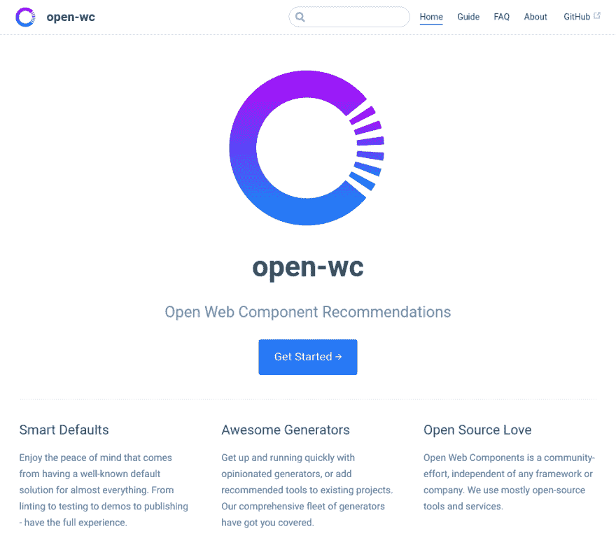](https://res.cloudinary.com/practicaldev/image/fetch/s--ZB964ZTj--/c_limit%2Cf_auto%2Cfl_progressive%2Cq_auto%2Cw_880/https://cdn-images-1.medium.com/max/1024/1%2Aia288m2UEvaWMsSf4ZV5pQ.png)

Open-wc 是许多开发者用例的建议和工具的组合:开发、林挺、测试、构建、演示、发布。一些样板文件非常固执己见，但是对于我的测试用例来说，它就是有效的！看看[他们的哲学](https://open-wc.org/about/#our-philosophy)。

在本教程中，我将详细解释模板 CLI 的“组件”样板的设置:

### **第一步:生成项目**

[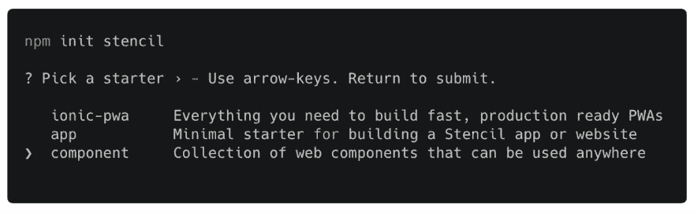](https://res.cloudinary.com/practicaldev/image/fetch/s--kU8cZo7j--/c_limit%2Cf_auto%2Cfl_progressive%2Cq_auto%2Cw_880/https://cdn-images-1.medium.com/max/1024/1%2ARYC4c5olX6QbR5ObF-XfRA.png)

你应该知道这些文件夹和文件的结构:

[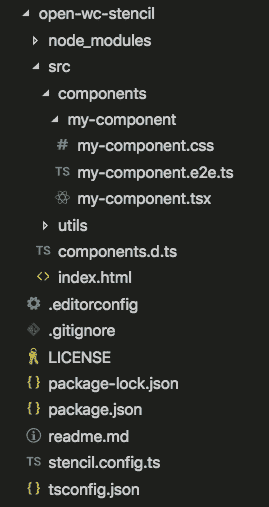](https://res.cloudinary.com/practicaldev/image/fetch/s--soCoFoRt--/c_limit%2Cf_auto%2Cfl_progressive%2Cq_auto%2Cw_880/https://cdn-images-1.medium.com/max/269/1%2AVOBSu_-ql2W2t2_ZwWFzkw.png)

### 第二步:安装[开口 wc](https://open-wc.org/) 测试工具

安装好 Yeoman 和 [Open-wc](https://open-wc.org/) 生成器后，你可以在你的模板项目中运行它:

[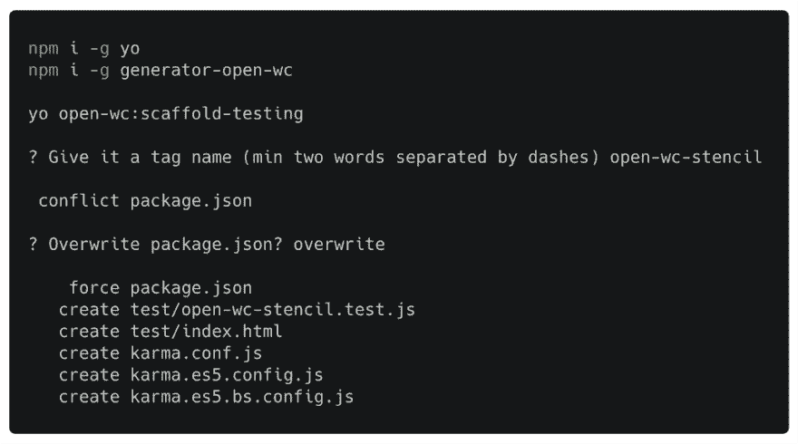](https://res.cloudinary.com/practicaldev/image/fetch/s--WL0_PPfs--/c_limit%2Cf_auto%2Cfl_progressive%2Cq_auto%2Cw_880/https://cdn-images-1.medium.com/max/1024/1%2A4esGCda5rzo_Ltr0mpq3MQ.png)

### **第三步:编辑测试文件**

生成的测试文件必须更新才能与您的模具 web 组件一起使用。

[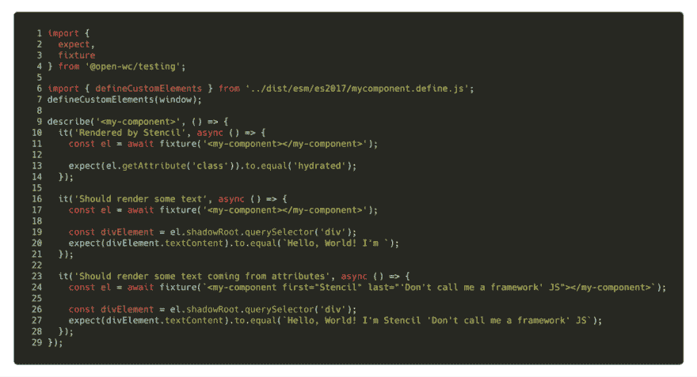](https://res.cloudinary.com/practicaldev/image/fetch/s--kc4atdaa--/c_limit%2Cf_auto%2Cfl_progressive%2Cq_auto%2Cw_880/https://cdn-images-1.medium.com/max/1024/1%2ALi1JZJOySjdJR1Cc5Mh5lw.png)

1.  我们导入模板导出的第 6 行的 **defineCustomElements** ，用第 7 行的窗口上下文调用它，在[**CustomElementsRegistry**](https://developer.mozilla.org/en-US/docs/Web/API/CustomElementRegistry)里面注册组件。
2.  我们可以开始测试我们的 Web 组件了。Open-wc 配备了非常酷的助手，如**【夹具】**。它帮助您为每个测试套件生成一个独立的组件，所以如果每个测试套件都是并行运行的，您就不会从一个到另一个产生副作用。
3.  **重要提示:**在尝试使用断言查询和测试您的 Web 组件之前，它必须在 DO 中呈现，并且您必须等待一定的时间。Fixture helpers 具有使用强大的 async/await 从模板调用公共 API 的内部绑定， [**【组件就绪()**](https://stenciljs.com/docs/methods/) **。**

### 步骤 4:在本地运行您的测试

在运行了 **npm install** 来安装所有的 devDependencies，用 Stencil 构建你的 Web 组件并启动测试之后，除了代码覆盖率之外，一切都应该没问题了。

[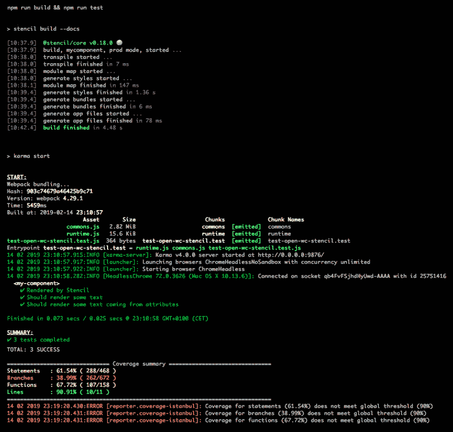](https://res.cloudinary.com/practicaldev/image/fetch/s--tmZwBQT8--/c_limit%2Cf_auto%2Cfl_progressive%2Cq_auto%2Cw_880/https://cdn-images-1.medium.com/max/960/1%2AyE_BUEUn_iTbUssf-i6irQ.png)

[open-wc/testing 的阈值默认代码覆盖率配置为 90%](https://github.com/open-wc/open-wc/blob/master/packages/testing-karma/default-settings.js#L48) 。您可以通过编辑 **karma.conf.js** 文件并配置阈值来改变这种情况。

[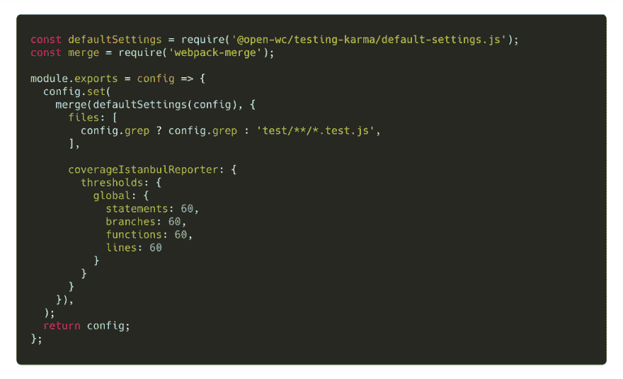](https://res.cloudinary.com/practicaldev/image/fetch/s--mhfeRclo--/c_limit%2Cf_auto%2Cfl_progressive%2Cq_auto%2Cw_880/https://cdn-images-1.medium.com/max/1024/1%2AoDILaAebV0tXJCrKvi0OpQ.png)

这对于我们的用例来说是不够的，因为 Karma 使用的代码覆盖工具[伊斯坦布尔](https://istanbul.js.org/)计算了 Stencil 编译器在 **dist** 文件夹中生成的所有文件的覆盖率。

[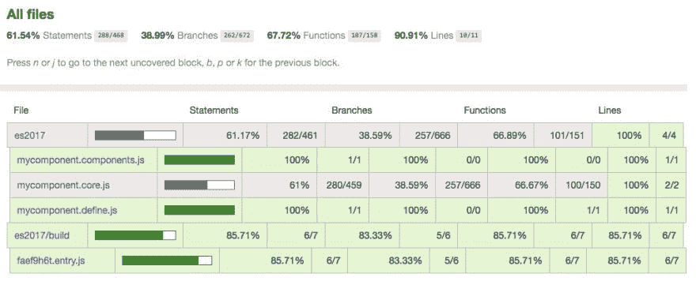](https://res.cloudinary.com/practicaldev/image/fetch/s--eI8gB-Mm--/c_limit%2Cf_auto%2Cfl_progressive%2Cq_auto%2Cw_880/https://cdn-images-1.medium.com/max/1020/1%2AvR061nKlZAFOedo0zbg1WA.jpeg)

**es2017** 文件夹包含用于引导我们的 Web 组件的文件，以及模板运行时。从代码覆盖中排除这些文件需要在 **karma.conf.js** 中添加以下正则表达式

[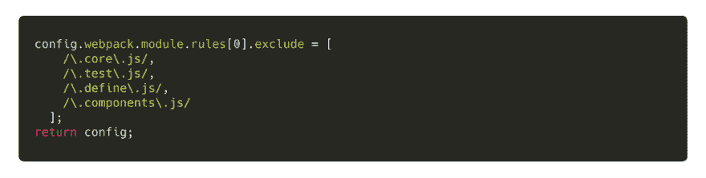](https://res.cloudinary.com/practicaldev/image/fetch/s--kMwFA7Y_--/c_limit%2Cf_auto%2Cfl_progressive%2Cq_auto%2Cw_880/https://cdn-images-1.medium.com/max/1024/1%2At_hkNbWh3pxr0sPUwheVsA.png)

### 步骤 5:在 BrowserStack 中运行您的测试

[Open-wc](https://open-wc.org/) 对此有一个包， **testing-karma-bs** 。它是在步骤 2 中安装的。编辑 **karma.es5.bs.config.js** 在 **BrowserStack** 中编辑你的项目的**名称**。

下一步，您必须设置一个 **.travis.yml** 文件来配置您的配置项。(你也可以用 [CircleCI](https://circleci.com/) 、 [TeamCity](https://www.jetbrains.com/teamcity/) 或者 [Gitlab](https://about.gitlab.com/product/continuous-integration/) 做同样的事情。)

[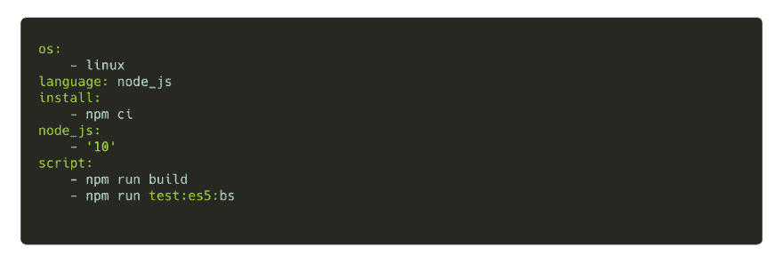](https://res.cloudinary.com/practicaldev/image/fetch/s--3i_6dRgf--/c_limit%2Cf_auto%2Cfl_progressive%2Cq_auto%2Cw_880/https://cdn-images-1.medium.com/max/1024/1%2ApDrloE0SQYqDjp60teiYDA.png)

[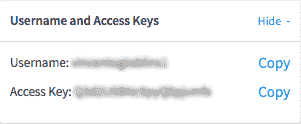](https://res.cloudinary.com/practicaldev/image/fetch/s--YGgCyQgA--/c_limit%2Cf_auto%2Cfl_progressive%2Cq_auto%2Cw_880/https://cdn-images-1.medium.com/max/301/1%2AZVvyK-nAVmI_nquZKukCtg.png)

下一步是在您的 Travis 存储库的设置中添加两个**环境变量**,**浏览器 _ 堆栈 _ 访问 _ 密钥**和**浏览器 _ 堆栈 _ 用户名**。您可以在 BrowserStack 仪表板的左上角找到它们。

[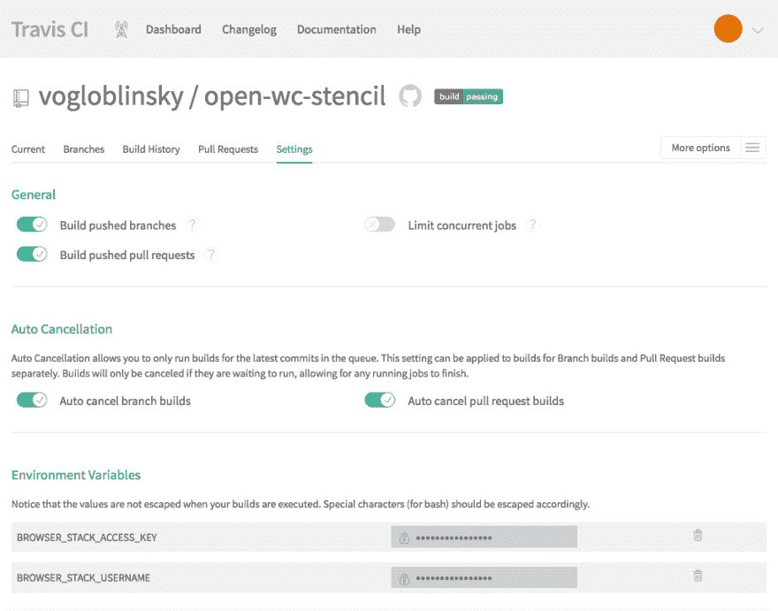](https://res.cloudinary.com/practicaldev/image/fetch/s--iD4XNfaU--/c_limit%2Cf_auto%2Cfl_progressive%2Cq_auto%2Cw_880/https://cdn-images-1.medium.com/max/1024/1%2A-fm8LsY_QD_0HpA2_sUspA.png)

最后一步是启动构建并等待结果:

[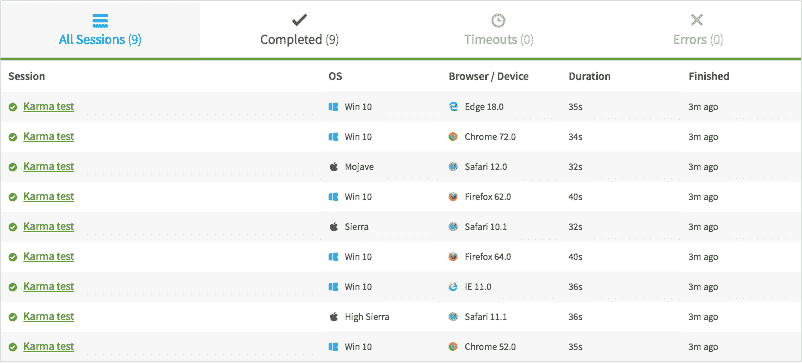](https://res.cloudinary.com/practicaldev/image/fetch/s--8Eebypw---/c_limit%2Cf_auto%2Cfl_progressive%2Cq_auto%2Cw_880/https://cdn-images-1.medium.com/max/802/1%2AHhefYswjPCfCRjr3W9ScmQ.png)

在 **BrowserStack** 内运行的浏览器默认列表在**open-WC/testing-karma-bs/bs-settings . js**的默认设置内配置:Chrome、Firefox、Safari、Edge、IE11 的最新稳定版本。

在[**karma . es5 . bs . config . js**](https://github.com/vogloblinsky/open-wc-stencil/blob/master/karma.es5.bs.config.js)**内部添加自定义启动器可以添加更多浏览器。**

### 真实用例:营养 Web 组件

如果你愿意，你还可以在我最近创建的一个开源项目中看到另一个 [open-wc](https://open-wc.org/) 测试工具的实现:[营养 Web 组件](https://github.com/vogloblinsky/nutrition-web-components)。它是两个 Web 组件的集合，用于显示 Nova 和 Nutri-score 营养徽章。我将在一个即将上线的营养开源项目中使用它们。

[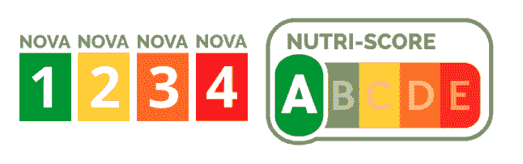](https://res.cloudinary.com/practicaldev/image/fetch/s--jRM8Ccw4--/c_limit%2Cf_auto%2Cfl_progressive%2Cq_auto%2Cw_880/https://cdn-images-1.medium.com/max/646/1%2AmJH7gUFX6YgYef7O0wrK7g.png) 

<figcaption>新星&营养徽章</figcaption>

### 谢谢！

就是这样！我希望你喜欢读这篇文章，就像我喜欢写它一样。

最终的源代码可以在 Github 上找到:

[vogloblinsky/open-WC-stencil](https://github.com/vogloblinsky/open-wc-stencil)

*在 Twitter 上关注我*[*@ vogloblinsky*](https://twitter.com/vogloblinsky)*获取关于 Web 组件的新闻。*

*感谢* [*瓦西姆*](https://medium.com/u/d44026c69d50) *和* [*托马斯*](https://twitter.com/daKmoR) *的点评。*

* * *