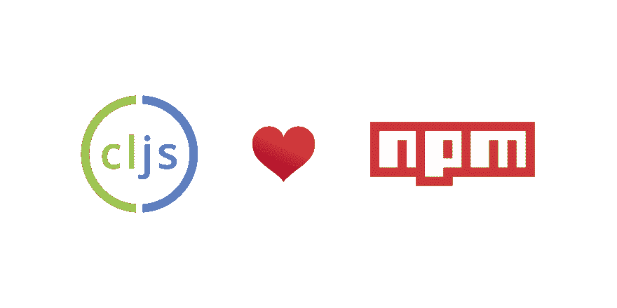
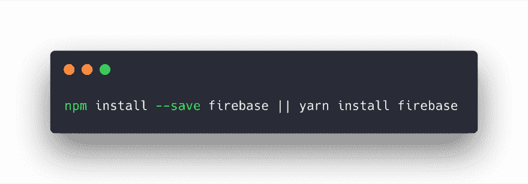
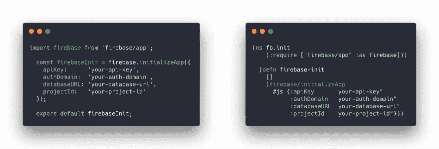
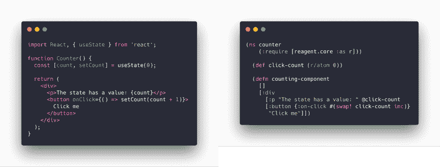
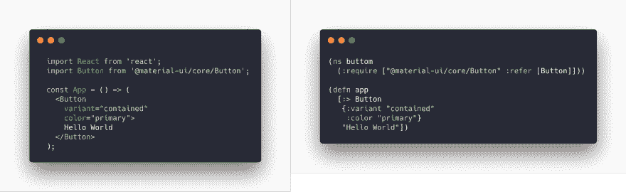
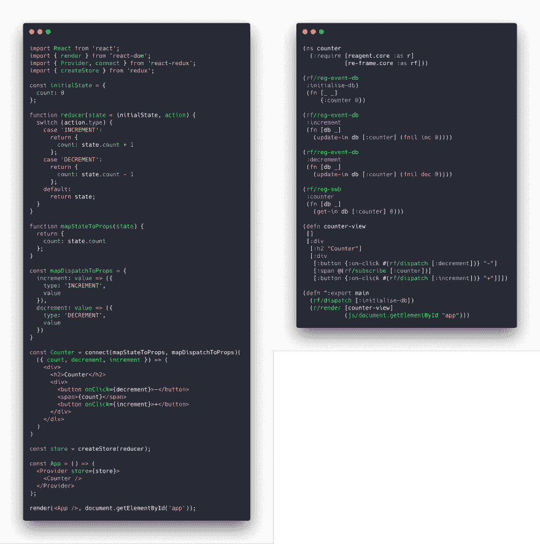

# ClojureScript 爱 NPM

> 原文：<https://dev.to/jacekschae/clojurescript-loves-npm-1ah4>

每一种遵守/转换 JS 的语言都想连接到 npm 来使用这个庞大的生态系统。这其中的高手当然是 Ecma 脚本了。第二个——依我拙见——是 ClojureScript，由于 [shadow-cljs](https://github.com/thheller/shadow-cljs) 。

免责声明:我知道在不同的社区有很多工作在进行，这些工作都在利用国家预防机制。无论如何，我不会试图贬低这一点，并声明 CLJS (ClojureScript)是最好的。我想让你看一下这在 ClojureScript 中是如何工作的。

## 安装 npm 软件包

在 ClojureScript 中，我们会像在 JavaScript 中一样安装 npm 包。我们将使用标准的 package.json 和 shadow-cljs 构建工具来解决剩下的问题。

安装后，我们将不得不要求软件包。所需语句与从 JS 导入几乎相同。在 CLJS 中，我们交换顺序——首先说从哪里开始，然后说什么。

每个 ClojureScript 文件都以 ns - namespace 声明开始。接下来是`require`，而不是`import`。然后我们用`defn`定义一个函数。这个函数将接入我们需要的 firebase 包，我们不使用`.`来导航到我们的方法`initializeApp`，而是使用`/`。我们确保当我们调用 JS 方法`initializeApp`时，我们用`#js`将 CLJS 映射(数据结构)转换成 JS 对象。

让我们尝试一些其他的 npm 包，以更好地感受 npm 和 ClojureScript 之间的互操作。

## 做出反应

用 React 怎么样？ClojureScript 有几个 React 的包装器——最流行的是[试剂](https://github.com/reagent-project/reagent)。这是一个简单的反例，有反应钩和试剂。

在这两个示例中，我们首先导入/要求反应和试剂。然后我们用钩子定义反应状态，用原子定义试剂状态。接下来是 JSX (JavaScript)和嗝嗝(ClojureScript)组件。这很酷，但是我们如何使用 Reagent 中的 React UI 库呢？

## React UI 库

最流行的 UI 库之一是[材质-ui](https://material-ui.com/) 。安装后，我们需要这个库，然后导入我们的按钮组件以及 React。在 Clojure 脚本中，我们只需要按钮。我们不需要试剂，因为它在我们的说明书里。为了与 React 进行互操作，我们将使用`:>`表单并在`{}`中传递我们想要的所有属性。

## Redux

你问 Redux 怎么样？有一个建立在试剂之上的库，叫做[重组](https://github.com/Day8/re-frame)。它于 2014 年 12 月首次设计，甚至比官方的榆树架构还要早。

到目前为止，您应该对为什么 CLJS 喜欢 npm 生态系统以及从 CLJS 到 JS 的互操作是多么容易有了一个很好的了解。也许这对你来说很有趣，你想知道为什么？为什么要尝试 ClojureScript 呢？

## 为什么？

### 不可改变

所有的 ClojureScritp 数据结构都是不可变的和预先抵抗的。如果你想离开像 ImmutableJS 这样的东西，你不需要学习新的 API。

### 功能性

ClojureScript 的核心包含了函数式编程思想。你不需要洛达什或拉姆达。

### 简单

使用 shadow-cljs，您不需要花费时间来配置您的构建。您需要您所需要的东西，构建工具将完成这项工作。

### 简洁

你的责任是你写的 LoC。ClojureScript 是最简洁的编程语言之一。查看此比较的最后一部分。

### 强大

ClojureScript 使用 Google 闭包工具进行代码缩减和树抖动。谷歌用来建立 Gmail，谷歌日历，谷歌文档，谷歌地图的收费是一样的。

### JavaScript

它将文件编译/转换成 JavaScript。正如 ES (EcmaScript) ReasonML，PureScript，Elm。

### 友好

ClojureScript 社区是我在网上遇到的最友好、最热情的一群人。我们主要是在[懈怠](https://clojurians.herokuapp.com/)和[关门](https://clojureverse.org/)的时候闲逛。

### 全栈

ClojureScript 老大哥——clo jure 用 Java 包含了所有这些思想。如果你想在一个性能最好、最稳定的平台——Java 虚拟机——上编写你的服务器，你可以使用相同的语言。

如果你喜欢这篇文章，你应该在推特上关注我。我只写/发关于编程和技术的文章——主要是关于 ClojureScript 和 Clojure。