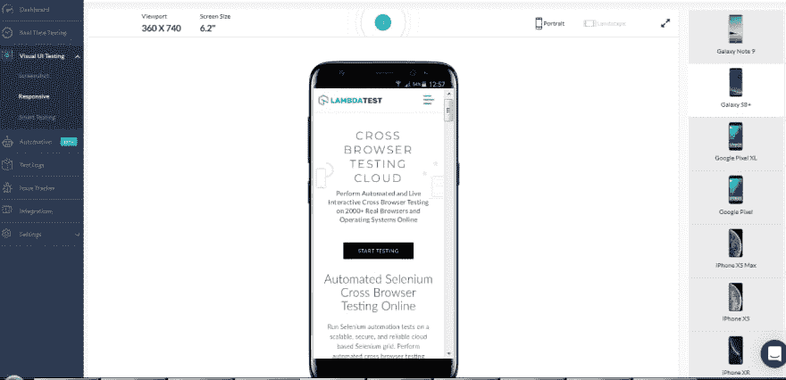

# 2019 年为什么需要关心自动化功能测试？

> 原文：<https://dev.to/lambdatest/why-you-need-to-care-about-automated-functional-testing-in-2019-5045>

有多少次你遇到了有好的用户界面但功能很差的产品，比如严重滞后的体验和大量的 bug，反之亦然。产品上线可能有多种原因，但这无疑表明没有进行彻底的测试。可能会出现这样的情况，即没有针对所有“极限情况”进行测试的微小软件更新可能会破坏软件产品中的现有功能。

在今天的数字经济中，在上线之前测试“软件更新”或“完整的软件包”是非常重要的，否则你的产品的用户将会看到一个有缺陷的产品。这可能会损害您组织的声誉，还可能导致损失，因为必须提供“修复”来解决问题。

强烈建议在 DevOps 中执行[持续测试，而不是在产品开发的最后阶段执行测试，devo PS](https://goo.gl/hrYHm7)强调在软件开发的每个关键阶段都要进行测试。有了像 [Shift-Left](https://goo.gl/pcD6Gc) 测试这样的方法，组织现在甚至在开发部分完成之前就已经开始合并测试了。“功能测试”是应该进行的一类测试，以确保所有功能都按照软件需求规范(SRS)、业务需求规范(BRS)和其他“需求规范”文档中记录的要求运行。

嘿，你正在寻找一个免费的工具来将国际化域名转换成 ASCII 兼容编码，即 Punycode。你可以通过 [IDN 编码](https://www.lambdatest.com/free-online-tools/idn-encode?utm_source=devto&utm_medium=organic&utm_campaign=may16_rn&utm_term=rn&utm_content=free_tools)工具来实现。

## 什么是功能测试？

功能测试是一种测试形式，通过验证应用程序根据客户需求文档提供的功能来评估软件产品的质量。在软件开发开始之前，需求收集团队提出不同的文档集，如软件需求规范(SRS)、业务需求规范(BRS)、客户需求规范(CRS)，而功能测试是确保所有记录的需求是否已得到满足并作为最终产品的一部分实现的一种方法。

在进行功能测试时，测试人员应该进行“黑盒测试”,而不应该关心功能的实现细节。根据产品的性质，你可以混合使用[手动&自动化测试方法](https://goo.gl/Cz6y33)来获得最大的测试覆盖率。数据库、应用编程接口([API 和浏览器兼容性](https://goo.gl/eoZRJt))、 [API 性能测试](https://goo.gl/1xsS4i)、客户端/服务器访问、用户界面交互、安全测试和[跨浏览器测试](https://goo.gl/GwzR6C)是可以作为功能测试的一部分来执行的一些事情。根据您的团队正在开发的产品的类型&功能，场景肯定会有所不同。

## 功能测试的重要性

如前所述，熟悉功能测试的测试人员必须从各个角度验证软件产品，并确保需求被很好地记录。此外，不同的需求规格文档应该在被测试的产品/应用中得到满足。因此，功能测试是由测试人员执行的，其中产品测试更多地是从客户/消费者的角度进行的，即“客户需求”，而非功能测试是通过优先考虑“客户期望”来执行的。我们将在随后的章节中研究功能测试和非功能测试之间的区别。

不同于其他形式的测试，如在“特定的块”或“片段”上进行的单元测试，功能测试是在集成产品上进行的。集成测试后发现的问题可能与其他形式的测试非常不同。这就是为什么为解决这些问题而推出的 bug 修复程序可能会导致可能的“副作用”。这个副作用就是回归缺陷。回归缺陷是由于应用程序中最近的错误修复而导致的结果错误。理解回归缺陷对于每个发布过程都很重要。

作为功能测试的一部分，测试团队可以执行脚本来验证数据流、安全方面、UI/UX 流以及 CRS 中提到的其他功能。一个功能测试人员应该对产品有很好的了解，并且应该拥有很好的领域能力。

测试人员可以进行手动测试或自动功能测试，或者两者的结合。更多的测试意味着更好的测试覆盖率和更好的产品测试。除了功能测试，建议您的测试团队也关注压力测试、非功能测试、回归测试、系统测试等。这取决于开发中的软件产品的时间表和性质。

## 了解功能测试的区别&非功能测试

在我们研究测试方法之间的区别之前，理解“功能测试的主要目标”是很重要的。下面提到了功能测试的一些核心目标:

*   :使用手工测试/自动化测试/两者的混合，测试是为了确保产品没有可用性问题。用户应该能够在不同的屏幕之间无缝导航。

*   **错误检查**:为了增加“测试覆盖率”，作为功能测试的一部分，所有的边界&错误场景都被彻底测试。

*   **比较“输出”和“预期结果”**:通过提供相关的测试数据，测试产品/应用中的所有主要功能。

现在，让我们来看看功能测试和非功能测试之间的顶级差异

*   **目标**:执行功能测试以检查“SRS、BRS、CRS 等中提到的要求”被翻译成“等同的特征/功能”。另一方面，非功能性测试关注其他参数，如软件产品/应用程序中的可伸缩性、速度、可靠性和其他非功能性方面。

*   **测试方法**:可以使用手动测试和自动功能测试方法或两者的混合来执行功能测试，但是“手动测试”是必须的，因为测试人员必须确保所有必要的功能都已实现。另一方面，非功能性测试应该使用自动化工具来执行，因为您需要在不同的场景下测试“系统/应用程序”,这些场景可能等同于真实世界的场景。例如，增加运行应用程序的所有 CPU 内核的负载，并在这种情况下检查应用程序的性能。

*   **孰先孰后**:功能测试通常在执行非功能测试之前进行，因为在执行非功能测试之前“必要功能”应该准备就绪。一旦实现了“基本功能”，开发人员必须确保“功能”是可扩展的，并且在不同的情况下(如不同的 CPU 负载、不同的热条件、在不安全的环境中安装应用程序)都能很好地运行。

一些常见的“功能测试”方法有——白盒测试、黑盒测试、单元测试、冒烟测试、跨浏览器测试等。一些常见的“非功能测试”方法有压力测试、负载测试、可靠性测试、安全性测试等。

## 功能测试示例

假设您正在构建一个“B2C 电子商务”应用程序，该应用程序执行以下操作

*   用户注册和登录
*   列出后端库存中的产品(不同类别)
*   通过不同的在线支付选项方便购买产品

现在，举例来说，我们将考虑一些测试因素，在用上面提到的例子执行功能测试时要记住。

*   **屏幕测试**:允许新用户使用注册页面注册。“返回”用户应该能够使用现有凭据登录，并且应该有“忘记密码”功能，以防用户忘记密码。执行示例场景的功能测试时，团队应该使用不同的用户/密码组合测试“注册&登录”页面，并记录输出。他们需要确保屏幕之间的导航是快速的，并且实现了该页面的功能(在 SRS 中列出)。

*   **功能测试**:基于目标市场，产品团队&开发团队将确定“潜在的浏览器&设备”,在这些设备上，应用程序应该在浏览器兼容性测试方面功能齐全。为了验证这一场景，我们执行了“[浏览器兼容性测试](https://goo.gl/pgg3v2)，在不同设备(台式机、手机、平板电脑等)的组合上测试应用程序。)、操作系统(Windows、Linux、Android、iOS、KaiOS 等。)，以及浏览器(火狐、Chrome、Opera 等。).

*   **测试回退机制**:让我们从[跨浏览器测试](https://goo.gl/TupxUK)的角度来理解这一点。如果你的应用程序迎合了目标市场，那里有很多人使用旧版本的浏览器，你的开发团队应该确保所有的需求都被转化为实现。一旦他们检测到网络应用程序是使用“不支持的或旧版本的特定浏览器”访问的，就应该有一个后备机制。

这是一个功能测试示例，如果浏览器不支持“Adobe Flash”，团队应确保提供视频的替代链接，以便视频可以在“该版本的浏览器”中播放。为这种场景进行手动/自动功能测试的测试团队应该记录“浏览器类型和版本”,并测试这些版本的浏览器(以及不同设备组合)的功能。

通过结合使用手动和自动功能测试，团队应该在不同的组合或屏幕分辨率上测试“应用程序屏幕”,以提供跨设备的可访问性。基于产品团队的输入，你应该优先测试可能被目标客户群广泛使用的组合。使用手动方法的跨浏览器测试不具有高度可伸缩性，因为它需要采购测试所需的必要基础设施，并且测试团队无法使用该方法实现良好的测试覆盖。仍然有一些方法可以加速手动跨浏览器测试。

嘿，你正在寻找一个免费的工具来将带有特殊字符的文本(Unicode)转换成 Punycode 编码(只是 ASCII)。你可以通过 [IDN 解码](https://www.lambdatest.com/free-online-tools/idn-decode?utm_source=devto&utm_medium=organic&utm_campaign=may16_rn&utm_term=rn&utm_content=free_tools)工具来完成。

## 自动化在功能测试中的作用

由于功能测试涉及产品中实现的功能的验证，测试团队必须确保每个“特性”都得到测试。这还包括涵盖错误场景和边界条件。手动测试有它自己的局限性，因为如果你的产品有大量的特性，你可能需要一个更大的测试团队。这样会增加整体费用。如果你只使用手工测试，你可能无法达到最好的“测试覆盖率”,如果你的产品不符合必要的“覆盖率指南”,你的 QA 可能会拒绝你的产品。

这就是'[自动化功能测试](https://goo.gl/WZqK33)可以发挥重要作用的地方，因为测试可以通过编写脚本来自动化。这些测试自动化脚本可以被扩展以覆盖不同的测试场景，并提高整体测试覆盖率&的效率。

自动化功能测试可以在你的项目期限非常紧迫的情况下派上用场。它提高了员工的整体生产力，因为他们从事更“有趣”的工作，组织可以节省时间&成本。手动测试是由测试人员完成的，他们是该领域的专家，一旦他们离开组织，一个新人必须承担他的责任，并建立相同水平的能力。

## 指向在进入“自动化功能测试”之前的“思考”

虽然[自动化测试](https://goo.gl/TRp8TH)有很多优点，但是产品团队应该决定哪些特性应该使用[手工测试&自动化功能测试](https://goo.gl/aQHaEc)来测试。在某些场景中，手工测试会占上风；因此，您的测试团队需要弄清楚自动化在产品特性&功能验证中的作用。在任何情况下，你都不能用自动化的功能测试来代替手工测试，因为所有的测试场景都不能自动化(尤其是那些需要手工干预的场景)。

从事自动化功能测试的团队不应该在竖井中工作。事实上，团队应该与“手工测试团队”和“产品团队”紧密合作，这样他们就可以理解自动化功能测试更有用的场景。这对于获取领域知识以及通过[编写有效的测试用例](https://goo.gl/C5NC2t)来构建更健壮(和可伸缩)的测试套件是必要的。

为了从自动化功能测试中获得最佳效果，您应该选择正确的自动化工具。自动化工具的选择应该基于它的可伸缩性、团队中过去的工作经验、成本和维护的容易程度。“测试报告”提供了关于通过和失败场景的重要信息，而“[强大的错误报告](https://goo.gl/Wcczzr)”(以及客户支持)在筛选自动化工具时应该是必备的。选择一个“错误的自动化工具”会导致时间的损失，这会影响项目的时间表，并且不必要的返工会挫伤测试团队的积极性。因此，选择正确的& [最佳测试自动化工具](https://goo.gl/w944EF)对于您的测试自动化策略的成功至关重要。

## 与功能测试相关的神话

有相当多的读者在不知道这些测试方法之间的区别的情况下，交替地讨论不同的测试机制。围绕这个主题有很多困惑，我们有必要打破与功能测试相关的神话。

**“功能测试”与“系统测试”相同**
功能测试是系统测试的一种形式，或者我们应该说是系统测试的一个子部分。虽然功能测试是为了测试产品/应用程序的基本功能，但压力测试本质上更加严格。作为系统测试的一部分，测试人员执行以下操作:

*   完全集成产品的测试。
*   测试案例不仅关注设计，还关注产品/应用的“功能”。
*   功能需求规范(FRS)和软件需求规范(SRS)被认为是系统测试的支柱。
*   测试案例还关注安全性、性能、边界条件、电源管理等。测试用例的覆盖范围很大程度上依赖于“被测产品”。

如果您正在构建一个硬件产品，它还涉及认证测试、符合性测试等。这些测试不包括在功能测试中。系统测试还包括压力测试和负载测试，其中 AUT(测试中的应用程序)根据不同的系统场景进行测试，其性能使用工具进行测量。因为功能测试只是系统测试的一个子集，所以它总是在系统测试之前进行。

理想情况下，不清楚功能测试场景的产品/web 应用程序不应该进行系统测试验证。

## ‘端到端测试’是‘功能测试’的一部分

[端到端测试](https://goo.gl/2cWPWm)是一种测试形式，从头到尾从各个角度对“产品”或“测试中的应用”进行测试。简而言之，这是从用户角度执行的测试方法。参考较早的 B2C 电子商务应用的例子，当浏览网站/应用上的产品时，用户可能会面临互联网连接节流。应用程序应该向用户显示什么，或者在没有互联网连接时会发生什么？

端到端测试也会考虑这种极端场景(包括第三方依赖)，因为它对产品的“可用性因素”有直接影响。

另一方面，如果产品通过功能测试；这意味着产品的基本流程运行良好，开发团队可以致力于“产品的进一步改进”。

## 永远以 100%自动化的功能测试为目标

自动化功能测试肯定比手工测试有很多优势，主要的优势是更好的测试覆盖率和节省时间和成本。然而，自动化网站测试面临许多挑战。在无法自动化的测试场景中，或者在自动化可能不具有成本效益的情况下，即这些测试场景通常需要手动干预或者需要手动观察。

参考前面的 B2C 电子商务应用程序的例子，假设应用程序正在 Android 手机(安装了 Android P)上进行测试，设备从“纵向”模式切换到“横向”模式。图形有一个小问题，图形的某些部分不能正常显示。这不能自动化，因为只有参与手工测试的人才能观察到这样的问题。

测试团队(参与手动和自动化功能测试)坐在一起，处理可以自动化的测试场景是很重要的。自动化功能测试的全部意图是更多的测试覆盖和构建一个健壮的测试套件。在理想的情况下，应该使用手动和自动功能测试的稳定组合来测试不同场景下的产品。

总而言之，问题从来不是什么测试用例可以自动化；但是它是关于你如何在整个测试计划中适应自动化功能测试，以交付一个更稳定的最终产品。

## 使用 LambdaTest 进行跨浏览器功能测试

实现手动和自动跨浏览器功能测试的正确组合极其重要，针对(浏览器+操作系统+设备)组合测试您的产品/web 应用程序变得比以前更加重要。使用 LambdaTest 的云基础设施，您可以在不同的场景下测试您的站点/web 应用程序。

您可以从一系列操作系统和设备中进行选择，以在设备间执行“响应屏幕测试”。你可以从一系列设备中选择&也可以调整“视窗尺寸”和“屏幕尺寸”。如果您计划通过截图从 UX 和用户界面的角度验证产品，只需在延迟一段时间后调用截图即可。下面显示的是 LambdaTest 控制台的截图，其中 LambdaTest 网站的验证是在 Galaxy S8+上进行的(在纵向模式下)。
[T3】](https://www.lambdatest.com/blog/why-you-need-to-care-about-automated-functional-testing-in-2019/)

您还可以选择使用“屏幕截图测试”和“智能测试”，这是视觉用户界面测试的一部分。借助屏幕截图和智能测试，您可以执行视觉回归测试，并通过在单个测试会话中捕获网站的批量屏幕截图来加快屏幕截图测试过程。

LambdaTest 现在还提供平台的自动化跨浏览器功能测试，以执行(和移植)用 Python、C#、PHP、Ruby、JavaScript 等编写的自动化测试用例。以硒为测试框架。LambdaTest 提供了一个包含 2000 多个浏览器的 Selenium 网格供您测试。

嘿，你正在寻找一个免费的工具来生成随机 YAML 数据结构。你可以通过[随机 YAML 生成器](https://www.lambdatest.com/free-online-tools/random-yaml-generator?utm_source=devto&utm_medium=organic&utm_campaign=may16_rn&utm_term=rn&utm_content=free_tools)工具来实现。

## 结论

功能测试应该总是在产品开发周期中进行，以确保所有必要的/基本的功能在产品中正常工作。它应该在开发的早期阶段完成，以便在错误滚雪球成为“发布阻塞”之前，在正确的时间记录它们。

根据软件产品的性质，还需要执行其他类型的测试——压力测试、跨浏览器兼容性测试、集成测试、合规性测试、白盒测试等等。随着设备数量的增长，跨浏览器测试变得越来越重要，这是一种不能再被忽视的测试，因为它与产品的可用性方面密切相关。使用 LamdaTest 在云上的跨浏览器测试，测试人员可以减少整体构建时间(通过并行执行测试)，并实现更好的测试覆盖率。

原文出处:[lambdatest.com](https://goo.gl/oNroUg)

**相关文章**

1.  [自动化跨浏览器测试](https://goo.gl/vQCLix)
2.  [为什么信息架构在 UX 进程中是一种必然？](https://goo.gl/KfwhtM)
3.  专业 QA 领导如何为测试部门设定目标？