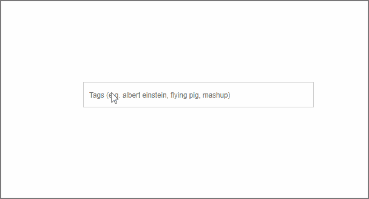

# 通过模仿别人来学习

> 原文：<https://dev.to/benjaminadk/learn-by-copying-someone-else-16j6>

你在学`React`吗？你对`Styled Components`感兴趣吗？如果`yes||yes`、[在 YouTube 上免费看我的新系列](https://www.youtube.com/playlist?list=PLh6ckU65UHatP5H8ujyQ8IlPC6G5n8A3b)。Else，`article.exit(0)`。

[https://www.youtube.com/embed/IJD33I0Ixck](https://www.youtube.com/embed/IJD33I0Ixck)

这个想法是从流行的网站中分离出动态但简单的组件，并使用 React 和 Styled 组件重新创建它们。我们不是在这里建立一个完整的堆栈应用程序，每个系列的目标长度约为 1 小时。所以这些是容易理解的视频。

为了更好地了解发生了什么，下面的 GIF 是第一个组件 YouTube 标签输入。它出现在用户上传视频时，标签用于帮助搜索功能或视频排序。虽然大多数 def 并不是有史以来最炫的 UI，但它确实在一个小空间里包含了很多功能。我喜欢的是用户第一眼看到的是一个常规的`input[type='text']`元素。仔细观察，还有更多的事情在发生。标签被保存在某个地方。文本输入的占位符仅在没有标签时显示。逗号和`enter`键保存一个标签。标签中不允许使用某些字符和多个空格。每个标签都有一个小的`x`来删除它。标签太长后会被剪掉。这一切是怎么发生的？

好吧。让我们再深入一点。YouTube 标签输入的一个巧妙之处是如何删除单个标签。这是通过`backspace`键完成的。如果出现了标签之外的任何文本，退格键会正常工作——一次删除一个字母。现在，如果没有文本，退格键将把最后一个标签变成选定的文本。那么再按一次当然会擦除整个标签。这很酷，因为它给了用户一个删除标签的中间步骤，而不会超出顶部，就像一个`confirm`对话框之类的——我的意思是我们在这里只是谈论一个标签。所以如果你想知道如何做到这一点...看视频。

另一方面，没人逼你做任何事。但我会说，尝试克隆其他网站的 UI 功能是一个值得的做法。即使你不是一个 React 的人，使用你喜欢的 UI 库/框架，或者甚至是普通的 JavaScript。我发现当我的心态是`user`的时候，我不会真的去想功能背后的代码。当一些东西易于使用时，幕后的复杂性就被忽略了。

感谢阅读。