# 如何将你的 Github 贡献图的颜色改为更酷的颜色

> 原文：<https://dev.to/abdurrahmaanj/how-to-change-your-github-contribution-graph-colour-to-something-cool-34gg>

在本帖中，我们将看到如何将你在 github 上的贡献变成一个漂亮的配色方案。这是一个简单的教程，足够详细，随时澄清任何疑问！让我们开始吧。

## 侦察

首先，这就是我们所说的贡献图。绿色方块。

[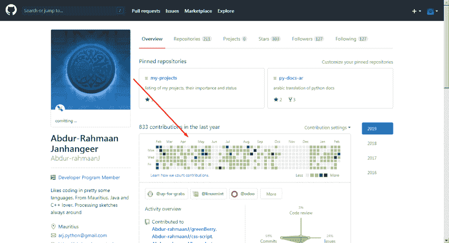](https://res.cloudinary.com/practicaldev/image/fetch/s--o9qdUVdK--/c_limit%2Cf_auto%2Cfl_progressive%2Cq_auto%2Cw_880/https://thepracticaldev.s3.amazonaws.com/i/wadf8qutl6n7iv0i475m.png)

现在我们需要看看 github 实际上是怎么做的。右键单击，然后选择检查元素。

[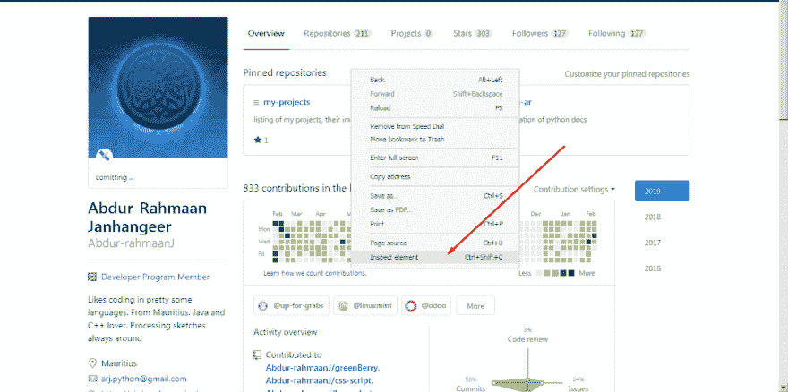](https://res.cloudinary.com/practicaldev/image/fetch/s--ueO0bk2s--/c_limit%2Cf_auto%2Cfl_progressive%2Cq_auto%2Cw_880/https://thepracticaldev.s3.amazonaws.com/i/sr8eyziwkjw6r0ix3b51.png)

接下来我们看到一个盒子出现了。这向我们展示了页面的结构，并显示了控制台消息。这有利于调试。

[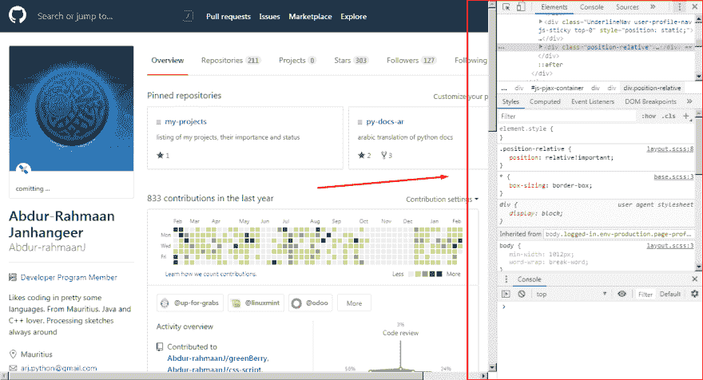](https://res.cloudinary.com/practicaldev/image/fetch/s--sMO_d_wg--/c_limit%2Cf_auto%2Cfl_progressive%2Cq_auto%2Cw_880/https://thepracticaldev.s3.amazonaws.com/i/r7su6iy4j23cyymizhjh.png)

现在，如果你想改变它的位置，点击点，然后选择你喜欢的观点。

[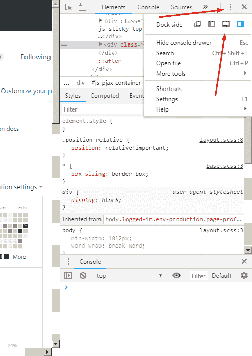](https://res.cloudinary.com/practicaldev/image/fetch/s--N7XWYzJC--/c_limit%2Cf_auto%2Cfl_progressive%2Cq_auto%2Cw_880/https://thepracticaldev.s3.amazonaws.com/i/jarkgddsfim7x784mct4.png)

现在我们将通过使用选择工具来揭开单个方块背后的秘密。

[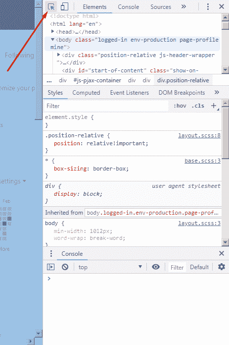](https://res.cloudinary.com/practicaldev/image/fetch/s---UaX7Y5s--/c_limit%2Cf_auto%2Cfl_progressive%2Cq_auto%2Cw_880/https://thepracticaldev.s3.amazonaws.com/i/euosrs8kr6zqqkg9zezy.png)

然后我们会看到一个单独的方块

[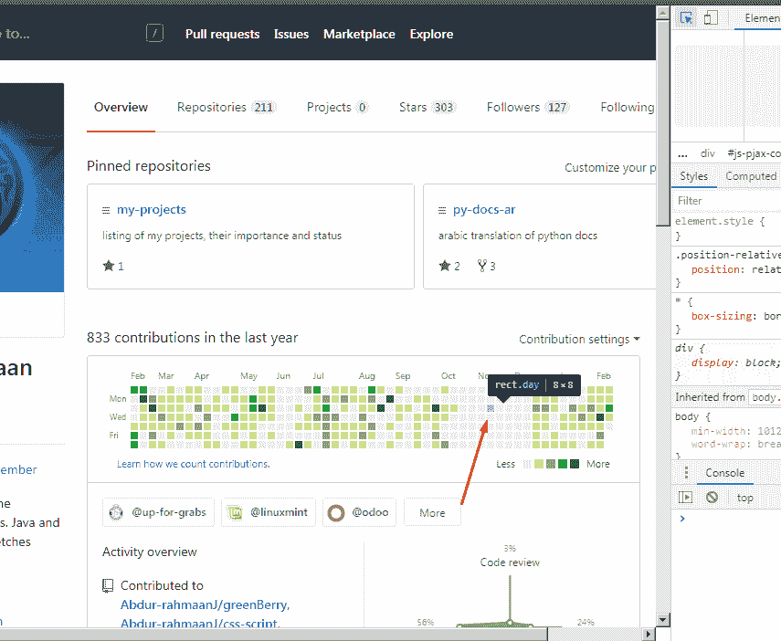](https://res.cloudinary.com/practicaldev/image/fetch/s--KciZ5hP2--/c_limit%2Cf_auto%2Cfl_progressive%2Cq_auto%2Cw_880/https://thepracticaldev.s3.amazonaws.com/i/ieccvg38de5o593h5uhk.png)

啊哈，所以，我们有一个元素，颜色在填充属性中。不错！

[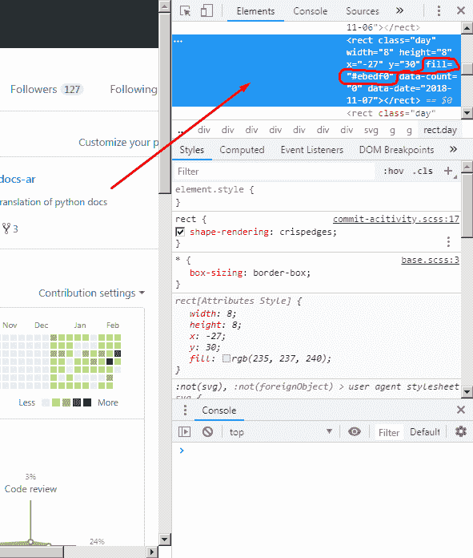](https://res.cloudinary.com/practicaldev/image/fetch/s--N8rF3A5B--/c_limit%2Cf_auto%2Cfl_progressive%2Cq_auto%2Cw_880/https://thepracticaldev.s3.amazonaws.com/i/3x38w6gfqydqjryyw6lv.png)

## 在进入大逆不道的猴子

Tampermonkey 是一个允许你改变/篡改网页中代码的工具。在 opera 上可以找到

以及在 chrome 上

[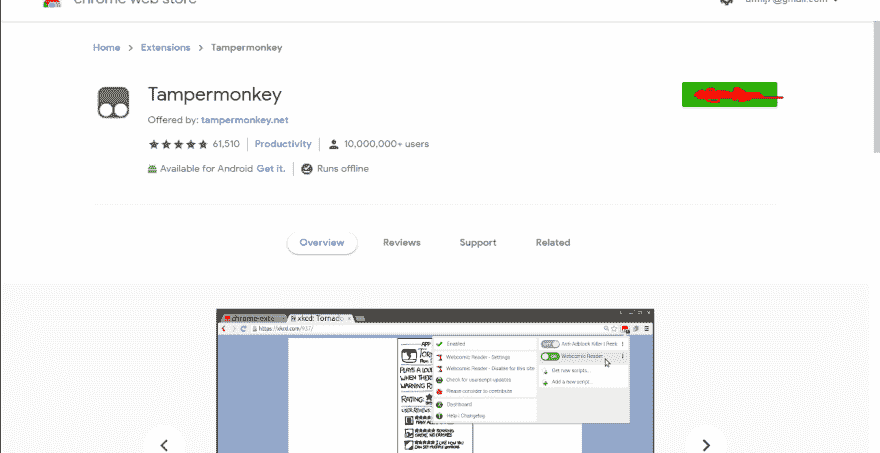](https://res.cloudinary.com/practicaldev/image/fetch/s--2DfymL-4--/c_limit%2Cf_auto%2Cfl_progressive%2Cq_auto%2Cw_880/https://thepracticaldev.s3.amazonaws.com/i/tdoxdhq2xt9jjk91rgk9.png)

如果一切顺利，您应该会在浏览器的右上角看到一个漂亮的图标(我使用的是 opera)

现在让我们创建一个新的脚本

[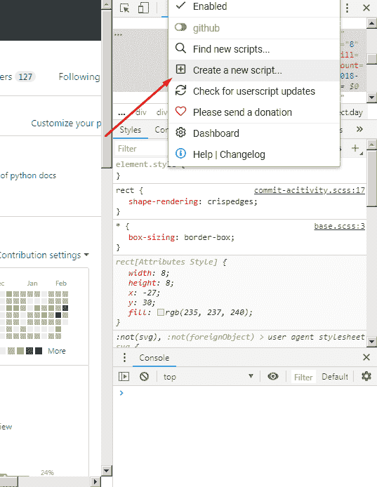](https://res.cloudinary.com/practicaldev/image/fetch/s--k8ZgveMn--/c_limit%2Cf_auto%2Cfl_progressive%2Cq_auto%2Cw_880/https://thepracticaldev.s3.amazonaws.com/i/x73c3oj1l0tyazz5y6xl.png)

我们得到这个画面
[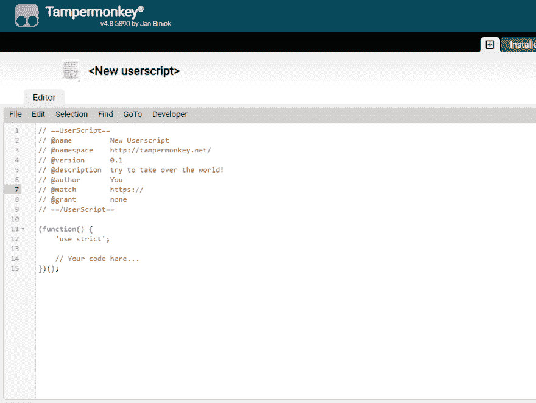](https://res.cloudinary.com/practicaldev/image/fetch/s--2K5F6-fH--/c_limit%2Cf_auto%2Cfl_progressive%2Cq_auto%2Cw_880/https://thepracticaldev.s3.amazonaws.com/i/0loiybpezhf5w0g3hdcu.png)

现在让我们匹配 github 上的所有域

[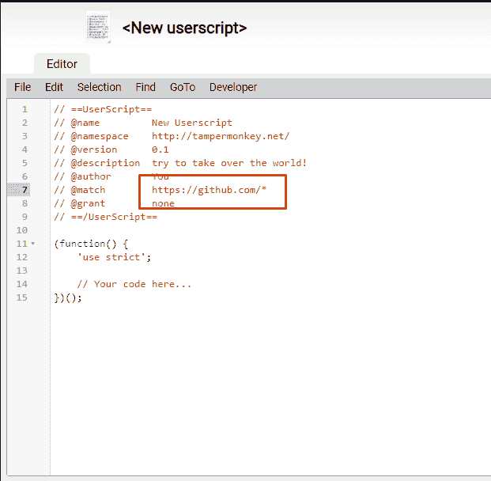](https://res.cloudinary.com/practicaldev/image/fetch/s--iplplfwG--/c_limit%2Cf_auto%2Cfl_progressive%2Cq_auto%2Cw_880/https://thepracticaldev.s3.amazonaws.com/i/7y8v0w90hpi7bcg5hlu0.png)

并更改脚本名称

[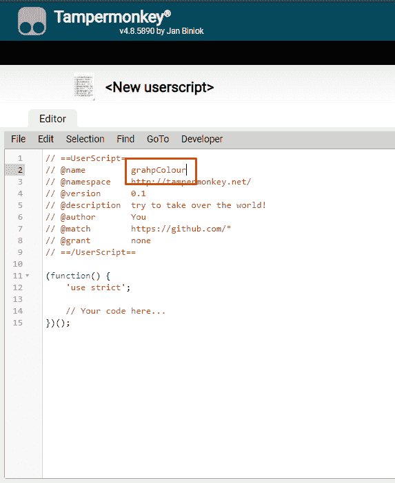](https://res.cloudinary.com/practicaldev/image/fetch/s--KW-qP4ix--/c_limit%2Cf_auto%2Cfl_progressive%2Cq_auto%2Cw_880/https://thepracticaldev.s3.amazonaws.com/i/3jdxfi5xhkoxh6wpqnhl.png)

现在，如果我们按“保存”,我们将被定向到此屏幕。只需点击名称即可返回编辑器

[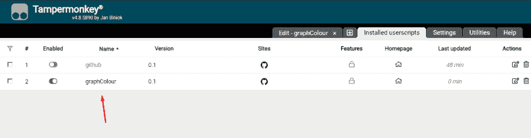](https://res.cloudinary.com/practicaldev/image/fetch/s--sjEBZXjB--/c_limit%2Cf_auto%2Cfl_progressive%2Cq_auto%2Cw_880/https://thepracticaldev.s3.amazonaws.com/i/46oy21693vsjcf0f7inn.png)

在检查我们的 github 页面时，我们发现了两件事

*   有五种颜色

[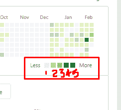](https://res.cloudinary.com/practicaldev/image/fetch/s--7JMoQG9b--/c_limit%2Cf_auto%2Cfl_progressive%2Cq_auto%2Cw_880/https://thepracticaldev.s3.amazonaws.com/i/cgqk2uguuz8nqtwa19ad.png)

和

*   它们是根据数据计数来分级的

[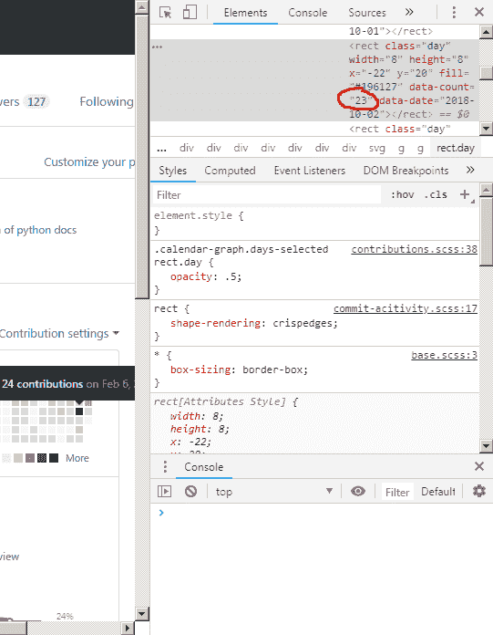](https://res.cloudinary.com/practicaldev/image/fetch/s--GJM6hmk7--/c_limit%2Cf_auto%2Cfl_progressive%2Cq_auto%2Cw_880/https://thepracticaldev.s3.amazonaws.com/i/k41xfdx6ufh8xuqa9ojn.png)

这是我们的起点

[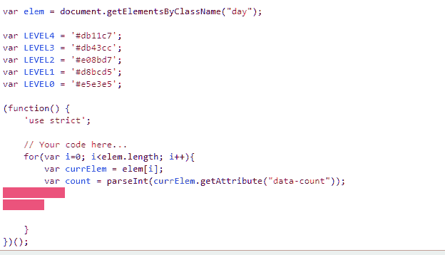](https://res.cloudinary.com/practicaldev/image/fetch/s--NCHv7523--/c_limit%2Cf_auto%2Cfl_progressive%2Cq_auto%2Cw_880/https://thepracticaldev.s3.amazonaws.com/i/20mv02n1xh176ctkmame.png)

现在让我们添加计数分级

[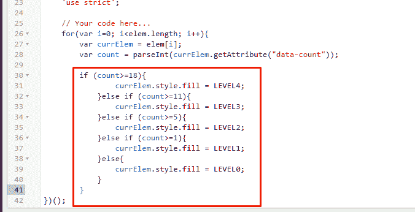](https://res.cloudinary.com/practicaldev/image/fetch/s--3QA3AmhX--/c_limit%2Cf_auto%2Cfl_progressive%2Cq_auto%2Cw_880/https://thepracticaldev.s3.amazonaws.com/i/8nun5v4e3wguh9rh0oea.png)

救援

## 看到结果

现在进入 github，点击图标，你会看到我们的脚本被激活

[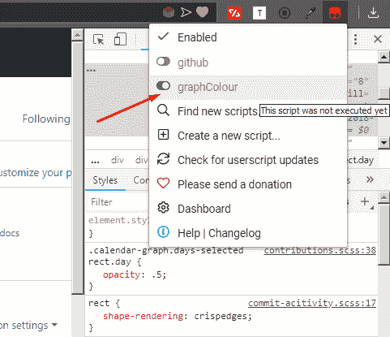](https://res.cloudinary.com/practicaldev/image/fetch/s--j7vfeDOz--/c_limit%2Cf_auto%2Cfl_progressive%2Cq_auto%2Cw_880/https://thepracticaldev.s3.amazonaws.com/i/mndsa2v7w2yqwk98jtvt.png)

现在刷新页面，您会看到类似这样的内容:

只是现在我们需要处理这个传说

## 与传说打交道

检查图例显示了一个带有李儿童和背景颜色的班级图例

[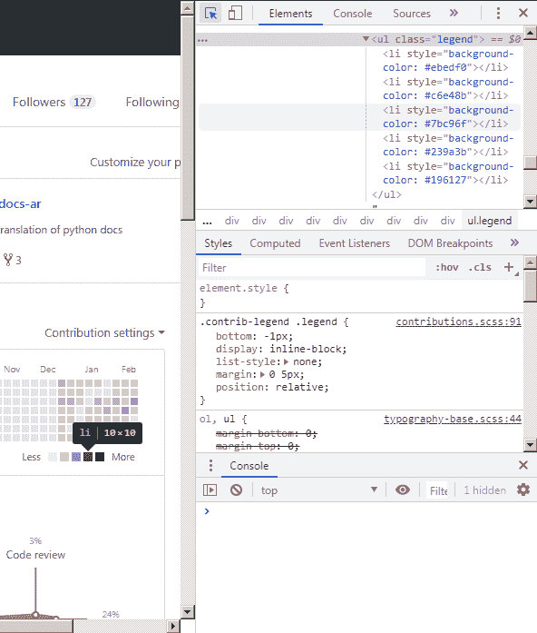](https://res.cloudinary.com/practicaldev/image/fetch/s--hxxCU8Q2--/c_limit%2Cf_auto%2Cfl_progressive%2Cq_auto%2Cw_880/https://thepracticaldev.s3.amazonaws.com/i/5r7ggresvy8vxrdwro4b.png)

我们相应地改变我们的代码

[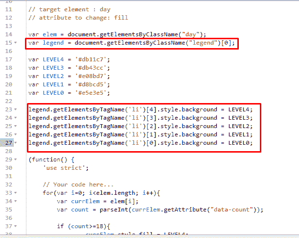](https://res.cloudinary.com/practicaldev/image/fetch/s--MWd6xzlC--/c_limit%2Cf_auto%2Cfl_progressive%2Cq_auto%2Cw_880/https://thepracticaldev.s3.amazonaws.com/i/sybqjz5s5axzz5svd1ql.png)

还有 tada！

[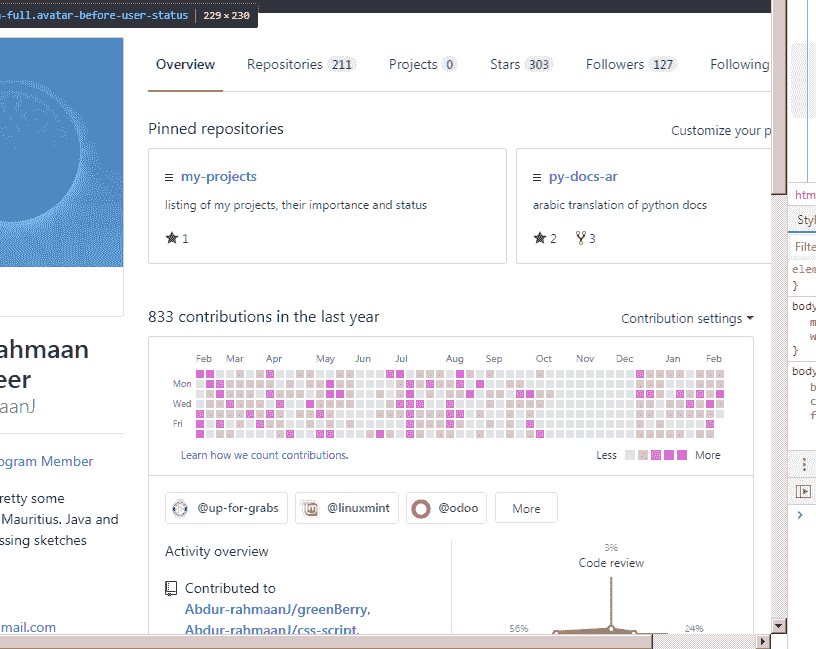](https://res.cloudinary.com/practicaldev/image/fetch/s--1Lrlw-Ew--/c_limit%2Cf_auto%2Cfl_progressive%2Cq_auto%2Cw_880/https://thepracticaldev.s3.amazonaws.com/i/oq41eeqanmihwjpjf10r.png)

现在，无论我们何时移动，我们的图形都是相同的颜色。比如伊森·弗曼的资料

[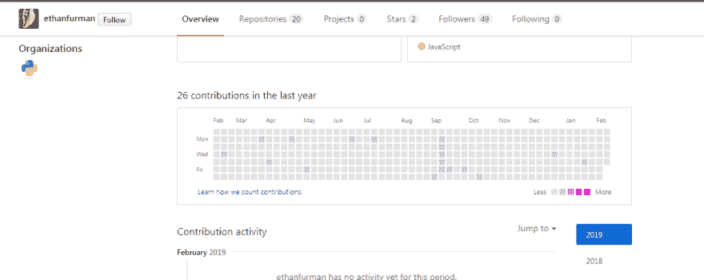](https://res.cloudinary.com/practicaldev/image/fetch/s--RUxKxGFq--/c_limit%2Cf_auto%2Cfl_progressive%2Cq_auto%2Cw_880/https://thepracticaldev.s3.amazonaws.com/i/v36k1ckaq0tv8oioipyi.png)

## 包装完毕

你可以在这里找到来源(要点可能更合适)

也可以在 greeasyfork[这里](https://greasyfork.org/en/scripts/377763-githubgraphcolour)查看

欢迎在下面提出更多的配色方案。希望你喜欢这篇文章！