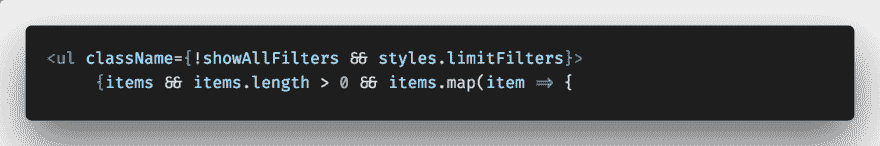

# VS 代码设置以提高生产率

> 原文：<https://dev.to/chiamakaikeanyi/vs-code-setup-to-improve-productivity-j5i>

代码编辑器已经发展了很多年。几年前还没有 Visual Studio 代码(VS 代码)。你可能用了 Sublime，Atom，Bracket 等等。但是随着 VS 代码的发布，它已经成为大多数软件开发者最喜欢的编辑器。

## 为什么要 VS 码？

*   可定制的
*   易于调试
*   蚂蚁
*   扩展ˌ扩张
*   Git 集成
*   集成终端
*   智能感知
*   轻量级选手
*   主题化和更多...

已经看到了使用 VS 代码的优势[和你可以用它做的惊人的事情](https://vscodecandothat.com/)，这篇文章将从生产力的角度讨论使用 VS 代码时需要的 VS 代码设置和扩展。

## 埃米特

在许多流行的文本编辑器中使用，这极大地改善了 HTML & CSS 工作流程。
按下`CMD + SHIFT + P`即可进入。然后，搜索**埃米特**。这显示了可以使用 emmet 执行的操作列表。

例如，要用类名项显示五个 div，您所需要的就是

```
 .item{$}*5 
```

然后，按下`Enter`键。结果是

```
<div class="item">1</div>
<div class="item">2</div>
<div class="item">3</div>
<div class="item">4</div>
<div class="item">5</div> 
```

## 字体

由于支持连字，FiraCode 看起来很酷。它让你的代码一目了然。下载并安装 FiraCode，然后将其添加到您的`settings.json`文件中。

[](https://res.cloudinary.com/practicaldev/image/fetch/s--kr6Mkbiv--/c_limit%2Cf_auto%2Cfl_progressive%2Cq_auto%2Cw_880/https://thepracticaldev.s3.amazonaws.com/i/ylunkhys8opkr1csyw1w.png)

## 配置

您可以在`settings.json`文件中配置 VS 代码来匹配您的偏好。

```
{  "editor.multiCursorModifier":  "ctrlCmd",  "editor.formatOnPaste":  true,  "editor.wordWrap":  "bounded",  "editor.trimAutoWhitespace":  true,  "editor.fontFamily":  "Fira Code",  "editor.fontLigatures":  true,  "editor.fontSize":  14,  "editor.formatOnSave":  true,  "files.autoSave":  "onFocusChange",  "emmet.syntaxProfiles":  {  "javascript":  "jsx"  },  "eslint.autoFixOnSave":  true,  "eslint.validate":  [  "javascript",  "javascriptreact"  ],  "javascript.validate.enable":  true,  "git.enableSmartCommit":  true,  "files.trimTrailingWhitespace":  true,  "editor.tabSize":  2,  "gitlens.historyExplorer.enabled":  true,  "diffEditor.ignoreTrimWhitespace":  false,  "workbench.sideBar.location":  "right",  "explorer.confirmDelete":  false,  "javascript.updateImportsOnFileMove.enabled":  "always",  } 
```

## 从命令行启动

按`CMD + SHIFT + P`，键入 *shell 命令*，选择路径的*安装代码命令。
然后，从终端导航到任何项目，并从目录中键入 **`code .`** ，使用 VS 代码启动该项目。*

## 多个光标

您可以同时修改多行代码。您需要在您的`settings.json`文件中设置您的首选访问权限`KEY`。

```
 "editor.multiCursorModifier": "ctrlCmd",

    or

    "editor.multiCursorModifier": "alt", 
```

## 终端

您可以[设置您的终端来使用 iTerm2 和 ZSh](https://chiamakaikeanyi.dev/how-to-configure-your-macos-terminal-with-zsh-like-a-pro) ，并设置您的 VS 代码终端来使用它们。

## 分机

下面是一些有用的扩展，可以改善开发人员在代码库工作时的体验。

要访问这些扩展，

*   转到视图>扩展
*   在市场中搜索扩展
*   点击安装

* * *

*   **添加 jsdoc 注释**

这将注释块添加到代码中。要使用它，突出显示该功能的第一行，按下`CMD + SHIFT + P`并选择*添加文档注释*

*   **自动导入**

有了这个扩展，你就不需要手动导入文件了。如果您正在处理一个基于组件的项目，只需输入组件名，它就会被自动导入。

*   **自动重命名标签**

自动重命名成对的元素

*   **CSS 窥视**

顾名思义，这有助于您了解代码库中定义的样式所应用的规则及其特殊性。在处理遗留代码时，这很方便。

*   **Chrome 调试器**

这让你可以直接从谷歌浏览器调试你的 JavaScript 代码

*   **码头工人**

您可以使用这个扩展动态创建 docker 文件。它还提供了语法高亮、智能感知等等。

按下`CMD + SHIFT + P`并搜索*将 Docker 文件添加到工作区*

*   **ESDoc MDN**

在某些情况下，我们往往会忘记一件特定的事情是如何运作的。这就是这个扩展变得有用的地方。你不需要启动你的网络浏览器来找出语法。你只需要输入

```
//mdn [object].[method]; 
```

*   **ESLint**

这将 ESLint 集成到 VS 代码中来 Lint 你的代码。您正在处理的项目需要在本地或全局安装 ESLint，以利用该扩展提供的特性。
要在本地安装 ESLint，运行`npm install eslint`或使用
T1 进行全局安装。
您还需要创建`.eslintrc`配置文件。

如果您在本地安装了 ESLint，运行
`./node_modules/.bin/eslint --init`
或`eslint --init`
进行全局安装。

*   **GitLens**

GitLens 提升了您使用 Git 可以实现的目标。它可以帮助你做更多的事情，比如无缝地探索 Git 库，查看代码修改，作者身份等等。

*   **谷歌字体**

有了这个扩展，添加谷歌字体变得更加容易。您不再需要在浏览器上搜索字体。要访问字体列表，按`CMD + SHIFT + P`并搜索**谷歌字体**继续。

*   **htmlint**

这个扩展验证你的 HTML，帮助你编写符合标准的代码

*   **进口成本**

导入成本显示代码中导入包的影响。它有助于测量性能瓶颈。

*   **直播服务器**

这将启动一个具有实时重新加载功能的本地开发服务器。

*   **孔雀**

这个扩展让你能够改变你的工作空间的颜色。当您有多个 VS 代码实例并且想要快速识别一个特定的实例时，这是非常理想的。

安装孔雀后，点击【设置】图标>设置，选择【工作区设置】标签，点击{}粘贴下面的代码。

```
 {
        "workbench.colorCustomizations": {
            "activityBar.background": "#e90b8d",
            "activityBar.foreground": "#fff",
            "activityBar.inactiveForeground": "#b5b5b5",
        },
        "peacock.affectedElements": [
            "activityBar",
        ]
    } 
```

您还可以将`titleBar`和`statusBar`添加到 affectedElements，并在 color customizations 部分为它们添加颜色定制。

要使用一种默认颜色，按下`CMD + SHIFT + P`，输入**孔雀**，选择你喜欢的主题。这将覆盖为该工作区定义的 settings.json 文件中的颜色设置。

*   **更漂亮**

格式化您的代码并使其可读

*   **波兰语**

作为一个技术作家，这很方便。它给你一个吸引人的代码片段截图。

```
Step 1: Press CMD + SHIFT + P
Step 2: Select Polacode 📸
Step 3: Copy some code
Step 4: Paste into Polacode view
Step 5: Click the lens-like button below the code view to save 
```

*   **待办事项高亮显示**

有很多需要优先处理的工作，有时，你可能会忘记尚未完成的任务。TODO highlight 通过突出显示这些内容使其易于查看。

* * *

请随意在评论区留下对你有用的内容，并分享这篇文章。