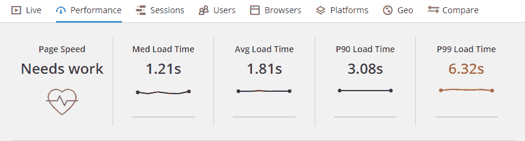
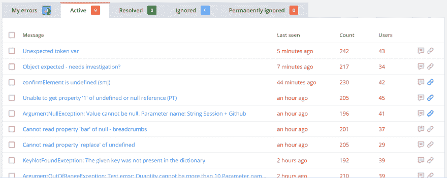
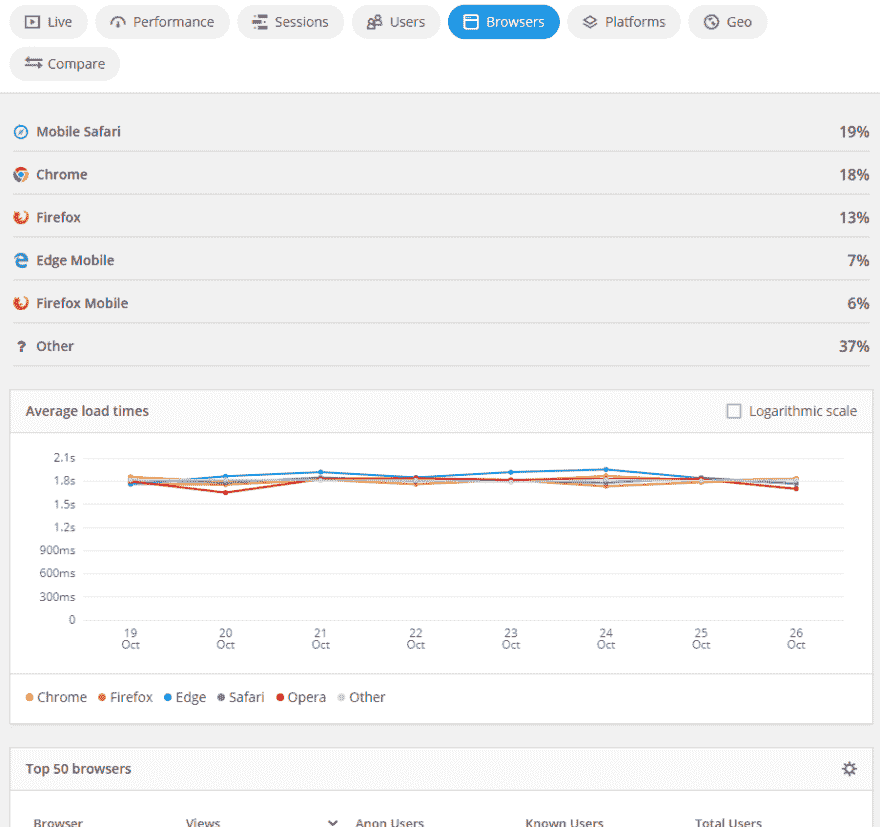
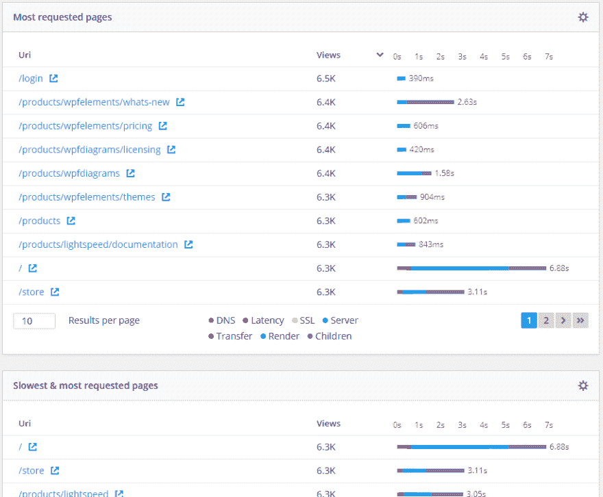
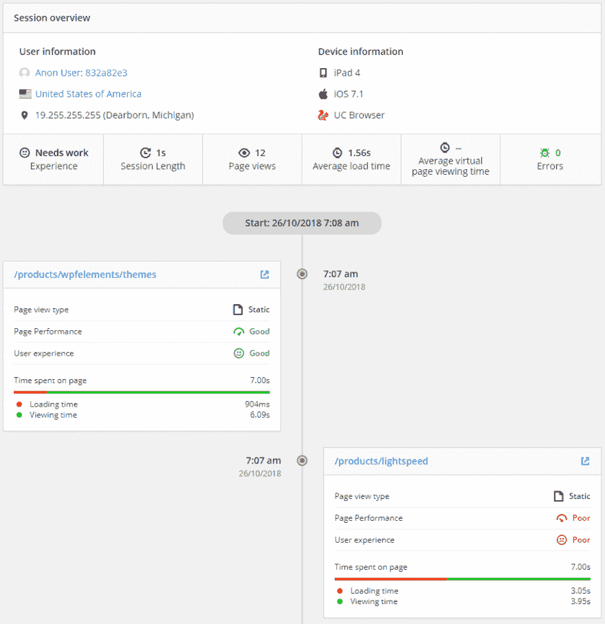

# 真实用户监控最佳实践

> 原文：<https://dev.to/raygun/real-user-monitoring-best-practices-m8g>

*原载于 [Raygun 博客](https://raygun.com/blog/real-user-monitroring-best-practices/)T3】*

客户体验正成为竞争对手之间的关键区别。其实，*已经是了！如果你的网站表现不佳，就会损害你的业务。提高这种性能的第一步是使用一个真正的用户监控工具来识别问题并监控您的改进进度。*

## 为什么我的站点需要出色的性能？

[谷歌](https://www.thinkwithgoogle.com/data/mobile-site-abandonment-three-second-load/) (2016)的研究显示，如果手机网站的加载时间超过三秒，53%的访问者会离开。其他研究也指向相同的方向。[谷歌](https://www.thinkwithgoogle.com/intl/en-145/perspectives/local-articles/why-great-mobile-experiences-should-be-priority-marketers/) (2017 年)估计，如果用户体验不佳，45%的用户不太可能再次访问该网站。

谷歌在移动领域进行了大量研究，但早在 2009 年，Akamai 委托进行的一项研究发现，40%的电子商务访问者会在网站加载不到三秒钟时离开网站。
来自真实研究的真实数据向我们展示了性能是用户体验的一个关键部分。许多潜在客户希望你的网站加载速度快，如果加载速度不快，他们通常不会再回来。

可惜[很多网站表现不好](https://www.thinkwithgoogle.com/intl/en-154/insights-inspiration/research-data/european-mobile-speed-rankings-are-how-does-your-site-compare/)。你的网站有多快？也许你觉得它很快，但是对你的潜在客户来说它加载得快吗？这就是真正的用户监控介入的地方。

## 真实用户监控的定义

让我们先在维基百科上找一个定义。它将真实用户监控定义为"[一种被动监控技术，记录用户与网站或客户端的所有交互，以及与服务器或基于云的应用程序的交互](https://en.wikipedia.org/wiki/Real_user_monitoring)。“被动”这个词在这里很重要。被动监控是一种在不干涉的情况下监控应用程序实际使用情况的方式。

相比之下，在主动监控中，您通常会在自动浏览器中运行某个脚本，并分析单个会话的结果。

主动监控非常有用，因为您可以在真实客户遇到情况之前进行模拟。被动监控是重要的，因为它允许您看到真实发生的事情，而不管您的测试场景如何。

有些事情可能与测试中的反应不同，您可能没有考虑到所有可能的情况，或者您可能无法测试每个可能的场景(如浏览器、地区、用户、网络速度或中断)。

那么，我们如何利用[真实用户监控](https://raygun.com/blog/real-user-monitoring-benefits/)来改善我们客户的体验，从而改善我们的业务呢？

## 第一步:衡量你的整体表现

在沉迷于细节之前，您应该对您的应用程序的性能有一个高层次的概述。在 Raygun，测量以下项目:

*   中值装载时间
*   平均装载时间
*   P90 加载时间
*   P99 装载时间

看看这张来自 Raygun 的截图:

让我简单解释一下这些术语的意思。

**中值加载时间**是您将测得的所有加载时间从低到高排序后得到的值，取中间值。这很好地表明了大多数用户需要等待多长时间。它指出了数据中的一个中心趋势。

平均加载时间通过将所有测量的总和除以测量次数来计算。平均值是观察集中趋势的另一种方式，但是容易被异常值扭曲。

最后， **P90** 和 **P99 加载时间**基本上是 90%或 99%的用户不得不等待你的应用程序的最长时间。因此，如果 P90 是三秒，那么 90%的请求在三秒或更短的时间内得到处理。

这些测量可以让您很好地了解应用程序的性能。至少，您应该监控这些指标。但是我们可以做得更好。正如前面提到的[，Raygun 的团队还监控:](https://raygun.com/blog/software-team-kpis/)

*   **受 bug 影响的用户**
*   解决的错误> =新的错误

对于第一个问题，提供一些观点是很重要的。我将引用链接的文章:“如果你有 10，000 个错误影响一个客户，这还不如 500 个错误影响 250 个客户。”因此，这个度量是决定给定 bug 优先级的一个很好的方法。Raygun 有助于显示这一点，因为它可以对错误进行分组，并向您显示有多少用户受到了影响。

测量新的和已解决的 bug 的数量可以让您看到您是增加了还是减少了 bug 的数量。这与测量 bug 发生的次数不同，后者是我们可以用前面的度量来测量的。

到目前为止，我提到的所有指标都提供了对应用程序状态的高度概述。拥有这些指标是构建的第一个基础。

没有它们，你将很难改善应用程序的用户体验。

## 第二步:你想在哪里？

那么现在你有了一组你正在监控的数字，你用它们做什么呢？什么是好的价值观？在什么时候你应该被警告事情开始变坏了？

我提到了几项研究，这些研究指出，如果一个网站不能在三秒钟内加载，用户就会离开这个网站。这似乎是一个转折点。所以你应该让你的应用程序或网站在三秒内做出响应。

你所有的请求都应该这么快加载吗？不，那是不现实的。不管你做什么，现实生活中的情况都会导致一些请求进展缓慢。

这就是为什么建议把你的 P90 的装载时间控制在三秒钟以内，也许把你的 T2 P99 的装载时间控制在五秒钟以内。

这为一小部分可能是离群值的请求留下了一些空间。

如果你在更大、更受欢迎的网站上工作，你会希望在高流量期间保持这些加载时间(比如说，如果你从事电子商务，你需要[确保网站在黑色星期五销售周末](https://raygun.com/retail-software-errors)的稳定性)。)

消费者和用户对速度慢的网站并不十分宽容，即使这是由于大量并发用户造成的。

## 第三步:将业务与绩效联系起来

好的，那么你知道你的高级指标，你知道你想要他们在哪里。下一步是真正开始跟踪和报告你的表现。您不希望手动分析服务器日志来确定这些数字。

最佳实践是拥有一个可以随时使用的工具。这个工具应该能够告诉你你目前的数字，以及你是如何发展的。你的 P90 是两秒吗？*好！*但几个月前是一秒吗？

嗯，你可能想调查一下到底发生了什么，因为你不想明年向 3 秒、5 秒或 10 秒进化！

在看到您的整体性能之后，您还可以更深入几个层次，分析某些用户正在经历的事情。也许某个特定地区的加载速度很慢？还是某些浏览器？

性能对业务有真正的影响。正如我提到的，如果你的网站太慢，用户会离开。在不久的将来，客户体验可能会成为关键的差异化因素。

Gartner 和[沃克](https://www.walkerinfo.com/knowledge-center/featured-research-reports/customers2020-1)过去曾报道过此事。只需快速浏览一下你最喜欢的社交媒体，你就会发现，当客户的体验低于平均水平时，他们会非常直言不讳。

**性能是客户体验的一个重要方面。**

这就是为什么你应该根据你从监控中获得的洞察力采取具体的行动。新功能并不是唯一要放在你的待办事项中的东西。杰夫·阿特伍德在 2011 年已经说过:[性能也是一个特点](https://blog.codinghorror.com/performance-is-a-feature/)。但是单纯要求开发者提高网站性能是行不通的。您想知道哪些具体部分应该首先改进，因为它们将对业务产生最大的影响。

## ray gun 如何帮助提高网站性能

到目前为止，我想我们都同意性能是客户体验的重要组成部分，客户体验已经并将继续对业务产生真正的影响。这意味着您需要认真对待性能，监控它，改进它，并在它恶化时迅速采取行动。

像 Raygun 这样的平台意味着你不必自己完成所有这些工作。Raygun 的[真实用户监测](https://raygun.com/platform/real-user-monitoring)让你洞察真实用户的体验。然后，您可以按照浏览器、地理位置和平台/操作系统对这些体验进行分组:

您可以获得网站的统计数据(如平均页面速度)或单个页面的统计数据(如请求最多或最慢的页面):

如果你愿意，你可以看到个人用户如何体验你的网站。甚至可以在你的网站上看到他们的不同会话:

当用户遇到麻烦时，您可以看到用户访问的不同页面以及他们所做的操作。这可以证明是查明问题的有价值的信息。

有了 Raygun，你可以找出你应该优先考虑的事情。也许你的网站在你的开发者没有测试的特定浏览器上表现特别差。很大一部分访问者可能来自离数据中心太远的地方。或者可能只是一些特定的页面给你的用户带来了不好的体验。

然后，崩溃报告和应用程序性能监控(APM)可以帮助您确定性能问题的确切原因；无论是服务器端还是软件错误。

## 真实用户监控改善您的业务

真实用户监控让你深入了解访客和潜在客户的体验。如果他们有不好的经历，他们会离开，可能永远不会回来。用户希望加载时间不超过三秒，因此性能是用户体验的重要组成部分。

您应该通过监控您当前的加载时间以及它们是如何变化的来实现这个三秒或更少的目标。除了这些全局指标之外，一个好的工具将允许您深入细节，如浏览器或区域。这为开发人员提供了必要的信息来确定问题的优先级和位置。

真正的用户监控以及您因此而采取的步骤会对您的业务产生重大影响。