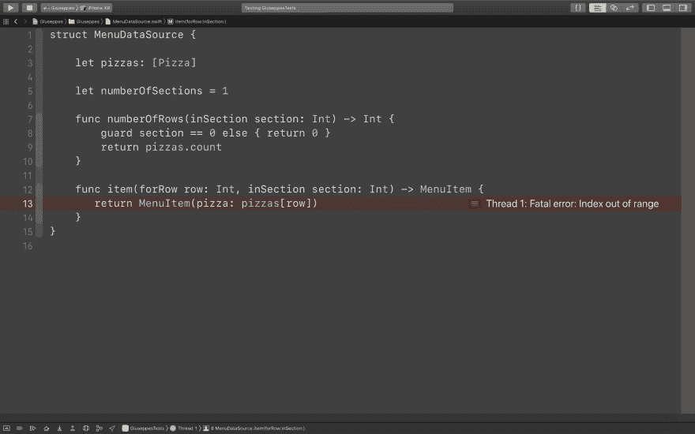

# 如何在 Swift 中进行 TDD，分步指南

> 原文：<https://dev.to/mokagio/how-to-tdd-in-swift-a-step-by-step-guide-8jg>

这是我的博客[mokacoding.com](https://www.mokacoding.com/blog/step-by-step-tdd-in-swift-part-1/)的一篇交叉文章。

有一种编写软件的方法可以最大限度地减少错误和意外行为的发生。以这种方式开发还会产生易于更改的小组件。

这种编写软件的方式是测试驱动开发。这篇文章展示了如何实践 TDD，以及它如何带来愉快而有效编码体验。

* * *

你最喜欢的披萨店的老板 Giuseppe 雇佣你为他的公司开发 iOS 应用程序。像聪明的开发者一样，你鼓励 Giuseppe 从小处着手，快速迭代。你们两个同意从他的顾客的数字菜单开始，来衡量它的接受度。

快速开发一个应用程序，同时确保它的行为符合预期的一个方法是将它的业务逻辑从输入和输出如何发送给用户的细节中分离出来。鲍勃叔叔在[的演讲](https://www.youtube.com/watch?v=HhNIttd87xs)和他的书[清洁建筑](https://geni.us/dM1KXD8)中阐述了这个想法。

我们应该将 iOS 视为我们的应用程序的交付层(T2 ),尽可能少地将业务逻辑实现放在这一层。想象你正在构建一个 CLI 应用程序，然后假装 iOS 是它的 GUI 包装器。理想情况下，任何业务逻辑都不应该`import UIKit`。

当 TDDing 是"**我能做的最小最简单的事情是什么？**”。开始开发这个应用程序时，我们能做的最小的东西是什么？朱塞佩的菜单有三个部分:披萨、饮料和甜点。让我们从一个只显示比萨饼的菜单应用程序开始。

只有披萨的这个版本的应用程序是我们的[行走骨架](http://wiki.c2.com/?WalkingSkeleton)，一个只有最低限度功能的应用程序，以确保所有组件都粘在一起，端到端地工作。

因为我们的业务逻辑的核心是将 Giuseppe 的菜单转换成可以显示的格式，所以让我们从它的一个组件开始，让我们称它为`MenuDataSource`。

**在进行 TDD 时，我们总是从测试**开始，所以让我们为`MenuDataSource`创建一个。在这篇文章中，我们将使用苹果的 [`XCTest` famework](https://developer.apple.com/documentation/xctest) ，但这并不是在 Swift 中编写测试的唯一选择。

```
@testable import Giuseppes
import XCTest

class MenuDataSourceTests: XCTestCase {
} 
```

Enter fullscreen mode Exit fullscreen mode

我们的测试应该描述并验证我们想要的`MenuDataSource`的**行为**。我们决定我们的行走骨架将只有比萨饼，所以让我们确保`MenuDataSource`只为菜单提供一个部分。

为了测试这种行为，我们首先需要一个`MenuDataSource`的实例。

```
@testable import Giuseppes
import XCTest

class MenuDataSourceTests: XCTestCase {

    func testHasOneSection() {
        let dataSource = MenuDataSource()
        // 🔴 Use of unresolved identifier 'MenuDataSource';
        // did you mean 'MenuDataSourceTests'?
    }
} 
```

Enter fullscreen mode Exit fullscreen mode

代码没有编译，因为我们还没有定义`MenuDataSource`。在 TDD 中，编译失败被认为是测试失败，我们的工作是**编写尽可能简单的代码来使测试通过**，在这种情况下这意味着编译。

为了编译测试，我们必须定义`MenuDataSource`。

```
struct MenuDataSource { } 
```

Enter fullscreen mode Exit fullscreen mode

注意，在这个`MenuDataSource`中没有属性或`init`参数。这意味着尽可能编写最简单的代码，只要代码足够通过测试即可。我们将只在我们需要它们来通过测试时才给类型添加属性。

既然测试已经编译好了，让我们继续断言`MenuDataSource`在被要求分段时的行为。

```
func testHasOneSection() {
    let dataSource = MenuDataSource()
    XCTAssertEqual(dataSource.numberOfSections, 1)
    // 🔴 Value of type 'MenuDataSource' has no member 'numberOfSections'
} 
```

Enter fullscreen mode Exit fullscreen mode

由于编译错误，我们再次测试失败。我们能写的最简单的代码是什么？

```
struct MenuDataSource {

    let numberOfSections = 1
} 
```

Enter fullscreen mode Exit fullscreen mode

再次注意，这里没有逻辑，只有一个硬编码的值。这足以让我们的测试编译通过，我们对此很满意。

```
@testable import Giuseppes
import XCTest

class MenuDataSourceTests: XCTestCase {

    func testHasOneSection() {
        let dataSource = MenuDataSource()
        XCTAssertEqual(dataSource.numberOfSections, 1)  // ✅
    }
} 
```

Enter fullscreen mode Exit fullscreen mode

一句警告。你不应该相信一个你没见过失败的测试。我们已经看到了由于编译错误而导致的测试失败，但是测试实际行为呢？将`MenuDataSource`中的硬编码 1 改为另一个值，并验证测试是否失败，这不会有什么坏处。

我们终于有一个通过测试，让我们承诺:`Implement MenuDataSource returning number of sections`。

下一步是什么？让我们添加一种方法来获取一个部分中的行数。

```
func testRowsInSection() {
    let dataSource = MenuDataSource()
    XCTAssertEqual(dataSource.numberOfRows(inSection: 0), ???)
} 
```

Enter fullscreen mode Exit fullscreen mode

等等，一个部分应该有多少行？如果我们的部分正在显示比萨饼，那么它应该有与要显示的比萨饼一样多的行。我们如何测试这种行为？我们需要一种方法来控制这个输入参数，例如我们可以在`init`时间向`MenuDataSource`传递要显示的披萨数组。

**为我们想要的行为编写测试的行为揭示了我们软件的设计细节**。我们没有预先决定`MenuDataSource`应该用一个`Array<Pizza>`初始化，我们让对它的需求[从测试中浮现](https://en.wikipedia.org/wiki/Emergent_Design)。

在解决这个问题之前，让我们将测试带入一个成功的状态。我们只能说行数应该总是 3。

```
func testRowsInSection() {
    let dataSource = MenuDataSource()
    XCTAssertEqual(dataSource.numberOfRows(inSection: 0), 3)
    // 🔴 Value of type 'MenuDataSource' has no member 'numberOfRows';
    // did you mean numberOfSections'?
} 
```

Enter fullscreen mode Exit fullscreen mode

让测试通过的最简单的方法是将结果硬编码为 3。

```
func numberOfRows(inSection section: Int) -> Int {
    return 3
} 
```

Enter fullscreen mode Exit fullscreen mode

```
func testRowsInSection() {
    let dataSource = MenuDataSource()
    XCTAssertEqual(dataSource.numberOfRows(inSection: 0), 3)  // ✅
} 
```

Enter fullscreen mode Exit fullscreen mode

让我们提交这个中间步骤。`Implement dummy number of rows in section`。

现在我们有了一个绿色测试，让我们开始用一组比萨饼初始化`MenuDataSource`。我们能写的最少的代码量是多少？我们总是从测试开始:

```
func testHasOneSection() {
    let dataSource = MenuDataSource(pizzas: [Pizza()])
    // 🔴 Use of unresolved identifier 'Pizza'
    XCTAssertEqual(dataSource.numberOfSections, 1)
}

func testRowsInSection() {
    let dataSource = MenuDataSource(pizzas: [Pizza(), Pizza(), Pizza()])
    // 🔴 Use of unresolved identifier 'Pizza'
    XCTAssertEqual(dataSource.numberOfRows(inSection: 0), 3)
} 
```

Enter fullscreen mode Exit fullscreen mode

编译器现在提示我们下一步，定义`Pizza`。

```
struct Pizza { } 
```

Enter fullscreen mode Exit fullscreen mode

向`Pizza`添加属性很有诱惑力，比如它的名字、价格和成分，但是我们不需要这些代码来通过测试。我们试图解决的问题不是写一个全面的`Pizza`，而是确保我们可以通过`Pizza` s 来显示给`MenuDataSource`。 **TDD 就是解决一个接一个的小问题。**

如果我们再次尝试运行测试，我们将得到一个新的错误:

```
func testHasOneSection() {
    let dataSource = MenuDataSource(pizzas: [Pizza()])
    // 🔴 Argument passed to call that takes no arguments
    XCTAssertEqual(dataSource.numberOfSections, 1)
}

func testRowsInSection() {
    let dataSource = MenuDataSource(pizzas: [Pizza(), Pizza(), Pizza()])
    // 🔴 Argument passed to call that takes no arguments
    XCTAssertEqual(dataSource.numberOfRows(inSection: 0), 3)
} 
```

Enter fullscreen mode Exit fullscreen mode

让我们将新的`Pizza`的数组作为参数传递给`MenuDataSource`的`init`方法。

```
struct MenuDataSource {

    let pizzas: [Pizza]
} 
```

Enter fullscreen mode Exit fullscreen mode

```
func testHasOneSection() {
    let dataSource = MenuDataSource(pizzas: [Pizza()])
    XCTAssertEqual(dataSource.numberOfSections, 1)  // ✅
}

func testRowsInSection() {
    let dataSource = MenuDataSource(pizzas: [Pizza(), Pizza(), Pizza()])
    XCTAssertEqual(dataSource.numberOfRows(inSection: 0), 3)  // ✅
} 
```

Enter fullscreen mode Exit fullscreen mode

现在测试又通过了，所以让我们提交，即使我们还没有实现读取`Pizza`的逻辑。`Pass [Pizza] to MenuDataSource init`。

提交通常会使 TDD 更容易。我们一次移动一点点，如果我们最终发现一些不工作的东西，我们只需要审查很少的代码。您甚至可以放弃那些未分级的更改，从头开始。不要担心 Git 历史会变长，提交存储起来很便宜。如果你想在你的修改被合并之前有一个更紧凑的历史，你总是可以[做一个交互式的重置](https://thoughtbot.com/blog/git-interactive-rebase-squash-amend-rewriting-history)并整理它。

接下来，让我们编写最简单的代码，让`MenuDataSource`根据给定的`[Pizza]`返回一些行。

```
// MenuDataSource.swift
func numberOfRows(inSection section: Int) -> Int {
    return pizzas.count
} 
```

Enter fullscreen mode Exit fullscreen mode

测试仍然是绿色的，所以我们的更改是行为的有效实现。我们来提交这个小改动:`Return number of menu rows based on input [Pizza]`。

我们的下一步是什么？在继续实现下一个行为之前，让我们看看我们是如何测试`numberOfRows(inSection:)`的。我们考虑过它所有可能的行为吗？要回答这个问题，我们可以看看它的输入参数，该方法是否应该为每个输入返回相同的输出？如果提供的`section`索引与菜单中的任何部分都不匹配——目前只有一个——该怎么办？假设这个方法叫做“行数”，那么合理的做法是返回 0。让我们为这个场景编写一个测试。

```
func testRowsInOutOfBoundsSectionIsZero() {
    let dataSource = MenuDataSource(pizzas: [Pizza(), Pizza(), Pizza()])
    XCTAssertEqual(dataSource.numberOfRows(inSection: 1), 0)
    // ❌ XCTAssertEqual failed: ("3") is not equal to ("0")
    XCTAssertEqual(dataSource.numberOfRows(inSection: -1), 0)
    // ❌ XCTAssertEqual failed: ("3") is not equal to ("0")
} 
```

Enter fullscreen mode Exit fullscreen mode

测试失败了，你对此并不惊讶，是吗？当前版本的`numberOfRows(inSection:)`总是返回比萨饼的数量。让我们写尽可能少的代码来通过测试。

```
func numberOfRows(inSection section: Int) -> Int {
    guard section == 0 else { return 0 }
    return pizzas.count
} 
```

Enter fullscreen mode Exit fullscreen mode

```
func testRowsInOutOfBoundsSectionIsZero() {
    let dataSource = MenuDataSource(pizzas: [Pizza(), Pizza(), Pizza()])
    XCTAssertEqual(dataSource.numberOfRows(inSection: 1), 0)  // ✅
    XCTAssertEqual(dataSource.numberOfRows(inSection: -1), 0) // ✅
} 
```

Enter fullscreen mode Exit fullscreen mode

我们做出了改变，测试也通过了，是时候提交了。

下一步，让`MenuDataSource`返回给定部分和行要显示的内容。让返回值成为一个独特的类型是很有用的，我们称之为`MenuItem`。这比返回一个`Pizza`更好的原因是它引入了数据域(比萨饼)和 UI 域(菜单项)之间的分离。这种分离允许我们在不影响另一个域的情况下改变其中一个域，只改变在两个域之间转换的代码。

但是我们如何验证方法返回的`MenuItem`是我们期望的那个呢？或者说，我们能做的最简单的事情是什么来验证方法返回的`MenuItem`是预期的那个？使用 pizza 名称似乎是一个很好的选择，如果一个 pizza 被命名为“Margherita”，那么`MenuItem`也应该有`title`“Margherita”。

```
func testItemForRowAndSection() {
    let dataSource = MenuDataSource(pizzas: [Pizza(), Pizza(), Pizza()])
    XCTAssertEqual(dataSource.item(forRow: 0, inSection: 0).title, "Margherita") 
    // 🔴 Value of type 'MenuDataSource' has no member 'item'
} 
```

Enter fullscreen mode Exit fullscreen mode

为了通过测试，我们可以编写的最简单的代码是让`MenuItem`和`title`总是“Margherita”。

```
// in MenuItemDataSource.swift
func item(forRow row: Int, inSection section: Int) -> MenuItem {
   return MenuItem()
}

// in MenuItem.swift
struct MenuItem {

    let title = "Margherita"
} 
```

Enter fullscreen mode Exit fullscreen mode

```
func testItemForRowAndSection() {
    let dataSource = MenuDataSource(pizzas: [Pizza(), Pizza()])
    XCTAssertEqual(dataSource.item(forRow: 0, inSection: 0).title, "Margherita")  // ✅
} 
```

Enter fullscreen mode Exit fullscreen mode

我们有一个绿色测试，它不可否认地是不完整的，但仍然足够我们有一个坚实的基础来建立。来犯吧:`Implement dummy item(forRow:, inSection:) in MenuDataSource`。

我们的测试还没有测试“如果一个比萨饼被命名为‘玛格丽塔’”的行为。为了改进我们的测试，我们需要一种方法给它起不同的名字。是时候用一个`name`属性来扩展`Pizza`的定义了。

在对`Pizza` `init`及其消费者进行更改之前，让我们使更改变得容易些。用肯特·贝克的话说，“让改变变得容易，警告这可能很难，然后让改变变得容易”。

使改变更容易的一个方法是减少代码中直接初始化`Pizza`的地方。我们可以使用[夹具延伸](https://www.mokacoding.com/blog/streamlining-tests-setup-with-fixtures-in-swift/)来完成。

```
@testable import Giuseppes

extension Pizza {

    static func fixture() -> Pizza {
        return Pizza()
    }
} 
```

Enter fullscreen mode Exit fullscreen mode

这个扩展现在不做任何事情，但是它会使改变`Pizza`的`init`变得更容易，因为我们只需要更新 fixture，而不是所有的测试。

```
func testHasOneSection() {
    let dataSource = MenuDataSource(pizzas: [.fixture()])
    XCTAssertEqual(dataSource.numberOfSections, 1) // ✅
}

func testRowsInSection() {
    let dataSource = MenuDataSource(pizzas: [.fixture(), .fixture(), .fixture()])
    XCTAssertEqual(dataSource.numberOfRows(inSection: 0), 3) // ✅
}

func testRowsInOutOfBoundsSectionIsZero() {
    let dataSource = MenuDataSource(pizzas: [.fixture(), .fixture(), .fixture()])
    XCTAssertEqual(dataSource.numberOfRows(inSection: 1), 0) // ✅
    XCTAssertEqual(dataSource.numberOfRows(inSection: -1), 0) // ✅
}

func testItemForRowAndSection() {
    let dataSource = MenuDataSource(pizzas: [.fixture(), .fixture()])
    XCTAssertEqual(dataSource.item(forRow: 0, inSection: 0).title, "Margherita") // ✅
} 
```

Enter fullscreen mode Exit fullscreen mode

提交时间。

既然我们已经使改变变得容易了，现在让我们进行简单的改变。一如既往，我们从测试开始。

```
func testItemForRowAndSection() {
    let dataSource = MenuDataSource(
        pizzas: [.fixture(name: "Margherita"), .fixture(name: "Capricciosa")]
        // 🔴 Argument passed to call that takes no arguments
    )
    XCTAssertEqual(dataSource.item(forRow: 0, inSection: 0).title, "Margherita")
} 
```

Enter fullscreen mode Exit fullscreen mode

测试没有编译，因为`Pizza`和它的 fixture 没有`name`。在这里，您可以看到夹具是如何使更改测试变得更加容易的。通过默认`name`参数，我们使得所有调用`.fixture()`的测试都不需要更新，除非我们想通过传递一个自定义参数来测试直接依赖于该值的行为。

```
// Pizza.swift
struct Pizza {

    let name: String
}

// Pizza+Fixture.swift
extension Pizza {

    static func fixture(name: String = "Margherita") -> Pizza {
        return Pizza(name: name)
    }
} 
```

Enter fullscreen mode Exit fullscreen mode

```
func testHasOneSection() {
    let dataSource = MenuDataSource(pizzas: [.fixture()])
    XCTAssertEqual(dataSource.numberOfSections, 1) // ✅
}

func testRowsInSection() {
    let dataSource = MenuDataSource(pizzas: [.fixture(), .fixture(), .fixture()])
    XCTAssertEqual(dataSource.numberOfRows(inSection: 0), 3) // ✅
}

func testRowsInOutOfBoundsSectionIsZero() {
    let dataSource = MenuDataSource(pizzas: [.fixture(), .fixture(), .fixture()])
    XCTAssertEqual(dataSource.numberOfRows(inSection: 1), 0) // ✅
    XCTAssertEqual(dataSource.numberOfRows(inSection: -1), 0) // ✅
}

func testItemForRowAndSection() {
    let dataSource = MenuDataSource(
        pizzas: [.fixture(name: "Margherita"), .fixture(name: "Capricciosa")]
    )
    XCTAssertEqual(dataSource.item(forRow: 0, inSection: 0).title, "Margherita") // ✅
} 
```

Enter fullscreen mode Exit fullscreen mode

你知道接下来是什么吗？提交:`Add name property to Pizza`。

这一次，让我们添加另一个测试来证明我们现在拥有的代码是不正确的，而不是直接替换虚拟实现。这种技术被称为三角测量(即使我们只使用了两个断言)。

```
func testItemForRowAndSection() {
    let dataSource = MenuDataSource(
        pizzas: [.fixture(name: "Margherita"), .fixture(name: "Capricciosa")]
    )
    XCTAssertEqual(dataSource.item(forRow: 0, inSection: 0).title, "Margherita") // ✅
    XCTAssertEqual(dataSource.item(forRow: 1, inSection: 0).title, "Capricciosa")
    // ❌ XCTAssertEqual failed: ("Margherita") is not equal to ("Capricciosa")
} 
```

Enter fullscreen mode Exit fullscreen mode

让我们写一个合适的实现:

```
// MenuDataSource.swift
func item(forRow row: Int, inSection section: Int) -> MenuItem {
   return MenuItem(pizza: pizzas[row])
}

// MenuItem.swift
struct MenuItem {

    let title: String
}

extension MenuItem {

    init(pizza: Pizza) {
        self.init(title: pizza.name)
    }
} 
```

Enter fullscreen mode Exit fullscreen mode

```
func testItemForRowAndSection() {
    let dataSource = MenuDataSource(
        pizzas: [.fixture(name: "Margherita"), .fixture(name: "Capricciosa")]
    )
    XCTAssertEqual(dataSource.item(forRow: 0, inSection: 0).title, "Margherita") // ✅
    XCTAssertEqual(dataSource.item(forRow: 1, inSection: 0).title, "Capricciosa") // ✅
} 
```

Enter fullscreen mode Exit fullscreen mode

提交`Provide actual implementation for item(forRow:, inSection:)`

就像我们对`numbe of rows`所做的那样，我们应该问自己是否已经涵盖了所有可能的输入类型的行为。如果我们给出一个不匹配的节索引会发生什么？一排怎么样？如果行和节对与支持数据不匹配，那么返回“nothing”似乎是合适的。Swift 漂亮的`Optional`型是描述这种场景的最佳工具。

```
func testItemForOutOfBoundsRowAndSectionIsNil() {
    let dataSource = MenuDataSource(
        pizzas: [.fixture(name: "Margherita"), .fixture(name: "Capricciosa")]
    )
    XCTAssertNil(dataSource.item(forRow: 2, inSection: 0))
    XCTAssertNil(dataSource.item(forRow: 0, inSection: 1))
    XCTAssertNil(dataSource.item(forRow: 2, inSection: 1))
    XCTAssertNil(dataSource.item(forRow: -1, inSection: -1))
} 
```

Enter fullscreen mode Exit fullscreen mode

[](https://res.cloudinary.com/practicaldev/image/fetch/s--qF2bPVlh--/c_limit%2Cf_auto%2Cfl_progressive%2Cq_auto%2Cw_880/https://s3.amazonaws.com/mokacoding/2019-02-07-tdd-28.png)

现在运行测试会导致崩溃，毕竟我们访问的是一个越界数组。我们能修理它的最简单的方法是什么？

```
func item(forRow row: Int, inSection section: Int) -> MenuItem? {
    guard row >= 0, pizzas.count > row else { return .none }
    return MenuItem(pizza: pizzas[row])
} 
```

Enter fullscreen mode Exit fullscreen mode

```
func testItemForRowAndSection() {
    let dataSource = MenuDataSource(
        pizzas: [.fixture(name: "Margherita"), .fixture(name: "Capricciosa")]
    )
    XCTAssertEqual(dataSource.item(forRow: 0, inSection: 0).title, "Margherita")
    // 🔴 Value of optional type 'MenuItem?' must be unwrapped to refer to member 'title'
    // of wrapped base type 'MenuItem'
    XCTAssertEqual(dataSource.item(forRow: 1, inSection: 0).title, "Capricciosa")
    // 🔴 Value of optional type 'MenuItem?' must be unwrapped to refer to member 'title'
    // of wrapped base type 'MenuItem'
} 
```

Enter fullscreen mode Exit fullscreen mode

请注意，`item(forRow:, inSection:)`的类型签名从`-> MenuItem`到`-> MenuItem?`的变化破坏了测试。我们需要更新对方法的其他调用，以考虑新的可选性。

```
func testItemForRowAndSection() {
    let dataSource = MenuDataSource(
        pizzas: [.fixture(name: "Margherita"), .fixture(name: "Capricciosa")]
    )
    XCTAssertEqual(dataSource.item(forRow: 0, inSection: 0)?.title, "Margherita") // ✅
    XCTAssertEqual(dataSource.item(forRow: 1, inSection: 0)?.title, "Capricciosa") // ✅
}

func testItemForOutOfBoundsRowAndSectionIsNil() {
    let dataSource = MenuDataSource(
        pizzas: [.fixture(name: "Margherita"), .fixture(name: "Capricciosa")]
    )
    XCTAssertNil(dataSource.item(forRow: 2, inSection: 0)) // ✅
    XCTAssertNil(dataSource.item(forRow: 0, inSection: 1))
    // ❌ XCTAssertNil failed: "MenuItem(title: "Margherita")"
    XCTAssertNil(dataSource.item(forRow: 2, inSection: 1)) // ✅
    XCTAssertNil(dataSource.item(forRow: -1, inSection: -1)) // ✅
} 
```

Enter fullscreen mode Exit fullscreen mode

没有崩溃，但是出界部分的测试仍然失败。这是因为在上面的代码中，我们只检查了行。让我们全面检查一下。

```
func item(forRow row: Int, inSection section: Int) -> MenuItem? {
    guard section == 0 else { return .none }
    guard row >= 0, pizzas.count > row else { return .none }

    return MenuItem(pizza: pizzas[row])
} 
```

Enter fullscreen mode Exit fullscreen mode

```
func testItemForOutOfBoundsRowAndSectionIsNil() {
    let dataSource = MenuDataSource(
        pizzas: [.fixture(name: "Margherita"), .fixture(name: "Capricciosa")]
    )
    XCTAssertNil(dataSource.item(forRow: 2, inSection: 0)) // ✅
    XCTAssertNil(dataSource.item(forRow: 0, inSection: 1)) // ✅
    XCTAssertNil(dataSource.item(forRow: 2, inSection: 1)) // ✅
    XCTAssertNil(dataSource.item(forRow: -1, inSection: -1)) // ✅
} 
```

Enter fullscreen mode Exit fullscreen mode

所有的考验都过去了，快乐的日子。提交:`Address out of range behaviour of item(forRow:, inSection:)`。

现在，我们的披萨菜单有了一个功能正常的数据源。🎉。下一步是将它输入视图控制器，以便向用户显示该信息。我们当然也可以用测试来驱动这个实现，但是这超出了本文的范围。

下面是如何使用`MenuDataSource`来支持一个`UITableView`。

```
extension MenuViewController: UITableViewDataSource {

    func numberOfSections(in tableView: UITableView) -> Int {
        return menuDataSource.numberOfSections
    }

    func tableView(_ tableView: UITableView, numberOfRowsInSection section: Int) -> Int {
        return menuDataSource.numberOfRows(inSection: section)
    }

    func tableView(_ tableView: UITableView, cellForRowAt indexPath: IndexPath) -> UITableViewCell {
        let cell = tableView.dequeueReusableCell(withIdentifier: cellIdentifier, for: indexPath)
        guard let item = menuDataSource.item(forRow: indexPath.row, inSection: indexPath.section) else {
            return cell
        }

        cell.textLabel?.text = item.title

        return cell
    }
} 
```

Enter fullscreen mode Exit fullscreen mode

## “太慢了”

我从开发人员和管理人员那里得到的一个普遍观察是 TDDing 需要更长的时间。“如果没有测试，我写这篇文章的时间会少得多。”当然，会有的。但是构建一个软件产品不仅仅是写代码的问题，我们还需要确保代码的行为符合预期，并且能够轻松地修改代码。

最重要的是，当你只有一个屏幕时，这可能看起来有点大材小用，但大多数应用程序并不只有一个屏幕或一个功能，不是吗？例如，如果我们要为菜单中的每个项目添加一个详细的屏幕，以验证该屏幕的行为，我们将必须始终导航到它。如果测试涵盖了大部分行为，我们可以简单地通过运行测试来验证它，并且只在需要验证 UI 细节时才启动和浏览应用程序，从而节省大量时间。

当用测试驱动你的实现时，你在编写阶段要慢一点，以便在开发过程的所有其他步骤中快一点。同样重要的是要注意，当你获得更多时间的 TDD 时，你会做得更快。测试驱动代码库的成熟也有助于更快地编写测试，因为您已经有了很多基础设施。

## 重述

我们已经看到了如何编写测试驱动的软件。过程很简单:

*   为您希望拥有的代码编写一个测试，它会失败，因为代码还没有出现。
*   使用失败的测试作为反馈来实现足够的代码以使测试通过。
*   一旦你通过了测试，让底层代码变得更好。

换句话说:红色、绿色、提交、重构、提交。

这种简单性是它强大的原因。编写足够多的测试代码来获得失败，然后足够多的代码来使它通过意味着你总是在解决小问题。这种持续快速的反馈循环就是一个[流量](https://geni.us/StUP)诱导过程。就像运动员和喜剧演员都知道的那样，你的反馈循环越快，你进步的就越快。

**TDD 不仅仅是一种写代码的方式，更是一种商业理念**。这是一种以小的增量步骤构建产品，同时不断获得反馈的方法，从单个功能的微观层面，到下一版本迭代的宏观层面。

* * *

👉📬如果你喜欢阅读此文[,请点击这里](http://eepurl.com/dEr0DH),在你的收件箱里收到类似这样的新帖子。