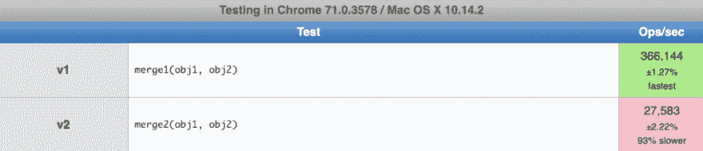

# JavaScript 中复制对象的 4 种不同技术

> 原文：<https://dev.to/bnevilleoneill/4-different-techniques-for-copying-objects-in-javascript-5fog>

#### (以及如何实现它们)

[](https://res.cloudinary.com/practicaldev/image/fetch/s--iXI5l3DW--/c_limit%2Cf_auto%2Cfl_progressive%2Cq_auto%2Cw_880/https://cdn-images-1.medium.com/max/668/1%2Ahcws3Wa6u9IqaEZ_4X04uw.jpeg)

当使用函数式编程时，一个好的经验法则是总是创建新的对象，而不是改变旧的对象。这样做，我们可以确保我们对对象结构的干预不会影响应用程序中一些看似不相关的部分，从而使整个代码更加可预测。

我们如何确切地确定我们对一个对象所做的更改不会影响到其他地方的代码呢？完全删除不需要的引用似乎是个好主意。要去掉一个引用，我们需要将对象的所有属性复制到一个新对象中。有许多方法可以做到这一点，每种方法产生的结果都略有不同。我们就来看看最流行的:*浅抄*、*深抄*、*合并*和*赋值*。

对于我们分析的每一种方法，我们都会看到两种不同的变化——每一种都有略微不同的结果。此外，除了列出每种方法的优缺点之外，我们还将根据它们的性能来比较这些变化。我还将提供在实际应用程序中使用的生产就绪等价物的链接。

如果你想看到给定解决方案的完整代码，只需点击标题。该链接会将您重定向到 [Github 库](https://github.com/maciejcieslar/object-guide)。

[](https://logrocket.com/signup/)

### 1。[浅抄](https://github.com/maciejcieslar/object-guide/tree/master/src/shallow)

对于*浅层复制，*对象意味着简单地创建一个具有完全相同的属性集的新对象。我们称这个副本为*浅*，因为目标对象中的属性仍然可以保存对源对象中属性的引用。

然而，在我们开始实现之前，让我们先写一些测试，以便稍后我们可以检查是否一切都按预期工作。

### 测试

```
const testShallow = (shallowFn: ShallowFn) => {
 const obj1 = { prop1: true, prop2: { prop3: true } }

 const copiedObj1 = shallowFn(obj1)

 expect(copiedObj1).not.toBe(obj1)
 expect(copiedObj1.prop2).toBe(obj1.prop2)
 expect(copiedObj1).toEqual(obj1)
}

describe('shallow v1 (spread operator)', () => {
 it('copies an object shallowly', () => {
   return testShallow(shallowv1)
 })
})

describe('shallow v2 (copy props)', () => {
 it('copies an object shallowly', () => {
   return testShallow(shallowv2)
 })
}) 
```

### 版本 1

在这个版本中，我们将使用 *spread* 操作符来复制对象。

```
function shallow<T extends object>(source: T): T {
 return {
   ...source,
 }
} 
```

### 第二版

在这里，我们创建一个新对象，并从源对象中复制每个属性。

```
function shallow<T extends object>(source: T): T {
 const copy = {} as T

 Object.keys(source).forEach((key) => {
   copy[key] = source[key]
 })

 return copy
} 
```

### 性能测试

[](https://res.cloudinary.com/practicaldev/image/fetch/s--t-UkXozp--/c_limit%2Cf_auto%2Cfl_progressive%2Cq_auto%2Cw_880/https://cdn-images-1.medium.com/max/1024/0%2Adg4YpLNrkbgOpgZr)

正如我们所看到的，带有 *spread* 操作符的第一个版本更快。这很可能是由于*传播*操作符已经针对这种用途进行了优化，特别是**。**

[点击此处](https://jsperf.com/shallow-object-copy-maciej-cieslar)自行测试。

### 何时使用

每当我们想要丢失对源对象的引用，但几乎不关心对任何嵌套属性的引用时，例如从函数返回时，应该使用浅层复制。

### 生产就绪当量

lodash . clone()

### 2。[深度复制](https://github.com/maciejcieslar/object-guide/tree/master/src/deep)

当我们制作一个*深度副本*时，我们创建了一个全新的对象，它不包含对原始对象的引用。

### 测试

```
const testDeep = (deepFn: DeepFn) => {
 const obj1 = { one: true }

 expect(deepFn(obj1)).not.toBe(obj1)

 const obj2 = {
   prop1: {
     prop2: {
       prop3: {
         prop: true,
       },
       prop4: [1, 2, 3, 4, 5],
     },
   },
 }

 const copiedObj2 = deepFn(obj2)

 expect(copiedObj2).not.toBe(obj2)
 expect(copiedObj2.prop1.prop2.prop4).not.toBe(obj2.prop1.prop2.prop4)
 expect(copiedObj2).toEqual(obj2)
}

describe('deep v1 (resursively)', () => {
 it('copies an object completely', () => {
   return testDeep(deepv1)
 })
})

describe('deep v2 (JSON.parse/JSON.stringify)', () => {
 it('copies an object completely', () => {
   return testDeep(deepv2)
 })
}) 
```

### 版本 1

我们的第一个实现递归工作。我们编写了一个深度函数，它检查发送给它的参数的类型，或者调用一个适当的函数来确定参数是数组还是对象，或者简单地返回参数的值(如果它既不是数组也不是对象)。

```
function deep<T>(value: T): T {
 if (typeof value !== 'object' || value === null) {
   return value
 }

 if (Array.isArray(value)) {
   return deepArray(value)
 }

 return deepObject(value)
} 
```

deepObject 函数获取对象的所有键，并对它们进行迭代，为每个值递归调用 deep 函数。

```
function deepObject<T>(source: T) {
 const result = {}

 Object.keys(source).forEach((key) => {
   const value = source[key]

   result[key] = deep(value)
 }, {})

 return result as T
} 
```

因此，deepArray 对提供的数组进行迭代，对数组中的每个值调用 deep。

```
function deepArray<T extends any[]>(collection: T) {
 return collection.map((value) => {
   return deep(value)
 })
} 
```

### 第二版

现在，让我们采取不同的方法。我们的目标是创建一个新对象，而不引用前一个对象，对吗？那我们为什么不使用 JSON 对象呢？首先，我们对对象进行字符串化，然后解析得到的字符串。我们得到的是一个完全不知道其来源的新物体。

注意:在前面的解决方案中，对象的方法被保留，但在这里却没有。JSON 格式不支持函数，因此它们被一起删除了。

```
function deep<T extends object>(source: T): T {
 return JSON.parse(JSON.stringify(source))
} 
```

### 性能测试

[](https://res.cloudinary.com/practicaldev/image/fetch/s--PJstwJOl--/c_limit%2Cf_auto%2Cfl_progressive%2Cq_auto%2Cw_880/https://cdn-images-1.medium.com/max/1024/0%2AiB1DCw3PYbKBlzUw)

我们可以看到第一个版本更快。

[点击此处](https://jsperf.com/deep-object-copy-maciej-cieslar)自行测试。

### 何时使用

每当我们觉得可能需要在更深的层次上改变给定的对象(嵌套对象/数组)时，应该使用深度复制。然而，我建议只在绝对必要的时候使用它，因为当处理大量对象时，它经常会降低程序的速度。

### 生产就绪当量

[lodash.cloneDeep()](https://lodash.com/docs/4.17.11#cloneDeep)

### 3。[分配](https://github.com/maciejcieslar/object-guide/tree/master/src/assign)

这里，我们将获取多个源并将它们各自的属性浅拷贝到一个目标，因此这看起来非常像 Object.assign 的实现。

### 测试

```
describe('assign v1 (copy props)', () => {
 it('assigns objects properties correctly', () => {
   const obj1 = { one: true }
   const obj2 = { two: true }

   expect(assignv1(obj1, obj2)).toEqual({ one: true, two: true })
 })

 it('mutates the target', () => {
   const obj1 = { one: true }
   const obj2 = { two: true }

   assignv1(obj1, obj2)

   expect(obj1).toEqual({ one: true, two: true })

   const obj3 = { three: true }
   const obj4 = { four: true }
   const obj5 = assignv1({}, obj3, obj4)

   expect(obj5).not.toBe(obj3)
   expect(obj5).not.toBe(obj4)
   expect(obj5).toEqual({ three: true, four: true })
 })
})

describe('assign v2 (spread operator)', () => {
 it('assigns objects properties correctly', () => {
   const obj1 = { one: true }
   const obj2 = { two: true }

   expect(assignv2(obj1, obj2)).toEqual({ one: true, two: true })
 })

 it('does not mutate the target', () => {
   const obj1 = { one: true }
   const obj2 = { two: true }

   const obj3 = assignv2(obj1, obj2)

   expect(obj1).not.toEqual({ one: true, two: true })
   expect(obj3).not.toBe(obj1)
   expect(obj3).toEqual({ one: true, two: true })
 })
}) 
```

### 版本 1

这里，我们只是将每个源对象的属性复制到目标对象，为了防止变异，我们通常将它作为{}传递。

```
const assign = (target: object, ...sources: object[]) => {
 sources.forEach((source) => {
   return Object.keys(source).forEach((key) => {
     target[key] = source[key]
   })
 })

 return target
} 
```

### 第二版

这是一个安全的版本，在这个版本中，我们没有改变目标对象，而是创建了一个全新的对象，并在稍后将其赋给一个变量。这意味着我们根本不需要传递目标参数。不幸的是，这个版本不能使用关键字 this，因为它不能被重新分配。

```
const assign = (...sources: object[]) => {
 return sources.reduce((result, current) => {
   return {
     ...result,
     ...current,
   }
 }, {})
} 
```

### 性能测试

[](https://res.cloudinary.com/practicaldev/image/fetch/s--4w2qgQm6--/c_limit%2Cf_auto%2Cfl_progressive%2Cq_auto%2Cw_880/https://cdn-images-1.medium.com/max/1024/0%2Ah5EE_HZ3i7qmupv1)

第一个版本要快得多，因为它直接改变(“变异”)目标对象，而第二个版本为每个源创建一个新对象。

[点击此处](https://jsperf.com/assign-object-maciej-cieslar)自行测试。

### 何时使用

版本 1 是赋值函数的标准实现。通过将{}作为目标进行传递，我们可以确保没有对象发生变异。每当需要给一个现有的对象分配一些新的属性时，我们就会使用 assign，例如:

```
// safe

const props = Object.assign({}, defaultProps, passedProps)

// with mutations

const props = {}

Object.assign(props, defaultProps, passedProps) 
```

### 生产就绪当量

[Object.assign()](https://developer.mozilla.org/en-US/docs/Web/JavaScript/Reference/Global_Objects/Object/assign) 或 [lodash.assign()](https://lodash.com/docs/4.17.11#assign) 。

### 4。[合并](https://github.com/maciejcieslar/object-guide/tree/master/src/merge)

这个函数的工作方式类似于 *assign* ，但是它不是替换目标中的属性，而是实际上邻接它们。如果一个值是一个数组或者一个对象，这个函数也会递归地合并属性。不像对象的属性(不是数组也不是对象)只是简单地用*赋值*，未定义的属性被完全忽略。

### 测试

```
const testMerge = (mergeFn: MergeFn) => {
 const obj1 = {
   prop1: {
     prop2: {
       prop3: [1, 2, 6],
       prop4: true,
       prop5: false,
       prop6: [{ abc: true, abcd: true }],
     },
   },
 }
 const obj2 = {
   prop1: {
     prop2: {
       prop3: [1, 2, undefined, 4, 5],
       prop4: false,
       prop6: [{ abc: false }],
     },
     prop7: true,
   },
 }

 expect(mergeFn({}, obj1, obj2)).toEqual({
   prop1: {
     prop2: {
       prop3: [1, 2, 6, 4, 5],
       prop4: false,
       prop5: false,
       prop6: [{ abc: false, abcd: true }],
     },
     prop7: true,
   },
 })
}

describe('merge v1 (recursively)', () => {
 it('it merges provided objects into one', () => {
   return testMerge(mergev1)
 })
})

describe('merge v2 (flatten props)', () => {
 it('it merges provided objects into one', () => {
   return testMerge(mergev2)
 })
}) 
```

### 版本 1

我们现在要看的与我们的*深度复制*函数的第一个版本有些相似。这是因为我们将使用函数的递归用法。

函数 mergeValues 接受两个参数:目标和源。如果两个值都是对象，我们调用并返回 mergeObjects，将前面提到的目标和源作为参数。类似地，当两个值都是数组时，我们调用并返回 mergeArrays。如果源是未定义的，我们只保留先前的值，这意味着我们返回目标参数。如果以上都不适用，我们只返回源参数。

```
function mergeValues(target: any, source: any) {
 if (isObject(target) && isObject(source)) {
   return mergeObjects(target, source)
 }

 if (Array.isArray(target) && Array.isArray(source)) {
   return mergeArrays(target, source)
 }

 if (source === undefined) {
   return target
 }

 return source
} 
```

mergeArrays 和 mergeObjects 的工作方式是一样的:我们获取源属性并在目标中的同一个键下设置它们。

```
function mergeObjects(target: object, source: object) {
 Object.keys(source).forEach((key) => {
   const sourceValue = source[key]
   const targetValue = target[key]

   target[key] = mergeValues(targetValue, sourceValue)
 })

 return target
}

function mergeArrays(target: any[], source: any[]) {
 source.forEach((value, index) => {
   target[index] = mergeValues(target[index], value)
 })

 return target
} 
```

现在剩下要做的就是创建一个合并函数:

```
const merge = (target: object, ...sources: object[]) => {
 sources.forEach((source) => {
   return mergeValues(target, source)
 })

 return target
} 
```

### 第二版

这种方法对你来说可能看起来很奇怪，因为我们可以很容易地预测它会变得更慢。然而，从不同的角度来看我们可以解决同一个问题是值得的。

这里的想法是，我们希望首先获得源对象的所有属性——即使它们嵌套了三个对象——并保存到它们的路径。这将允许我们在目标对象内部的正确路径上设置值。

路径是一个字符串数组，看起来像这样: *['firstObject '，' secondObject '，' propertyName']* 。

这里有一个如何工作的例子:

```
const source = {
 firstObject: {
   secondObject: {
     property: 5,
   },
 },
}

console.log(getValue(source))

// [[[{ value: 5, path: ['firstObject', 'secondObject', 'property']}]]] 
```

我们调用 getValue 函数来获取包含路径和值的对象数组。让我们来看看这个函数是如何工作的。如果参数值为空或者不像我们简单地说的那样是对象，因为我们不能再深入了，返回一个包含参数值及其路径的对象。

否则，如果参数是类对象的并且不为空，我们可以确定它要么是数组，要么是对象。如果是数组，我们称之为 getArrayValues，如果是对象，我们称之为 getObjectValues。

```
function getValue(value: any, path: (number | string)[] = []) {
 if (value === null || typeof value !== 'object') {
   return {
     value,
     path: [...path],
   }
 }

 if (Array.isArray(value)) {
   return getArrayValues(value, path)
 }

 return getObjectValues(value, path)
} 
```

getArrayValues 和 getObjectValues 都迭代属性，为每个属性调用 getValue，并将当前索引/键追加到路径中。

```
function getArrayValues(collection: any[], path: (number | string)[] = []) {
 return collection.map((value, index) => {
   return getValue(value, [...path, index])
 })
}

function getObjectValues(source: object, path: (number | string)[] = []) {
 return Object.keys(source).map((key) => {
   const value = source[key]

   return getValue(value, [...path, key])
 })
} 
```

在获得整个源对象的路径和值之后，我们可以看到它们被深深地嵌套了。但是，我们希望将它们都放在一个数组中。这意味着我们需要展平数组。

展平数组归结为迭代每一项以检查它是否是一个数组。如果是，我们将其展平，然后将值连接到结果数组。

```
function flatten(collection: any[]) {
 return collection.reduce((result, current) => {
   let value = current

   if (Array.isArray(current)) {
     value = flatten(current)
   }

   return result.concat(value)
 }, [])
} 
```

既然我们已经介绍了如何获取路径，让我们考虑如何在目标对象中设置所有这些属性。

让我们讨论一下 setAtPath 函数，我们将使用它来设置它们各自路径上的值。我们希望访问路径的最后一个属性来设置值。为了做到这一点，我们需要检查路径的项目，也就是属性的名称，并且每次都获取属性的值。

我们从目标对象开始 reduce 函数，然后将它作为结果参数。每次我们返回 result[key]下的值时，它都成为下一次迭代的结果参数。这样，当我们到达路径的最后一项时，结果参数就是我们设置值的对象或数组。

在我们的例子中，每次迭代的结果参数是:target-> first object-> second object。

我们必须记住，目标可能是一个空对象，而源可能有很多层。这意味着在设置一个值之前，我们可能必须自己重新创建一个对象或数组的结构。

```
function setAtPath(target: object, path: (string | number)[], value: any): any {
 return path.reduce((result, key, index) => {
   if (index === path.length - 1) {
     result[key] = value
     return target
   }

   if (!result[key]) {
     const nextKey = path[index + 1]

     result[key] = typeof nextKey === 'number' ? [] : {}
   }

   return result[key]
 }, target)
} 
```

我们在路径的最后一项设置值，并返回我们开始的对象。

```
if (index === path.length - 1) {
  result[key] = value

  return target
} 
```

如果在第一个对象中没有第二个对象，我们会得到 undefined，然后当我们试图设置 undefined['property']时会出错。为了防止这种情况，我们首先检查 result[key]是否存在。如果没有，我们需要创建它——要么作为一个对象，要么作为一个数组，但是我们怎么知道是哪一个呢？那么，路径中的下一个项目就是答案。如果下一项的类型是“数字”(实际上是一个索引)，我们需要创建一个数组。如果它是一个字符串，我们创建一个对象。

```
if (!result[key]) {
  const nextKey = path[index + 1]

  result[key] = typeof nextKey === 'number' ? [] : {}
} 
```

剩下要做的就是创建合并函数，将所有内容联系在一起。

```
function merge(target: object, ...sources: object[]) {
  return flatten(
    sources.map((source) => {
      return getValue(source)
    }),
  ).reduce((result, { path, value }) => {
    if (value === undefined) {
      return result
    }

    return setAtPath(result, path, value)
  }, target)
} 
```

### 性能测试

[](https://res.cloudinary.com/practicaldev/image/fetch/s--G9EZLI3---/c_limit%2Cf_auto%2Cfl_progressive%2Cq_auto%2Cw_880/https://cdn-images-1.medium.com/max/1024/0%2Av57WZSbv8z6kl-ne)

我们看到，正如预期的那样，第一个版本运行得更快。

[点击此处](https://jsperf.com/merge-objects-maciej-cieslar)自行测试。

### 何时使用

合并对象并不常见。然而，我们可能会发现自己处于这样一种情况，例如，为了设置一些嵌套的默认值，我们想要合并具有许多深层属性的配置。

注意:合并实际上不会丢失对源的引用。如果我们想丢失它们，我们可以创建一个合并对象的深层副本。

### 生产就绪当量

[lodash.merge()](https://lodash.com/docs/4.17.11#merge)

### 结论

总的来说，当我们需要去掉对一个对象的引用，但我们不太关心对它的任何更深层属性的引用时，我们使用*浅拷贝*，例如当从一个函数返回时。*深度复制*确保没有对源对象或其任何属性的引用，但代价是降低了应用程序的速度。*赋值*是一个很好的方法，可以将对象的属性合并在一起，或者只是给一个现有的对象赋值。最后， *merge* ，尽管不是很流行，允许我们合并对象的属性，不管对象嵌套有多深。

### Plug: [LogRocket](https://logrocket.com/signup/) ，一款适用于网络应用的 DVR

[](https://logrocket.com/signup/)

<figcaption>[https://logrocket.com/signup/](https://logrocket.com/signup/)</figcaption>

LogRocket 是一个前端日志工具，可以让你回放问题，就像它们发生在你自己的浏览器中一样。LogRocket 不需要猜测错误发生的原因，也不需要向用户询问截图和日志转储，而是让您重放会话以快速了解哪里出错了。它可以与任何应用程序完美配合，不管是什么框架，并且有插件可以记录来自 Redux、Vuex 和@ngrx/store 的额外上下文。

除了记录 Redux 操作和状态，LogRocket 还记录控制台日志、JavaScript 错误、堆栈跟踪、带有头+正文的网络请求/响应、浏览器元数据和自定义日志。它还使用 DOM 来记录页面上的 HTML 和 CSS，甚至为最复杂的单页面应用程序重新创建像素级完美视频。

免费试用。

* * *