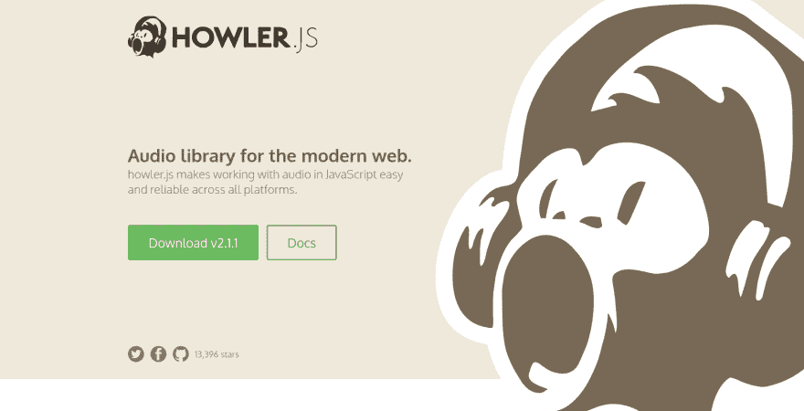
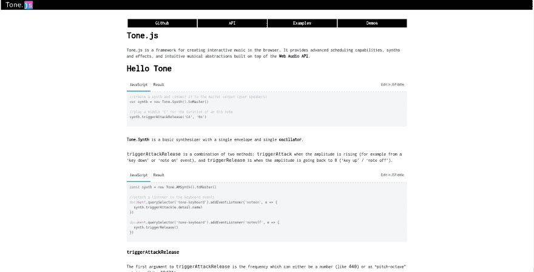
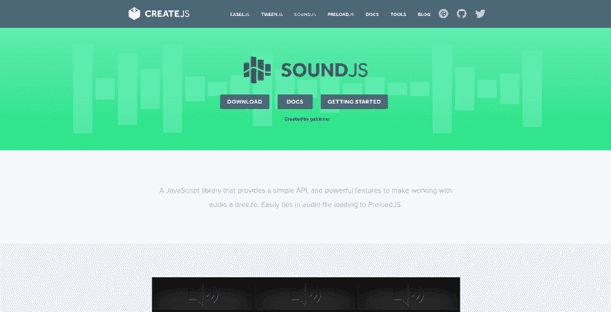
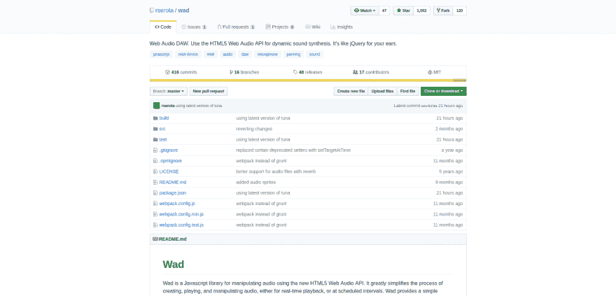
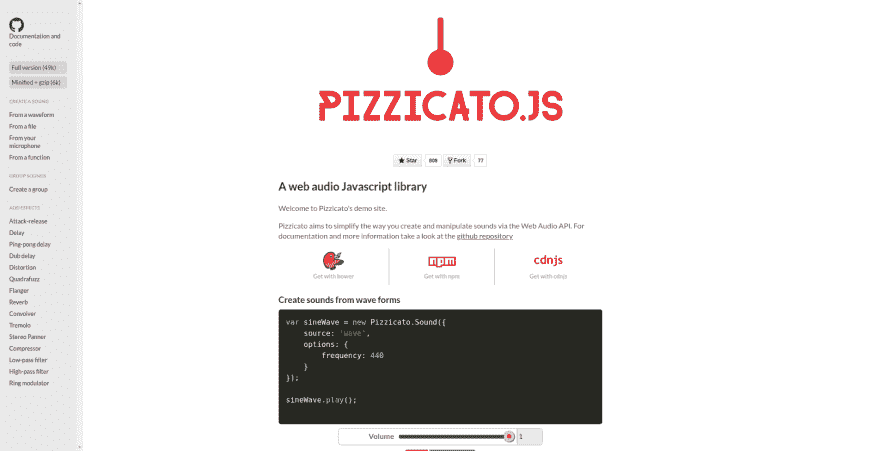
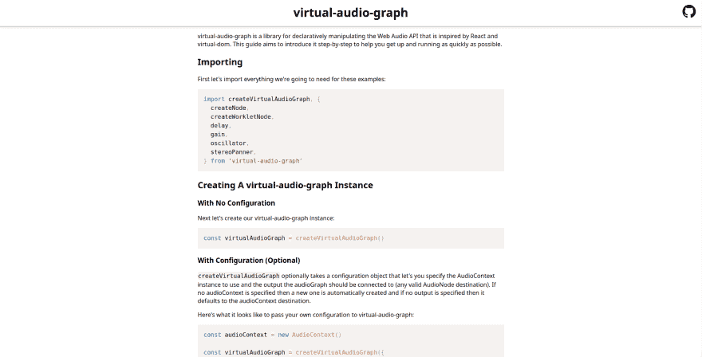
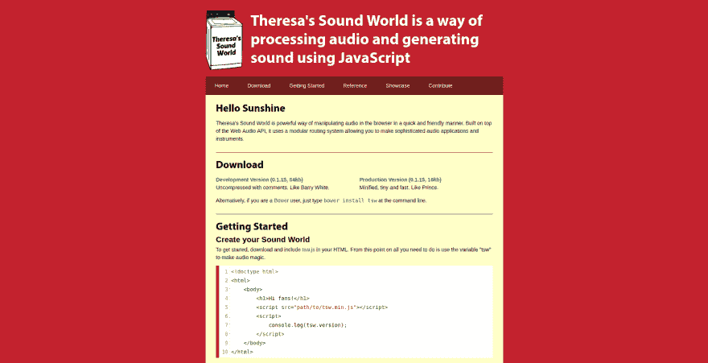
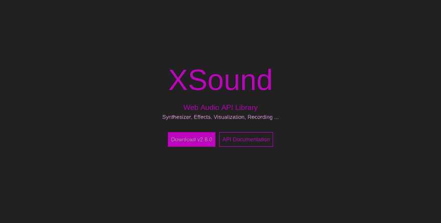

# 9 个库来启动你的网络音频材料

> 原文：<https://dev.to/areknawo/9-libraries-to-kickstart-your-web-audio-stuff-460p>

**这篇文章摘自[我的博客](https://areknawo.com)，所以请务必查看更多最新内容😉**

作为一名网络开发者，你很可能渴望为你的目标用户创造越来越好的体验。自从 **HTML5** 发布后，它变得比以往任何时候都容易。相比之下，人们对更好的，甚至是**更沉浸式的**网络体验的需求🔥。这主要是因为 HTML5 和更高版本中出现了新的网络标准，允许每个人做这种事情。其中之一是 Web API，或者更具体地说(出于本文的目的)， **Web Audio API** 。使用这个工具集，您可以完成您的 web 体验的视觉设置，并获得丰富的音频效果。

为什么我经常使用“经历”这个词？因为没有更好的词来形容这类产品。对于一个标准的网站，甚至是一个网络应用程序，你不需要任何高级的音频或视觉效果(除非它是某种交互式的)。我说的“体验”指的是类似于游戏的东西或者任何其他种类的视觉内容展示。在这些情况下，网络音频可能会被证明是一个有价值的补充。我想每个人都同意声音效果是如此的有影响力。这也是本文的重点。让我们首先学习更多关于这个 API 的知识，然后查看一些在使用它时有用的库和工具。享受🦄！

# 我们在谈论什么？

Web Audio API 是最流行和使用最广泛的 Web APIs 之一。它为处理音频数据(**文件**、**流**等提供了一个先进的系统。)以几乎任何需要的方式(这意味着在基于 web 浏览器的环境中，您不应该需要更多😉).这意味着支持不同的音频源、**效果**(甚至是空间效果)、**可视化**等等。但在基本层面上，你可能会用它来播放/暂停音轨。所以，让我们坚持下去，看看如何用 JS 风格来实现它！⚡

```
const context = new AudioContext(); 
```

Enter fullscreen mode Exit fullscreen mode

从头开始(因为还有哪里？)我们需要创建音频上下文的新实例。它基本上允许我们访问底层功能。

接下来，我们需要某种输入/音频源。为此，我们可以在 HTML 中包含带有`<audio/>`元素的音频文件。

```
<audio id="track" src="track.mp3" type="audio/mpeg"></audio> 
```

Enter fullscreen mode Exit fullscreen mode

当然，使用纯 HTML 你也可以访问一些音频控件(如自动播放等。)，但肯定没有用 JS 的时候宽泛。

然后你需要使用这些`AudioContext`方法来加载你的音频源:

```
const audioElement = document.getElementById("track");
const source = context.createMediaElementSource(audioElement); 
```

Enter fullscreen mode Exit fullscreen mode

最后，你需要将你的源连接到目的地来实际播放它，用:

```
source.connect(context.destination); 
```

Enter fullscreen mode Exit fullscreen mode

其中`context.destination`是对默认音频输出硬件的引用。综上所述，来自 [**MDN**](https://developer.mozilla.org/) 的一个小图将整个过程形象化在一个漂亮、简单的包中:

[](https://res.cloudinary.com/practicaldev/image/fetch/s--FkPYxjLi--/c_limit%2Cf_auto%2Cfl_progressive%2Cq_auto%2Cw_880/https://areknawo.com/conteimg/2019/02/audio-context_.png)

你还可以看到，在输入和目的地中间，有一个地方是用来放置效果的。考虑到这一点，您可以使用相同的 API 集将自定义效果应用到您的音频数据中。

如果你在 **NodeJS** 环境中工作，或者你只是将 HTML 与这些技术材料分开，你总是可以使用 **AJAX** 、**输入文件**(NodeJS/文件上传)甚至麦克风( **WebRTC** API)来检索你的数据！提醒你一下，这里有一个 AJAX 请求的例子:

```
const source = context.createBufferSource();
const request = new XMLHttpRequest();
request.open('GET', 'track.mp3', true);
request.responseType = 'arraybuffer';
request.onload = () => {
    context.decodeAudioData(request.response, (buffer) => {
        source.buffer = buffer;
        // ...
    });
}
request.send(); 
```

Enter fullscreen mode Exit fullscreen mode

在这个例子中，我们使用了另外两个由`AudioContext`提供的效用函数，它们是`createBufferSource()`和`decodeAudioData()`。我认为它们的名字很好地代表了它们的意义。在那之后，你显然必须把你的源连接到目的地，就像之前的 HTML 版本一样。

最后，要播放你的音频，你可以使用下面的代码:

```
if (context.state === 'suspended') {
    context.resume();
}
audioElement.play() // HTML
source.start(); // buffer 
```

Enter fullscreen mode Exit fullscreen mode

前面的`if`子句只是检查上下文是否由于自动播放策略而被暂停，从而确保您的音频一定会被播放。接下来，根据数据类型的不同，调用语法也有所不同。如果你正在使用 HTML `<audio/>`元素，你可以使用它的 [**自带的 API**](https://developer.mozilla.org/en-US/docs/Web/HTML/Element/audio) 。如果没有，可以使用 [**缓冲源 API**](https://developer.mozilla.org/en-US/docs/Web/API/AudioBufferSourceNode) 。我可以向你保证，你可以用你选择的任何方式达到类似的效果。但是，在我看来，buffer/JS-only 方式提供了一个有点低级的 API。选择权在你(除非你不会使用 HTML🙃)!

[](https://res.cloudinary.com/practicaldev/image/fetch/s--3g_CE-KP--/c_limit%2Cf_auto%2Cfl_progressive%2Cq_auto%2Cw_880/https://images.unsplash.com/photo-1487525219605-eadb39ae229c%3Fixlib%3Drb-1.2.1%26q%3D80%26fm%3Djpg%26crop%3Dentropy%26cs%3Dtinysrgb%26w%3D1080%26fit%3Dmax%26ixid%3DeyJhcHBfaWQiOjExNzczfQ)

# 越走越深

通过上面的代码，我们仅仅触及了网络音频 API 的表面。请记住，这是最大的问题之一！也就是说，基础就是基础，这个 API 的其他用例(音效、**生成**和**可视化**)肯定需要更多这些宝贵的 loc😀！您可以随时去探索 API 的全部荣耀或...您可以留下来，阅读这篇文章直到最后，并使用下面的 Web 音频 API 库和工具列表使您的生活变得更加轻松(编写的 loc 更少)!

[](https://res.cloudinary.com/practicaldev/image/fetch/s--vInTAW8s--/c_limit%2Cf_auto%2Cfl_progressive%2Cq_auto%2Cw_880/https://areknawo.com/conteimg/2019/02/Screenshot-from-2019-02-11-19-12-47.png)

# [Howler.js](https://howlerjs.com/)

从最流行和传播最广的库开始，下面是 **Howler.js** ！这个库很可能是 JS 音频的首选工具。除了**超级简单的 API** ，这个轻量级工具( **7KB** )通过内置的**精灵**(用于分割音频数据)或**自动缓存**等功能，让你完全控制你的音频。它还具有 HTML5 音频回退功能(适用于较旧的浏览器)，并支持多种音频编码。凭借其模块化的**可插拔架构**，它配备了可选的**空间效果**插件🤯(用于 3D 音效)。你还想要什么？👍

[](https://res.cloudinary.com/practicaldev/image/fetch/s--czR6R3Ke--/c_limit%2Cf_auto%2Cfl_progressive%2Cq_auto%2Cw_880/https://areknawo.com/conteimg/2019/02/Screenshot-from-2019-02-11-19-14-05.png)

# [T1](#tonejs)[tone . js](https://tonejs.github.io/)

我们将进入一个全新的网络音频水平！这个库为它的用户提供了先进的功能，实际上**在浏览器中创建你自己的音乐**！在这里，你将成为一名作曲家，一名以**代码为指挥棒的指挥家**。😀您可以轻松配置时间，效果，来源和更多。这样的库总是提醒我编码也是艺术。🤔不管怎样，如果你对这类东西感兴趣，可以看看我们的网站。

[](https://res.cloudinary.com/practicaldev/image/fetch/s--kguwmcDz--/c_limit%2Cf_auto%2Cfl_progressive%2Cq_auto%2Cw_880/https://areknawo.com/conteimg/2019/02/Screenshot-from-2019-02-11-19-27-41.png)

# [声音](https://createjs.com/soundjs)

**SoundJS** 是 JS 库套件的一部分，由 **GSkinner** 创建，名为 [**CreateJS**](http://createjs.com/) 。这是一套简化 JS 创作流程的工具。SoundJS 的主要目的是让**加载**和**管理**你的音频资产变得更容易。那么它的主要卖点是什么呢？嗯，一些音频加载器(为了跨浏览器兼容性)和与套件中其他库的集成水平。它还支持 **sprites** ，所以它的 API 集类似于 Howler.js。

[](https://res.cloudinary.com/practicaldev/image/fetch/s--yz7LK681--/c_limit%2Cf_auto%2Cfl_progressive%2Cq_auto%2Cw_880/https://areknawo.com/conteimg/2019/02/Screenshot-from-2019-02-11-19-36-33.png)

# [金枪鱼](https://github.com/Theodeus/tuna)

Tuna 是一个简单的库，具有同样简单的 API。它的主要目标是为网络音频 API 提供易于使用的**音效**。考虑到这一点，它的 API 被构建为与标准的 WA API 兼容/交互。这意味着只是创造叠加效果，它做得很好。👍

[](https://res.cloudinary.com/practicaldev/image/fetch/s--wptnYoem--/c_limit%2Cf_auto%2Cfl_progressive%2Cq_auto%2Cw_880/https://areknawo.com/conteimg/2019/02/Screenshot-from-2019-02-11-19-58-30.png)

# [Wad](https://github.com/rserota/wad)

**Wad** 是一个基于 WA API 的音频操纵器库。基本上，您可以使用 Wad 来简化加载音频资产及其基本管理，但它可以做的远不止这些！使用 Wad，您可以轻松应用效果、滤镜和平移，使您的音频听起来更好。🔈它还支持**精灵**，各种**自定义特效**，**麦克风输入** 🎙，令人惊讶的是，它还支持所有的金枪鱼特效(它就是建立在这些特效之上的)！

[](https://res.cloudinary.com/practicaldev/image/fetch/s--jVBfYxEQ--/c_limit%2Cf_auto%2Cfl_progressive%2Cq_auto%2Cw_880/https://areknawo.com/conteimg/2019/02/Screenshot-from-2019-02-11-20-10-20.png)

# [pizza to . js](https://alemangui.github.io/pizzicato/)

Pizzicato.js 和列表中的其他库有着相同的目的——让 WA API **更容易使用**，就像它应该的那样。通过它的 API，它无疑实现了它的目标。就像真的，很好看，干净，短。它还内置了一堆不同的**音效**。如果你不相信我，那么在项目主页上查看一些例子。😉

[](https://res.cloudinary.com/practicaldev/image/fetch/s--WFW0HBC1--/c_limit%2Cf_auto%2Cfl_progressive%2Cq_auto%2Cw_880/https://areknawo.com/conteimg/2019/02/Screenshot-from-2019-02-11-20-28-22.png)

# [虚拟声像](https://virtual-audio-graph.netlify.com/)

虚拟音频图(Virtual-audio-graph)为开发者提供了一个**声明式 API** 覆盖。它并没有简化很多东西，但它确实改变了思考和编写 WA API 代码的方式。但是，在引擎盖下，它管理 WA API **状态**并负责较小的细节(受 React 背后的想法的启发)。除此之外，真的很小——**2.4 kb**min zipped！

[](https://res.cloudinary.com/practicaldev/image/fetch/s--jDU5Foib--/c_limit%2Cf_auto%2Cfl_progressive%2Cq_auto%2Cw_880/https://areknawo.com/conteimg/2019/02/Screenshot-from-2019-02-11-20-29-12.png)

# **特里萨-声音-世界**

凭借其模块化系统， **TSW** 是一组 WA API 相关的方法，它们提供了一个**的低级抽象**。强大的控件与稍显简单的 API 合二为一，可以轻松满足众多开发者的需求。😉

[](https://res.cloudinary.com/practicaldev/image/fetch/s--2v9EbFBk--/c_limit%2Cf_auto%2Cfl_progressive%2Cq_auto%2Cw_880/https://areknawo.com/conteimg/2019/02/Screenshot-from-2019-02-11-20-34-27.png)

# [XSound](https://korilakkuma.github.io/XSound/)

XSound 是一个包含电池的音频库。从基本的**管理**和**加载**到**流**、**效果**，以**可视化**和**录制**结束，这个库几乎提供了一切！它也有漂亮的半链式 API 和可靠的文档。

# 还有吗？

为特定的工作流程/任务找到最好的工具可能很难。这就是为什么像这样的列表存在的主要原因。但是在网络音频领域，选择并不多。在为你选择最好的库(你刚刚看到的那些)时，我总是在看它的 **API** 和**功能**集有多好**以及它的**可维护性**的情况如何。所以，我希望你喜欢我的选择，至少发现这个列表是有用的。😀**

暂时就这样吧！如果你喜欢这篇文章，可以考虑**分享它**并查看我的 [**个人博客**](https://areknawo.com) 的最新内容。另外，关注我的 [**Twitter**](https://twitter.com/areknawo) 和我的 [**脸书页面**](https://www.facebook.com/Areknawos-Blog-770620059945105) 了解更多信息！📣