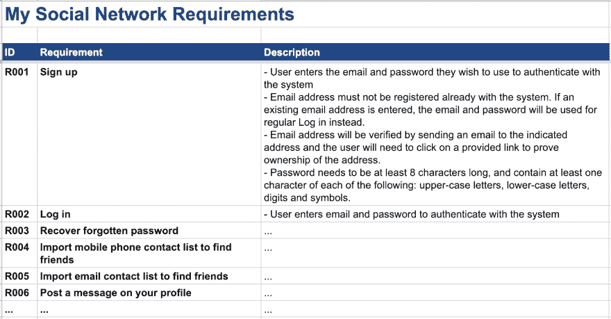
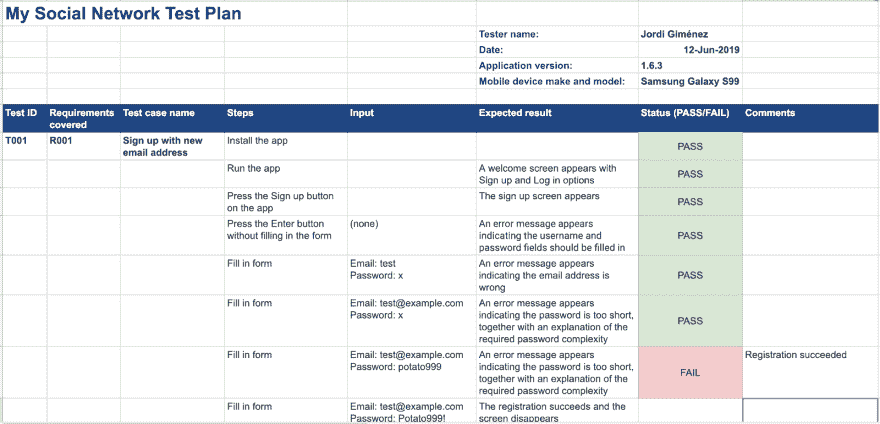
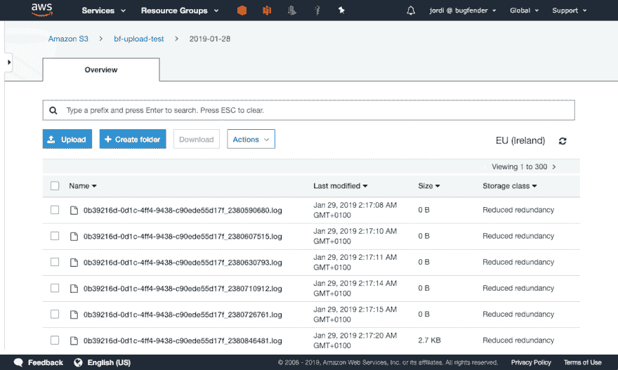
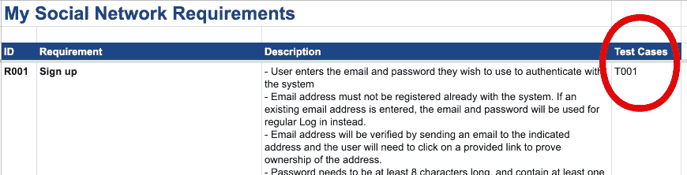

# 如何掌握手工测试

> 原文：<https://dev.to/bugfenderapp/how-to-master-manual-testing-i1n>

自 2011 年成立以来，我们 Mobile Jazz 有幸开发了一些世界上最受欢迎的应用程序，我们所有产品的总下载量超过了 5 亿次。当处理这种影响力和受欢迎程度的应用程序时，测试是至关重要的:质量保证过程中的一点小故障都会导致大量投诉。

我们不断完善我们的测试制度，改进我们的方法，以确保我们所有产品流的质量一致。我们花费数小时来确定何时以及如何自动化我们的测试。

我们以前写过关于自动化测试工具的文章(你可以查看我们以前在 [iOS](https://bugfender.com/blog/best-automated-testing-tools-ios/) 和 [Android 自动化测试工具](https://bugfender.com/blog/best-automated-testing-tools-android/)上的帖子)，但是我们从经验中知道机器并不是万能的。在测试中，就像生活中的所有领域一样，有时你需要一点人情味。

在这篇文章中，我们将深入探讨手动测试。我们将讨论什么时候合适，并提供一系列技巧来帮助您完善您的测试制度。我们希望它对专业测试人员以及正在构建他们自己的测试程序的工程师有用。

**关键位**

本文将重点关注:

*   控制何时自动化的基本规则
*   如何构建在压力下工作的手动测试
*   如何利用精简版测试增加价值
*   远程日志记录如何帮助您的测试制度

自动化，还是不自动化？

每个开发人员都有自己的经验法则，关于什么时候自动化，什么时候坚持好的老式手册。但是这些是我们根据自己长期(有时是痛苦的)经验总结出来的一些基本规则。

*   您可以自动化单元测试和某些集成测试，但是 UI 测试应该总是由人来完成。
*   制定一个测试计划是一个很好的实践，包括一个测试用例列表，并描述如何执行每个测试用例(相信我，这比听起来容易)。
*   确保您运行了您的测试计划:执行测试并保留记录。
*   保持高效，找到简单回归测试的策略。

用户界面测试，也称为系统测试，永远不应该成为自动化的候选，除非你有一个非常好的理由。或者，你有很多你不需要的钱！

你会问，为什么 UI 如此不适合自动化？嗯，两个原因。首先，因为 UI 测试通常非常脆弱。它们可以很容易地捕捉到底层实现中微小的美学细节或其他无害的变化，这些变化实际上不会改变功能或外观。

此外，很难向机器描述 UI 应该是什么样子。虽然人类可以很容易地发现看起来不对劲的东西，如元素的错位、不正确的颜色或不可访问的按钮，但这对于自动化程序来说并不容易评估。

通过自动化 UI 测试，你将自己暴露在问题面前。这可能是对时间的巨大浪费:你可能会发现你花了一整天(或两天)来编写测试，但几天后当测试失败时，你才发现自己又回到了绘图板前。脆弱或不可用的测试也会打击你团队的士气，他们可能最终会放弃测试(相信我，我已经亲眼见过了！)

**构建自己的测试模板**

好了，现在我们已经讨论了“何时”，让我们继续讨论“如何”。具体来说，您如何着手实现手动测试呢？

首先，最好列出需求或用例的清单。如果您没有准备好书面列表，您可以通过查看应用程序包含的屏幕和按钮来识别案例。应用程序会自动做某些事情吗，比如给你发送通知？如果是这样，也把它们加入到列表中。

如果你还没有把需求写下来，永远都不会太晚！事实上，你现在就可以开始。我喜欢 Google Sheets，我将在本文中使用它，但是您可以使用任何您喜欢的文档工具。

例如，如果你正在运行一个社交媒体应用程序，这里有一个你可以编译的需求列表示例:

*   签约雇用
*   登录
*   找回忘记的密码
*   导入手机联系人列表查找朋友
*   导入电子邮件联系人列表以查找朋友
*   在您的个人资料上发布消息
*   …等等

电子表格看起来会像这样:

接下来，写下每个需求要测试的东西的列表。考虑用户通常会选择的常规路径，但也要考虑可能导致故障的其他情况。例如，对于登录屏幕，尝试在不输入任何细节的情况下按下登录按钮，然后使用错误的用户名或密码进行尝试。

一旦你编好了你想测试的东西的清单，写一个逐步的指南告诉你如何去做。解释每个文本字段、按钮按下、出现的每个对话框...这在开始时可能看起来有点愚蠢，但是理想情况下，它应该足够简单明了，使得任何人都能够在您不在的时候执行测试。

事实上，我建议你不要自己做测试。如果你没有现场的 QA 团队，我建议你问一个同事。测试人员不一定是开发人员:他或她可以是设计师、营销人员、会计，团队中的任何人。信不信由你，开发人员可能是发现 bug 最差的人，仅仅是因为我们对应用程序投入太多，很难走出去。

根据前面的示例，注册要求的测试可能如下所示:

*   安装应用程序并运行它。将出现一个带有注册和登录选项的欢迎屏幕。
*   点击应用程序上的注册按钮。应该会出现注册屏幕。
*   不填写任何字段，按 enter 按钮。应该出现一条错误消息，指示应该填写用户名和密码字段。
*   输入“test”作为电子邮件地址，输入“x”作为密码。出现一条错误消息，指示电子邮件地址错误。
*   输入“test@example.com”作为电子邮件地址，输入“x”作为密码。出现一条错误消息，指出密码太短，并解释了所需的密码复杂性。
*   输入“test@example.com”作为用户名，输入“potato”作为密码。注册成功，屏幕消失。

我喜欢将我的测试用例构建成一种形式。为此，我再次喜欢使用谷歌表。添加一个标题是很好的做法，标题中包含测试人员姓名、日期、应用程序版本名称和您用来测试的移动设备的品牌/型号。给测试人员留一个空白的地方来写通过/失败，也许还有一个额外的观察栏。

可能是这样的:

将此电子表格作为模板保存。一旦你准备好测试你的应用，复制(或打印)并填写它。将填写好的表格作为记录保存；将来追踪一个错误可能会有用。此外，根据您的项目，甚至可能有必要保留某种测试日志，以符合您的内部公司规则，用于监管目的或作为记录向您的客户展示(如果您是承包商)。

下面是一个填写好的表单的样子:

**使用远程日志来帮助您的测试制度**

无意自夸，我们的产品 [Bugfender](https://bugfender.com/) 在这里真的很有用。如果您需要保留记录，您可以使用 Bugfender 从整个测试会话中收集日志。我们的产品将获取日志，无论您是仍在测试，还是已经处于生产阶段。

日志将提供测试的记录，并在其中一个测试没有按预期工作时帮助您重现和解决错误。您甚至可以使用我们的[亚马逊 S3 导出功能](http://support.bugfender.com/getting-started/uploading-logs-to-amazon-s3)将日志的存档副本保留几年，这样您就可以随时回到过去，检查测试期间到底发生了什么，即使是几个月前。

如果你有兴趣注册，[点击这里](https://dashboard.bugfender.com/signup)。我们保证从现在开始不再自我推销了！

**跑步缩小版**

手动测试需要时间，您可能会担心检查更新和为每个新的应用程序版本执行完整的测试套件可能会太多。您的担心是正确的:如果您经常发布，并且在几个移动设备上进行测试，那么执行测试的时间可能会延长。

这里有一个多年来对我很有用的技巧:除了写你的需求和测试用例，你还可以写第三表，交叉引用哪些需求被哪些测试覆盖。如果您更改了一个需求，这将有助于找到您需要在您的模板上更新的测试。

这些表格的额外好处是，当您仅在应用程序中进行较小的更改，并且您只想重新测试已受影响的需求时，您还可以使用它们来产生测试套件的删节版本。

我建议对较小的应用程序更改进行简化测试，同时在更改应用程序的重要部分时，或者在测试与新版本操作系统的兼容性时，仍然进行完整的测试。

这个“需求与测试”表通常被称为追溯矩阵。你可以把它写成一个表格，但是我喜欢把它反规范化，所以在需求和测试表格中写一个额外的列，引用另一个表格中的列。在我们的例子中是这样的:

**准备好开始了吗？**

如果你想马上进入你的测试，你可以访问我们的模板作为起点。点击查看[。不要被我们的格式所束缚——随意添加或删除栏目，并根据您的需要进行调整。](https://docs.google.com/spreadsheets/d/e/2PACX-1vTQLvd6H2jVrkcZGCgc3ed4mySFoVpEIuY1gLN7hjaKmrbAwuq9ZjCbcJ90ML9z5o3mDZaVFDdVGSyp/pubhtml?widget=true&headers=false)

请记住，测试有时会令人沮丧，它肯定会涉及大量的工作，但这是值得的。通过额外的努力，完善您的测试机制并正确地记录它，您可以捕捉到关键的错误并确保跨版本的质量。不管你的公司是大是小，这绝对是一笔精明的投资。

*这篇文章最初发表在我们的[博客](https://bugfender.com/blog/how-to-master-manual-testing/)T3 上。*