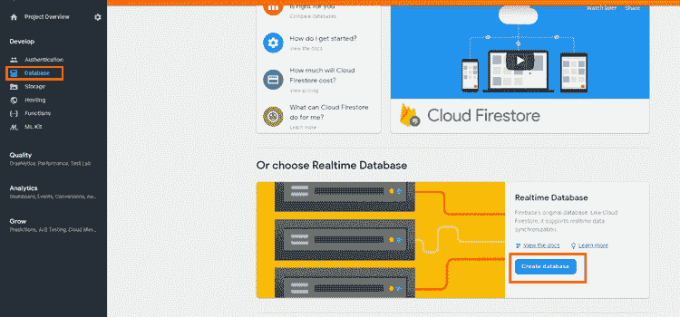
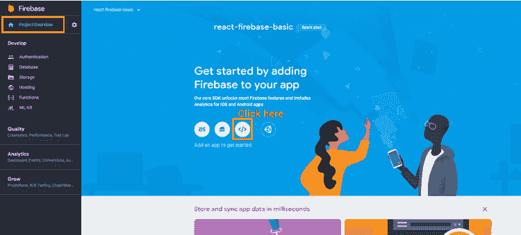

# Firebase 作为 React 应用程序的简单数据库

> 原文：<https://dev.to/nsebhastian/firebase-as-simple-database-to-react-app-430p>

Firebase 是一个一体化的后端即服务提供商(BaaS ),在他们的众多服务中提供数据库、身份验证、云存储。在本教程中，您将学习如何在 React 应用程序中使用 Firebase 实时数据库服务。

您将构建一个简单的团队列表应用程序，用户可以在其中添加、删除和编辑团队成员信息。

## 创建您的数据库应用程序

首先，您需要在 Firebase 控制台中创建应用程序。

然后前往*数据库*菜单，向下滚动一点进入*选择实时数据库*部分。

[](https://res.cloudinary.com/practicaldev/image/fetch/s--hnzCh9pr--/c_limit%2Cf_auto%2Cfl_progressive%2Cq_auto%2Cw_880/https://sebhastian.com/static/918f9d5ee2d9c1912113d8cf4fa2a9e3/228d5/react-firebase-1.png)

将安全规则设置为在**测试模式**下启动。

(这使您的数据库不安全，但对于本教程的目的来说是没问题的。)

最后，获取将 Firebase 集成到 web 应用程序所需的配置。

[](https://res.cloudinary.com/practicaldev/image/fetch/s--lBiAskkl--/c_limit%2Cf_auto%2Cfl_progressive%2Cq_auto%2Cw_880/https://sebhastian.com/static/99e36d584cc576ff473460382936770c/228d5/react-firebase-3.png)

从这个 codesandbox 中获取源代码，并将其分支:

[https://codesandbox.io/embed/p2wqnk3zqj](https://codesandbox.io/embed/p2wqnk3zqj)

并将您的凭证放入配置文件:

```
const config = {
  apiKey: "{YOUR KEY}",
  authDomain: "{YOUR KEY}",
  databaseURL: "{YOUR KEY}",
}

export default config; 
```

## 设置 React 应用程序

使用`create-react-app`
启动 React 应用程序

```
npx create-react-app react-firebase-basic 
```

然后安装 firebase 和 Bootstrap(这样就可以跳过自己写 css 了。)

```
npm i firebase bootstrap 
```

然后你可以删除`src/`中的所有内容，因为你不需要大部分的样板文件

## 创建`config.js`文件

让我们在一个单独的`config.js`文件中编写 Firebase 配置:

```
const config = {
  apiKey: "{YOUR KEY}",
  authDomain: "{YOUR KEY}",
  databaseURL: "{YOUR KEY}",
}

export default config; 
```

稍后您会将此配置导入到您的`App.js`中。

## 写入`index.js`文件

这个文件将作为 React 入口点:

```
import React from 'react';
import ReactDOM from 'react-dom';
import 'bootstrap/dist/css/bootstrap.css';
import App from './App';

ReactDOM.render(<App />, document.getElementById('root')); 
```

## 创建您的应用

是时候写你的`App.js`文件了。让我们在构造函数中初始化我们的 Firebase 应用程序:

```
import React from 'react';

import Firebase from 'firebase';
import config from './config';

class App extends React.Component {

  constructor(props){
    super(props);
    Firebase.initializeApp(config.firebase);

    this.state = {
      developers: []
    }
  }

  //... 
```

然后可以编写获取和保存数据的逻辑:`writeUserdata`将我们的状态写入数据库，而`getUserData`将在`/`路径上创建一个监听器，在`value`发生变化时，我们将把快照值指定为状态。

```
writeUserData = () => {
  Firebase.database().ref('/').set(this.state);
  console.log('DATA SAVED');
}

getUserData = () => {
  let ref = Firebase.database().ref('/');
  ref.on('value', snapshot => {
    const state = snapshot.val();
    this.setState(state);
  });
  console.log('DATA RETRIEVED');
} 
```

将这些`writeUserData`和`getUserData`分别放入`componentDidMount`和`componentDidUpdate`中。

```
componentDidMount() {
  this.getUserData();
}

componentDidUpdate(prevProps, prevState) {
  // check on previous state
  // only write when it's different with the new state
  if (prevState !== this.state) {
    this.writeUserData();
  }
} 
```

剩下的就是编写呈现和处理提交表单逻辑:我们将从`state`映射我们的`developers`数组，并将每一项放入一个 card 组件中。每张卡都有一个删除和更新按钮。单击删除时，我们会过滤出特定的项目，而单击更新时，我们会将项目数据放入表单中。

`handleSubmit`将在`uid`值为`false`时插入数据，在`true`时更新数据。我们使用`ref`从表单输入中获取数据。

```
// ...
render() {
  const { developers } = this.state;
  return(
    <div className="container">
      <div className="row">
        <div className='col-xl-12'>
          <h1>Firebase Development Team</h1>
        </div>
      </div>
      <div className='row'>
        <div className='col-xl-12'>
        { 
          developers
          .map(developer => 
            <div key={developer.uid} className="card float-left" style={{width: '18rem', marginRight: '1rem'}}>
              <div className="card-body">
                <h5 className="card-title">{ developer.name }</h5>
                <p className="card-text">{ developer.role }</p>
                <button onClick={ () => this.removeData(developer) } className="btn btn-link">Delete</button>
                <button onClick={ () => this.updateData(developer) } className="btn btn-link">Edit</button>
              </div>
            </div>
            )
        } 
        </div>
      </div>
      <div className='row'>
        <div className='col-xl-12'>
          <h1>Add new team member here</h1>
          <form onSubmit={ this.handleSubmit }>
            <div className="form-row">
              <input type='hidden' ref='uid' />
              <div className="form-group col-md-6">
                <label>Name</label>
                <input type="text" ref='name' className="form-control" placeholder="Name" />
              </div>
              <div className="form-group col-md-6">
                <label>Role</label>
                <input type="text" ref='role' className="form-control" placeholder="Role" />
              </div>
            </div>
            <button type="submit" className="btn btn-primary">Save</button>
          </form>
        </div>
      </div>
    </div>
  )
}

handleSubmit = (event) => {
  event.preventDefault();
  let name = this.refs.name.value;
  let role = this.refs.role.value;
  let uid = this.refs.uid.value;

  if (uid && name && role){
    const { developers } = this.state;
    const devIndex = developers.findIndex(data => {
      return data.uid === uid 
    });
    developers[devIndex].name = name;
    developers[devIndex].role = role;
    this.setState({ developers });
  }
  else if (name && role ) {
    const uid = new Date().getTime().toString();
    const { developers } = this.state;
    developers.push({ uid, name, role })
    this.setState({ developers });
  }

  this.refs.name.value = '';
  this.refs.role.value = '';
  this.refs.uid.value = '';
}

removeData = (developer) => {
  const { developers } = this.state;
  const newState = developers.filter(data => {
    return data.uid !== developer.uid;
  });
  this.setState({ developers: newState });
}

updateData = (developer) => {
  this.refs.uid.value = developer.uid;
  this.refs.name.value = developer.name;
  this.refs.role.value = developer.role;
} 
```

现在，React 应用程序已经准备好读取数据并将其设置到 Firebase 数据库中。这是最后一次演示:

[https://codesandbox.io/embed/p2wqnk3zqj](https://codesandbox.io/embed/p2wqnk3zqj)

你可能想知道把 Firebase Api 密匙放在有经验的程序员容易得到的配置中是否安全。实际上，把它放在那里是没问题的，因为 Firebase 有安全规则，确保只有经过身份验证的用户才能访问您的数据库。我只是没有在本教程中设置安全规则。

我将在下一篇文章中写一个更完整的教程，涵盖认证、数据库规则和使用 Firebase 云存储用户上传的图像，敬请关注！

[](https://sebhastian.com/react-distilled)