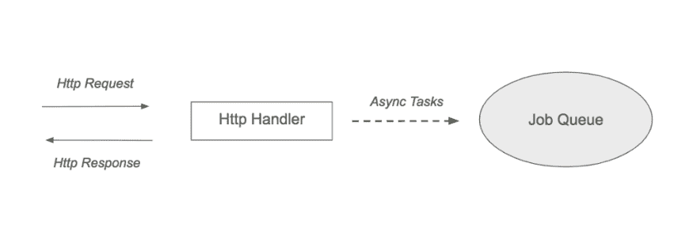

# Goblero 简介:Go 嵌入式作业队列

> 原文：<https://dev.to/didil/introducing-goblero-a-go-embedded-job-queue-38p1>

地鼠遇见獾

这些年来，我使用过许多作业队列，比如 [Sidekiq](https://github.com/mperham/sidekiq) 、 [Kue](https://github.com/Automattic/kue) 或 [Faktory](https://github.com/contribsys/faktory) ，它们通常是我开发的许多应用程序的核心部分。由于嵌入式数据库在围棋界如此流行，我想我应该尝试为围棋应用程序创建一个开源嵌入式作业队列: [Goblero](https://github.com/didil/goblero)

#### 什么是作业队列？

作业队列也称为后台作业队列、任务队列或工作服务器。例如，在处理不属于 web 请求处理程序的异步任务或长时间运行的任务时，它们会非常方便。大多数作业队列由 Redis / RabbitMQ / Kafka 等数据库支持，这些数据库提供快速的作业存储/检索，有时还提供发布/订阅功能。

[](https://res.cloudinary.com/practicaldev/image/fetch/s--Eo1hY2Ef--/c_limit%2Cf_auto%2Cfl_progressive%2Cq_auto%2Cw_880/https://cdn-images-1.medium.com/max/1024/1%2AtVvw5xwxKeW-g1zB3kSGmQ.png) 

<figcaption>Web App 流程:客户端- > Http 处理程序- >作业队列</figcaption>

上图展示了作业队列的一个用例:

*   Http 处理器从 Web 客户端接收 Http 请求，例如包含需要大量处理的文件。
*   Http 处理程序尽可能快地响应，并将繁重的工作委派给作业队列。

#### 为什么是嵌入式作业队列？

虽然诸如 Sidekiq 或 Celery 之类的作业队列更适合由多个工作人员进行分布式处理，但是嵌入式作业队列背后的想法是，它将在创建作业的同一个进程中运行。主要的好处是，我们不需要运行单独的进程来处理作业，也不需要管理外部数据库。嵌入式作业队列对于需要简单持久性的小型本地任务非常有用。

例如，让我们设想一个 Go CLI 应用程序，它在输入中接收一个包含 10，000 个 url 的文本文件，为每个 url 从另一个源获取一些数据，然后向该 URL 发送一个 POST 请求。想象一下，它一次处理 5 个 URL，然后在 2000 个 URL 后崩溃。我们如何知道从哪里重新开始？哪些 URL 已经被处理？当然，您可以为您的应用程序创建一个专门的解决方案来跟踪处理状态，但是作业队列背后的想法是允许您以一种简单可靠的方式跟踪处理状态，并提供一些数据持久性保证。

#### 输入 Goblero

Goblero 的目标是为 Go 应用提供一个简单、快速、嵌入式、持久的作业队列。它仍然处于 alpha 阶段，根本没有准备好投入生产，但大多数基本功能已经存在，我们的想法是保持功能简单，您已经可以在您的 Go side-project 中开始使用它了。

我选择 [BadgerDB](https://github.com/dgraph-io/badger) 作为后台嵌入式数据库，因为它似乎有一些有趣的属性，比如:

*   键值存储
*   纯围棋
*   分类 KV 接入
*   ACID 并发事务

如果您想了解库的内部情况，repo 中的源代码应该很容易获得。这个设计目前当然还处于试验阶段。欢迎提出问题、建议和请求！

在这篇文章中，我想重点演示它的用法。我们将使用 [Goblero 演示](https://github.com/didil/goblero-demo/tree/master) github repo，它包含一个简单的工作应用程序，利用了 Goblero 作业队列。

要开始演示，你需要安装 Go([https://golang.org/dl/](https://golang.org/dl/))。然后，您可以使用以下命令克隆回购:

```
git clone [https://github.com/didil/goblero-demo.git](https://github.com/didil/goblero-demo.git) 
```

获取包:

```
go get -u github.com/didil/goblero/pkg/blero 
```

构建演示应用程序:

```
go build . 
```

下面是我们将要运行的代码: