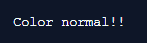
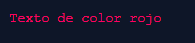
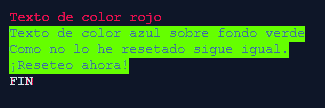

# 使用 Java 和 System.out.println 更改控制台颜色

> [https://dev . to/campus MVP/CMO-更改控制台颜色-con-Java-y-system utprintln-23l2](https://dev.to/campusmvp/cmo-cambiar-los-colores-de-la-consola-con-java-y-systemoutprintln-23l2)

今天他玩一个简单但有用的把戏。

当我们在 **Java** 编程时，我们习惯于**通过控制台发送消息**，以告知用户正在发生的事情。为此，默认方法是使用**方法`System.out.println`** 。

此方法通常不允许更改屏幕输出的颜色。一切看起来都是我们的默认颜色，通常是黑色背景上的白色(或浅灰色)，类似于:

[](https://res.cloudinary.com/practicaldev/image/fetch/s--5wGexoV4--/c_limit%2Cf_auto%2Cfl_progressive%2Cq_auto%2Cw_880/https://www.campusmvp.es/recursos/image.axd%3Fpicture%3D/2019/1T/java-consola-color-x-defecto.png)

但是，当我们创建命令行工具时，**用其他颜色突出事物**可能会非常有用。例如，当出现异常时使用红色，并且我们希望在控制异常后发出警告，或在成功执行任务时使用绿色。

> **注**:这种用于标记意思的颜色用途**是不可接近的**，因此，如果我们希望视力受损的用户，例如色盲的用户能够使用它们，则不合适。确保除了颜色以外**在文字**本身中使用了别的东西(大写、符号-我...。)表示这是一个特殊事件。

好消息是，有一系列的“[”ansi 转义代码“](https://es.wikipedia.org/wiki/C%C3%B3digo_escape_ANSI)”使我们能够控制控制台的某些方面，包括使用的颜色。

如果我们在代码中定义以下常数:

```
public static final String ANSI\_BLACK = "\u001B[30m";
public static final String ANSI\_RED = "\u001B[31m";
public static final String ANSI\_GREEN = "\u001B[32m";
public static final String ANSI\_YELLOW = "\u001B[33m";
public static final String ANSI\_BLUE = "\u001B[34m";
public static final String ANSI\_PURPLE = "\u001B[35m";
public static final String ANSI\_CYAN = "\u001B[36m";
public static final String ANSI\_WHITE = "\u001B[37m"; 
```

我们可以用它们来控制我们想用`System.out.println`显示的颜色。

我们还可以定义这个常数:

```
public static final String ANSI_RESET = "\u001B[0m"; 
```

这将使我们能够保持原样，恢复到默认颜色。

因此，我们可以写如下:

```
System.out.println(ANSI_RED + "Texto de color rojo" + ANSI_RESET); 
```

我们会看到红色：

[](https://res.cloudinary.com/practicaldev/image/fetch/s--7PZb2tQ8--/c_limit%2Cf_auto%2Cfl_progressive%2Cq_auto%2Cw_880/https://www.campusmvp.es/recursos/image.axd%3Fpicture%3D/2019/1T/java-consola-color-rojo.png)

此外，控制台仍保持其默认状态，如下所示。

同样，我们可以定义一系列常数来设置文本要使用的背景色，如:

```
public static final String ANSI_BLACK_BACKGROUND = "\u001B[40m";public static final String ANSI_RED_BACKGROUND = "\u001B[41m";public static final String ANSI_GREEN_BACKGROUND = "\u001B[42m";public static final String ANSI_YELLOW_BACKGROUND = "\u001B[43m";public static final String ANSI_BLUE_BACKGROUND = "\u001B[44m";public static final String ANSI_PURPLE_BACKGROUND = "\u001B[45m";public static final String ANSI_CYAN_BACKGROUND = "\u001B[46m";public static final String ANSI_WHITE_BACKGROUND = "\u001B[47m" 
```

使用它们，我们还可以设置背景颜色，并将它们与前面的文字颜色组合起来，如下所示:

```
System.out.println(ANSI_GREEN_BACKGROUND + ANSI_BLUE + "Texto de color azul sobre fondo verde");System.out.println("Como no lo he resetado sigue igual.");System.out.println("¡Reseteo ahora!" + ANSI_RESET);System.out.println("FIN"); 
```

通过屏幕获取此信息:

[](https://res.cloudinary.com/practicaldev/image/fetch/s--SxA0qvBo--/c_limit%2Cf_auto%2Cfl_progressive%2Cq_auto%2Cw_880/https://www.campusmvp.es/recursos/image.axd%3Fpicture%3D/2019/1T/java-consola-color-fondo.png)

如果你盯着它看，只要你不把“重置”控制码发给它，它就不会恢复到默认颜色，所以你可以发送不可见的更改颜色命令，而不需要写任何东西，只需用它们来控制颜色的更改。

我把这些例子留给你(用常数，你感兴趣的)在这个框架内运作。。单击绿色三角形按钮以运行该三角形并查看结果。

## 胶水:在 Windows 上不起作用-我...。默认情况下。

我刚才教你的东西在 Mac 和 Linux 上都很好用。但是，如果您尝试在 Windows 控制台中将它与 Java 一起使用，您会发现它对您不起作用。

幸运的是，有一个名为 jansi 的开源库，它使用 [Java Native Interface (JNI)](https://es.wikipedia.org/wiki/Java_Native_Interface) 在包括 Windows 在内的所有操作系统中以一致的方式获得相同的结果。

你只需下载它，将其添加到你的项目中，并使用它的具体方法而不是以前的常数。你也可以用在窗户系统上。看看 Github 上的文档，你会发现很简单。

直到结果出来！

> **原始邮件:**[https://www . campus MVP . es/resources/post/how-to-change them-from-console-con-Java-y-system-out-println . aspx](https://www.campusmvp.es/recursos/post/como-cambiar-los-colores-de-la-consola-con-java-y-system-out-println.aspx)