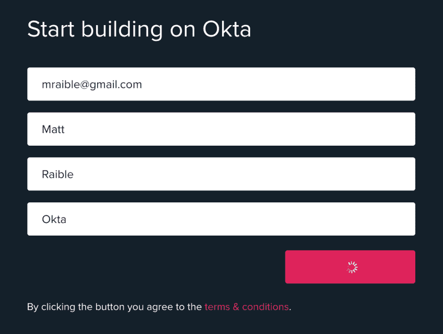
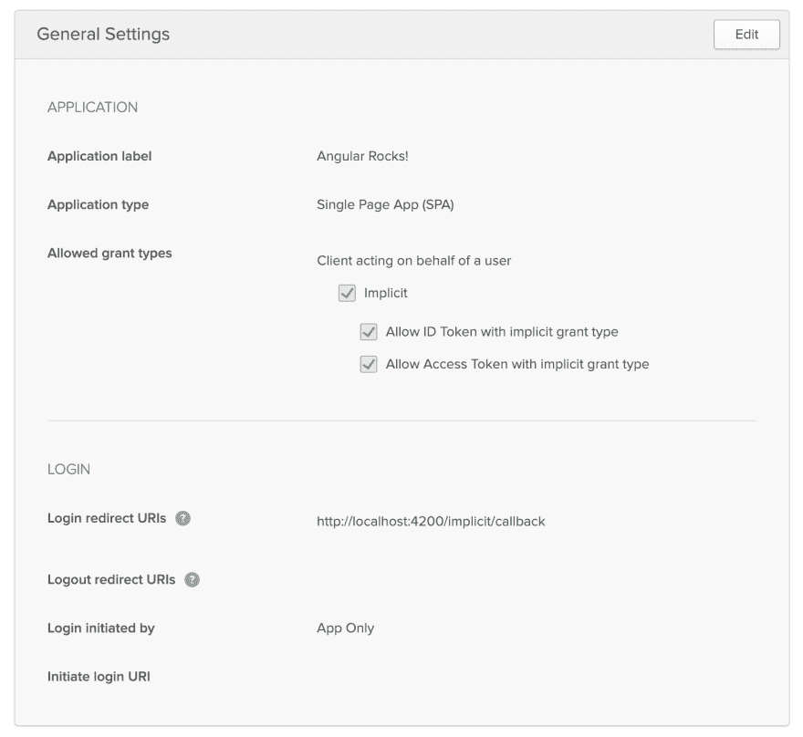
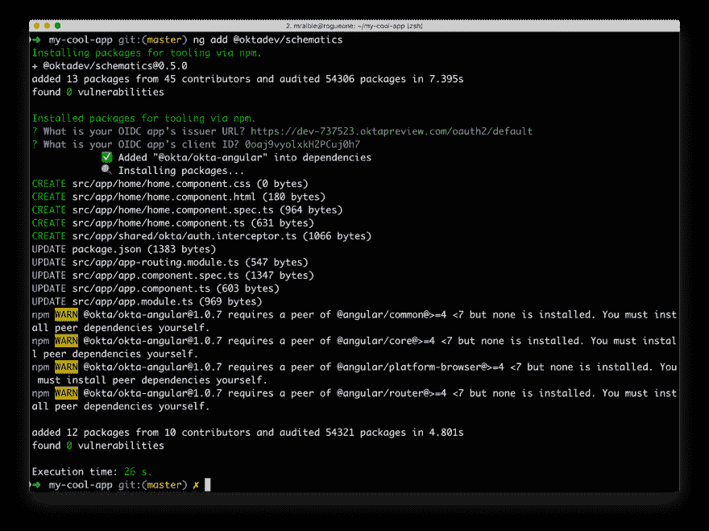
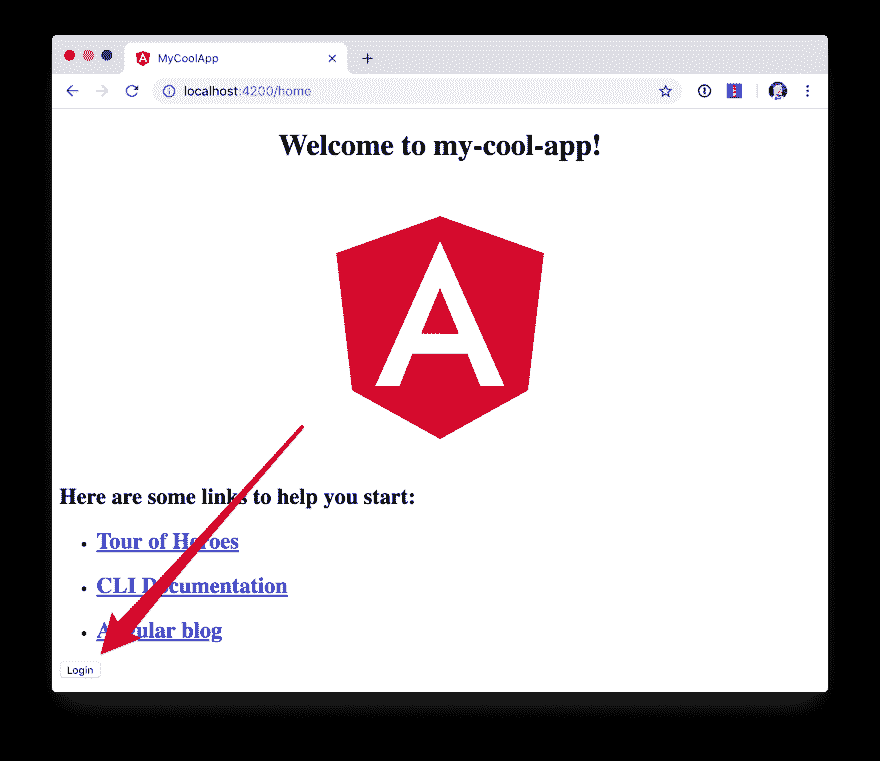

# 使用角度示意图简化您的生活

> 原文：<https://dev.to/oktadev/use-angular-schematics-to-simplify-your-life-157e>

当我第一次开始学习 Angular(当时它被称为 Angular 2)时，我被您需要创建的文件数量震惊了，以使一个基本的“Hello，World”示例工作。随着 Angular 的成熟，多亏了 Angular CLI，很多痛苦都消失了。Angular CLI 是一个命令行工具，可为您生成基本的角度项目。在它的 7.0 版本中，它开始询问你关于你的应用程序的问题。根据您的响应，它选择添加路由并确定样式表格式。

您知道 Angular CLI 使用 Schematics 来生成此代码吗？"图表到底是什么？"，你可能会问。好问题。Schematics 是 Angular 团队在一年多以前(2018 年 1 月)发布的一个项目。简而言之，它提供了一个 API，允许您在 Angular 项目中操作文件和添加新的依赖项。它也可以在非角度项目中工作，但让我们从角度开始。

要查看原理图，请安装 Angular CLI:

```
npm install -g @angular/cli@7.3.0 
```

然后创建一个新的角度项目:

```
$ ng new my-cool-app
? Would you like to add Angular routing? Yes
? Which stylesheet format would you like to use? (Use arrow keys)
❯ CSS
  Sass [http://sass-lang.com]
  Less [http://lesscss.org]
  Stylus [http://stylus-lang.com] 
```

就是这样！原理图可以提示你问题，根据你的回答进行修改，而且做的时候看起来不错！

## 使用 Schematics 向您的 Angular 应用程序添加验证

想看看更酷的东西吗？您可以使用以下命令将 [Okta](https://developer.okta.com) 支持添加到 Angular CLI 生成的应用程序:

```
ng add @oktadev/schematics 
```

**提示**:在运行这个命令之前，确保你在一个角度项目目录中。此外，请确保在运行项目之前将其签入源代码管理。

这将提示您输入 OIDC 发行者和客户端 ID。为了获得这些值，[创建一个 Okta 开发者账户](https://developer.okta.com/signup/)。

[](https://res.cloudinary.com/practicaldev/image/fetch/s--XDDPpa8p--/c_limit%2Cf_auto%2Cfl_progressive%2Cq_auto%2Cw_880/https://developer.okta.com/assets-jekyll/blog/angular-schematics/signup-a4456f1295145960a6d7ae8c2d068135064b5ffc5ddd58411a63f522c7944523.png)

一旦你验证了你的邮箱，登录你的账户，导航到**应用** > **添加应用**，选择**单页应用**，点击**下一步**。给你的应用取一个你会记住的名字，在基础中将端口`8080`改为`4200`并重定向 URIs，然后点击**完成**。您的设置应该类似于下面的截图。

[](https://res.cloudinary.com/practicaldev/image/fetch/s--TfLnrzVk--/c_limit%2Cf_auto%2Cfl_progressive%2Cq_auto%2Cw_880/https://developer.okta.com/assets-jekyll/blog/angular-schematics/oidc-app-settings-f46fda325ec0f54ee99c18cdae0aa791078eb5f62c22611b3b072666738dd7b2.png)

从该屏幕复制**客户端 ID** ，并将其保存在临时文件中。点击**仪表板**，你会在右上角找到一个 **Org URL** 。也将该值复制到文件中。如果您还没有运行`ng add @oktadev/schematics`命令，现在就运行。对于发卡行 URL，使用您的组织 URL + `/oauth2/default`。你可以在下面看到我的价值观和流程的截图。

[](https://res.cloudinary.com/practicaldev/image/fetch/s--_h_k7_ns--/c_limit%2Cf_auto%2Cfl_progressive%2Cq_auto%2Cw_880/https://developer.okta.com/assets-jekyll/blog/angular-schematics/ng-add-%40oktadev-schematics-4ee87302f69b19bc707e62d6600b8acd28c1bbfcbbd3a8eca7d53359ecee8f0e.png)

现在你可以用`ng serve`运行你的应用，导航到`http://localhost:4200`，你会在底部看到一个登录按钮。点击它向 Okta 认证。当你被重定向回你的应用时，它将被替换为注销按钮。

[](https://res.cloudinary.com/practicaldev/image/fetch/s--Y2EJZvgH--/c_limit%2Cf_auto%2Cfl_progressive%2Cq_auto%2Cw_880/https://developer.okta.com/assets-jekyll/blog/angular-schematics/login-with-arrow-bb4115d7646d708a4bc45d4d5a0ca17a7e93659929879d2e8b6d261a2fe3c71f.png)

多甜蜜啊。！没有这个原理图，你必须执行以下步骤(从[用 Angular 7.0 和 Spring Boot 2.1](https://dev.to/blog/2018/08/22/basic-crud-angular-7-and-spring-boot-2#oktas-angular-support) 构建一个基本的 CRUD 应用):

1.  运行`npm install @okta/okta-angular`

2.  更新`app.module.ts`以添加配置并初始化

3.  将回拨路由添加到`app-routing.module.ts`

4.  添加并配置一个`HttpInterceptor`以添加一个`Authorization`报头

5.  添加登录和注销按钮

6.  将认证逻辑添加到`app.component.ts`

7.  生成`HomeComponent`并配置认证

我们的原理图会在不到 30 秒的时间内为您完成所有工作，而不是必须完成这七个步骤！🎉😆

现在您已经看到了 Schematics 的强大功能，让我们深入学习如何创建一个 Schematics。

## 角度 CLI、角度示意图和角度开发套件

Angular CLI 可用于创建、管理、构建和测试您的 Angular 项目。它建立在 DevKit 之上，dev kit 驻留在 GitHub 上的[同一个 monorepo 中。DevKit 是为了提供可用于管理、开发、部署和分析代码的库而构建的。DevKit 有一个`schematics-cli`命令行工具，可以用来创建自己的原理图。](https://github.com/angular/angular-cli)

## 创建您的第一个原理图

要创建 Schematics 项目，首先安装 Schematics CLI:

```
npm i -g @angular-devkit/schematics-cli@0.13.1 
```

然后运行`schematics`创建一个新的空白项目:

```
schematics blank --name=my-component 
```

这将为您创建许多文件。

```
CREATE /my-component/README.md (639 bytes)
CREATE /my-component/package.json (539 bytes)
CREATE /my-component/tsconfig.json (656 bytes)
CREATE /my-component/.gitignore (191 bytes)
CREATE /my-component/.npmignore (64 bytes)
CREATE /my-component/src/collection.json (231 bytes)
CREATE /my-component/src/my-component/index.ts (318 bytes)
CREATE /my-component/src/my-component/index_spec.ts (474 bytes) 
```

有一个`package.json`处理你的项目的依赖关系。还有一个`src/collection.json`为您的项目定义元数据。如果你查看`collection.json`，你会看到以下内容:

```
{  "$schema":  "../node_modules/@angular-devkit/schematics/collection-schema.json",  "schematics":  {  "my-component":  {  "description":  "A blank schematic.",  "factory":  "./my-component/index#myComponent"  }  }  } 
```

你可以看到`my-component`示意图指向`my-component/index.ts`中的一个工厂功能。打开它，你会看到下面的内容:

```
import { Rule, SchematicContext, Tree } from '@angular-devkit/schematics';

export function myComponent(_options: any): Rule {
  return (tree: Tree, _context: SchematicContext) => {
    return tree;
  };
} 
```

`my-component/index_spec.ts`还有一个测试。

```
import { Tree } from '@angular-devkit/schematics';
import { SchematicTestRunner } from '@angular-devkit/schematics/testing';
import * as path from 'path';

const collectionPath = path.join(__dirname, '../collection.json');

describe('my-component', () => {
  it('works', () => {
    const runner = new SchematicTestRunner('schematics', collectionPath);
    const tree = runner.runSchematic('my-component', {}, Tree.empty());

    expect(tree.files).toEqual([]);
  });
}); 
```

Schematics 很酷的一点是，它们不会对文件系统执行任何直接操作。相反，你指定你想对一个`Tree`做什么。`Tree`是一个数据结构，包含一组已经存在的文件和一个暂存区(包含新的/更新的代码的文件)。你可以在上面的代码中看到什么都没有发生，测试甚至证明了树是空的！

### 添加一个 Hello World 示例

让我们做一些比确保它运行并创建一个`hello.ts`文件更有趣的事情。修改`my-component/index.ts`以拥有一个`tree.create()`命令。

```
import { Rule, SchematicContext, Tree } from '@angular-devkit/schematics';

export function myComponent(_options: any): Rule {
  return (tree: Tree, _context: SchematicContext) => {
    tree.create('hello.ts', 'console.log("Hello, World")');
    return tree;
  };
} 
```

然后更新`my-component/index_spec.ts`来期待这个文件。

```
describe('my-component', () => {
  it('works', () => {
    const runner = new SchematicTestRunner('schematics', collectionPath);
    const tree = runner.runSchematic('my-component', {}, Tree.empty());

    expect(tree.files).toEqual(['/hello.ts']);
  });
}); 
```

跑`npm test`一切都该过去了。想证明它有效吗？从`my-component`目录运行以下命令。

```
schematics .:my-component 
```

这个*看起来*像是创建了一个文件，但是它没有。这是因为默认情况下`schematics`在调试模式下运行。可以通过在命令中添加`--dry-run=false`来绕过。运行`schematics .:my-component --dry-run=false`和`hello.ts`将在你的硬盘上创建。如果您尝试再次运行该命令，将会失败，因为该文件已经存在。

```
schematics .:my-component --dry-run=false An error occured:
Error: Path "/hello.ts" already exist. 
```

使用 Schematics 时，您不太可能想要手动创建文件及其内容。更有可能的是，您会想要复制模板，操作它们的内容，并把它们放到您正在修改的项目中。幸运的是，有这样一个 API！

### 复制和操作模板

创建一个`src/my-component/files/src/app`目录来保存你的模板。

```
mkdir -p src/my-component/files/src/app 
```

**提示**:如果你在 Windows 上，`mkdir -p`只有在 Windows 上使用[Bash](https://itsfoss.com/install-bash-on-windows/)才能工作。如果你没有使用 Bash，你需要`md`每个目录。

在`src/my-component/files/src/app`中创建一个`app.component.ts`文件，并将下面的代码放入其中:

```
import { Component } from '@angular/core';

@Component({
  selector: 'app-root',
  templateUrl: './app.component.html',
  styleUrls: ['./app.component.css']
})
export class AppComponent {
  name = '<%= name %>';
} 
```

**注意**:您可以忽略这个文件中的任何编译错误。这只是一个模板，应该在您的目标项目中编译。

`<%= name %>`变量是运行该原理图时您将传入的一个选项。用一些 HTML 创建一个`app.component.html`文件来读取 name 变量。

```
<div style="text-align:center">
  <h1>
   Hello, {{ name }}
  </h1> </div> 
<router-outlet></router-outlet> 
```

创建这些文件后，您的`src/my-component`目录应该如下所示。

```
src/my-component/
├── files
│ └── src
│ └── app
│ ├── app.component.html
│ └── app.component.ts
├── index.ts
└── index_spec.ts 
```

为了定义`name`提示符，在`src/my-component`目录下创建一个`schema.json`文件。

```
{  "$schema":  "http://json-schema.org/schema",  "id":  "SchematicsMyComponent",  "title":  "My Component Schema",  "type":  "object",  "properties":  {  "name":  {  "type":  "string",  "description":  "Your Name",  "x-prompt":  "What is your name?"  }  },  "required":  ["name"]  } 
```

然后更新`src/collection.json`以在`schema`属性中引用该文件。

```
{  "$schema":  "../node_modules/@angular-devkit/schematics/collection-schema.json",  "schematics":  {  "my-component":  {  "description":  "A blank schematic.",  "factory":  "./my-component/index#myComponent",  "schema":  "./my-component/schema.json"  }  }  } 
```

修改`src/my-component/index.ts`,这样你就可以得到你生成的项目的路径，并复制模板。

```
import {
  apply,
  MergeStrategy,
  mergeWith,
  move,
  Rule,
  SchematicContext,
  template,
  Tree,
  url
} from '@angular-devkit/schematics';
import { join, normalize } from 'path';
import { getWorkspace } from '@schematics/angular/utility/config';

export function setupOptions(host: Tree, options: any): Tree {
  const workspace = getWorkspace(host);
  if (!options.project) {
    options.project = Object.keys(workspace.projects)[0];
  }
  const project = workspace.projects[options.project];

  options.path = join(normalize(project.root), 'src');
  return host;
}

export function myComponent(_options: any): Rule {
  return (tree: Tree, _context: SchematicContext) => {
    setupOptions(tree, _options);

    const movePath = normalize(_options.path + '/');
    const templateSource = apply(url('./files/src'), [
      template({..._options}),
      move(movePath)
    ]);
    const rule = mergeWith(templateSource, MergeStrategy.Overwrite);
    return rule(tree, _context);
  };
} 
```

想证明这一切都有效吗？为它写一个测试！

### 测试你的原理图

为了测试这个从工作区读取并获取项目信息的功能，您需要在测试中运行两个外部图表:一个创建工作区，一个创建项目。你需要安装`@schematics/angular`来实现这一点。

```
npm i -D @schematics/angular@7.3.0 
```

然后修改`src/index_spec.ts`以包含工作空间选项、应用程序生成选项和模式选项。

```
import { SchematicTestRunner, UnitTestTree } from '@angular-devkit/schematics/testing';
import * as path from 'path';

describe('my-component', () => {

  const collectionPath = path.join(__dirname, '../collection.json');
  const schematicRunner = new SchematicTestRunner(
    'schematics',
    path.join(__dirname, './../collection.json'),
  );

  const workspaceOptions: any = { (1)
    name: 'workspace',
    newProjectRoot: 'projects',
    version: '0.5.0',
  };

  const appOptions: any = { (2)
    name: 'schematest'
  };

  const schemaOptions: any = { (3)
    name: 'foo'
  };

  let appTree: UnitTestTree;

  beforeEach(() => { (4)
    appTree = schematicRunner.runExternalSchematic('@schematics/angular', 'workspace', workspaceOptions);
    appTree = schematicRunner.runExternalSchematic('@schematics/angular', 'application', appOptions, appTree);
  });

  it('works', () => {
    const runner = new SchematicTestRunner('schematics', collectionPath);
    runner.runSchematicAsync('my-component', schemaOptions, appTree).toPromise().then(tree => {
      const appComponent = tree.readContent('/projects/schematest/src/app/app.component.ts'); (5)
      expect(appComponent).toContain(`name = '${schemaOptions.name}'`); (6)
    });
  });
}); 
```

**1** 设置工作空间选项
**2** 设置应用程序选项(Angular CLI 接受的任何选项)
**3** 设置您的模式选项
**4** 运行外部 schematics 以使用新应用程序设置您的树
**5** 验证模板已复制且包含预期值

跑吧，为你的胜利欢呼吧！

### 使用 Angular CLI 运行原理图

在将原理图发布到 npm 之前，最好使用 Angular CLI 进行一些基本的手动测试。创建新项目:

```
ng new my-test-app --routing --style css 
```

然后运行`npm link /path/to/schematics`。我在与 Schematics 项目相同的目录下创建了我的，所以我运行的命令是:

```
cd my-test-app
npm link ../my-component 
```

**注意**:你也可以在你的 schematics 项目中使用`npm pack`，然后在你的 Angular 项目中使用`npm install /path/to/artifact.tar.gz`。这比`npm link`更像`npm install`。

用`ng g`命令运行原理图。

```
ng g my-component:my-component 
```

当我尝试这样做时，它提示我输入我的名字，但是无法覆盖模板。

```
? What is your name? Matt
ERROR! src/app/app.component.html already exists.
ERROR! src/app/app.component.ts already exists.
The Schematic workflow failed. See above. 
```

如您所见，我的测试通过了，但在现实世界中却行不通。要解决这个问题，打开`my-component/src/index.ts`并在`move(movePath)`后添加一个`forEach()`。

```
import { FileEntry, forEach } from '@angular-devkit/schematics';

...

export function myComponent(_options: any): Rule {
  return (tree: Tree, _context: SchematicContext) => {
    setupOptions(tree, _options);

    const movePath = normalize(_options.path + '/');
    const templateSource = apply(url('./files/src'), [
      template({..._options}),
      move(movePath),
      // fix for https://github.com/angular/angular-cli/issues/11337
      forEach((fileEntry: FileEntry) => {
        if (tree.exists(fileEntry.path)) {
          tree.overwrite(fileEntry.path, fileEntry.content);
        }
        return fileEntry;
      }),
    ]);
    const rule = mergeWith(templateSource, MergeStrategy.Overwrite);
    return rule(tree, _context);
  };
} 
```

运行`my-component`目录中的`npm run build`来重建原理图。然后再次运行`ng g`命令。这一次一切都应该正常。

```
$ ng g my-component:my-component
? What is your name? Matt
UPDATE src/app/app.component.html (109 bytes)
UPDATE src/app/app.component.ts (207 bytes) 
```

### 将您的原理图发布到 npm

将原理图发布到 npm 时，最重要的是默认的`.npmignore`会忽略所有的类型脚本文件。这意味着如果您运行`npm publish`，您编译的原理图将被发布，您的 HTML 模板，但不是您的 TypeScript 模板！

**修改`.npmignore`，使其不排除您的模板文件。**

我花了 [*几个小时*](https://stackoverflow.com/questions/54356046/why-is-there-different-behavior-when-linking-to-a-schematic-vs-installing-one/54370368#54370368) 才弄明白这个问题。如此简单，却又如此微妙。

当您准备好将原理图发布到 npm 时，运行`npm publish`。如果要删除已发布的包，可以在最初的 72 小时内完成:

*   运行`npm unpublish <package_name> -f`通过`-f`或强制标志移除整个包

*   使用`npm unpublish <package_name>@<version>`删除特定版本

你可以在 npm 的文档中了解更多关于 [`unpublish`命令](https://docs.npmjs.com/cli/unpublish)和[取消发布策略](https://www.npmjs.com/policies/unpublish)的信息。

## 用 Angular CLI 添加对`ng add`的支持

Angular CLI 的一个巧妙之处是它的`ng add`命令。您可以使用它来调用 schematics 并将 PWA 支持和角度材料等功能添加到项目中。比如:

```
ng add @angular/pwa
ng add @angular/material 
```

你也可以支持`ng add $your-schematic`！打开`my-component/src/collection.json`并添加一个新的`ng-add`原理图。

```
{  "$schema":  "../node_modules/@angular-devkit/schematics/collection-schema.json",  "schematics":  {  "my-component":  {  "description":  "A blank schematic.",  "factory":  "./my-component/index#myComponent",  "schema":  "./my-component/schema.json"  },  "ng-add":  {  "factory":  "./ng-add/index",  "description":  "Add schematic",  "schema":  "./my-component/schema.json"  }  }  } 
```

创建`src/ng-add/index.ts`并添加调用`my-component`原理图所需的代码。

```
import { chain, Rule, schematic, SchematicContext, Tree, } from '@angular-devkit/schematics';

export default function (options: any): Rule {
  return (host: Tree, context: SchematicContext) => {
    return chain([
      schematic('my-component', options)
    ])(host, context);
  };
} 
```

在您的`my-component`项目中运行`npm run build`。现在你应该可以在你的`my-test-app`项目中运行`ng add my-component`了。很圆滑，是吧？

## 了解更多关于角度和原理图

我希望你喜欢这个关于原理图的快速教程。在开发 [OktaDev 原理图](https://github.com/oktadeveloper/schematics)的时候，我学到了很多关于它们的知识。我鼓励你去看看它的源代码以及 [Angular CLI 的原理图](https://github.com/angular/angular-cli/tree/master/packages/schematics/angular)。特别是，我从 [PWA 示意图](https://github.com/angular/angular-cli/blob/master/packages/angular/pwa/pwa/index.ts)中学到了很多。

你读到这里了吗？谢谢！万一你错过了，可以分分钟创建一个安全的 Angular app！😉

```
ng new my-secure-app --routing
cd my-secure-app
// create a SPA app on Okta, copy settings
ng add @oktadev/schematics 
```

运行这些命令后，您将在项目中安装并配置 Okta Angular SDK。你可以在我们的 [Angular + Okta 文档](https://developer.okta.com/code/angular/)中了解它的所有特性。

在接下来的几个月里，我希望添加更多的原理图，以便与我们的 [React](https://github.com/okta/okta-oidc-js/tree/master/packages/okta-react) 和[Vue](https://github.com/okta/okta-oidc-js/tree/master/packages/okta-vue)SDK 轻松集成。

你可以在 GitHub 上的[okta developer/okta-angular-schematics-example](https://github.com/oktadeveloper/okta-angular-schematics-example)找到示例原理图的源代码。

我们喜欢在这个博客上写 Angular。以下是我们最近的一些棱角分明的帖子:

*   [构建您的第一个带角度的 PWA](https://dev.to/blog/2019/01/30/first-angular-pwa)

*   [用 ASP.NET MVC 和 Angular 搭建一个基础网站](https://dev.to/blog/2018/12/21/build-basic-web-app-with-mvc-angular)

*   [Angular 7:有什么新鲜值得关注的+ OIDC 善良](https://dev.to/blog/2018/12/04/angular-7-oidc-oauth2-pkce)

*   [视频] [用 Angular 7.0 和 Spring Boot 2.1](https://youtu.be/HoDzatvGDlI) 构建一个基本的 CRUD App

*   [用 Express、Angular 和 GraphQL 构建一个简单的 Web 应用](https://dev.to/blog/2018/11/30/web-app-with-express-angular-graphql)

这里有一些我用来学习原理图的文章:

*   [原理图—简介](https://blog.angular.io/schematics-an-introduction-dc1dfbc2a2b2)

*   [🏖️如何用 Ease🛠️创建你的第一个自定义角度示意图](https://medium.com/@tomastrajan/%EF%B8%8F-how-to-create-your-first-custom-angular-schematics-with-ease-%EF%B8%8F-bca859f3055d)

*   [使用原理图制作可添加的角度包](https://nitayneeman.com/posts/making-an-addable-angular-package-using-schematics/)

*   [角度示意图:简单示意图](https://medium.com/rocket-fuel/angular-schematics-simple-schematic-76be2aa72850)

如果你喜欢这篇文章，你可能会喜欢以后的文章！在 Twitter 上关注我们 [@oktadev](https://twitter.com/oktadev) 了解我们何时发布它们。我们还在我们的 YouTube 频道上发布[的截屏视频。](https://www.youtube.com/channel/UC5AMiWqFVFxF1q9Ya1FuZ_Q)