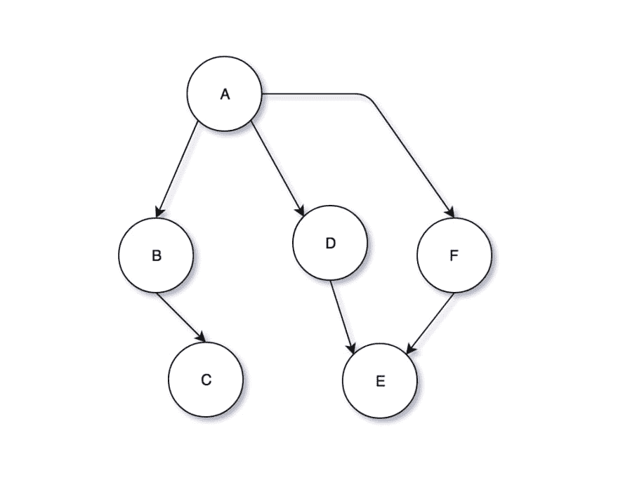
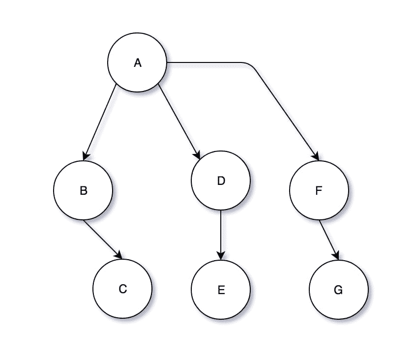
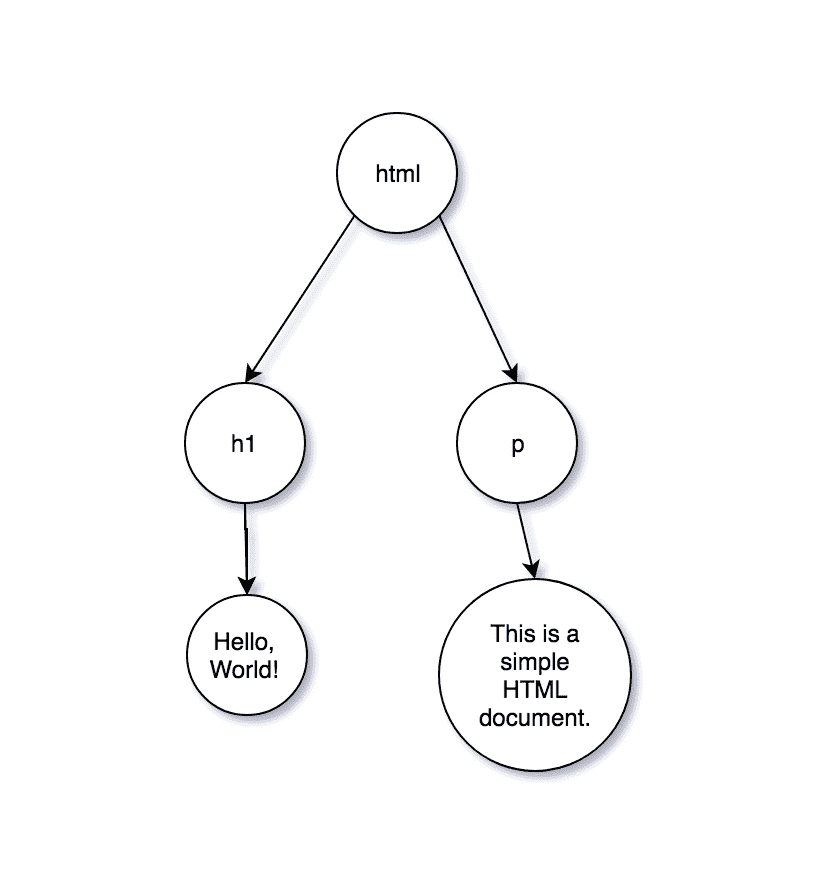
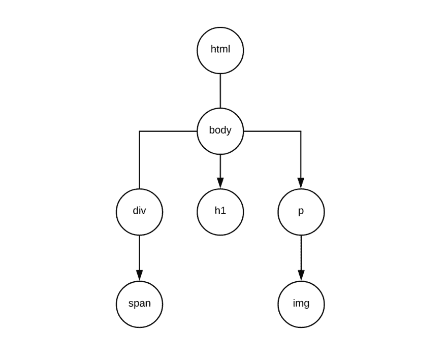
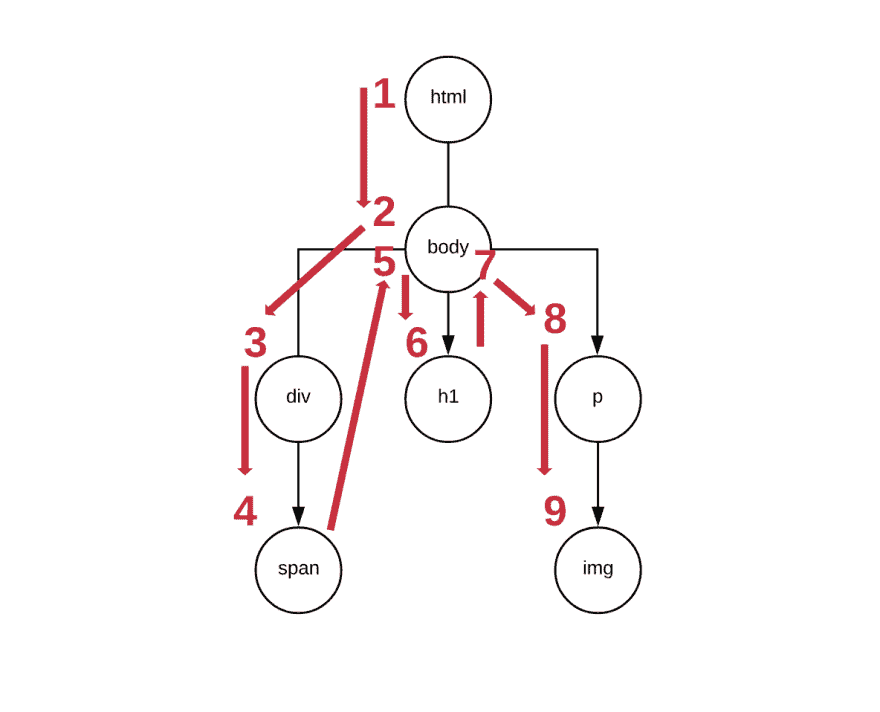

# Golang 数据结构:树

> 原文：<https://dev.to/fteem/golang-datastructures-trees-gkg>

你可以在你的编程生涯中花相当多的时间不与树打交道，或者如果你不理解它们就简单地避开它们(这是我曾经做过的)。

现在，不要误解我的意思——数组、列表、堆栈和队列是非常强大的数据结构，可以带你走得很远，但是它们的功能是有限的，你如何使用它们以及使用的效率如何。当你把散列表加入到这个混合体中时，你可以解决相当多的问题，但是对于很多问题来说，如果你把树放在你的腰带之下，树是一个强大的(也许是唯一的)工具。

[](https://res.cloudinary.com/practicaldev/image/fetch/s--w3HMRpzo--/c_limit%2Cf_auto%2Cfl_progressive%2Cq_auto%2Cw_880/https://thepracticaldev.s3.amazonaws.com/i/dbn3iu5dtl5v0f7l3n5c.jpg) 
<small>塞巴斯蒂安·恩格勒在 Unsplash 上的照片</small>

那么，让我们看看树，然后我们可以尝试在一个小练习中使用它们。

## 淡淡的理论

数组、列表、队列、堆栈在一个集合中存储数据，这个集合有开始和结束，因此它们被称为“线性的”。但是当涉及到树和图时，事情会变得混乱，因为数据不是以线性方式存储的。

树被称为非线性数据结构。事实上，你也可以说树是分层的数据结构，因为数据是以分层的方式存储的。

为了你的阅读乐趣，维基百科对树的定义是:

> 树是由节点或顶点和边组成的数据结构，没有任何循环。没有节点的树称为空树。非空的
> 树由一个根节点和潜在的多级
> 节点组成，这些节点形成了一个层次结构。

该定义指出，树只是节点(或顶点)和边(或节点之间的链接)的组合，没有循环。

[](https://res.cloudinary.com/practicaldev/image/fetch/s--jS0938Fv--/c_limit%2Cf_auto%2Cfl_progressive%2Cq_auto%2Cw_880/https://ieftimov.com/img/posts/golang-datastructures-trees/invalid-tree.png)

例如，图上表示的数据结构是节点的组合，从 A 到 F，有六条边。虽然它的所有元素看起来像是构造了一棵树，但是节点 A、D、E 和 F 有一个循环，因此这个结构不是树。

如果我们断开节点 F 和 E 之间的边，并添加一个名为 G 的新节点，其边在 F 和 G 之间，我们将得到如下结果:

[](https://res.cloudinary.com/practicaldev/image/fetch/s--Jz7r6xdK--/c_limit%2Cf_auto%2Cfl_progressive%2Cq_auto%2Cw_880/https://ieftimov.com/img/posts/golang-datastructures-trees/valid-tree.png)

现在，因为我们消除了图中的循环，我们可以说我们有一个有效的树。它有一个名为 A 的**根**，共有 7 个**节点**。节点 A 有 3 个**子节点** (B，D & F)，而那些节点有 3 个子节点(分别是 C，E & G)。因此，节点 A 有 6 个**后代**。此外，该树有 3 个叶节点(C，E
T11】G)或没有子节点的节点。

B，D & F 有什么共同点？它们是**兄弟**，因为它们有相同的父节点(节点 A)。它们都位于**层** 1，因为从它们中的每一个到根，我们只需要走一步。例如，节点 G 有第二层，因为从 G 到 A 的**路径**是:G - > F - > A，因此我们需要沿着两条边到达 A

现在我们知道了一些关于树的理论，让我们看看如何解决一些问题。

## 建模一个 HTML 文档

如果你是一个从来没有编写过 HTML 的软件开发人员，我将假设你已经看到(或者有一个想法)HTML 是什么样子的。如果你还没有，那么我建议你右击你正在阅读的页面，然后点击“查看源代码”。

说真的，去吧，我会等你...

浏览器内置了这种东西，称为 DOM——一种跨平台和独立于语言的应用程序编程接口，它将互联网文档视为一种树形结构，其中每个节点都是表示文档一部分的对象。这意味着当浏览器读取你的文档的 HTML 代码时，它会加载它并创建一个 DOM。

因此，让我们想象一下，我们是开发 Chrome 或 Firefox 等浏览器的开发人员，我们需要对 DOM 建模。为了让这个练习更简单，让我们来看一个小小的 HTML 文档:

```
<html>
  <h1>Hello, World!</h1>
  <p>This is a simple HTML document.</p>
</html> 
```

Enter fullscreen mode Exit fullscreen mode

因此，如果我们将此文档建模为一棵树，它看起来会像这样:

[](https://res.cloudinary.com/practicaldev/image/fetch/s--oy-Yqj5Y--/c_limit%2Cf_auto%2Cfl_progressive%2Cq_auto%2Cw_880/https://ieftimov.com/img/posts/golang-datastructures-trees/html-document-tree.png)

现在，我们可以将文本节点视为独立的`Node`节点，但是我们可以通过假设任何 HTML 元素都可以包含文本来简化我们的生活。

`html`节点将有两个子节点`h1`和`p`，它们将有`tag`、`text`和`children`作为字段。让我们把它写成代码:

```
type Node struct {
    tag      string
    text     string
    children []*Node
} 
```

Enter fullscreen mode Exit fullscreen mode

一个`Node`将只有标签名和可选的子标签。让我们试着手工创建上面看到的 HTML 文档，作为一棵`Node`的树:

```
func main() {
        p := Node{
                tag:  "p",
                text: "This is a simple HTML document.",
                id:   "foo",
        }

        h1 := Node{
                tag:  "h1",
                text: "Hello, World!",
        }

        html := Node{
                tag:      "html",
                children: []*Node{&p, &h1},
        }
} 
```

Enter fullscreen mode Exit fullscreen mode

看起来不错，我们现在已经有了一个基本的树并正在运行。

## 构建 MyDOM——DOM 的嵌入式替代品😂

现在我们已经有了一些树结构，让我们后退一步，看看 DOM 会有什么样的功能。例如，如果 MyDOM <sup>(TM)</sup> 可以替代真实的 DOM，那么使用 JavaScript 我们应该能够访问节点并修改它们。

用 JavaScript 做到这一点最简单的方法是使用

```
document.getElementById('foo') 
```

Enter fullscreen mode Exit fullscreen mode

该函数将在`document`树中查找 ID 为`foo`的节点。让我们更新我们的`Node`结构，让它有更多的属性，然后为我们的树编写一个查找函数:

```
type Node struct {
  tag      string
  id       string
  class    string
  children []*Node
} 
```

Enter fullscreen mode Exit fullscreen mode

现在，我们的每个`Node`结构都有一个`tag`、`children`，这是一个指向那个`Node`的子节点的指针片段、`id`，这是那个 DOM 节点的 ID，还有`class`，这是可以应用于这个 DOM 节点的类。

现在，回到我们的`getElementById`查找函数。让我们看看如何实现它。首先，让我们构建一个示例树，我们可以将它用于我们的查找算法:

```
<html>
  <body>
    <h1>This is a H1</h1>
    <p>
      And this is some text in a paragraph. And next to it there's an image.
      
    </p>
    <div class='footer'>
      This is the footer of the page.
      <span id='copyright'>2019 &copy; Ilija Eftimov</span>
    </div>
  </body>
</html> 
```

Enter fullscreen mode Exit fullscreen mode

这是一个相当复杂的 HTML 文档。让我们使用`Node`结构作为构建块，在 Go 中勾画出它的结构:

```
image := Node{
        tag: "img",
        src: "http://example.com/logo.svg",
        alt: "Example's Logo",
}

p := Node{
        tag:      "p",
        text:     "And this is some text in a paragraph. And next to it there's an image.",
        children: []*Node{&image},
}

span := Node{
        tag:  "span",
        id:   "copyright",
        text: "2019 &copy; Ilija Eftimov",
}

div := Node{
        tag:      "div",
        class:    "footer",
        text:     "This is the footer of the page.",
        children: []*Node{&span},
}

h1 := Node{
        tag:  "h1",
        text: "This is a H1",
}

body := Node{
        tag:      "body",
        children: []*Node{&h1, &p, &div},
}

html := Node{
        tag:      "html",
        children: []*Node{&body},
} 
```

Enter fullscreen mode Exit fullscreen mode

我们开始自下而上构建这棵树。这意味着我们从嵌套最深的结构开始创建结构，并朝着`body`和`html`前进。让我们来看看我们的树的图形:

[](https://res.cloudinary.com/practicaldev/image/fetch/s--Ga-FuF58--/c_limit%2Cf_auto%2Cfl_progressive%2Cq_auto%2Cw_880/https://ieftimov.com/img/posts/golang-datastructures-trees/mydom-tree.png)

## 实现节点查找🔎

所以，让我们继续我们之前的工作——允许 JavaScript 在我们的`document`上调用`getElementById`,并找到它正在寻找的`Node`。

为此，我们必须实现一个树搜索算法。最流行的搜索(或遍历)图和树的方法是广度优先搜索(BFS)和深度优先搜索(DFS)。

### 广度优先搜索⬅➡

顾名思义，BFS 采用了一种遍历方法，即在深入“深度”之前先探索“宽度”上的节点。以下是 BFS 算法遍历整个树的可视化步骤:

[](https://res.cloudinary.com/practicaldev/image/fetch/s--NZJNIH8---/c_limit%2Cf_auto%2Cfl_progressive%2Cq_auto%2Cw_880/https://ieftimov.com/img/posts/golang-datastructures-trees/mydom-tree-bfs-steps.png)

如您所见，该算法将采取两步深度(在`html`和`body`上)，但是在继续深入探索和访问`span`和`img`节点之前，它将访问`body`的所有子节点。

如果你想有一个循序渐进的行动手册，那就是:

1.  我们从根节点`html`开始
2.  我们把它推到`queue`
3.  当`queue`不为空时，我们开始一个循环
4.  我们检查`queue`中的下一个元素是否匹配。如果找到匹配，我们返回匹配，我们就完成了。
5.  当没有找到匹配时，我们将接受检查的节点的所有子节点添加到队列中，这样就可以对它们进行检查
6.  `GOTO` 4

让我们来看看这个算法在 Go 中的一个简单实现，我会分享一些关于如何轻松记住这个算法的技巧。

```
func findById(root *Node, id string) *Node {
        queue := make([]*Node, 0)
        queue = append(queue, root)
        for len(queue) > 0 {
                nextUp := queue[0]
                queue = queue[1:]
                if nextUp.id == id {
                        return nextUp
                }
                if len(nextUp.children) > 0 {
                        for _, child := range nextUp.children {
                                queue = append(queue, child)
                        }
                }
        }
        return nil
} 
```

Enter fullscreen mode Exit fullscreen mode

该算法有三个关键点:

1.  `queue` -它将包含算法访问的所有节点
2.  获取`queue`的第一个元素，检查它是否匹配，如果没有找到匹配，则继续下一个节点
3.  `Queue`在继续进行`queue`之前，整理一个节点的所有子节点

本质上，整个算法围绕着将子节点推入队列并检查排队的节点。当然，如果最后没有找到匹配，我们返回`nil`而不是一个指向`Node`的指针。

### 深度优先搜索⬇

为了完整起见，让我们看看 DFS 是如何工作的。

如前所述，深度优先搜索将首先通过访问尽可能多的节点进行深度搜索，直到到达一片叶子。当这种情况发生时，它会返回并在树上找到另一个分支向下钻取。

让我们直观地看看这意味着什么:

[](https://res.cloudinary.com/practicaldev/image/fetch/s--aEOQrdGA--/c_limit%2Cf_auto%2Cfl_progressive%2Cq_auto%2Cw_880/https://ieftimov.com/img/posts/golang-datastructures-trees/mydom-tree-dfs-steps.png)

如果这让您感到困惑，不要担心——我在步骤中增加了更多的粒度来帮助我的解释。

算法就像 BFS 一样开始——它从`html`走到`body`再到`div`。然后，它不再继续前进`h1`，而是向叶子`span`再迈一步。一旦它发现`span`是一片叶子，它将返回到`div`寻找其他分支进行探索。因为它找不到任何分支，所以它将返回到`body`来寻找新的分支，并继续访问`h1`。然后，它将再次做同样的练习——返回到`body`并发现还有另一个分支要探索——最终访问`p`和`img`节点。

如果你想知道“没有指向它的指针，我们如何回到父节点”，那么你忘记了书中最古老的技巧之一——递归。让我们来看看算法的一个简单递归 Go 实现:

```
func findByIdDFS(node *Node, id string) *Node {
        if node.id == id {
                return node
        }

        if len(node.children) > 0 {
                for _, child := range node.children {
                        findByIdDFS(child, id)
                }
        }
        return nil
} 
```

Enter fullscreen mode Exit fullscreen mode

## 按类名查找🔎

MyDOM <sup>(TM)</sup> 应该具有的另一个功能是通过类名查找节点的能力。本质上，当 JavaScript 脚本执行`getElementsByClassName`时，MyDOM 应该知道如何收集某个类的所有节点。

可以想象，这也是一个必须探索整个 MyDOM <sup>(TM)</sup> 树并挑选满足特定条件的节点的算法。

为了让我们的生活更简单，我们先实现一个`Node`可以接收的函数，叫做`hasClass` :

```
func (n *Node) hasClass(className string) bool {
        classes := strings.Fields(n.classes)
        for _, class := range classes {
                if class == className {
                        return true
                }
        }
        return false
} 
```

Enter fullscreen mode Exit fullscreen mode

`hasClass`获取一个`Node`的类字段，在每个空格字符上分割它们，然后循环类的切片，并试图找到我们感兴趣的类名。让我们编写几个测试来测试这个函数:

```
type testcase struct {
        className      string
        node           Node
        expectedResult bool
}

func TestHasClass(t *testing.T) {
        cases := []testcase{
                testcase{
                        className:      "foo",
                        node:           Node{classes: "foo bar"},
                        expectedResult: true,
                },
                testcase{
                        className:      "foo",
                        node:           Node{classes: "bar baz qux"},
                        expectedResult: false,
                },
                testcase{
                        className:      "bar",
                        node:           Node{classes: ""},
                        expectedResult: false,
                },
        }

        for _, case := range cases {
                result := case.node.hasClass(test.className)
                if result != case.expectedResult {
                        t.Error(
                                "For node", case.node,
                                "and class", case.className,
                                "expected", case.expectedResult,
                                "got", result,
                        )
                }
        }
} 
```

Enter fullscreen mode Exit fullscreen mode

如您所见，`hasClass`函数将检测类名是否在`Node`的类列表中。现在，让我们继续实现 MyDOM 通过类名
查找所有`Node`的实现

```
func findAllByClassName(root *Node, className string) []*Node {
        result := make([]*Node, 0)
        queue := make([]*Node, 0)
        queue = append(queue, root)
        for len(queue) > 0 {
                nextUp := queue[0]
                queue = queue[1:]
                if nextUp.hasClass(className) {
                        result = append(result, nextUp)
                }
                if len(nextUp.children) > 0 {
                        for _, child := range nextUp.children {
                                queue = append(queue, child)
                        }
                }
        }
        return result
} 
```

Enter fullscreen mode Exit fullscreen mode

如果这个算法看起来很熟悉，那是因为你正在看一个修改过的`findById`函数。`findAllByClassName`的工作方式与`findById`类似，但是`return`不是在找到匹配的时候就开始处理，而是将匹配的`Node`添加到`result`片上。它将继续这样做，直到所有的`Node`都被访问过。

如果没有匹配，`result`切片将为空。如果有任何匹配，它们将作为`result`片段的一部分返回。

最后值得一提的是，为了遍历树，我们在这里使用了广度优先的方法——该算法为每个`Node`使用一个队列，并在它们上面循环，如果找到匹配，就追加到`result`片。

## 删除节点🗑

DOM 中经常使用的另一个功能是删除节点的能力。正如 DOM 可以做到这一点一样，我们的 MyDOM <sup>(TM)</sup> 也应该能够处理这样的操作。

在 JavaScript 中做这个操作最简单的方法是:

```
var el = document.getElementById('foo');
el.remove(); 
```

Enter fullscreen mode Exit fullscreen mode

我们的`document`知道如何处理`getElementById`(通过在幕后调用`findById`)，而我们的`Node`不知道如何处理`remove`函数。从 MyDOM <sup>(TM)</sup> 树中删除`Node`将是一个两步过程:

1.  我们必须查找`Node`的`parent`,并将其从其父`children`集合中移除；
2.  如果要删除的`Node`有孩子，我们必须从 DOM 中删除他们。这意味着我们必须删除指向每个子节点及其父节点(要删除的节点)的所有指针，这样 Go 的垃圾收集器才能释放内存。

这里有一个简单的方法来做到这一点:

```
func (node *Node) remove() {
        // Remove the node from it's parents children collection
        for idx, sibling := range n.parent.children {
                if sibling == node {
                        node.parent.children = append(
                                node.parent.children[:idx],
                                node.parent.children[idx+1:]...,
                        )
                }
        }

        // If the node has any children, set their parent to nil and set the node's children collection to nil
        if len(node.children) != 0 {
                for _, child := range node.children {
                        child.parent = nil
                }
                node.children = nil
        }
} 
```

Enter fullscreen mode Exit fullscreen mode

一个`*Node`会有一个`remove`函数，这个函数执行两步移除`Node`的过程。

在第一步中，我们将节点从`parent`的子列表中取出，方法是循环遍历它们，并通过在列表中的节点前追加元素以及在节点后追加元素来移除节点。

在第二步中，在检查节点上是否存在任何子节点之后，我们从所有子节点中移除对`parent`的引用，然后将`Node`的子节点设置为`nil`。

## 下一步去哪里？

显然，我们的 MyDOM <sup>(TM)</sup> 实现永远不会成为 DOM 的替代品。但是，我相信这是一个有趣的例子，可以帮助你学习，这是一个非常有趣的问题。我们每天都与浏览器互动，因此思考它们如何在幕后工作是一项有趣的工作。

如果你想玩我们的树形结构并编写更多的功能，你可以去 WC3 的 JavaScript HTML DOM 文档[文档](https://www.w3schools.com/js/js_htmldom_document.asp)并考虑给 MyDOM 添加更多的功能。

显然，这篇文章背后的想法是学习更多关于树(图)的知识，并学习流行的搜索/遍历算法。但是，无论如何，请继续探索和试验，并告诉我您对 MyDOM 实现做了哪些改进。