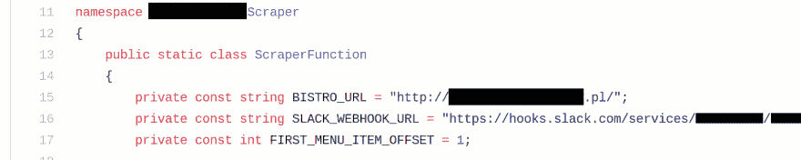
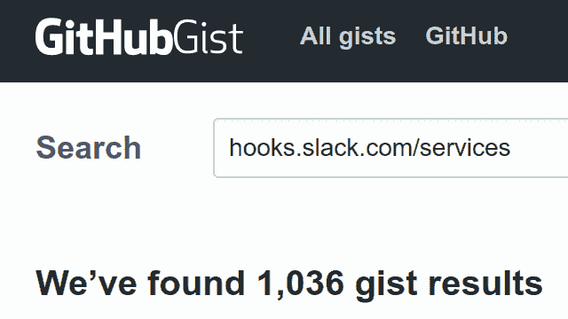
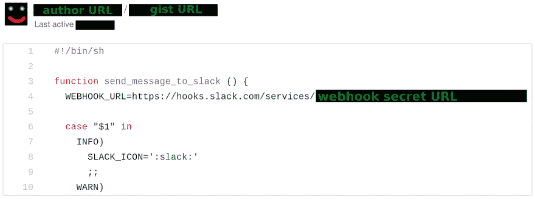
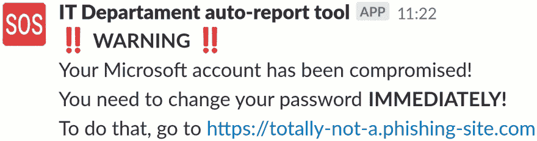

# 从 GitHub 上刮下松弛的网钩

> 原文：<https://dev.to/suve/scraping-slack-webhooks-from-github-5f7k>

**最初发布于[blog . svgames . pl](https://blog.svgames.pl/article/scraping-slack-webhooks-from-github)T3】**

前一段时间， [Slack](https://slack.com) 成为公司和社区中非常流行的即时通讯工具。许多人认为它是一个令人敬畏的平台；许多人认为它只不过是一个被美化的 IRC 替代品。撇开技术上的优点和缺陷不谈，Slack 和许多类似的平台可能还会存在一段时间。

让 Slack 对团队真正有用的一点是能够非常容易地编写将它连接到其他服务的集成。可能在一个*传入 Webhook* 中可以进行的最简单的集成，它基本上是一个网关，允许通过发出 post 请求向给定团队的 Slack 工作区发布消息。Webhooks 不使用任何额外的认证——如果你知道 URL，你可以自由使用它。

[](https://res.cloudinary.com/practicaldev/image/fetch/s--76DGR3av--/c_limit%2Cf_auto%2Cfl_progressive%2Cq_auto%2Cw_880/https://blog.svgames.pl/image/webhook-example.png)

前一段时间，我的一个同事写了一个脚本，可以转到附近一家小酒馆的脸书个人资料，抓取今天的菜单，并将其发布到我们工作场所的*#午餐*频道。对自己的工作感到满意后，他将源代码放在一个 [GitHub Gist](https://gist.github.com/) 中，贴在 Slack 上，并请求评论。
代码看起来足够干净，所有重要的参数——包括 web hook URL——都放在文件开头的`const`中。

[](https://res.cloudinary.com/practicaldev/image/fetch/s--xwqUNjcI--/c_limit%2Cf_auto%2Cfl_progressive%2Cq_auto%2Cw_880/https://blog.svgames.pl/image/bistro-webhook.png)

盯着页面看了一会儿后，有一件事引起了我的注意——我没有登录 GitHub，但我可以毫无问题地阅读要点。我突然意识到，这必须是一个公共要点，这意味着任何人都可以访问它，任何人都可以使用 webhook URL 并使用它向我们的*#午餐*频道发布消息。

虽然这是一个小问题，但我立即通知了这位同事，他很快撤销了 webhook，并为脚本请求了一个新的。但这让我想到:还有多少人犯了类似的错误？我可以从 GitHub 中抓取公开的 webhook URLs，并将其用于邪恶的目的吗？

只有一个方法可以知道...

## 查找相关要点

首先，我打开 GitHub Gists 页面，在搜索框中输入`hooks.slack.com/services`。令我感到有趣的是，找到了将近 1000 个匹配项(自从我开始写这篇文章以来，这个数字增加到 1000 多一点)。

[](https://res.cloudinary.com/practicaldev/image/fetch/s--RDi2yE5y--/c_limit%2Cf_auto%2Cfl_progressive%2Cq_auto%2Cw_880/https://blog.svgames.pl/image/thousand-gists.png)

看到这么大的数据集已经成熟，我转向 GitHub API 文档，以获取关于如何获取我感兴趣的 Gists 的信息。唉，原来 API 没有提供任何搜索 Gists 的方法。是时候刮刮胡子了。

## 刮痧

搜索页面显示用户名和 gist 名称，并带有一些非常突出的超链接，因此从 HTML 标记中提取 gist URLs 轻而易举。在浏览了几页搜索结果后，我有了一个可以收集的清单。

[](https://res.cloudinary.com/practicaldev/image/fetch/s--SeZ03xot--/c_limit%2Cf_auto%2Cfl_progressive%2Cq_auto%2Cw_880/https://blog.svgames.pl/image/gist-search-example.png)

由于我只对提取 Slack webhook URLs 感兴趣，所以我没有考虑如何获取原始格式的 gists，只是从搜索页面获取链接的 HTML 版本。此外，一个要点可以包含多个文件，原始下载选项只是单个文件，而 HTML 版本包含整个要点。无论哪种方式，一旦下载了要点，获取 Webhook URL 只是使用一个正则表达式的问题。

## 达到速率极限

编写了搜索页面和 gists 本身的代码后，我启动了脚本。不出所料，我很快就达到了限速。我的第一个解决方案是添加一个`--request-delay`选项，允许我指定请求间隔的秒数。这似乎奏效了...

...一段时间了。我又达到限速了。
这次我决定添加一些代码来检查服务器的响应是否包含`Retry-After`或`X-RateLimit-Reset` HTTP 头，然后等待必要的时间(或者，如果这两个头都不存在，就等待预定的时间)。有了这个添加，脚本终于可以在没有任何监督的情况下完全工作了。满意之后，我继续做一些其他的杂务，然后在睡觉前启动脚本，这样它就可以通宵工作了。

## 过滤网页挂钩列表

早上醒来时，我看到一个大约有 1000 个网址的列表...或者说我希望如此。结果发现大多数结果并不是真正的 Webhook URLs，而只是占位符字符串；想一想:

```
hooks.slack.com/services/YOUR-WEBHOOK-ID-HERE 
```

在过滤掉明显伪造的条目后，我最终得到了 111 个相当数量的网页挂钩——大约是原始数量的 1/9。虽然没那么激动人心，但还是很令人满意。

## 接触松弛

列出清单后，我不知道下一步该做什么。最初，我考虑过遍历 webhooks，给每个 web hooks 发一条消息，告诉他们我已经抓取了 URL，并建议人们替换它，但我很快就放弃了，因为这太具侵入性了。

我最终决定简单地使用 Slack 帮助页面上的联系方式，因为他们很可能有一些程序，告诉我如何处理这种事情。写完邮件一两天后，我收到了以下回复:

> 我们定期扫描公开的 GitHub repos，寻找可能被入侵的 API 令牌，但并不是特别针对 webhooks，正如你所说，这是一个小威胁，因为他们只有发布权限。
> 
> 尽管如此，我们真的很感谢你遵守并与我们分享这份名单。我将确保与平台团队的其他成员一起转发，以便他们可以调查并采取任何必要的措施。

看到这种交流是如何在近一年前发生的，我没有收到任何后续消息，我猜 Slack 要么决定这不是一个问题，要么对他们来说这只是一件日常的事情，一百多个公共链接不值得特别提及和回应。

## 但是等等，实际上有什么威胁吗？

虽然很难否认只能发布消息的 Webhooks 几乎没有提供任何破解手段，但它们仍然可以用来攻击任何安全系统中最薄弱的部分——也就是人类。我还没有提到的一件事是，虽然每个 Webhook 都有一个名字和一个头像，但这些只是*的默认值*；您可以通过在请求 JSON 中添加一些额外的属性*来轻松覆盖它们。* 

```
{
    "icon_emoji": ":robot_face:",
    "user_name": "IT departament auto-messaging tool",
    "text": ":exclamation: *WARNING* :exclamation:"
} 
```

虽然你无法摆脱小小的**应用**徽章，表明这是一条自动消息，但没有什么可以阻止你使用*#午餐机器人* Webhook 向*#公告*频道发布消息，甚至更好——向个人用户发送个人消息，这给了你大量的机会来进行一些老式的网络钓鱼。

[](https://res.cloudinary.com/practicaldev/image/fetch/s--BM2ieFpy--/c_limit%2Cf_auto%2Cfl_progressive%2Cq_auto%2Cw_880/https://blog.svgames.pl/image/webhook-scam.png)

当然，发起一次成功的网络钓鱼攻击会带来一系列的挑战，所以仅仅因为有*一些*网络钓鱼的可能性，并不意味着网络钩子都是不好的，我们应该避免它们。恰恰相反，它们是一种易于使用的有用工具。但是就像任何工具一样，它们可能被滥用，所以如果你知道你可能在某个地方泄露了一个 Webhook URL 我建议替换它，以防万一。

## 参考文献

*   [Slack API 文档:传入的 webhooks](https://api.slack.com/incoming-webhooks)

*   [GitHub 开发者指南:REST API v3: Gists](https://developer.github.com/v3/gists/)