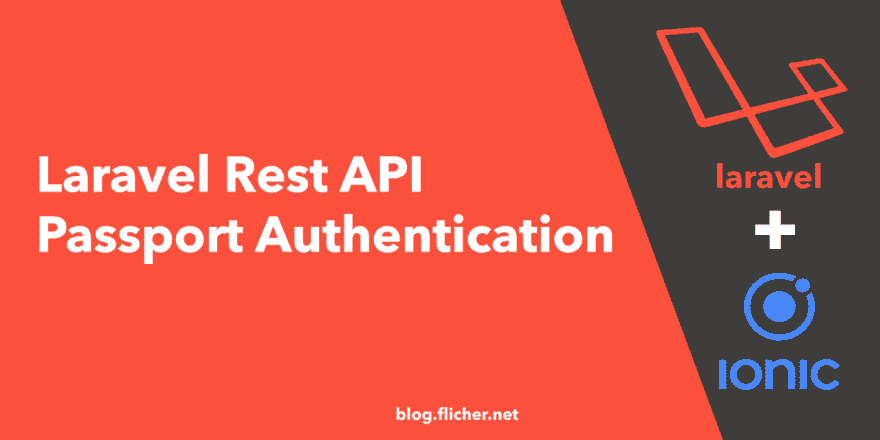
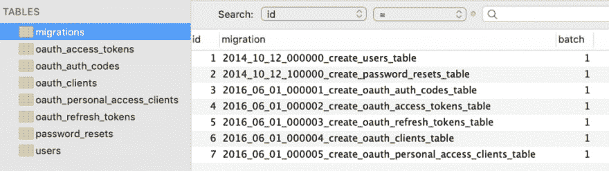
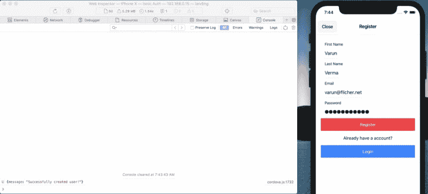
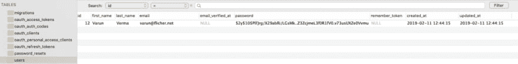
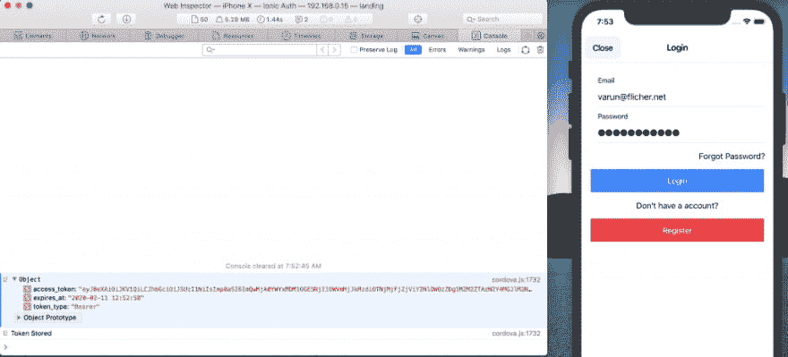
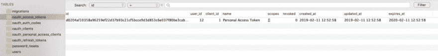
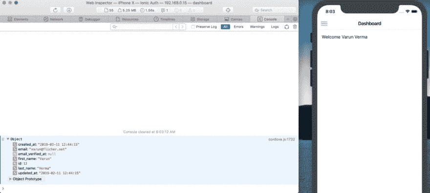
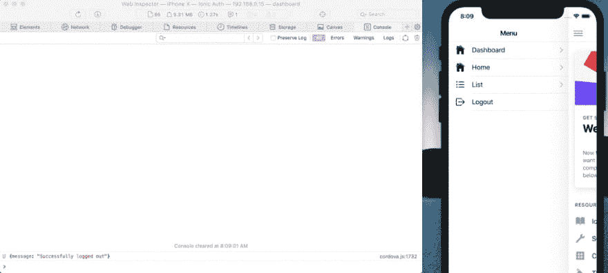

# 适用于 Ionic 应用程序的 Laravel Rest API Passport 认证

> 原文：<https://dev.to/flicher/laravel-rest-api-passport-authentication-for-ionic-app-3370>

[](https://res.cloudinary.com/practicaldev/image/fetch/s--9C90pa-I--/c_limit%2Cf_auto%2Cfl_progressive%2Cq_auto%2Cw_880/https://blog.flicher.net/wp-content/uploads/2019/02/laravel-ionic-auth-1280x640.png)

## 介绍

在本教程中，我们将学习使用 Laravel Passport 创建认证系统。API 很棒，Laravel 已经使 Rest API 认证变得很容易。

API 通常使用令牌来验证用户，并且不维护请求之间的会话状态。Laravel 使用 Laravel Passport 使 API 认证变得轻而易举，它在几分钟内为您的 Laravel 应用程序提供了完整的 OAuth2 服务器实现。

来测试这个项目。我们还将使用 [Ionic 4](https://ionicframework.com/) 创建一个移动应用程序。但是你也可以使用 [Postman](https://www.getpostman.com/) 来测试你的 API。我们将使用移动应用程序，因此我们测试真实世界的环境。

如果你也有兴趣为你的项目创建移动应用，请看我的另一篇文章[设置 Ionic](https://blog.flicher.net/setting-up-ionic-4-on-mac/) 开始吧。

这个项目文件可以在 https://github.com/flicher-net/laravel-auth-passport 的 GitHub 上找到

## 步骤 1 —开始

首先，让我们继续创建一个全新的 Laravel 项目。打开您的终端或命令提示符，并前往您想要创建应用程序的目录。您可以使用以下命令来更改目录。

```
cd Desktop/
```

然后运行以下命令创建一个新项目。

```
composer create-project --prefer-dist laravel/laravel auth-app
```

接下来，通过运行以下命令进入目录。

```
cd auth-app/
```

## 步骤 2 —安装 Laravel Passport

现在让我们通过运行以下命令来安装 Laravel Passport。

```
composer require laravel/passport
```

## 步骤 3 —迁移数据库

Passport 服务提供商向框架注册了自己的数据库迁移目录，因此您应该在安装软件包后迁移数据库。Passport 迁移将创建应用程序存储客户机和访问令牌所需的表。

由于 laravel 默认自带**用户**迁移，位于**数据库/迁移/create_users_table.php** 。你也可以根据你的需要更新它。我将只添加两个新列，而不是**名称**列。

```
increments('id');
            $table->string('first_name');
            $table->string('last_name');
            $table->string('email')->unique();
            $table->timestamp('email_verified_at')->nullable();
            $table->string('password');
            $table->rememberToken();
            $table->timestamps();
        });
    }

    /**
     * Reverse the migrations.
     *
     * @return void
     */
    public function down()
    {
        Schema::dropIfExists('users');
    }
}
```

现在我们需要更改**中的数据库变量值。env** 文件。因此，用您数据库名称、用户名、密码等更新该文件。这样我们就可以进行迁移了。

```
APP_NAME=Laravel
APP_ENV=local
APP_KEY=base64:OZakMJg2LBGFcM5Da/XtArMHSEzWn7Jda+WUKW+Kwec=
APP_DEBUG=true
APP_URL=http://localhost

LOG_CHANNEL=stack

DB_CONNECTION=mysql
DB_HOST=127.0.0.1
DB_PORT=3306
DB_DATABASE=flicher
DB_USERNAME=flicheruser
DB_PASSWORD=super-secret-password

BROADCAST_DRIVER=log
CACHE_DRIVER=file
QUEUE_CONNECTION=sync
SESSION_DRIVER=file
SESSION_LIFETIME=120

REDIS_HOST=127.0.0.1
REDIS_PASSWORD=null
REDIS_PORT=6379

MAIL_DRIVER=smtp
MAIL_HOST=smtp.mailtrap.io
MAIL_PORT=2525
MAIL_USERNAME=null
MAIL_PASSWORD=null
MAIL_ENCRYPTION=null

PUSHER_APP_ID=
PUSHER_APP_KEY=
PUSHER_APP_SECRET=
PUSHER_APP_CLUSTER=mt1

MIX_PUSHER_APP_KEY="${PUSHER_APP_KEY}"
MIX_PUSHER_APP_CLUSTER="${PUSHER_APP_CLUSTER}"
```

更新后，运行以下命令来迁移数据库。

```
php artisan migrate
```

现在，如果你检查你的数据库，你会看到所有这些表格。



完美！

## 步骤 4 —生成密钥

接下来，我们必须创建生成安全访问令牌所需的加密密钥。此外，该命令将创建用于生成访问令牌的“个人访问”和“密码授权”客户端。运行以下命令来实现这一点。

```
php artisan passport:install
```

## 步骤 5 —配置

运行这个命令后，我们需要在一些文件中做一些修改。让我们开始吧。

首先打开 **App/User.php** 并添加**Laravel \ Passport \ hasa pitokens**trait。

```
@var
 array
     */
    protected $fillable = [
        'name', 'email', 'password',
    ];

    /**
     * The attributes that should be hidden for arrays.
     *
     * @var
 array
     */
    protected $hidden = [
        'password', 'remember_token',
    ];
}
```

接下来打开**app/Providers/authserviceprovider . PHP**，在 **boot** 方法中调用 **Passport::routes** 方法。此方法将注册颁发访问令牌和撤销访问令牌、客户端和个人访问令牌所需的路由。

```
@var
 array
     */
    protected $policies = [
        'App\Model' => 'App\Policies\ModelPolicy',
    ];

    /**
     * Register any authentication / authorization services.
     *
     * @return void
     */
    public function boot()
    {
        $this->registerPolicies();

        Passport::routes();
    }
}

```

最后，在你的 **config/auth.php** 配置文件中，你要将 **api** 认证卫士的**驱动**选项设置为 **passport** 。这将指示您的应用程序在验证传入的 API 请求时使用 Passport 的**令牌保护**。

```
<?php

return [

    'defaults' => [
        'guard' => 'web',
        'passwords' => 'users',
    ],

    'guards' => [
        'web' => [
            'driver' => 'session',
            'provider' => 'users',
        ],

        'api' => [
            'driver' => 'passport',
            'provider' => 'users',
        ],
    ],

    'providers' => [
        'users' => [
            'driver' => 'eloquent',
            'model' => App\User::class,
        ],

        // 'users' => [
        //     'driver' => 'database',
        //     'table' => 'users',
        // ],
    ],

    'passwords' => [
        'users' => [
            'provider' => 'users',
            'table' => 'password_resets',
            'expire' => 60,
        ],
    ],

];
```

## 步骤 6-设置 API 路由

现在让我们设置 API 路由。通常我们在 **routes/web.php** 中创建我们所有的路线，但是因为我们在处理 API，所以我们将在 **routes/api.php** 中创建我们所有的路线。

将下面的代码复制到 **routes/api.php** 中。我们将为登录、注册、注销和用户创建路由。

```
 'auth'
], function () {
    Route::post('login', 'Auth\AuthController@login')->name('login');
    Route::post('register', 'Auth\AuthController@register');
    Route::group([
      'middleware' => 'auth:api'
    ], function() {
        Route::get('logout', 'Auth\AuthController@logout');
        Route::get('user', 'Auth\AuthController@user');
    });
});

```

## 步骤 7-创建控制器

因为我们已经创建了我们的 API 路由。现在我们需要创建 **AuthController** 。为此，运行以下命令。

```
php artisan make:controller Auth/AuthController
```

然后打开**app/Http/Controllers/Auth/Auth controller . PHP**，添加以下代码。

```
validate([
            'email' => 'required|string|email',
            'password' => 'required|string',
            //'remember_me' => 'boolean'
        ]);
        $credentials = request(['email', 'password']);
        if(!Auth::attempt($credentials))
            return response()->json([
                'message' => 'Unauthorized'
            ], 401);
        $user = $request->user();
        $tokenResult = $user->createToken('Personal Access Token');
        $token = $tokenResult->token;
        if ($request->remember_me)
            $token->expires_at = Carbon::now()->addWeeks(1);
        $token->save();
        return response()->json([
            'access_token' => $tokenResult->accessToken,
            'token_type' => 'Bearer',
            'expires_at' => Carbon::parse(
                $tokenResult->token->expires_at
            )->toDateTimeString()
        ]);
    }

    public function register(Request $request)
    {
        $request->validate([
            'fName' => 'required|string',
            'lName' => 'required|string',
            'email' => 'required|string|email|unique:users',
            'password' => 'required|string'
        ]);

        $user = new User;
        $user->first_name = $request->fName;
        $user->last_name = $request->lName;
        $user->email = $request->email;
        $user->password = bcrypt($request->password);

        $user->save();

        return response()->json([
            'message' => 'Successfully created user!'
        ], 201);
    }

    public function logout(Request $request)
    {
        $request->user()->token()->revoke();
        return response()->json([
            'message' => 'Successfully logged out'
        ]);
    }

    /**
     * Get the authenticated User
     *
     * @return [json] user object
     */
    public function user(Request $request)
    {
        return response()->json($request->user());
    }
}

```

## 步骤 8 —添加 CORS 中间件

想象一下，在浏览器中运行的域 X 的所有 JavaScript 代码都能够向域 Y 发出 http 请求，域 X 上的恶意代码能够在您不知情的情况下与站点 Y 进行交互。在大多数情况下，你不希望这样。幸运的是，所有主流浏览器都只允许网站对自己的域名提出请求。他们不允许 JavaScript 代码对不同域上的站点发出请求。这叫做[同源政策](https://www.w3.org/Security/wiki/Same_Origin_Policy)。

但在某些情况下，你确实希望允许这种行为。因为我们现在需要它，所以让我们添加 CORS 中间件。运行以下命令创建一个新的中间件

```
php artisan make:middleware Cors
```

将创建一个新文件，让我们更新**app/Http/Middleware/CORS . PHP**

```
@param
  \Illuminate\Http\Request  $request
     * @param
  \Closure  $next
     * @return mixed
     */
    public function handle($request, Closure $next)
    {
        return $next($request)
            ->header('Access-Control-Allow-Origin', '*')
            ->header('Access-Control-Allow-Methods', 'GET, POST, PUT, PATCH, DELETE, OPTIONS')
            ->header('Access-Control-Allow-Headers', 'Content-Type, Authorization, X-Requested-With, X-XSRF-TOKEN');
    }
}

```

最后一步，我们需要在 **app/Http/Kernal.php** 中注册我们的新中间件。

```
@var
 array
     */
    protected $middleware = [
        \App\Http\Middleware\CheckForMaintenanceMode::class,
        \Illuminate\Foundation\Http\Middleware\ValidatePostSize::class,
        \App\Http\Middleware\TrimStrings::class,
        \Illuminate\Foundation\Http\Middleware\ConvertEmptyStringsToNull::class,
        \App\Http\Middleware\TrustProxies::class,
        \App\Http\Middleware\Cors::class,
    ];

...
```

太好了，我们准备好了。运行以下命令来运行。

```
php artisan serve
```

## 试验

正如我之前说过的，我将使用一个移动应用程序测试这个 API，这个移动应用程序是我使用 Ionic Framework 构建的。现在，如果你想看看我是如何构建这个应用程序的，请访问 [Ionic 4 用户注册&登录教程](https://blog.flicher.net/ionic-4-user-registration-login-tutorial/)获取完整教程。

### 注册

所以我将发送 POST 请求到**http://localhost:8000/API/auth/register**。我将发送后请求的名字，姓氏，电子邮件和密码。

[](https://res.cloudinary.com/practicaldev/image/fetch/s--eYN3K4hK--/c_limit%2Cf_auto%2Cfl_progressive%2Cq_auto%2Cw_880/https://blog.flicher.net/wp-content/uploads/2019/02/laravel-ionic-register-1024x464.png)

现在我点击注册按钮。如果用户成功创建，我会收到我之前设置为响应的消息。如果我现在检查我的数据库，我的数据库中应该有新用户。

[](https://res.cloudinary.com/practicaldev/image/fetch/s--eSpFLtFR--/c_limit%2Cf_auto%2Cfl_progressive%2Cq_auto%2Cw_880/https://blog.flicher.net/wp-content/uploads/2019/02/laravel-auth-users-1024x128.png)

完美，因为用户现在在数据库中，让我们尝试登录。

### 注册

对于登录，我们需要发送 POST 请求到**http://localhost:8000/API/auth/log in**，我们需要在请求中发送电子邮件和密码，以便我们可以获得一个不记名令牌作为响应。

[](https://res.cloudinary.com/practicaldev/image/fetch/s--9nElMtEb--/c_limit%2Cf_auto%2Cfl_progressive%2Cq_auto%2Cw_880/https://blog.flicher.net/wp-content/uploads/2019/02/laravel-ionic-login-1024x464.png)

正如你所看到的，当我尝试登录时，我得到了令牌。我可以将这个令牌存储在手机或网络浏览器的本地存储器中。我们将使用这个令牌来获取所有受 API 认证中间件保护的用户数据。

现在这个令牌也存储在 **oauth_access_tokens** 表中。

[](https://res.cloudinary.com/practicaldev/image/fetch/s--L0T9Ka1V--/c_limit%2Cf_auto%2Cfl_progressive%2Cq_auto%2Cw_880/https://blog.flicher.net/wp-content/uploads/2019/02/laravel-auth-token-1024x131.png)

完美！我们现在尝试获取用户详细信息，因为我们现在已经登录，并且拥有令牌。

### 用户

我们将向**http://localhost/API/auth/user**发送 GET 请求，我们需要发送令牌作为授权头。

[](https://res.cloudinary.com/practicaldev/image/fetch/s--8iHRchUa--/c_limit%2Cf_auto%2Cfl_progressive%2Cq_auto%2Cw_880/https://blog.flicher.net/wp-content/uploads/2019/02/laravel-ionic-user-1024x461.png)

正如您所看到的，当我向 http://localhost/API/auth/user 发送 GET 请求时，使用了我之前获得的授权头作为令牌。我正在从数据库中获取用户的详细信息。

[](https://res.cloudinary.com/practicaldev/image/fetch/s--oQG89EM1--/c_limit%2Cf_auto%2Cfl_progressive%2Cq_auto%2Cw_880/https://blog.flicher.net/wp-content/uploads/2019/02/laravel-ionic-headers-1024x461.png)

正如您在“网络”下看到的那样，我们已经将令牌作为标题。

### 注销

最后但同样重要的是。让我们也试着测试注销。因此，我将单击菜单中的 logout 按钮，这将向**http://localhost/API/auth/logout**发送 GET 请求，我还需要再次发送 send 令牌作为授权头。

[](https://res.cloudinary.com/practicaldev/image/fetch/s--mmMYzoaM--/c_limit%2Cf_auto%2Cfl_progressive%2Cq_auto%2Cw_880/https://blog.flicher.net/wp-content/uploads/2019/02/laravel-ionic-logout-1024x461.png)

完美！我们从后端得到响应。

## 结论

恭喜你！您已经成功地在您的 Laravel 应用程序中添加了 API 认证。如果你有任何问题，请在下面留言。

## 资源

原文发布在 [Flicher 博客](https://blog.flicher.net)

[Laravel Framework Passport docs](https://laravel.com/docs/5.7/passport)
[Ionic Framework docs](https://ionicframework.com/docs/)
[设置 Ionic 教程](https://blog.flicher.net/setting-up-ionic-4-on-mac/)
[Ionic 4 用户注册&登录教程](https://blog.flicher.net/ionic-4-user-registration-login-tutorial/)