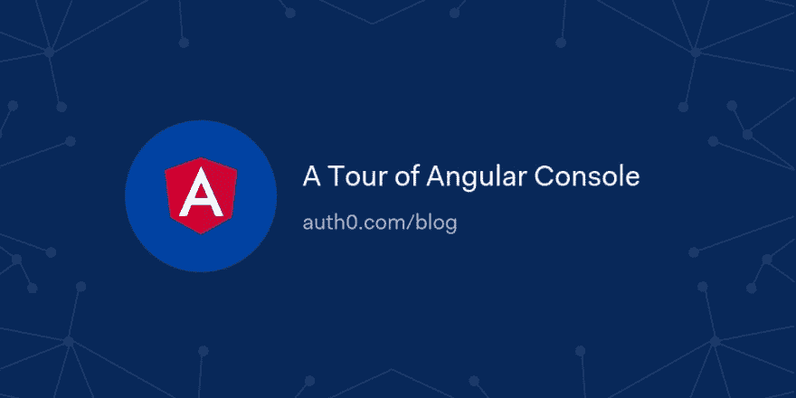

# 角度控制台之旅

> 原文：<https://dev.to/auth0/a-tour-of-angular-console-4aj9>

在本文中，我们将探索角度控制台。Angular Console 是一个桌面应用程序，为 Angular CLI 提供图形用户界面。它包含代码生成、任务运行等功能，以及用于安装 CLI 扩展(如 schematics)的简单界面。Angular 控制台是所有技能水平的 Angular 开发者的一个伟大工具！

[读读🅰️](https://auth0.com/blog/how-to-use-angular-console/?utm_source=dev&utm_medium=sc&utm_campaign=howto_angularconsole)

